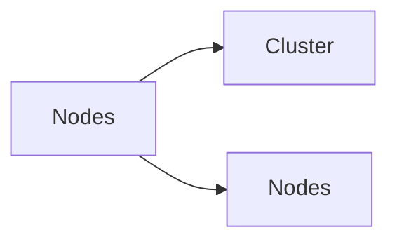

# Cluster & Nodes

> Part of the [NetApp ONTAP CLI Reference](../).



---

## Cluster

```bash
# Identity and status
cluster show
cluster identity show
cluster identity modify -name <new_name>
cluster ring show
cluster ha show
version

# NTP
cluster time-service ntp server show
cluster time-service ntp server create -server <ip>
cluster time-service ntp server delete -server <ip>
```

---

## Nodes

```bash
# Node status
node show
node show -fields node,health,uptime,model,serial-number

# Node-level diagnostics (advanced shell)
node run -node <node> sysconfig
node run -node <node> sysconfig -a
node run -node <node> sysconfig -r
node run -node <node> df -h
node run -node <node> environment status
```
