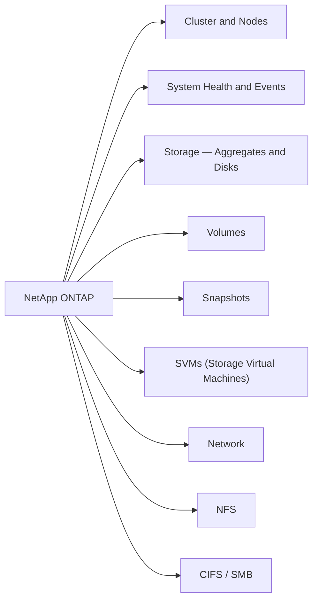

# NetApp ONTAP CLI Reference

NetApp ONTAP is the operating system that runs on NetApp storage arrays (AFF, FAS, ONTAP Select). The CLI uses a dot-separated namespace — `storage aggregate show`, `network interface create` — and runs at the `cluster::>` prompt. Most data access configuration (NFS, CIFS, iSCSI, FC) happens at the SVM (Storage Virtual Machine) level — each SVM is an isolated data access instance within the cluster.

> SSH to the cluster management IP and log in as `admin`. Use `cluster-name::>` as your prompt. Commands that affect a specific SVM typically require `-vserver <svm>`.



---


<div class="kb-grid kb-grid-1">

<a class="kb-card" href="svms/">
  <strong>Svms</strong>
  <span>Svms notes, checks, commands, and references.</span>
</a>

</div>
## Cluster & Nodes

Cluster-level identity, health status, HA pairs, NTP, and node-level diagnostics. Run these first when connecting to an unfamiliar cluster.

```bash
# Identity and status
cluster show
cluster identity show
cluster identity modify -name <new_name>
cluster ring show
cluster ha show
version

# NTP (time sync is critical — certificate errors and log correlation break without it)
cluster time-service ntp server show
cluster time-service ntp server create -server <ip>
cluster time-service ntp server delete -server <ip>

# Node status
node show
node show -fields node,health,uptime,model,serial-number

# Node-level diagnostics (drops to node shell)
node run -node <node> sysconfig
node run -node <node> sysconfig -a
node run -node <node> sysconfig -r
node run -node <node> df -h
node run -node <node> environment status
```

---

## System Health & Events

Overall health status, active alerts, the EMS event log, firmware updates, and AutoSupport. Start here when investigating issues or before maintenance windows.

```bash
# Overall health
system health status show                     # expected: ok
system health alert show                      # unresolved alerts
system health subsystem show
system health node-connectivity show

# EMS event log
event log show
event log show -severity emergency
event log show -severity alert
event log show -severity error
event log show -node <node_name>
event log show -time ">1h"
event log show -time ">24h"
event log show -messagename wafl.vol.full

# EMS notification destinations (email, syslog)
event notification show
event notification destination show

# Software images
system node image show

# Firmware updates (disk, shelf, SP)
system node firmware update -node <node>
system node upgrade-revert show

# AutoSupport
system node autosupport show
system node autosupport show -fields state,last-successful-destination
system node autosupport invoke -node <node> -type all -message "Manual test"
```

---

## Storage — Aggregates & Disks

An aggregate is the physical RAID group that holds one or more volumes. Disks are the raw drives. Check aggregate capacity before provisioning new volumes.

```bash
# Aggregates
storage aggregate show
storage aggregate show -state online
storage aggregate show -fields aggr-name,node,size,availsize,usedsize,state
storage aggregate show-space
storage aggregate show-space -aggregate <aggr>

# Aggregate operations
storage aggregate rename -aggregate <old_name> -newname <new_name>
storage aggregate modify -aggregate <aggr> -maxraidsize 24
storage aggregate add-disks -aggregate <aggr> -diskcount <n>

# Disks
storage disk show
storage disk show -broken                           # failed or suspect
storage disk show -container-type spare             # available spares
storage disk show -fields disk,bay,node,container-type,disk-type,rpm,size,position

# Disk operations
storage disk unfail -disk <disk_name>               # re-add after investigation
storage disk assign -disk <disk_name> -owner <node_name>

# RAID groups
storage aggregate show-raidtree -aggregate <aggr>
storage aggregate show -fields raidtype

# Disk shelves
storage shelf show
storage shelf show -detail
```

---

## Volumes

Volumes are the logical containers for data in ONTAP. Each volume lives in an aggregate and can be mounted at a junction path in the SVM namespace. FlexClone creates instant space-efficient copies for test/dev.

```bash
# List and status
volume show
volume show -vserver <svm>
volume show -fields volume,vserver,size,used,available,percent-used,state
volume show -state offline
volume show -junction-path <path>

# Create / modify / delete
volume create -vserver <svm> -volume <vol> -aggregate <aggr> -size <size> \
    -junction-path <path> -policy <export-policy>
volume modify -vserver <svm> -volume <vol> -size <size>
volume modify -vserver <svm> -volume <vol> -percent-snapshot-space <n>
volume rename -vserver <svm> -volume <old> -newname <new>
volume delete -vserver <svm> -volume <vol>

# Mount / unmount
volume mount -vserver <svm> -volume <vol> -junction-path <path>
volume unmount -vserver <svm> -volume <vol>

# Bring online / offline
volume online -vserver <svm> -volume <vol>
volume offline -vserver <svm> -volume <vol>

# Storage efficiency (dedup / compression)
volume efficiency show
volume efficiency show -vserver <svm> -volume <vol>
volume efficiency start -vserver <svm> -volume <vol>
volume efficiency stop -vserver <svm> -volume <vol>

# FlexClone (instant space-efficient copy — great for dev/test)
volume clone create -vserver <svm> -flexclone <name> -parent-volume <vol>
volume clone create -vserver <svm> -flexclone <name> -parent-volume <vol> -parent-snapshot <snap>
volume clone split start -vserver <svm> -flexclone <name>
volume clone split status -vserver <svm> -flexclone <name>
```

---

## Snapshots

ONTAP snapshots are read-only point-in-time copies stored within the same volume's snapshot reserve. They're near-instant and space-efficient — only changed blocks consume additional space.

```bash
# List snapshots
volume snapshot show
volume snapshot show -vserver <svm> -volume <vol>
volume snapshot show -vserver <svm> -volume <vol> -fields size,create-time,busy

# Create
volume snapshot create -vserver <svm> -volume <vol> -snapshot <snap_name>

# Delete
volume snapshot delete -vserver <svm> -volume <vol> -snapshot <snap_name>
volume snapshot delete -vserver <svm> -volume <vol> -snapshot * -force true   # all snapshots

# Rename
volume snapshot rename -vserver <svm> -volume <vol> -snapshot <old_name> -new-name <new_name>

# Restore (volume must be offline or quiesced)
volume snapshot restore -vserver <svm> -volume <vol> -snapshot <snap_name>
volume snapshot restore -vserver <svm> -volume <vol> -snapshot <snap_name> -online true

# Snapshot policies
volume snapshot policy show
volume snapshot policy create -policy <policy_name> -enabled true
volume snapshot policy add-schedule -policy <policy_name> -schedule hourly -count 24
volume modify -vserver <svm> -volume <vol> -snapshot-policy <policy_name>

# Snapshot reserve
volume show -vserver <svm> -volume <vol> -fields snapshot-percent
volume modify -vserver <svm> -volume <vol> -percent-snapshot-space 15

# Accessing snapshots from the client
# NFS: ls /mnt/data/.snapshot/
# SMB: \\server\share\~snapshot\
```

---

## SVMs (Storage Virtual Machines)

SVMs (also called Vservers) are the data access layer. Each SVM has its own namespace, protocols, network interfaces, and security configuration — think of each SVM as an isolated virtual storage appliance within the cluster.

```bash
# List and view
vserver show
vserver show -fields vserver,type,state,allowed-protocols
vserver show -vserver <svm>

# Create
vserver create \
    -vserver <svm_name> \
    -rootvolume <vol_name> \
    -aggregate <aggr_name> \
    -rootvolume-security-style unix \
    -language C.UTF-8
vserver modify -vserver <svm_name> -allowed-protocols nfs,cifs

# Delete
vserver stop -vserver <svm_name>
vserver delete -vserver <svm_name>

# Protocol management
vserver show-protocols -vserver <svm_name>
vserver modify -vserver <svm_name> -allowed-protocols nfs,cifs,iscsi

# Network interfaces (LIFs)
network interface show -vserver <svm_name>
network interface create -vserver <svm_name> -lif <lif_name> -role data \
    -data-protocol nfs -home-node <node_name> -home-port <port> \
    -address <ip> -netmask <mask>
network interface migrate -vserver <svm_name> -lif <lif_name> \
    -dest-node <node_name> -dest-port <port>

# Join SVM to Active Directory (CIFS)
vserver cifs create -vserver <svm_name> -cifs-server <netbios_name> \
    -domain corp.local -ou "OU=StorageServers,DC=corp,DC=local"
vserver cifs show -vserver <svm_name>

# NFS service
vserver nfs create -vserver <svm_name> -access true -v3 enabled -v4.1 enabled
vserver nfs show -vserver <svm_name>

# SVM state management
vserver stop -vserver <svm_name>
vserver start -vserver <svm_name>
```

---

## Network

LIFs (Logical Interfaces) are the IP addresses that clients connect to. Each LIF lives on a port and can be migrated between nodes for load balancing or maintenance.

```bash
# LIFs
network interface show
network interface show -vserver <svm>
network interface show -fields lif,vserver,address,home-node,home-port,status-oper
network interface create -vserver <svm> -lif <lif> -role data -data-protocol nfs \
    -home-node <node> -home-port <port> -address <ip> -netmask <mask>
network interface modify -vserver <svm> -lif <lif> -address <ip> -netmask <mask>
network interface delete -vserver <svm> -lif <lif>
network interface migrate -vserver <svm> -lif <lif> -dest-node <node> -dest-port <port>
network interface revert -vserver <svm> -lif <lif>
network interface failover-groups show

# Ports
network port show
network port show -role data
network port show -fields node,port,speed,health-status,link-status
network port ifgrp show
network port vlan show

# Routes
network route show
network route create -vserver <svm> -destination 0.0.0.0/0 -gateway <gw>
network route delete -vserver <svm> -destination 0.0.0.0/0 -gateway <gw>

# Connectivity test
network ping -lif <lif> -vserver <svm> -destination <ip>
```

---

## NFS

Configure the NFS service, export policies, and access rules. Export policies control which clients can mount which volumes — every volume references an export policy by name.

```bash
# NFS service
vserver nfs show
vserver nfs show -vserver <svm>
vserver nfs create -vserver <svm> -v3 enabled -v4.0 enabled -v4.1 enabled
vserver nfs modify -vserver <svm> -v4.1 enabled

# Export policies
vserver export-policy show
vserver export-policy show -vserver <svm>
vserver export-policy create -vserver <svm> -policyname <name>
vserver export-policy delete -vserver <svm> -policyname <name>

# Export rules (each rule defines who can access and how)
vserver export-policy rule show
vserver export-policy rule show -vserver <svm> -policyname <name>
vserver export-policy rule create \
    -vserver <svm> \
    -policyname <name> \
    -ruleindex 1 \
    -clientmatch <cidr_or_ip> \
    -rorule sys \
    -rwrule sys \
    -superuser sys
vserver export-policy rule delete -vserver <svm> -policyname <name> -ruleindex <n>

# Assign policy to volume
volume modify -vserver <svm> -volume <vol> -policy <export-policy>

# Verify client access
vserver nfs check-client -vserver <svm> -client-ip <ip>

# Connected NFS clients
nfs connected-client show -vserver <svm>
```

---

## CIFS / SMB

Create and manage CIFS (SMB) file shares. The CIFS server is joined to Active Directory. Shares expose volume paths to Windows clients.

```bash
# CIFS server
vserver cifs show
vserver cifs show -vserver <svm>
vserver cifs create -vserver <svm> -cifs-server <name> -domain <domain>
vserver cifs delete -vserver <svm>

# Shares
vserver cifs share show
vserver cifs share show -vserver <svm>
vserver cifs share create -vserver <svm> -share-name <name> -path <path>
vserver cifs share modify -vserver <svm> -share-name <name> -comment <text>
vserver cifs share delete -vserver <svm> -share-name <name>
vserver cifs share access-control show -vserver <svm> -share <name>
vserver cifs share access-control modify \
    -vserver <svm> -share <name> \
    -user-or-group <group> -permission Full_Control

# Sessions and open files
vserver cifs session show
vserver cifs session show -vserver <svm>
vserver cifs session show -fields node,vserver,connection-count
vserver cifs session file show -vserver <svm>
vserver cifs session close -node <node> -vserver <svm> -session-id <id>

# SMB version settings (disable SMB1 for security)
vserver cifs options show -vserver <svm>
vserver cifs options modify -vserver <svm> -smb1-enabled false
vserver cifs options modify -vserver <svm> -smb2-enabled true

# AD connectivity check
vserver cifs show -vserver <svm> -fields ad-status
```

---

## Block Protocols (iSCSI / FC)

Present LUNs to hosts via iSCSI or Fibre Channel. LUNs are mapped to igroups (initiator groups) — an igroup lists the WWNs or IQNs of hosts that are allowed to see the LUN.

```bash
# iSCSI service
vserver iscsi show
vserver iscsi create -vserver <svm>
vserver iscsi modify -vserver <svm> -is-admin-enabled true

# LUNs
lun show
lun show -vserver <svm>
lun show -fields path,vserver,size,state,mapped,os-type
lun create -vserver <svm> -path <path> -size <size> -ostype vmware
lun delete -vserver <svm> -path <path>
lun resize -vserver <svm> -path <path> -size <size>
lun online -vserver <svm> -path <path>
lun offline -vserver <svm> -path <path>
lun map -vserver <svm> -path <path> -igroup <igroup>
lun unmap -vserver <svm> -path <path> -igroup <igroup>
lun mapping show
lun mapping show -vserver <svm>

# igroups (define which hosts can see which LUNs)
lun igroup show
lun igroup show -vserver <svm>
lun igroup create -vserver <svm> -igroup <name> -protocol iscsi -ostype vmware
lun igroup add -vserver <svm> -igroup <name> -initiator <iqn>
lun igroup remove -vserver <svm> -igroup <name> -initiator <iqn>
lun igroup delete -vserver <svm> -igroup <name>

# Fibre Channel
vserver fcp show
vserver fcp create -vserver <svm>
fcp adapter show
fcp adapter show -fields node,adapter,state,speed,fabric-established
fcp interface show
fcp initiator show
lun igroup create -vserver <svm> -igroup <name> -protocol fcp -ostype vmware
```

---

## SnapMirror

SnapMirror replicates volumes between SVMs or clusters for disaster recovery. The destination volume is read-only until a failover (break). Monitor lag time to ensure RPO is being met.

```bash
# View relationships
snapmirror show
snapmirror show -destination-path <svm>:<vol>
snapmirror show -fields source-path,destination-path,state,lag-time,health
snapmirror show -health false                                          # unhealthy only

# Create
snapmirror create \
    -source-path <src_svm>:<src_vol> \
    -destination-path <dest_svm>:<dest_vol> \
    -type DP \
    -policy MirrorAllSnapshots
snapmirror delete -destination-path <svm>:<vol>
snapmirror release -source-path <svm>:<vol> -destination-path <svm>:<vol>

# Operations
snapmirror initialize -destination-path <svm>:<vol>    # baseline transfer
snapmirror update -destination-path <svm>:<vol>        # manual sync
snapmirror quiesce -destination-path <svm>:<vol>       # pause
snapmirror break -destination-path <svm>:<vol>         # make destination writable (failover)
snapmirror resync -destination-path <svm>:<vol>        # re-establish after break
snapmirror abort -destination-path <svm>:<vol>

# Monitoring
snapmirror history show -destination-path <svm>:<vol>
snapmirror lag show
snapmirror show -transfer-progress
```

---

## Quotas

Quotas limit disk space and file counts on volumes, qtrees, or users. Enable quotas on a volume, create rules, then resize to activate them without disrupting access.

```bash
# View quota status and usage
volume quota show
volume quota report -vserver <svm> -volume <vol>
volume quota policy rule show -vserver <svm>

# Enable / disable / resize
volume quota on -vserver <svm> -volume <vol>
volume quota off -vserver <svm> -volume <vol>
volume quota resize -vserver <svm> -volume <vol>    # pick up new rules without disabling

# Create quota rules
# Tree quota — limit a qtree
volume quota policy rule create \
    -vserver <svm> -policy-name default -volume <vol> \
    -type tree -target /qtree_name \
    -disk-limit 500g -soft-disk-limit 400g

# Default user quota (applies to all users)
volume quota policy rule create \
    -vserver <svm> -policy-name default -volume <vol> \
    -type user -target "" -disk-limit 100g

# Specific user quota
volume quota policy rule create \
    -vserver <svm> -policy-name default -volume <vol> \
    -type user -target "DOMAIN\username" -disk-limit 200g

# Modify / delete rules
volume quota policy rule modify \
    -vserver <svm> -policy-name default -volume <vol> \
    -type tree -target /qtree_name -disk-limit 1t
volume quota policy rule delete \
    -vserver <svm> -policy-name default -volume <vol> \
    -type tree -target /qtree_name
```

---

## Performance & QoS

ONTAP statistics require a sample start/stop cycle before viewing. QoS (Quality of Service) lets you cap or guarantee throughput for specific volumes or LUNs.

```bash
# Statistics collection
statistics start -object volume -sample-id perf_check
# wait 10–30 seconds
statistics stop -sample-id perf_check
statistics show -sample-id perf_check

# Filter statistics output
statistics show -sample-id perf_check | grep -E "total_latency|read_latency|write_latency"
statistics show -sample-id perf_check | grep -E "total_ops|read_ops|write_ops"

# QoS policy groups
qos policy-group show
qos policy-group create -policy-group prod-limit -vserver <svm> -max-throughput 5000IOPS
qos policy-group create -policy-group db-floor -vserver <svm> -min-throughput 2000IOPS
qos policy-group modify -policy-group prod-limit -max-throughput 8000IOPS
qos policy-group delete -policy-group prod-limit

# Apply QoS to a volume
volume modify -vserver <svm> -volume <vol> -qos-policy-group prod-limit
volume modify -vserver <svm> -volume <vol> -qos-policy-group none

# QoS workload monitoring
qos workload show
qos statistics performance show
```

---

## Security & Users

User login accounts, role-based access control, certificate management, and CIFS/NFS audit logging.

```bash
# Login accounts
security login show
security login show -vserver <svm>
security login create \
    -username <user> \
    -application ssh \
    -authentication-method password \
    -role admin \
    -vserver <svm>
security login delete -username <user> -application ssh -vserver <svm>
security login password -username <user> -vserver <svm>
security login lock -username <user> -vserver <svm>
security login unlock -username <user> -vserver <svm>

# Roles
security login role show
security login role show -vserver <svm>
security login role create -role <role_name> -vserver <svm> \
    -cmddirname DEFAULT -access none
security login role create -role <role_name> -vserver <svm> \
    -cmddirname "volume show" -access readonly

# Certificates
security certificate show
security certificate show -vserver <svm>
security certificate install -vserver <svm> -type server
security certificate generate-csr \
    -common-name <cn> -size 2048 -country US \
    -state <state> -locality <city> -organization <org>

# Audit logging (file access events)
vserver audit show -vserver <svm>
vserver audit create -vserver <svm> -destination /audit_logs -format xml
vserver audit enable -vserver <svm>
```

---

## AutoSupport

AutoSupport sends telemetry and event data to NetApp support. It enables proactive case creation and feeds into NetApp Active IQ (cloud analytics). Keep it enabled and ensure delivery is working.

```bash
# Status
autosupport show
autosupport show -node <node>
autosupport show -fields last-subject-sent,last-successful-destination

# Send messages
autosupport invoke -node <node> -type test
autosupport invoke -node <node> -type all -message "Manual upload for case SR-XXXXX"

# History
autosupport history show
autosupport history show -node <node>
autosupport history show -fields seq-num,status,triggered-time,destination

# Configuration
autosupport modify -node <node> -state enable
autosupport modify -node <node> -state disable
autosupport modify -node <node> -mail-hosts <smtp_server>
autosupport modify -node <node> -proxy-url http://proxy.corp.local:8080
autosupport modify -node <node> -noteto ops@corp.local
autosupport modify -node <node> -transport https

# Verify HTTPS connectivity
autosupport check show
```
