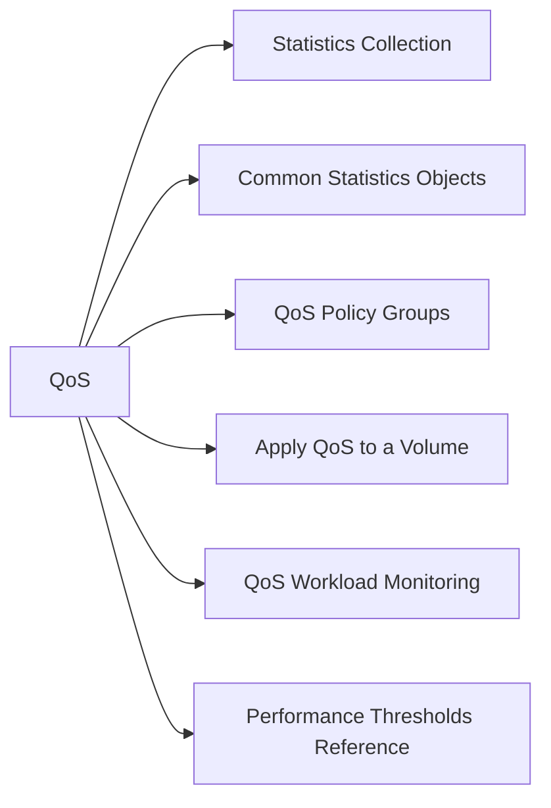

# Performance & QoS

> Part of the [NetApp ONTAP CLI Reference](../).



## Statistics Collection

ONTAP statistics require a sample to be collected before viewing:

```bash
# Start a statistics collection
statistics start -object volume -sample-id perf_check

# Wait 10–30 seconds, then stop
statistics stop -sample-id perf_check

# View collected statistics
statistics show -sample-id perf_check
```

## Common Statistics Objects

| Object | Measures |
|---|---|
| `volume` | Volume IOPS, throughput, latency |
| `lun` | LUN IOPS, latency |
| `vserver` | Per-SVM protocol performance |
| `node` | Node CPU, network, disk |
| `aggregate` | Aggregate IOPS, latency |
| `disk` | Per-disk I/O |

```bash
# Volume-level latency
statistics show -sample-id perf_check | grep -E "total_latency|read_latency|write_latency"

# IOPS per volume
statistics show -sample-id perf_check | grep -E "total_ops|read_ops|write_ops"
```

## QoS Policy Groups

QoS limits or guarantees throughput for specific volumes or LUNs:

```bash
# List all QoS policy groups
qos policy-group show

# Create a QoS max throughput policy (limit)
qos policy-group create \
    -policy-group prod-limit \
    -vserver <svm> \
    -max-throughput 5000IOPS

# Create a min throughput policy (guarantee)
qos policy-group create \
    -policy-group db-floor \
    -vserver <svm> \
    -min-throughput 2000IOPS

# Modify a policy group
qos policy-group modify -policy-group prod-limit -max-throughput 8000IOPS

# Delete a policy group
qos policy-group delete -policy-group prod-limit
```

## Apply QoS to a Volume

```bash
# Assign a QoS policy to a volume
volume modify -vserver <svm> -volume <vol> -qos-policy-group prod-limit

# Remove QoS from a volume
volume modify -vserver <svm> -volume <vol> -qos-policy-group none
```

## QoS Workload Monitoring

```bash
# All active QoS workloads
qos workload show

# QoS performance statistics (current IOPS and latency per workload)
qos statistics performance show

# Sort by highest IOPS
qos statistics performance show | sort -rn -k3
```

## Performance Thresholds Reference

| Metric | Warning | Critical |
|---|---|---|
| Volume read latency | > 5 ms | > 20 ms |
| Volume write latency | > 5 ms | > 20 ms |
| Aggregate utilisation | > 70% | > 85% |
| CPU utilisation (node) | > 70% | > 90% |
| Disk busy % | > 50% | > 80% |
