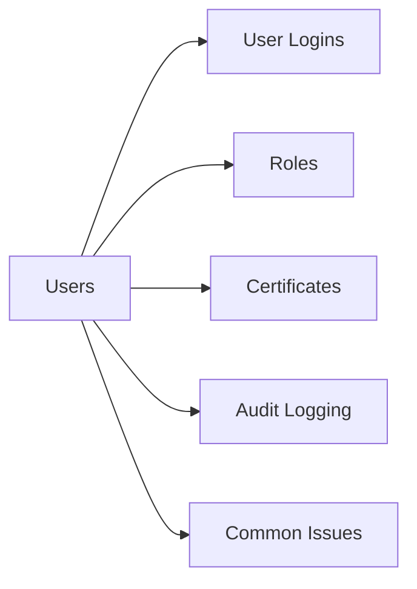

# Security & Users

> Part of the NetApp ONTAP CLI Reference.



## User Logins

```bash
# List all login accounts
security login show
security login show -vserver <svm>

# Create a user (SSH + password auth)
security login create \
    -username <user> \
    -application ssh \
    -authentication-method password \
    -role admin \
    -vserver <svm>

# Delete a user
security login delete -username <user> -application ssh -vserver <svm>

# Change password
security login password -username <user> -vserver <svm>

# Lock / unlock an account
security login lock -username <user> -vserver <svm>
security login unlock -username <user> -vserver <svm>
```

## Roles

```bash
# List roles
security login role show
security login role show -vserver <svm>

# Create a custom role (deny-all baseline)
security login role create \
    -role <role_name> \
    -vserver <svm> \
    -cmddirname DEFAULT \
    -access none

# Grant specific command to a role
security login role create \
    -role <role_name> \
    -vserver <svm> \
    -cmddirname "volume show" \
    -access readonly
```

## Certificates

```bash
# List installed certificates
security certificate show
security certificate show -vserver <svm>

# Install a certificate
security certificate install -vserver <svm> -type server

# Generate a CSR
security certificate generate-csr \
    -common-name <cn> \
    -size 2048 \
    -country US \
    -state <state> \
    -locality <city> \
    -organization <org>
```

## Audit Logging

```bash
# Show audit configuration
vserver audit show -vserver <svm>

# Create audit config (enable file access auditing)
vserver audit create -vserver <svm> -destination /audit_logs -format xml

# Enable auditing
vserver audit enable -vserver <svm>
```

## Common Issues

| Issue | Check | Action |
|---|---|---|
| Login denied | Account locked | `security login unlock` |
| SSH fails | Application type | Verify `-application ssh` on login |
| Certificate expired | `certificate show` | Reinstall or renew |
| Role too permissive | Role config | Review and restrict with `access none` baseline |
