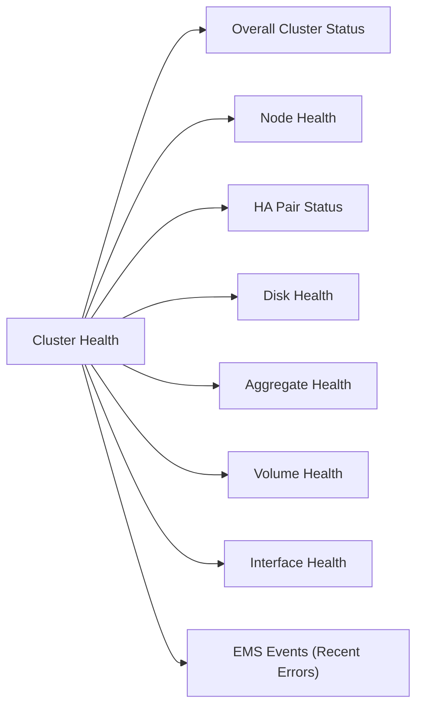

# ONTAP Cluster Health



## Overall Cluster Status

```bash
cluster show
# All nodes should show health: true and eligibility: true

system health status show
# Overall status should be: ok
```

## Node Health

```bash
system node show
# All nodes should be: up

system node show -fields uptime,health
```

## HA Pair Status

```bash
storage failover show
# Both nodes should show: Connected, Not in takeover
```

| State | Meaning |
|---|---|
| Connected, Not in takeover | Healthy — HA active |
| Connected, Waiting for giveback | Node in takeover; manual giveback may be needed |
| Disconnected | HA link down; investigate immediately |

## Disk Health

```bash
storage disk show -broken
# Any output here requires investigation

storage disk show -container-type spare
# Confirm spare disks are available for RAID rebuild
```

## Aggregate Health

```bash
storage aggregate show -state !online
# Should return no output if all aggregates are healthy

storage aggregate show-status | grep -v normal
```

## Volume Health

```bash
volume show -state !online
# Should return no output under normal conditions

volume show -fields state,health | grep -v true
```

## Interface Health

```bash
network interface show -status-oper down
# Any interfaces down should be investigated
```

## EMS Events (Recent Errors)

```bash
event log show -severity ERROR -time-range "1h"
event log show -severity CRITICAL
```

## Pre-Change Checklist

- [ ] All nodes `health: true`
- [ ] HA pair connected, not in takeover
- [ ] No broken disks; spares available
- [ ] All aggregates online
- [ ] All volumes online
- [ ] No critical EMS events in past 24 hours

## Health Summary Table

| Component | Command | Expected |
|---|---|---|
| Cluster | `cluster show` | health: true |
| HA | `storage failover show` | Connected |
| Disks | `storage disk show -broken` | No output |
| Aggregates | `storage aggregate show -state !online` | No output |
| Volumes | `volume show -state !online` | No output |
| EMS | `event log show -severity CRITICAL` | No output |
