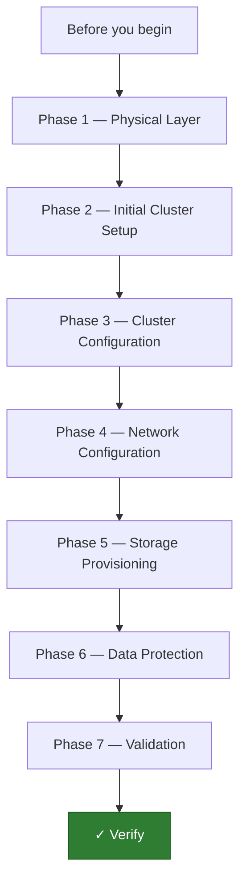

---
tags:
  - deployment
  - netapp
search:
  boost: 2
---
# ONTAP — Deploy

<div class="kb-summary">
This guide covers the end-to-end deployment of a NetApp ONTAP cluster — from physical rack-and-stack through cluster initialisation, network configuration, storage provisioning, data protection setup, and final validation. It follows a seven-phase sequence designed for AFF and FAS HA pairs running ONTAP 9.12 or later, and assumes a greenfield installation against a prepared data-centre environment.

*Applies to: ONTAP 9.12+*
</div>

---



```d2
direction: right

plan: "Plan" {shape: oval}
phase_1_physical_layer: "Phase 1 — Physical Layer" {shape: rectangle}
phase_2_initial_cluster_setup: "Phase 2 — Initial Cluster Setup" {shape: rectangle}
phase_3_cluster_configuration: "Phase 3 — Cluster Configuration" {shape: rectangle}
phase_4_network_configuration: "Phase 4 — Network Configuration" {shape: rectangle}
phase_5_storage_provisioning: "Phase 5 — Storage Provisioning" {shape: rectangle}
phase_6_data_protection: "Phase 6 — Data Protection" {shape: rectangle}
validate: "Validate" {shape: oval}

plan -> phase_1_physical_layer
phase_1_physical_layer -> phase_2_initial_cluster_setup
phase_2_initial_cluster_setup -> phase_3_cluster_configuration
phase_3_cluster_configuration -> phase_4_network_configuration
phase_4_network_configuration -> phase_5_storage_provisioning
phase_5_storage_provisioning -> phase_6_data_protection
phase_6_data_protection -> validate
```

## Before you begin

- **Access:** Root/admin access to both nodes via serial console (Node 1 first), and SSH access to the cluster management LIF after initial setup. Out-of-band management access (BMC/SP) must be configured and reachable before any cluster work begins.
- **Timing:** Allow 4–6 hours for a two-node cluster with two disk shelves. Aggregate creation and SnapMirror initialisation can run in the background but must complete before production cutover.
- **Dependencies:** Active Directory / LDAP server reachable (for CIFS/NFS Kerberos); NTP servers confirmed and accessible; DNS forward and reverse zones created for all planned LIF IPs; HCL check completed for all hardware against the NetApp Interoperability Matrix Tool (IMT).
- **Logging:** Enable serial console logging in your terminal emulator from the first power-on. Save the full `cluster setup` transcript — it is required for support cases if the cluster must be rebuilt.

---

!!! warning "Do not power both nodes simultaneously on first boot"
    Power Node 1 fully to the boot menu before connecting power to Node 2. Bringing both nodes up together before the cluster is initialised can cause them to form separate single-node clusters that are difficult to merge without a factory reset.

---

## Phase 1 — Physical Layer

**Exit criterion:** Both nodes and all disk shelves are racked, cabled, powered, and visible in the BMC/SP interface. No amber fault LEDs. HCL check passed.

### Racking and Cabling

Mount controllers in the rack according to the rail kit guide for your platform (AFF A400, AFF A800, FAS9000, etc.). Observe the following:

- Leave at least 1U of clearance above and below each 2U controller for airflow.
- Cable the cluster interconnect ports (e0a and e0b on most platforms, or the dedicated 100GbE cluster ports on AFF A800/A900) back-to-back for a two-node switchless cluster, or to a dedicated cluster switch for larger deployments.
- Use the designated management port (e0M on most AFF/FAS platforms) for OOB management — do **not** use a data port for this.
- Label all cables at both ends before routing. Use the NetApp cable layout diagram for your specific shelf model.

### Disk Shelf Connectivity

NetApp disk shelves use either SAS (DS224C, DS460C) or NVMe (NS224) cabling depending on the platform:

**SAS shelves (DS224C / DS460C):**

- Use the multipath HA cabling pattern: Node 1 HBA port 0a → Shelf IOM A port 1 / Node 1 HBA port 0b → Shelf IOM B port 1; Node 2 mirrors on its own HBA ports.
- Daisy-chain additional shelves from IOM A port 2 → next shelf IOM A port 1 (and same for IOM B).
- Maximum of 10 DS224C shelves per stack per node on most platforms; consult the platform-specific storage limits guide.

**NVMe shelves (NS224):**

- NS224 shelves attach via RoCE NICs (100GbE); cable each shelf's NSM100 module port e0a to Node 1 RoCE port, and NSM100 port e0b to Node 2 RoCE port.
- Each NS224 shelf is a separate stack — no daisy chaining.
- Confirm RoCE NIC firmware is at the version listed in the IMT for your ONTAP release.

Verify shelf IDs are unique before powering on. Change shelf IDs using the ID button on the IOM module if needed, then power-cycle the shelf to apply.

### OOB Management (BMC / SP)

Each node has a Service Processor (SP) or Baseboard Management Controller (BMC) accessible on the e0M port:

```text
# After initial network config, reach the SP via SSH:
ssh admin@<SP-IP>

# Check SP firmware version:
sp show-firmware

# Update SP firmware if required:
system service-processor image update -node <node> -package <package-url>
```

Assign static IP addresses to both SP/BMC interfaces from your OOB management VLAN before powering up the controllers. This is done via DHCP reservation or direct serial console configuration during first boot.

### Power Sequencing

1. Power on disk shelves first — wait for all shelf LEDs to go solid green (approximately 60 seconds per shelf).
2. Power on Node 1 only. Watch the boot sequence via serial console.
3. At the boot menu, halt at the prompt if you need to run a BIOS/firmware check; otherwise allow normal boot.
4. Do not power on Node 2 until Node 1 has reached the `cluster setup` prompt or the ONTAP login prompt.
5. Power on Node 2 after Node 1 is ready.

### HCL Check

Before continuing, validate the complete bill of materials against the NetApp Interoperability Matrix Tool:

- Go to <https://mysupport.netapp.com/matrix>
- Check: ONTAP version + platform + shelf model + disk firmware + host HBA + switch firmware (if applicable).
- Download and retain the IMT report as a deployment artefact.

---

## Phase 2 — Initial Cluster Setup

**Exit criterion:** Both nodes are joined to a named cluster, reachable via the cluster management IP, and the `cluster show` command shows both nodes as healthy.

### Console Connection and Boot

Connect a serial cable (or USB-to-serial adapter) to the console port on Node 1. Use 9600 baud, 8N1. Power on Node 1 and watch the boot sequence. ONTAP will load from the internal boot device.

When the system reaches the boot menu, select option **1** (Boot normal) if running a pre-installed factory image, or option **4** (Clean configuration and initialize all disks) for a fresh install from a downloaded image.

If installing from a downloaded ONTAP image:

```text
# At the boot menu prompt, boot from the network image:
Esc+5   → Boot menu
Select option 7 (Install new software first)
Enter the URL of the ONTAP image package: http://<http-server>/ontap-9.12.1-image.tgz
```

Allow the node to complete the installation and reboot automatically.

### Running the Cluster Setup Wizard

After the first clean boot, ONTAP starts the setup wizard automatically. If it does not, trigger it manually:

```text
cluster setup
```

The wizard prompts for the following values. Prepare these before starting:

| Prompt | Example value |
|---|---|
| Cluster name | `prod-ontap-01` |
| Cluster management IP | `10.10.10.100` |
| Netmask | `255.255.255.0` |
| Default gateway | `10.10.10.1` |
| DNS domain | `corp.example.com` |
| DNS name servers | `10.10.1.53, 10.10.1.54` |
| NTP servers | `10.10.1.123` |
| Node 1 management IP | `10.10.10.101` |
| Admin password | (choose a strong password) |

Work through each prompt. The wizard creates the cluster, sets the admin credentials, and assigns Node 1 as the first cluster node.

### Joining Node 2

After completing the wizard on Node 1, connect a serial console to Node 2 and power it on. When it boots and presents the setup prompt:

```text
# On Node 2 console:
cluster setup
Do you want to create a new cluster or join an existing cluster? [create/join] join
Enter the cluster management IP address: 10.10.10.100
Enter the admin password: <password>
```

Node 2 will contact Node 1, exchange keys, and join the cluster. Verify on Node 1:

```text
cluster show

Node                  Health  Eligibility
--------------------- ------- ------------
prod-ontap-01-01      true    true
prod-ontap-01-02      true    true
```

---

## Phase 3 — Cluster Configuration

**Exit criterion:** All required licenses installed, NTP synchronised, AutoSupport enabled and verified with a test message, and the cluster registered with Active IQ.

### License Installation

ONTAP uses capacity-based or feature-based licenses depending on the platform generation. For systems using per-feature license keys:

```text
# Add a license key:
system license add -license-code XXXXXXXXXXXXXXXX

# Add multiple keys at once (space-separated):
system license add -license-code KEY1 KEY2 KEY3 KEY4

# Verify installed licenses:
system license show

Package           Type    Description                       Expiration
----------------- ------- --------------------------------- ----------
NFS               site    NFS License                       -
CIFS              site    CIFS License                      -
iSCSI             site    iSCSI License                     -
FCP               site    FCP License                       -
FlexClone         site    FlexClone License                 -
SnapMirror        site    SnapMirror License                -
```

For ONTAP 9.10+ systems with capacity-based licensing (NLF files), upload the NLF file received from NetApp:

```text
system license add -license-code @/path/to/license.nlf
```

### NTP and Timezone

Accurate time is critical for cluster operations, SnapMirror, CIFS Kerberos, and audit logs.

```text
# Create NTP server associations:
cluster time-service ntp server create -server 10.10.1.123
cluster time-service ntp server create -server 10.10.1.124

# Verify NTP status:
cluster time-service ntp server show

# Set the cluster timezone:
cluster date modify -timezone Europe/London

# Verify cluster time:
cluster date show
```

### AutoSupport Configuration

AutoSupport sends diagnostic data to NetApp support and feeds the Active IQ Digital Advisor dashboard. Configure it before production traffic begins.

```text
# Enable AutoSupport on all nodes with SMTP transport:
autosupport modify -node * \
  -state enable \
  -transport smtp \
  -mail-hosts smtp.corp.example.com \
  -from ontap-asup@corp.example.com \
  -to support-team@corp.example.com \
  -support enable

# Verify AutoSupport config:
autosupport show -node *

# Send a test AutoSupport message:
autosupport invoke -node * -type test -message "ONTAP deployment test"

# Confirm delivery:
autosupport history show -node * -type test
```

### Active IQ Registration

Register the cluster with the NetApp Active IQ Digital Advisor portal to receive health and risk advisories:

1. Navigate to <https://activeiq.netapp.com>
2. Sign in with your NetApp Support credentials.
3. Select **Add System** and enter the cluster serial number (found via `system node show -fields serial-number`).
4. Allow 24 hours for the first AutoSupport bundle to populate the dashboard.

---

## Phase 4 — Network Configuration

**Exit criterion:** All management and data LIFs are up, reachable from their respective subnets, and failover groups are configured to allow non-disruptive LIF migration between nodes.

### Cluster Interconnect Verification

For switchless two-node clusters, verify the cluster interconnect is healthy:

```text
# Confirm cluster ports are up:
network port show -role cluster

# Check cluster interconnect health:
cluster interconnect show

Node           Link  Speed(Mbps)  IsPartial  IsPresent
-------------- ----  -----------  ---------  ---------
node1:e0a      up    100000       false      true
node1:e0b      up    100000       false      true
node2:e0a      up    100000       false      true
node2:e0b      up    100000       false      true
```

### Management LIF Configuration

Node management LIFs provide per-node SSH access, separate from the cluster management LIF created during setup:

```text
# Create node management LIF for Node 2 (Node 1 is created by cluster setup):
network interface create \
  -vserver prod-ontap-01 \
  -lif node2_mgmt \
  -role node-mgmt \
  -home-node prod-ontap-01-02 \
  -home-port e0M \
  -address 10.10.10.102 \
  -netmask 255.255.255.0

# Verify management LIFs:
network interface show -role node-mgmt
```

### Broadcast Domains and Failover Groups

Broadcast domains define the Layer 2 reachability scope for LIF failover. ONTAP auto-creates broadcast domains based on LLDP/CDP discovery during setup, but verify and adjust:

```text
# Show existing broadcast domains:
network port broadcast-domain show

# Add a port to a broadcast domain if missing:
network port broadcast-domain add-ports \
  -broadcast-domain Data \
  -ports prod-ontap-01-01:e0c,prod-ontap-01-02:e0c

# Create a failover group for the data subnet:
network interface failover-groups create \
  -vserver prod-ontap-01 \
  -failover-group data-fg \
  -targets prod-ontap-01-01:e0c,prod-ontap-01-02:e0c
```

### Data LIF Creation

Data LIFs are created per SVM (Storage Virtual Machine). Create the SVMs first (Phase 5), then return here, or create the LIFs as part of SVM creation. Example for an NFS SVM:

```text
# Create NFS data LIF on Node 1:
network interface create \
  -vserver svm_nfs \
  -lif nfs_lif_01 \
  -role data \
  -data-protocol nfs \
  -home-node prod-ontap-01-01 \
  -home-port e0c \
  -address 10.10.20.10 \
  -netmask 255.255.255.0 \
  -failover-group data-fg \
  -firewall-policy data \
  -auto-revert true

# Create NFS data LIF on Node 2 (for HA):
network interface create \
  -vserver svm_nfs \
  -lif nfs_lif_02 \
  -role data \
  -data-protocol nfs \
  -home-node prod-ontap-01-02 \
  -home-port e0c \
  -address 10.10.20.11 \
  -netmask 255.255.255.0 \
  -failover-group data-fg \
  -firewall-policy data \
  -auto-revert true

# Verify all LIFs are up:
network interface show -vserver svm_nfs
```

For iSCSI SVMs, repeat with `-data-protocol iscsi` and iSCSI-subnet IPs.

---

## Phase 5 — Storage Provisioning

**Exit criterion:** Aggregates created on both nodes, SVMs created for each protocol, volumes provisioned, and NFS exports or iSCSI LUNs accessible from at least one test host.

### Disk Visibility and Assignment

```text
# List all visible disks (unassigned shown with Owner = -):
storage disk show

# List unowned disks explicitly:
storage disk show -container-type unassigned

# Assign disks to nodes (auto-assign is enabled by default; disable for manual control):
storage disk option modify -node prod-ontap-01-01 -autoassign off
storage disk option modify -node prod-ontap-01-02 -autoassign off

# Manually assign a range of disks to Node 1:
storage disk assign -disk 1.0.0 -owner prod-ontap-01-01
storage disk assign -disk 1.0.1 -owner prod-ontap-01-01

# Bulk assign all unassigned disks to Node 1 (use with caution):
storage disk assign -node prod-ontap-01-01 -all true
```

For AFF systems with NSDs (NVMe SSDs), disk assignment is automatic when shelves are cabled in the recommended HA multipath pattern.

### Aggregate Creation

```text
# Create an aggregate on Node 1 using RAID-DP (standard for SAS/SSD):
storage aggregate create \
  -aggregate aggr1_node1 \
  -node prod-ontap-01-01 \
  -diskcount 22 \
  -raidtype raid_dp

# Create an aggregate on Node 2:
storage aggregate create \
  -aggregate aggr1_node2 \
  -node prod-ontap-01-02 \
  -diskcount 22 \
  -raidtype raid_dp

# Verify aggregate status:
storage aggregate show

Aggregate     Size Available Used% State   #Vols  Nodes       RAID Status
----------- ----- --------- ----- ------- ------ ----------- ------------
aggr1_node1  40TB    38.1TB    4%  online       0 node1       raid_dp, normal
aggr1_node2  40TB    38.1TB    4%  online       0 node2       raid_dp, normal
```

For AFF NVMe platforms, use `-raidtype raid_tec` (Triple Erasure Coding) which is the default and provides higher fault tolerance.

### SVM Creation

Create separate SVMs per protocol for isolation and independent LIF failover:

```text
# Create an NFS SVM:
vserver create \
  -vserver svm_nfs \
  -aggregate aggr1_node1 \
  -rootvolume svm_nfs_root \
  -rootvolume-security-style unix \
  -language C.UTF-8

# Create a SAN (iSCSI) SVM:
vserver create \
  -vserver svm_iscsi \
  -aggregate aggr1_node1 \
  -rootvolume svm_iscsi_root \
  -rootvolume-security-style unix \
  -language C.UTF-8

# Enable the appropriate protocols on each SVM:
vserver add-protocols -vserver svm_nfs -protocols nfs
vserver add-protocols -vserver svm_iscsi -protocols iscsi

# Start the iSCSI service:
iscsi create -vserver svm_iscsi
iscsi start -vserver svm_iscsi

# Verify SVM list:
vserver show
```

### Volume Creation

```text
# Create an NFS data volume:
volume create \
  -vserver svm_nfs \
  -volume vol_data_01 \
  -aggregate aggr1_node1 \
  -size 2TB \
  -security-style unix \
  -junction-path /data01 \
  -percent-snapshot-space 10

# Create a volume for iSCSI (no junction path needed):
volume create \
  -vserver svm_iscsi \
  -volume vol_lun_01 \
  -aggregate aggr1_node1 \
  -size 1TB \
  -security-style ntfs

# Verify volumes:
volume show -vserver svm_nfs
```

### NFS Export Policy

```text
# Create an export policy allowing the ESXi management subnet:
vserver export-policy create -vserver svm_nfs -policyname prod_nfs_policy

export-policy rule create \
  -vserver svm_nfs \
  -policyname prod_nfs_policy \
  -clientmatch 10.10.20.0/24 \
  -rorule sys \
  -rwrule sys \
  -superuser sys \
  -anon 65534

# Apply the export policy to the volume:
volume modify -vserver svm_nfs -volume vol_data_01 -policy prod_nfs_policy
```

### iSCSI LUN and Initiator Group (igroup) Creation

```text
# Create a LUN inside the iSCSI volume:
lun create \
  -vserver svm_iscsi \
  -volume vol_lun_01 \
  -lun lun_db_01 \
  -size 500GB \
  -ostype linux

# Create an initiator group for Linux hosts:
igroup create \
  -vserver svm_iscsi \
  -igroup igrp_linux_db \
  -protocol iscsi \
  -ostype linux \
  -initiator iqn.1994-05.com.redhat:hostname01

# Add additional initiators if needed:
igroup add -vserver svm_iscsi -igroup igrp_linux_db -initiator iqn.1994-05.com.redhat:hostname02

# Map the LUN to the initiator group:
lun map \
  -vserver svm_iscsi \
  -volume vol_lun_01 \
  -lun lun_db_01 \
  -igroup igrp_linux_db \
  -lun-id 0

# Verify the mapping:
lun show -vserver svm_iscsi
lun mapping show -vserver svm_iscsi
```

---

## Phase 6 — Data Protection

**Exit criterion:** Snapshot policies assigned to all data volumes, SnapMirror peer relationships established with the DR cluster, at least one SnapMirror relationship initialised and showing `Snapmirrored` state.

### Snapshot Policies

```text
# Show existing default policies:
volume snapshot policy show

# Create a custom snapshot policy (hourly, daily, weekly):
volume snapshot policy create \
  -policy prod_snap_policy \
  -enabled true \
  -schedule1 hourly \
  -count1 6 \
  -schedule2 daily \
  -count2 7 \
  -schedule3 weekly \
  -count3 4

# Assign the policy to a volume:
volume modify -vserver svm_nfs -volume vol_data_01 -snapshot-policy prod_snap_policy

# Verify snapshots are being created:
volume snapshot show -vserver svm_nfs -volume vol_data_01
```

### Cluster Peer Relationship

SnapMirror requires peering between the source and destination clusters before any relationships can be created.

```text
# On the SOURCE cluster — create the peer relationship:
cluster peer create \
  -peer-addrs 10.10.30.100 \
  -username admin

# Enter the passphrase when prompted (must match on both clusters).

# On the DESTINATION cluster — accept the peer offer:
cluster peer create \
  -peer-addrs 10.10.10.100 \
  -username admin

# Verify peer relationship on both clusters:
cluster peer show

Peer Cluster Name         Cluster Serial Number  Availability   Authentication
------------------------- ---------------------- -------------- ---------------
dr-ontap-01               123456789              Available      ok
```

### SVM Peer Relationship

After the cluster peer is established, create SVM-level peers:

```text
# On the source cluster:
vserver peer create \
  -vserver svm_nfs \
  -peer-vserver svm_nfs_dr \
  -peer-cluster dr-ontap-01 \
  -applications snapmirror

# On the destination cluster — accept the SVM peer:
vserver peer accept -vserver svm_nfs_dr -peer-vserver svm_nfs

# Verify:
vserver peer show
```

### SnapMirror Relationship and Initialisation

```text
# On the DESTINATION cluster — create the SnapMirror relationship:
snapmirror create \
  -source-path prod-ontap-01://svm_nfs/vol_data_01 \
  -destination-path dr-ontap-01://svm_nfs_dr/vol_data_01_dr \
  -type DP \
  -policy MirrorAllSnapshots \
  -schedule daily

# Initialise the relationship (triggers baseline transfer):
snapmirror initialize \
  -destination-path dr-ontap-01://svm_nfs_dr/vol_data_01_dr

# Monitor initialisation progress:
snapmirror show -destination-path dr-ontap-01://svm_nfs_dr/vol_data_01_dr

# Expected final state:
#   Mirror State: Snapmirrored
#   Relationship Status: Idle
#   Lag Time: 0:02:00
```

### SnapMirror Schedule

```text
# Create a SnapMirror schedule for more frequent updates (e.g. every 4 hours):
job schedule cron create \
  -name sm_4h \
  -hour 0,4,8,12,16,20 \
  -minute 0

# Apply the schedule to the relationship:
snapmirror modify \
  -destination-path dr-ontap-01://svm_nfs_dr/vol_data_01_dr \
  -schedule sm_4h

# Verify schedule:
snapmirror show -fields schedule -destination-path dr-ontap-01://svm_nfs_dr/vol_data_01_dr
```

---

## Phase 7 — Validation

**Exit criterion:** All checks below pass. Cluster is healthy, all LIFs are on home ports, SnapMirror lag is within the defined RPO, and AutoSupport test message is confirmed received by NetApp.

### Cluster Health

```text
# Overall cluster health (both nodes must show Health: true):
cluster show

# Node-level hardware health:
system node show -fields health,model,serial-number,uptime

# Check for any active EMS alerts:
event log show -severity ERROR -time-range 1h

# Confirm no disks are in failed or unassigned state:
storage disk show -broken
storage disk show -container-type unassigned
```

### Aggregate and Volume Status

```text
# All aggregates must be online:
storage aggregate show -fields state,size,usedsize,availsize

# All volumes must be online:
volume show -fields state,size,used,available,percent-used

# Check for volumes approaching capacity (>80%):
volume show -fields percent-used | sort -k2 -n | tail -10
```

### Network Validation

```text
# All LIFs must be on their home ports (Is Home = true):
network interface show -fields home-port,curr-port,is-home

# Revert any LIFs that have failed over:
network interface revert -vserver * -lif *

# Ping test from each node to gateway and DNS:
network ping -lif cluster_mgmt -destination 10.10.10.1
network ping -lif cluster_mgmt -destination 10.10.1.53
```

### LUN Connectivity Test

From a Linux host that has been logged into the iSCSI LUN:

```bash
# Discover iSCSI targets:
iscsiadm -m discovery -t sendtargets -p 10.10.20.10

# Login to the target:
iscsiadm -m node -T iqn.1992-08.com.netapp:sn.xxxxxx -p 10.10.20.10 --login

# Verify block device appears:
lsblk | grep sd

# Run a basic write test:
dd if=/dev/zero of=/dev/sdb bs=1M count=100 oflag=direct
```

### NFS Mount Test

From a Linux host:

```bash
# Show available exports:
showmount -e 10.10.20.10

# Mount the NFS export:
mount -t nfs -o nfsvers=3 10.10.20.10:/data01 /mnt/test

# Write and read test:
dd if=/dev/urandom of=/mnt/test/testfile bs=1M count=100
md5sum /mnt/test/testfile
```

### SnapMirror Lag Check

```text
# Confirm lag is within RPO on all relationships:
snapmirror show -fields lag-time,mirror-state,relationship-status

# All relationships must show:
#   Mirror State: Snapmirrored
#   Relationship Status: Idle
#   Lag Time: within defined RPO
```

### AutoSupport Validation

```text
# Send a test AutoSupport message:
autosupport invoke -node * -type test -message "ONTAP deployment complete — validation test"

# Check delivery status:
autosupport history show -node * -type test

# Log in to https://activeiq.netapp.com and confirm:
# - Both nodes appear in the system inventory
# - No critical risks are flagged
# - AutoSupport history shows the test message received
```

---

## Verify

- [ ] Both nodes show `Health: true` in `cluster show`
- [ ] No disks in broken or unassigned state
- [ ] All aggregates online and below 80% capacity
- [ ] All LIFs on home ports and reachable by ping from their subnets
- [ ] NFS export mounts successfully from a test host with read/write confirmed
- [ ] iSCSI LUN appears as a block device on a test host with write test passed
- [ ] SnapMirror initialisation complete; all relationships show `Snapmirrored / Idle`
- [ ] SnapMirror lag within defined RPO on all relationships
- [ ] AutoSupport test message delivered and visible in Active IQ
- [ ] No ERROR-severity EMS events in the last hour
- [ ] All required licenses installed and shown in `system license show`
- [ ] NTP synchronised on both nodes
- [ ] Snapshot policies assigned to all data volumes
- [ ] igroup membership correct — only intended hosts mapped to LUNs

---

## See also

- [Architecture](../architecture/)
- [Operations](../operations/)
- [Troubleshooting](../troubleshooting/)
