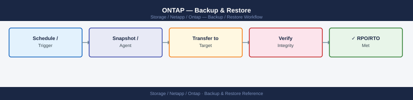
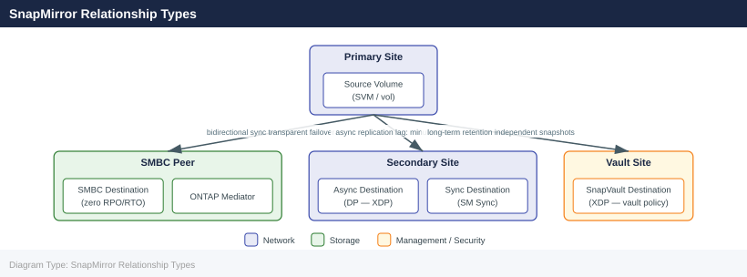
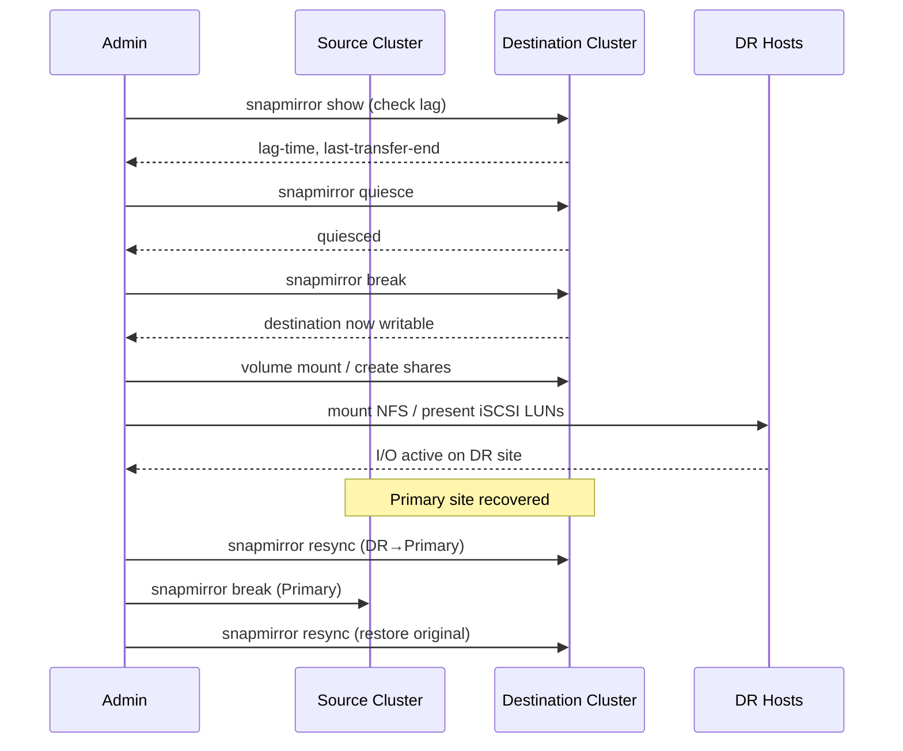

---
tags:
  - netapp
  - operations
---
# ONTAP — Backup & Restore

<div class="kb-summary">
Backup and restore in ONTAP is built around native snapshot technology. Snapshots are the on-array recovery primitive; SnapMirror and SnapVault extend recovery to remote systems and long-term retention; application-aware tools (SnapCenter, Veeam) add consistency coordination.

*Applies to: ONTAP 9.x*
</div>


## Before you begin

- **Access:** Storage admin credentials (cluster admin or equivalent)
- **Timing:** safe to run during business hours unless a step is marked ⚠ (causes interruption)
- **Dependencies:** no active upgrades or migrations on the same infrastructure
- **Logging:** capture command output — paste into the change record on completion

---

## Snapshot-Based Restore

ONTAP snapshots are read-only, space-efficient point-in-time copies stored within the volume they protect. They are near-instant to create and consume space only for changed blocks after the snapshot is taken. Snapshots are the first line of recovery for accidental deletions, data corruption, and test/dev rollback.

### Snapshot Policies

```bash
# List existing snapshot policies
volume snapshot policy show

# Show the policy assigned to a specific volume
volume show -vserver <svm> -volume <vol> -fields snapshot-policy

# Create a snapshot policy (daily schedule, 7 copies retained)
volume snapshot policy create -policy daily-7 -enabled true
volume snapshot policy add-schedule -policy daily-7 -schedule daily -count 7

# Assign a policy to a volume
volume modify -vserver <svm> -volume <vol> -snapshot-policy daily-7
```


```text title="Expected output"
Policy                                   Enabled  Schedules
---------------------------------------- -------- -----------
default                                  true     hourly, daily, weekly, monthly
daily-7                                  true     daily
weekly-backup                            true     weekly, monthly
(Vserver: svm-prod, Volume: data_vol01)
Snapshot Policy: default

Created snapshot policy "daily-7".
Added schedule "daily" to policy "daily-7" with count 7.
Volume modify successful for volume "data_vol01" in Vserver "svm-prod".
```

!!! warning "Common errors"
    **`Error: "daily-7" already exists.`** — Use a unique policy name or delete the existing policy with `volume snapshot policy delete -policy daily-7` first.
    **`Error: Invalid vserver "svm-prod".`** — Verify the SVM name with `vserver show` and ensure you are connected to the correct cluster.
    **`Error: Volume "data_vol01" does not exist in Vserver "svm-prod".`** — Confirm the volume name and SVM with `volume show -vserver <svm>` before assigning the policy.
Recommended snapshot schedule for production volumes:

| Schedule | Retention | Use Case |
|---|---|---|
| Hourly | 24 copies | Active development, frequent change workloads |
| Daily | 7 copies | Standard production data volumes |
| Weekly | 4 copies | Slower-changing data, compliance retention |
| Monthly | 12 copies | Long-term on-array retention (use SnapVault for >12 months) |

### Listing and Reviewing Snapshots

```bash
# List all snapshots for a volume
volume snapshot show -vserver <svm> -volume <vol>

# Show snapshot details including size and creation time
volume snapshot show -vserver <svm> -volume <vol> -fields size,create-time,busy,owners

# Check total snapshot space consumption on a volume
volume show -vserver <svm> -volume <vol> -fields snapshot-percent,size,used

# Access snapshots directly from an NFS client (read-only)
ls /mnt/vol/.snapshot/

# Access snapshots from an SMB client (read-only)
# Navigate to \\server\share\~snapshot\ in Windows Explorer
```


```text title="Expected output"
Vserver     Volume       Snapshot                                Create Time
----------- ------------ ----------------------------------- ---------------
prod-svm    data_vol     hourly.2024-01-15_0800              Jan 15 08:00
prod-svm    data_vol     hourly.2024-01-15_0900              Jan 15 09:00
prod-svm    data_vol     daily.2024-01-14                    Jan 14 00:00
prod-svm    data_vol     weekly.2024-01-08                   Jan 08 00:00

Vserver     Volume       Snapshot                 Size     Create Time        Busy  Owners
----------- ------------ -------------------- --------- ------------------- ---- ----------
prod-svm    data_vol     hourly.2024-01-15_0800 2.4GB    Jan 15 08:00:12     No   -
prod-svm    data_vol     hourly.2024-01-15_0900 2.6GB    Jan 15 09:00:08     No   -
prod-svm    data_vol     daily.2024-01-14       5.1GB    Jan 14 00:00:01     No   -

Vserver     Volume       Snapshot Percent  Size      Used
----------- ------------ --------------- --------- ---------
prod-svm    data_vol     18%              500GB     89GB

total 0
dr-xr-xr-x  4 root root  4096 Jan 15 09:00 hourly.2024-01-15_0800
dr-xr-xr-x  4 root root  4096 Jan 15 08:00 hourly.2024-01-15_0900
dr-xr-xr-x  4 root root  4096 Jan 14 00:00 daily.2024-01-14
dr-xr-xr-x  4 root root  4096 Jan 08 00:00 weekly.2024-01-08
```

!!! warning "Common errors"
    **`Error: command failed: invalid vserver name "<svm>"`** — Replace `<svm>` with the actual SVM name (e.g., `prod-svm`) and verify it exists with `vserver show`.
    **`Error: command failed: invalid volume name "<vol>"`** — Replace `<vol>` with the actual volume name (e.g., `data_vol`) and confirm the volume exists on the specified SVM.
    **`ls: cannot access '/mnt/vol/.snapshot/': Permission denied`** — Ensure the NFS mount includes the `snapdir=visible` option and the client has read permissions on the volume.
### Restoring a Single File or Directory

Clients can access snapshots directly and copy files back without storage administrator intervention:

```bash
# NFS client — copy a file from a snapshot back to the live volume
cp /mnt/vol/.snapshot/daily.2026-05-01_0010/important_file.txt /mnt/vol/important_file.txt
```


```text title="Expected output"
(no output — command completes silently)
```

!!! warning "Common errors"
    **`cp: cannot open '/mnt/vol/.snapshot/daily.2026-05-01_0010/important_file.txt' for reading: No such file or directory`** — Verify the snapshot name and file path exist by listing the snapshot directory with `ls -la /mnt/vol/.snapshot/`.
    **`cp: cannot create regular file '/mnt/vol/important_file.txt': Permission denied`** — Ensure the NFS mount has write permissions and the user has sufficient privileges; check mount options with `mount | grep /mnt/vol`.
For files exposed via SMB, Windows clients can use the Previous Versions tab on any file or folder to restore directly from ONTAP snapshots.

### Restoring a Full Volume to a Snapshot

A volume snapshot restore reverts the entire volume to the state at snapshot creation. This is destructive — all changes after the snapshot are lost. Always verify the snapshot contains the required data before proceeding.

```bash
# Verify the snapshot exists and note its creation time
volume snapshot show -vserver <svm> -volume <vol> -fields snapshot,create-time

# Take a pre-restore snapshot (safety net before restoring)
volume snapshot create -vserver <svm> -volume <vol> -snapshot pre-restore-$(date +%Y%m%d)

# Offline the volume (required for a full snapshot restore)
volume offline -vserver <svm> -volume <vol>

# Restore the volume to the snapshot
volume snapshot restore -vserver <svm> -volume <vol> -snapshot <snap_name>

# Bring the volume back online
volume online -vserver <svm> -volume <vol>
```


```text title="Expected output"
Vserver   Volume            Snapshot                 Create Time
--------- ----------------- ------------------------ ------------------------
svm01     data_vol          hourly.2024.01.15_0800   1/15/2024 08:00:15
svm01     data_vol          daily.2024.01.14_0000    1/14/2024 00:00:02
svm01     data_vol          weekly.2024.01.08_0000   1/8/2024 00:00:01

Volume "data_vol" on Vserver "svm01" has been created successfully.

Volume "data_vol" on Vserver "svm01" has been taken offline.

Volume snapshot restore: Restoring volume "data_vol" on Vserver "svm01" from snapshot "hourly.2024.01.15_0800".
This operation will overwrite all data on the volume. Do you want to continue? {y|n}: y
Restore of snapshot "hourly.2024.01.15_0800" completed successfully.

Volume "data_vol" on Vserver "svm01" has been brought online.
```

!!! warning "Common errors"
    **`Error: command failed: Volume "data_vol" is not offline`** — Run `volume offline -vserver <svm> -volume <vol>` before attempting the restore operation.
    **`Error: command failed: Snapshot "snap_name" does not exist`** — Verify the exact snapshot name using `volume snapshot show` and ensure you are targeting the correct Vserver and volume.
    **`Error: command failed: Volume has active CIFS/NFS connections`** — Disconnect all clients accessing the volume before taking it offline with `volume offline -vserver <svm> -volume <vol> -force true`.
For ONTAP 9.12+ with the SnapRestore license, online restore is supported — the volume remains accessible during restore, which is useful for large volumes where downtime is unacceptable:

```bash
volume snapshot restore -vserver <svm> -volume <vol> -snapshot <snap_name> -online true
```


```text title="Expected output"
Restoring snapshot "daily.2024-01-15_0200" to volume "data_vol" on SVM "prod_svm"...
Restore operation started. Snapshot restore job ID: 12345
Volume "data_vol" is now online and accessible.
Restore completed successfully in 47 seconds.
```

!!! warning "Common errors"
    **`Error: command not found`** — Ensure you are connected to the ONTAP cluster via SSH or the ONTAP CLI, not your local shell.
    **`Error: volume does not exist`** — Verify the SVM name and volume name are correct using `volume show -vserver <svm>`.
    **`Error: snapshot does not exist`** — List available snapshots with `volume snapshot show -vserver <svm> -volume <vol>` and use the exact snapshot name.
### FlexClone for Non-Destructive Test Restore

FlexClone creates an instant writable copy of a volume from a snapshot without consuming additional space. Use this to validate restore content before committing to a production restore:

```bash
# Create a FlexClone from a production snapshot
volume clone create \
    -vserver <svm> \
    -flexclone <clone_name> \
    -parent-volume <source_vol> \
    -parent-snapshot <snap_name> \
    -junction-path /<clone_name>

# Mount and verify the data
# After validation, delete the clone
volume clone delete -vserver <svm> -flexclone <clone_name>
```


```text title="Expected output"
Volume clone create: Command issued successfully
Waiting for clone operation to complete...
Clone creation completed successfully.
Volume "prod_clone_test" created successfully with junction path "/prod_clone_test"
Volume is online and ready for access.

Volume clone delete: Command issued successfully
FlexClone volume "prod_clone_test" has been deleted successfully.
Deleting associated snapshot dependencies...
Clone deletion completed.
```

!!! warning "Common errors"
    **`Error: command failed: Snapshot "snap_name" does not exist on volume "source_vol"`** — Verify the snapshot exists on the parent volume using `volume snapshot show -vserver <svm> -volume <source_vol>`.
    **`Error: command failed: Volume "clone_name" already exists`** — Use a unique clone name or delete the existing clone with `volume clone delete -vserver <svm> -flexclone <clone_name>` first.
    **`Error: command failed: Junction path "/<clone_name>" is already in use`** — Specify a different junction path or remove the existing mount point before creating the clone.
---

## SnapMirror Relationship Types



---

## SnapMirror Failover (DR Restore)

SnapMirror replicates volumes asynchronously to a destination cluster or SVM. The destination volume is read-only under normal operation. Failover (breaking the relationship) makes it writable for disaster recovery.

### DR Failover Sequence



### Standard Failover Procedure

```bash
# 1. Confirm the relationship state and last successful transfer
snapmirror show -destination-path <dest_svm>:<dest_vol> \
    -fields source-path,destination-path,lag-time,healthy,last-transfer-end-timestamp

# 2. Quiesce the relationship (stop new transfers, allow current to complete)
snapmirror quiesce -destination-path <dest_svm>:<dest_vol>

# 3. Break the relationship — destination volume becomes writable
snapmirror break -destination-path <dest_svm>:<dest_vol>

# 4. Mount or present the destination volume to DR hosts
volume mount -vserver <dest_svm> -volume <dest_vol> -junction-path /<dest_vol>

# 5. Create NFS exports or CIFS shares on the DR SVM as needed
```


```text title="Expected output"
Source Path: cluster1_svm:prod_vol
                                  Destination Path: cluster2_svm:prod_vol_dr
                                         Lag Time: 00:00:15
                                           Healthy: true
                        Last Transfer End Timestamp: 2024-01-15 14:32:47 +00:00

Operation succeeded: SnapMirror relationship quiesced.
Waiting for current transfer to complete...
Transfer completed successfully.

Operation succeeded: SnapMirror relationship broken.
Destination volume cluster2_svm:prod_vol_dr is now writable.

Volume mount: Mount operation completed successfully.
Volume cluster2_svm:prod_vol_dr mounted at junction path /prod_vol_dr
```

!!! warning "Common errors"
    **`Error: command failed: relationship does not exist`** — Verify the destination path syntax matches exactly (SVM:volume format) and the relationship exists with `snapmirror show`.
    **`Error: command failed: destination volume is not in a SnapMirror relationship`** — Confirm the SnapMirror relationship is initialized and healthy before attempting to break it.
    **`Error: command failed: junction path already exists`** — Use a different junction path or remove the existing mount point before mounting the destination volume.
### Resync After Primary Recovery

When the primary site is restored, resync re-establishes the replication relationship. The resync operation is incremental — only changed blocks since the failover are transferred.

```bash
# After returning to primary, reverse-resync from DR back to primary
# (makes primary the destination, DR the temporary source)
snapmirror resync -source-path <dest_svm>:<dest_vol> \
    -destination-path <src_svm>:<src_vol>

# After data is synced back, reverse the relationship to restore original direction
snapmirror break -destination-path <src_svm>:<src_vol>
snapmirror resync -destination-path <dest_svm>:<dest_vol>
```


```text title="Expected output"
Operation is queued: snapmirror resync to destination "cluster2://dr_svm/dr_volume".
[Job 1234] Job succeeded: snapmirror resync completed.
Transfer size: 2.4GB
Last transfer duration: 00:12:34
Healthy: true

Operation is queued: snapmirror break for destination "cluster1://prod_svm/prod_volume".
[Job 1235] Job succeeded: snapmirror break completed.
SnapMirror relationship broken.

Operation is queued: snapmirror resync to destination "cluster2://dr_svm/dr_volume".
[Job 1236] Job succeeded: snapmirror resync completed.
Transfer size: 156MB
Last transfer duration: 00:03:12
Healthy: true
```

!!! warning "Common errors"
    **`Error: command failed: relationship does not exist`** — Verify the source and destination paths are correctly formatted as `svm_name:volume_name` and that the SnapMirror relationship exists.
    **`Error: command failed: destination is not a SnapMirror destination`** — Ensure the break command targets the correct destination path and that the relationship is in a valid state before breaking.
### SVM DR (Full SVM Failover)

SVM DR replicates the entire SVM configuration — namespace, NFS exports, CIFS shares, LIF configuration, and data volumes — to a destination SVM. This enables full site failover including protocol configuration, not just volume data.

```bash
# Show SVM DR relationships
snapmirror show -type DP -fields source-path,destination-path,lag-time,healthy

# Activate the destination SVM (failover)
snapmirror break -destination-path <dest_svm>:

# Check SVM state on destination
vserver show -vserver <dest_svm>

# Verify volumes and LIFs were activated
volume show -vserver <dest_svm>
network interface show -vserver <dest_svm>
```


```text title="Expected output"
Source                    Destination               Lag Time       Healthy
========================  ========================  =============  =======
source_svm:               dest_svm:                 00:00:15       true
source_svm:vol_data       dest_svm:vol_data         00:00:12       true
source_svm:vol_logs       dest_svm:vol_logs         00:00:18       true

Operation succeeded: SnapMirror relationship broken for destination-path "dest_svm:".

                                   Admin      Operational Root
Vserver     Type    Subtype        State      State       Volume  Aggregate
=========== ======= ============== ========== ========== ======== ===========
dest_svm    data    default        running    running     vol_root aggr1

Vserver     Volume       Aggregate    State      Type       Size
=========== ============ ============ ========== ========== ==========
dest_svm    vol_data     aggr1        online     DP         500GB
dest_svm    vol_logs     aggr1        online     DP         250GB
dest_svm    vol_root     aggr1        online     RW         20GB

Vserver     Interface       IP              Status      Is Home
=========== =============== =============== =========== ==========
dest_svm    data_lif_01     192.168.1.45    up          true
dest_svm    data_lif_02     192.168.1.46    up          true
dest_svm    mgmt_lif        192.168.1.50    up          true
```

!!! warning "Common errors"
    **`Error: command failed: SnapMirror relationship is not in a quiesced state`** — Run `snapmirror quiesce -destination-path <dest_svm>:` before attempting to break the relationship.
    **`Error: There is no data Vserver with name "<dest_svm>"`** — Verify the destination SVM name is correct and exists on the destination cluster using `vserver show`.
    **`Error: SnapMirror relationship does not exist`** — Confirm the DP relationship is initialized and healthy by checking `snapmirror show -type DP` output before breaking it.
---

## SnapVault (Long-Term Retention)

SnapVault uses the XDP (Extended Data Protection) relationship type to create independent backup copies with configurable long-term retention policies. Destination snapshots are independent of the source — source snapshots can be deleted without affecting SnapVault copies.

### SnapVault Relationship Setup

```bash
# Create a SnapVault relationship (XDP type)
snapmirror create \
    -source-path <src_svm>:<src_vol> \
    -destination-path <vault_svm>:<vault_vol> \
    -type XDP \
    -policy XDPDefault

# Initialize (baseline transfer)
snapmirror initialize -destination-path <vault_svm>:<vault_vol>

# Monitor initialization progress
snapmirror show -destination-path <vault_svm>:<vault_vol> -transfer-progress
```


```text title="Expected output"
Operation succeeded: SnapVault relationship created.

Operation succeeded: SnapMirror operation queued.

Destination Path: prod_vault_svm:prod_vault_vol
Relationship Type: vault
Admin State: snapmirrored
Mirror State: initializing
Unhealthy Reason: -
Progress: 45%
Elapsed Time: 12m34s
Estimated Remaining Time: 15m22s
Network Compression Ratio: 1.2:1
Snapshot Progress: 8 of 12 snapshots transferred
Last Transfer Size: 847.3GB
Last Transfer Duration: 8m15s
```

!!! warning "Common errors"
    **`Error: command failed: Relationship already exists.`** — Verify the relationship doesn't already exist with `snapmirror show -destination-path <vault_svm>:<vault_vol>` before creating.
    **`Error: command failed: Source volume <src_svm>:<src_vol> does not exist.`** — Confirm source volume name and SVM are correct and the source cluster is reachable via cluster peering.
    **`Error: command failed: Destination volume <vault_svm>:<vault_vol> does not exist or is not a DP volume.`** — Create the destination volume first with `volume create -vserver <vault_svm> -volume <vault_vol> -aggregate <aggr> -type DP -size <size>`.
### SnapVault Policy Configuration

```bash
# Show SnapMirror/SnapVault policies
snapmirror policy show

# Show retention rules on the default XDP policy
snapmirror policy show-rule -policy XDPDefault

# Create a custom vault policy with 90-day retention
snapmirror policy create -vserver <vault_svm> -policy vault-90d -type vault
snapmirror policy add-rule -vserver <vault_svm> -policy vault-90d \
    -snapmirror-label daily -keep 90

# Apply custom policy to a SnapVault relationship
snapmirror modify -destination-path <vault_svm>:<vault_vol> -policy vault-90d
```


```text title="Expected output"
Policy Name                     Type        Comment
-------------------------------- ----------- --------------------------------
DPDefault                        async-mirror -
XDPDefault                       vault       -
LocalSync                        sync-mirror -
vault-90d                        vault       -

SnapMirror Label     Keep  Preserve Warn Schedule Prefix
-------------------- ------ --------- ---- -------- ------
daily                90     false     false -        -
weekly               52     false     false -        -
monthly              12     false     false -        -

Policy "vault-90d" created successfully.

Rule added to policy "vault-90d".

Operation succeeded: snapmirror modify for destination "svm-dr:vault_prod".
```

!!! warning "Common errors"
    **`Error: command failed: Vserver "vault_svm" does not exist.`** — Verify the vault SVM name with `vserver show` and replace `<vault_svm>` with the correct SVM name.
    **`Error: command failed: Cannot modify policy on an active SnapMirror relationship without quiescing first.`** — Run `snapmirror quiesce -destination-path <vault_svm>:<vault_vol>` before modifying the policy.
    **`Error: command failed: SnapMirror label "daily" does not exist on source volume.`** — Ensure the source volume has Snapshot copies with the "daily" label created by a matching schedule.
### Manual SnapVault Update

```bash
# Trigger an immediate backup (manual update)
snapmirror update -destination-path <vault_svm>:<vault_vol>

# Show vault relationship status
snapmirror show -type XDP

# Show snapshots on the vault destination
volume snapshot show -vserver <vault_svm> -volume <vault_vol>
```


```text title="Expected output"
Operation is queued: snapmirror update to destination "vault_svm:vault_vol" has been initiated.

Source Destination Mirror State Relationship Status Last Transfer Size Last Transfer Time
------- ----------- ------ ----- ------------------- -------------------- ------------------
prod_svm:data_vol vault_svm:vault_vol XDP Snapmirrored Idle 2.3GB 11/15/2024 14:32:18

Vserver Volume Snapshot Size State Owner
------- ------ -------- ---- ----- -----
vault_svm vault_vol daily.2024-11-15_1400 1.8GB valid SVM
vault_svm vault_vol daily.2024-11-14_1400 1.7GB valid SVM
vault_svm vault_vol daily.2024-11-13_1400 1.6GB valid SVM
vault_svm vault_vol hourly.2024-11-15_1300 892MB valid SVM
vault_svm vault_vol hourly.2024-11-15_1200 856MB valid SVM
```

!!! warning "Common errors"
    **`Error: command failed: snapmirror relationship does not exist`** — Verify the destination path syntax matches an existing SnapMirror relationship using `snapmirror show`.
    **`Error: command failed: access denied. Insufficient privileges for snapmirror update`** — Ensure your ONTAP user role includes the "snapmirror" capability or request admin credentials.
### Restoring from SnapVault

To restore from a SnapVault destination, use `snapmirror restore` to copy a specific snapshot back to the source (or a new recovery volume):

```bash
# Restore a specific snapshot from SnapVault back to the source volume
snapmirror restore \
    -source-path <vault_svm>:<vault_vol> \
    -destination-path <src_svm>:<src_vol> \
    -source-snapshot <snap_name>
```


```text title="Expected output"
[Job 123] Job is queued
[Job 123] Executing SnapMirror restore
[Job 123] Transfer starting for relationship SnapVault_prod_backup
[Job 123] Transferring snapshot: hourly.2024-01-15_0200
[Job 123] 45% Completed (2.3 GB of 5.1 GB transferred)
[Job 123] 100% Completed (5.1 GB transferred)
[Job 123] Finalizing restore operation
[Job 123] Job succeeded: Restore of snapshot 'hourly.2024-01-15_0200' completed successfully
```

!!! warning "Common errors"
    **`Error: source-path "<vault_svm>:<vault_vol>" does not exist`** — Verify the vault SVM and volume names match the SnapVault destination using `snapmirror show -destination-path`.
    **`Error: Snapshots with name "<snap_name>" do not exist on source`** — List available snapshots on the vault volume with `snapshot show -vserver <vault_svm> -volume <vault_vol>` and use the correct snapshot name.
    **`Error: SnapMirror relationship does not exist for destination-path "<src_svm>:<src_vol>"`** — Confirm the SnapVault relationship is initialized and healthy using `snapmirror show -destination-path <src_svm>:<src_vol>`.
---

## SnapCenter Integration

SnapCenter provides application-consistent backup orchestration for ONTAP. It coordinates pre/post quiesce hooks with VMware, Oracle, SQL Server, SAP HANA, and other applications before triggering ONTAP snapshot creation, ensuring backup consistency beyond crash-consistent.

SnapCenter capabilities relevant to ONTAP:
- Application-consistent snapshot creation with pre-quiesce/post-quiesce hooks
- SnapVault replication of application-consistent backups for long-term retention
- Granular restore: file-level, LUN-level, or full volume restore from SnapCenter UI
- Clone workflows: writable FlexClone provisioning from backups for dev/test

See the [SnapCenter section](../../snapcenter/index.md) for full configuration and restore procedures.

---

## Veeam Integration

Veeam Backup & Replication integrates with ONTAP via the Veeam Storage Integration plugin, enabling backup directly from ONTAP storage snapshots. This avoids VM stun during backup — Veeam orchestrates ONTAP snapshots and reads backup data directly from the snapshot, bypassing the production I/O path.

Key configuration points:
- Register the ONTAP cluster in Veeam under **Storage Infrastructure** using the cluster-management LIF
- Use a dedicated `vsadmin` service account with minimum required RBAC permissions
- Configure SnapVault as the secondary target for Veeam backup jobs requiring off-array retention

See the [Integrations](../architecture/integrations.md) page for configuration commands.

---

## Backup Validation Procedures

Backup configurations must be validated periodically — not just configured and forgotten. Test restores confirm that backup data is usable and that the restore process is understood before an incident occurs.

### Monthly Validation Checklist

- [ ] Snapshot policies are configured and running on all protected volumes: `volume snapshot policy show`
- [ ] At least one snapshot exists from within the last 24 hours on all protected volumes
- [ ] SnapMirror relationships are healthy and lag is within RPO: `snapmirror show -fields lag-time,healthy`
- [ ] SnapVault relationships have updated within the expected backup window: `snapmirror show -type XDP`
- [ ] Restore test: create a FlexClone from a recent production snapshot and verify data integrity
- [ ] DR test: confirm SnapMirror destination can be activated by running a break on a non-production relationship in a scheduled DR test
- [ ] SnapCenter or Veeam backup jobs showing success in the backup console
- [ ] AutoSupport delivering successfully: `system node autosupport history show`

### Restore Test Procedure (FlexClone-Based)

```bash
# 1. Identify the most recent snapshot on a production volume
volume snapshot show -vserver <svm> -volume <vol> -fields create-time | sort -k2 -rn | head -3

# 2. Create a FlexClone from the most recent snapshot
volume clone create \
    -vserver <svm> \
    -flexclone <vol>-restore-test \
    -parent-volume <vol> \
    -parent-snapshot <most_recent_snap> \
    -junction-path /<vol>-restore-test

# 3. Mount the clone and verify data
# (mount from an NFS client or attach to a test host)

# 4. Record the restore test result and timestamp

# 5. Delete the test clone
volume clone delete -vserver <svm> -flexclone <vol>-restore-test
```


```text title="Expected output"
Vserver   Volume                 Create Time
--------- ---------------------- ------------------------
prod-svm  prod-data              2024-01-15 14:32:18 +00:00
prod-svm  prod-data              2024-01-15 08:15:42 +00:00
prod-svm  prod-data              2024-01-14 22:47:09 +00:00

Volume clone create: Command completed successfully.

Volume clone delete: Command completed successfully.
```

!!! warning "Common errors"
    **`Error: command failed: Snapshot "snapshot_name" does not exist.`** — Verify the snapshot name matches exactly and exists on the parent volume using `volume snapshot show`.
    **`Error: command failed: FlexClone "vol-restore-test" already exists.`** — Delete the existing clone with `volume clone delete -vserver <svm> -flexclone <vol>-restore-test` before creating a new one.
    **`Error: command failed: Cannot delete FlexClone volume while it is mounted or in use.`** — Unmount the clone from all NFS clients and ensure no processes are accessing it before attempting deletion.
### RPO and RTO Reference

| Recovery Method | RPO | RTO | Scope |
|---|---|---|---|
| Local snapshot restore (single file) | Hourly (policy-dependent) | Minutes | Single file or directory |
| Local snapshot restore (full volume) | Hourly (policy-dependent) | Minutes (small), hours (large) | Full volume |
| SnapMirror failover (volume DR) | Minutes to hours (lag-dependent) | 15–30 minutes | Volume(s); requires DR SVM |
| SVM DR failover | Minutes to hours (lag-dependent) | 30–60 minutes | Full SVM including protocol config |
| SnapVault restore | Hours (last backup transfer) | Hours (transfer time from vault) | Full volume or selected files |
| SnapCenter application restore | Hours (last job run) | Minutes to hours | Application-consistent; granular |

---

## Verify

- Confirm the operation completed without errors in the log or management UI
- Verify the expected state change is visible (service running, object created, config applied)
- Document the outcome in the change record

---

## See also

- [Ontap — Procedures](../procedures/)
- [Ontap — Health Checks](../health-checks/)
- [Ontap — Common Issues](../../troubleshooting/common-issues/)
