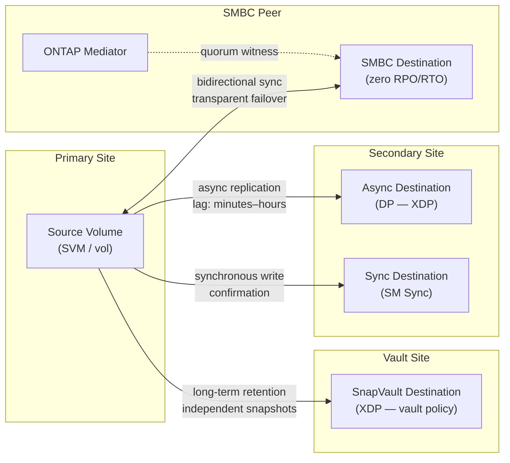
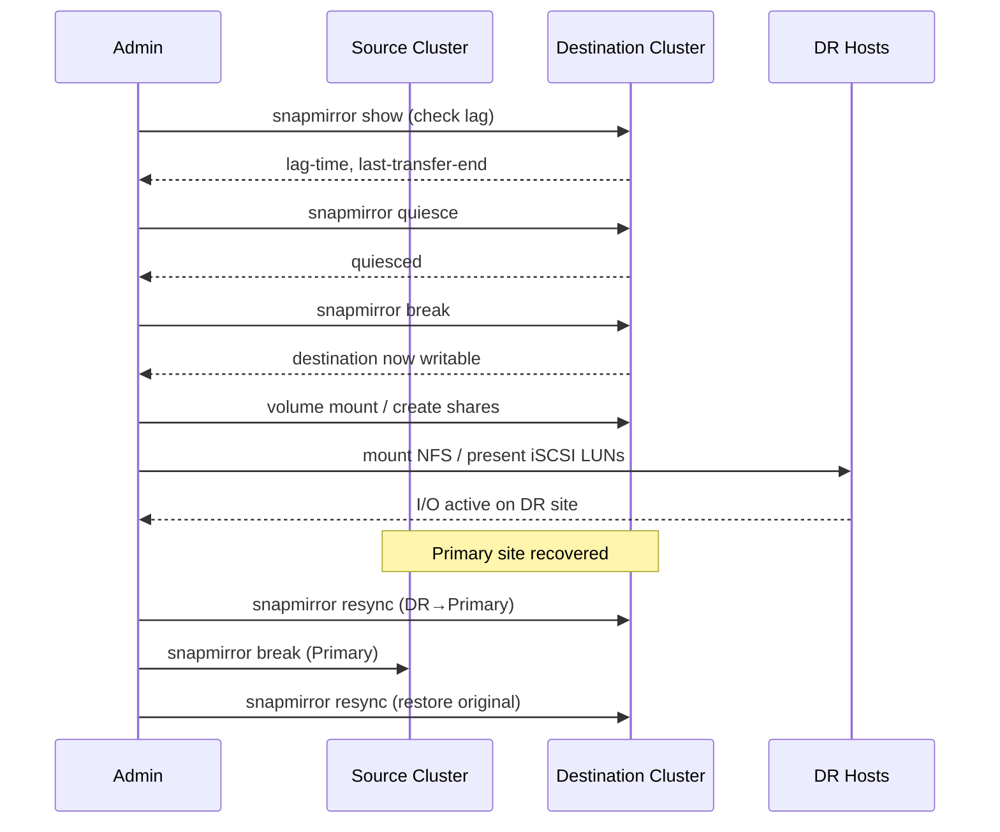

# ONTAP — Backup & Restore

Backup and restore in ONTAP is built around native snapshot technology. Snapshots are the on-array recovery primitive; SnapMirror and SnapVault extend recovery to remote systems and long-term retention; application-aware tools (SnapCenter, Veeam) add consistency coordination.

## Snapshot-Based Restore

ONTAP snapshots are read-only, space-efficient point-in-time copies stored within the volume they protect. They are near-instant to create and consume space only for changed blocks after the snapshot is taken. Snapshots are the first line of recovery for accidental deletions, data corruption, and test/dev rollback.

### Snapshot Policies

```bash
# List existing snapshot policies
volume snapshot policy show

# Show the policy assigned to a specific volume
volume show -vserver <svm> -volume <vol> -fields snapshot-policy

# Create a snapshot policy (daily schedule, 7 copies retained)
volume snapshot policy create -policy daily-7 -enabled true
volume snapshot policy add-schedule -policy daily-7 -schedule daily -count 7

# Assign a policy to a volume
volume modify -vserver <svm> -volume <vol> -snapshot-policy daily-7
```

Recommended snapshot schedule for production volumes:

| Schedule | Retention | Use Case |
|---|---|---|
| Hourly | 24 copies | Active development, frequent change workloads |
| Daily | 7 copies | Standard production data volumes |
| Weekly | 4 copies | Slower-changing data, compliance retention |
| Monthly | 12 copies | Long-term on-array retention (use SnapVault for >12 months) |

### Listing and Reviewing Snapshots

```bash
# List all snapshots for a volume
volume snapshot show -vserver <svm> -volume <vol>

# Show snapshot details including size and creation time
volume snapshot show -vserver <svm> -volume <vol> -fields size,create-time,busy,owners

# Check total snapshot space consumption on a volume
volume show -vserver <svm> -volume <vol> -fields snapshot-percent,size,used

# Access snapshots directly from an NFS client (read-only)
ls /mnt/vol/.snapshot/

# Access snapshots from an SMB client (read-only)
# Navigate to \\server\share\~snapshot\ in Windows Explorer
```

### Restoring a Single File or Directory

Clients can access snapshots directly and copy files back without storage administrator intervention:

```bash
# NFS client — copy a file from a snapshot back to the live volume
cp /mnt/vol/.snapshot/daily.2026-05-01_0010/important_file.txt /mnt/vol/important_file.txt
```

For files exposed via SMB, Windows clients can use the Previous Versions tab on any file or folder to restore directly from ONTAP snapshots.

### Restoring a Full Volume to a Snapshot

A volume snapshot restore reverts the entire volume to the state at snapshot creation. This is destructive — all changes after the snapshot are lost. Always verify the snapshot contains the required data before proceeding.

```bash
# Verify the snapshot exists and note its creation time
volume snapshot show -vserver <svm> -volume <vol> -fields snapshot,create-time

# Take a pre-restore snapshot (safety net before restoring)
volume snapshot create -vserver <svm> -volume <vol> -snapshot pre-restore-$(date +%Y%m%d)

# Offline the volume (required for a full snapshot restore)
volume offline -vserver <svm> -volume <vol>

# Restore the volume to the snapshot
volume snapshot restore -vserver <svm> -volume <vol> -snapshot <snap_name>

# Bring the volume back online
volume online -vserver <svm> -volume <vol>
```

For ONTAP 9.12+ with the SnapRestore license, online restore is supported — the volume remains accessible during restore, which is useful for large volumes where downtime is unacceptable:

```bash
volume snapshot restore -vserver <svm> -volume <vol> -snapshot <snap_name> -online true
```

### FlexClone for Non-Destructive Test Restore

FlexClone creates an instant writable copy of a volume from a snapshot without consuming additional space. Use this to validate restore content before committing to a production restore:

```bash
# Create a FlexClone from a production snapshot
volume clone create \
    -vserver <svm> \
    -flexclone <clone_name> \
    -parent-volume <source_vol> \
    -parent-snapshot <snap_name> \
    -junction-path /<clone_name>

# Mount and verify the data
# After validation, delete the clone
volume clone delete -vserver <svm> -flexclone <clone_name>
```

---

## SnapMirror Relationship Types



---

## SnapMirror Failover (DR Restore)

SnapMirror replicates volumes asynchronously to a destination cluster or SVM. The destination volume is read-only under normal operation. Failover (breaking the relationship) makes it writable for disaster recovery.

### DR Failover Sequence



### Standard Failover Procedure

```bash
# 1. Confirm the relationship state and last successful transfer
snapmirror show -destination-path <dest_svm>:<dest_vol> \
    -fields source-path,destination-path,lag-time,healthy,last-transfer-end-timestamp

# 2. Quiesce the relationship (stop new transfers, allow current to complete)
snapmirror quiesce -destination-path <dest_svm>:<dest_vol>

# 3. Break the relationship — destination volume becomes writable
snapmirror break -destination-path <dest_svm>:<dest_vol>

# 4. Mount or present the destination volume to DR hosts
volume mount -vserver <dest_svm> -volume <dest_vol> -junction-path /<dest_vol>

# 5. Create NFS exports or CIFS shares on the DR SVM as needed
```

### Resync After Primary Recovery

When the primary site is restored, resync re-establishes the replication relationship. The resync operation is incremental — only changed blocks since the failover are transferred.

```bash
# After returning to primary, reverse-resync from DR back to primary
# (makes primary the destination, DR the temporary source)
snapmirror resync -source-path <dest_svm>:<dest_vol> \
    -destination-path <src_svm>:<src_vol>

# After data is synced back, reverse the relationship to restore original direction
snapmirror break -destination-path <src_svm>:<src_vol>
snapmirror resync -destination-path <dest_svm>:<dest_vol>
```

### SVM DR (Full SVM Failover)

SVM DR replicates the entire SVM configuration — namespace, NFS exports, CIFS shares, LIF configuration, and data volumes — to a destination SVM. This enables full site failover including protocol configuration, not just volume data.

```bash
# Show SVM DR relationships
snapmirror show -type DP -fields source-path,destination-path,lag-time,healthy

# Activate the destination SVM (failover)
snapmirror break -destination-path <dest_svm>:

# Check SVM state on destination
vserver show -vserver <dest_svm>

# Verify volumes and LIFs were activated
volume show -vserver <dest_svm>
network interface show -vserver <dest_svm>
```

---

## SnapVault (Long-Term Retention)

SnapVault uses the XDP (Extended Data Protection) relationship type to create independent backup copies with configurable long-term retention policies. Destination snapshots are independent of the source — source snapshots can be deleted without affecting SnapVault copies.

### SnapVault Relationship Setup

```bash
# Create a SnapVault relationship (XDP type)
snapmirror create \
    -source-path <src_svm>:<src_vol> \
    -destination-path <vault_svm>:<vault_vol> \
    -type XDP \
    -policy XDPDefault

# Initialize (baseline transfer)
snapmirror initialize -destination-path <vault_svm>:<vault_vol>

# Monitor initialization progress
snapmirror show -destination-path <vault_svm>:<vault_vol> -transfer-progress
```

### SnapVault Policy Configuration

```bash
# Show SnapMirror/SnapVault policies
snapmirror policy show

# Show retention rules on the default XDP policy
snapmirror policy show-rule -policy XDPDefault

# Create a custom vault policy with 90-day retention
snapmirror policy create -vserver <vault_svm> -policy vault-90d -type vault
snapmirror policy add-rule -vserver <vault_svm> -policy vault-90d \
    -snapmirror-label daily -keep 90

# Apply custom policy to a SnapVault relationship
snapmirror modify -destination-path <vault_svm>:<vault_vol> -policy vault-90d
```

### Manual SnapVault Update

```bash
# Trigger an immediate backup (manual update)
snapmirror update -destination-path <vault_svm>:<vault_vol>

# Show vault relationship status
snapmirror show -type XDP

# Show snapshots on the vault destination
volume snapshot show -vserver <vault_svm> -volume <vault_vol>
```

### Restoring from SnapVault

To restore from a SnapVault destination, use `snapmirror restore` to copy a specific snapshot back to the source (or a new recovery volume):

```bash
# Restore a specific snapshot from SnapVault back to the source volume
snapmirror restore \
    -source-path <vault_svm>:<vault_vol> \
    -destination-path <src_svm>:<src_vol> \
    -source-snapshot <snap_name>
```

---

## SnapCenter Integration

SnapCenter provides application-consistent backup orchestration for ONTAP. It coordinates pre/post quiesce hooks with VMware, Oracle, SQL Server, SAP HANA, and other applications before triggering ONTAP snapshot creation, ensuring backup consistency beyond crash-consistent.

SnapCenter capabilities relevant to ONTAP:
- Application-consistent snapshot creation with pre-quiesce/post-quiesce hooks
- SnapVault replication of application-consistent backups for long-term retention
- Granular restore: file-level, LUN-level, or full volume restore from SnapCenter UI
- Clone workflows: writable FlexClone provisioning from backups for dev/test

See the [SnapCenter section](../../../snapcenter/) for full configuration and restore procedures.

---

## Veeam Integration

Veeam Backup & Replication integrates with ONTAP via the Veeam Storage Integration plugin, enabling backup directly from ONTAP storage snapshots. This avoids VM stun during backup — Veeam orchestrates ONTAP snapshots and reads backup data directly from the snapshot, bypassing the production I/O path.

Key configuration points:
- Register the ONTAP cluster in Veeam under **Storage Infrastructure** using the cluster-management LIF
- Use a dedicated `vsadmin` service account with minimum required RBAC permissions
- Configure SnapVault as the secondary target for Veeam backup jobs requiring off-array retention

See the [Integrations](../../architecture/integrations/) page for configuration commands.

---

## Backup Validation Procedures

Backup configurations must be validated periodically — not just configured and forgotten. Test restores confirm that backup data is usable and that the restore process is understood before an incident occurs.

### Monthly Validation Checklist

- [ ] Snapshot policies are configured and running on all protected volumes: `volume snapshot policy show`
- [ ] At least one snapshot exists from within the last 24 hours on all protected volumes
- [ ] SnapMirror relationships are healthy and lag is within RPO: `snapmirror show -fields lag-time,healthy`
- [ ] SnapVault relationships have updated within the expected backup window: `snapmirror show -type XDP`
- [ ] Restore test: create a FlexClone from a recent production snapshot and verify data integrity
- [ ] DR test: confirm SnapMirror destination can be activated by running a break on a non-production relationship in a scheduled DR test
- [ ] SnapCenter or Veeam backup jobs showing success in the backup console
- [ ] AutoSupport delivering successfully: `system node autosupport history show`

### Restore Test Procedure (FlexClone-Based)

```bash
# 1. Identify the most recent snapshot on a production volume
volume snapshot show -vserver <svm> -volume <vol> -fields create-time | sort -k2 -rn | head -3

# 2. Create a FlexClone from the most recent snapshot
volume clone create \
    -vserver <svm> \
    -flexclone <vol>-restore-test \
    -parent-volume <vol> \
    -parent-snapshot <most_recent_snap> \
    -junction-path /<vol>-restore-test

# 3. Mount the clone and verify data
# (mount from an NFS client or attach to a test host)

# 4. Record the restore test result and timestamp

# 5. Delete the test clone
volume clone delete -vserver <svm> -flexclone <vol>-restore-test
```

### RPO and RTO Reference

| Recovery Method | RPO | RTO | Scope |
|---|---|---|---|
| Local snapshot restore (single file) | Hourly (policy-dependent) | Minutes | Single file or directory |
| Local snapshot restore (full volume) | Hourly (policy-dependent) | Minutes (small), hours (large) | Full volume |
| SnapMirror failover (volume DR) | Minutes to hours (lag-dependent) | 15–30 minutes | Volume(s); requires DR SVM |
| SVM DR failover | Minutes to hours (lag-dependent) | 30–60 minutes | Full SVM including protocol config |
| SnapVault restore | Hours (last backup transfer) | Hours (transfer time from vault) | Full volume or selected files |
| SnapCenter application restore | Hours (last job run) | Minutes to hours | Application-consistent; granular |
