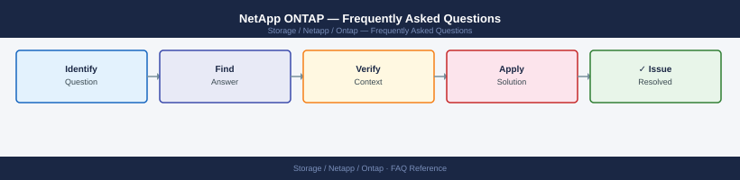

---
tags:
  - netapp-ontap
  - faq
  - operations
---
# NetApp ONTAP — Frequently Asked Questions

*Applies to: NetApp ONTAP 9.x*

Common questions about NetApp ONTAP operations, configuration, and troubleshooting. For step-by-step procedures, see the <a href="index.md">Operations</a> section.

## General

**Q: What ONTAP version is recommended for new deployments?**
A: ONTAP 9.14.1 or 9.15.1 (latest P-releases) are recommended. Check with `version` from ONTAP CLI or System Manager → Cluster → Software. Always apply the latest patch release.

**Q: How do I check the current NetApp ONTAP version?**
A: `version`

## Configuration

**Q: What is the default volume guarantee and when should it change?**
A: Default is `volume` guarantee (thick provisioning). Switch to `none` (thin provisioning) to allow overcommitment: `volume modify -volume vol1 -space-guarantee none`. Monitor aggregate space carefully when thin provisioning.

**Q: How do I enable ONTAP inline deduplication and compression?**
A: `volume efficiency on -volume vol1` enables inline dedup and compression. Verify: `volume efficiency show -volume vol1`. For AFF arrays, both are enabled by default. Expected savings: 2-5x for typical workloads.

## Operations

**Q: How do I perform an ONTAP rolling upgrade without downtime?**
A: Use ONTAP automatic non-disruptive upgrade (ANDU): `system image update -package <url> -replace-package true`. ANDU upgrades nodes one at a time, taking over and giving back storage. Verify with `cluster image show`.

**Q: What is the correct procedure to create a new SVM and NFS export?**
A: `vserver create -vserver nfs_svm -rootvolume root -rootvolume-security-style unix`. Add data LIF. Create volume. Add export policy. Verify: `vserver show -vserver nfs_svm`. Test mount from a client.

## Troubleshooting

**Q: ONTAP shows 'Aggregate is nearly full'. What does it mean?**
A: Aggregate space usage is above 90%. ONTAP restricts new volume creation and thin-provisioned writes above 98%. Add drives, move volumes to another aggregate, or delete snapshots to reclaim space immediately.

**Q: NFS/iSCSI latency increased — where do I start?**
A: Check `qos statistics performance show` for workload latency breakdown. Review `statistics show -object volume` for per-volume IOPS. Check aggregate disk busy % with `aggr show-space`. Review network with `network interface show`.

## Backup and Recovery

**Q: How often should I back up ONTAP configuration?**
A: ONTAP automatically backs up configuration to all nodes. Manual export: `system configuration backup upload`. For disaster recovery, configure SnapMirror for data and MetroCluster for HA. Test failover quarterly.

**Q: Can I restore a single file from an ONTAP snapshot?**
A: Yes — access the `.snapshot` directory in any NFS mount (`ls /mnt/vol1/.snapshot`). Copy the file directly from the snapshot directory. For block (iSCSI/FC), use SnapRestore: `volume snapshot restore-file -volume vol -snapshot snap -path /file`.

## See Also

- [NetApp ONTAP Operations](index.md)
- [NetApp ONTAP Troubleshooting](../../../troubleshooting/index.md)
