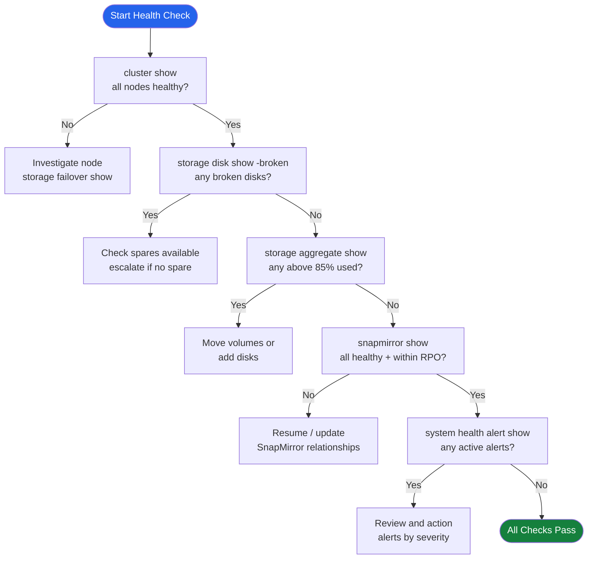

---
tags:
  - netapp
  - operations
---
# ONTAP — Health Checks

<div class="kb-summary">
Health Checks reference covering Health Check Decision Flow, Daily Checks, Health Check, Cluster Health, Pre-Change Checklist and 1 more sections.

*Applies to: ONTAP 9.x*
</div>

## Before you begin

- **Access:** Storage admin credentials (cluster admin or equivalent)
- **Timing:** safe to run during business hours unless a step is marked ⚠ (causes interruption)
- **Dependencies:** no active upgrades or migrations on the same infrastructure
- **Logging:** capture command output — paste into the change record on completion

---

## Run This Routine

1. **Cluster health** — `cluster show -health true` — all nodes should return Healthy
2. **Node status** — `system node show` — all nodes should be Online
3. **Volume health** — `volume show -health-status degraded` — should return no entries
4. **Aggregate status** — `aggr show -state !online` — should return no entries
5. **Disk health** — `disk show -state !present` and `disk show -broken-count` — count should be 0
6. **SVM status** — `vserver show -state !running` — all SVMs should be Running
7. **SnapMirror health** — `snapmirror show -health false` — should return empty
8. **NVRAM battery** — `system node show -fields nvram-battery-status` — all should show Ok

## Health Check Decision Flow




## Daily Checks


| Check | Command | Notes |
|---|---|---|
| [ ] Run `cluster show` | `cluster show` | verify all nodes are healthy and HA pairs are configured |
| [ ] Run `storage disk show -broken` | `storage disk show -broken` | confirm zero broken or failed disks |
| [ ] Run `storage aggregate show -fields used-percent` | `storage aggregate show -fields used-percent` | flag any aggregate above 85% used |
| [ ] Run `snapmirror show -fields lag-time,healthy` | `snapmirror show -fields lag-time,healthy` | confirm all relationships healthy and lag within RPO |
| [ ] Run `system health alert show` | `system health alert show` | review and action any active health alerts |
| [ ] Run `storage failover show` | `storage failover show` | confirm HA takeover state is normal on all nodes |
| [ ] Run `volume show -fields volume,state,percent-used` | `volume show -fields volume,state,percent-used` | confirm all volumes are online and below threshold |
| [ ] Run `event log show -messagename callhome.*` | `event log show -messagename callhome.*` | check for any callhome EMS events since last check |

## Health Check


- [ ] Cluster node count and status match expected inventory
- [ ] All HA pairs show `true` for giveback-capability
- [ ] No aggregates above 85% used (warning) or 90% (critical)
- [ ] All SnapMirror relationships show `healthy: true`
- [ ] No active health alerts with severity `error` or higher
- [ ] All SVMs are running: `svm show -state running`
- [ ] Network interfaces all online: `network interface show -status-oper down` returns no results
- [ ] AutoSupport last sent within expected interval: `autosupport history show`

```bash
# Cluster node and HA status
cluster show
storage failover show

# Aggregate capacity — flag anything above 85%
storage aggregate show -fields aggr-name,used-percent,state

# Volume space usage across all SVMs
volume show -fields volume,state,percent-used

# SnapMirror relationship health and lag time
snapmirror show -fields source-path,destination-path,lag-time,healthy,state

# Broken or failed disks
storage disk show -broken

# Active health alerts
system health alert show

# Recent callhome EMS events
event log show -messagename callhome.*

# SVM and LIF status
svm show
network interface show -status-oper down
```

## Cluster Health


```bash
cluster show
# All nodes should show health: true and eligibility: true

system health status show
# Overall status should be: ok
```

### Node Health


```bash
system node show
# All nodes should be: up

system node show -fields uptime,health
```

### HA Pair Status


```bash
storage failover show
# Both nodes should show: Connected, Not in takeover
```

| State | Meaning |
|---|---|
| Connected, Not in takeover | Healthy — HA active |
| Connected, Waiting for giveback | Node in takeover; manual giveback may be needed |
| Disconnected | HA link down; investigate immediately |

### Disk Health


```bash
storage disk show -broken
# Any output here requires investigation

storage disk show -container-type spare
# Confirm spare disks are available for RAID rebuild
```

### Aggregate Health


```bash
storage aggregate show -state !online
# Should return no output if all aggregates are healthy

storage aggregate show-status | grep -v normal
```

### Volume Health


```bash
volume show -state !online
# Should return no output under normal conditions

volume show -fields state,health | grep -v true
```

### Interface Health


```bash
network interface show -status-oper down
# Any interfaces down should be investigated
```

### EMS Events (Recent Errors)


```bash
event log show -severity ERROR -time-range "1h"
event log show -severity CRITICAL
```

## Pre-Change Checklist

- [ ] All nodes `health: true`
- [ ] HA pair connected, not in takeover
- [ ] No broken disks; spares available
- [ ] All aggregates online
- [ ] All volumes online
- [ ] No critical EMS events in past 24 hours

## Health Summary Table

| Component | Command | Expected |
|---|---|---|
| Cluster | `cluster show` | health: true |
| HA | `storage failover show` | Connected |
| Disks | `storage disk show -broken` | No output |
| Aggregates | `storage aggregate show -state !online` | No output |
| Volumes | `volume show -state !online` | No output |
| EMS | `event log show -severity CRITICAL` | No output |

---

## Verify

- Confirm the operation completed without errors in the log or management UI
- Verify the expected state change is visible (service running, object created, config applied)
- Document the outcome in the change record

---

## See also

- [Ontap — Procedures](../procedures/)
- [Ontap — CLI Reference](../cli-reference/)
- [Ontap — Common Issues](../../troubleshooting/common-issues/)
