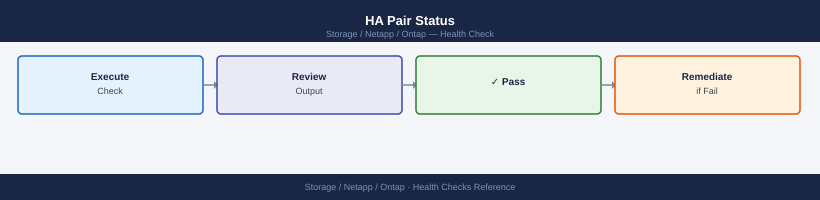
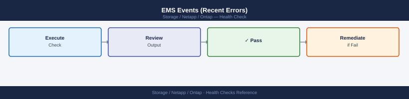

---
tags:
  - netapp
  - operations
---
# ONTAP — Health Checks

<div class="kb-summary">
Health Checks reference covering Health Check Decision Flow, Daily Checks, Health Check, Cluster Health, Pre-Change Checklist and 1 more sections.

*Applies to: ONTAP 9.x*
</div>

## Before you begin

- **Access:** Storage admin credentials (cluster admin or equivalent)
- **Timing:** safe to run during business hours unless a step is marked ⚠ (causes interruption)
- **Dependencies:** no active upgrades or migrations on the same infrastructure
- **Logging:** capture command output — paste into the change record on completion

---

## Run This Routine

1. **Cluster health** — `cluster show -health true` — all nodes should return Healthy
2. **Node status** — `system node show` — all nodes should be Online
3. **Volume health** — `volume show -health-status degraded` — should return no entries
4. **Aggregate status** — `aggr show -state !online` — should return no entries
5. **Disk health** — `disk show -state !present` and `disk show -broken-count` — count should be 0
6. **SVM status** — `vserver show -state !running` — all SVMs should be Running
7. **SnapMirror health** — `snapmirror show -health false` — should return empty
8. **NVRAM battery** — `system node show -fields nvram-battery-status` — all should show Ok

## Health Check Decision Flow


```d2
direction: right

start: "Start Health Check" {shape: oval}
clusterShow: "cluster show\nall nodes healthy?" {shape: rectangle}
nodeDown: "Investigate node\nstorage failover show" {shape: rectangle}
diskCheck: "storage disk show -broken\nany broken disks?" {shape: rectangle}
diskAction: "Check spares available\nescalate if no spare" {shape: rectangle}
aggrCheck: "storage aggregate show\nany above 85% used?" {shape: rectangle}
aggrAction: "Move volumes or\nadd disks" {shape: rectangle}
smCheck: "snapmirror show\nall healthy + within RPO?" {shape: rectangle}
smAction: "Resume / update\nSnapMirror relationships" {shape: rectangle}
alertCheck: "system health alert show\nany active alerts?" {shape: rectangle}
alertAction: "Review and action\nalerts by severity" {shape: rectangle}
done: "All Checks Pass" {shape: rectangle}

start -> clusterShow
clusterShow -> nodeDown
clusterShow -> diskCheck
diskCheck -> diskAction
diskCheck -> aggrCheck
aggrCheck -> aggrAction
aggrCheck -> smCheck
smCheck -> smAction
smCheck -> alertCheck
alertCheck -> alertAction
alertCheck -> done
```

## Daily Checks


| Check | Command | Notes |
|---|---|---|
| [ ] Run `cluster show` | `cluster show` | verify all nodes are healthy and HA pairs are configured |
| [ ] Run `storage disk show -broken` | `storage disk show -broken` | confirm zero broken or failed disks |
| [ ] Run `storage aggregate show -fields used-percent` | `storage aggregate show -fields used-percent` | flag any aggregate above 85% used |
| [ ] Run `snapmirror show -fields lag-time,healthy` | `snapmirror show -fields lag-time,healthy` | confirm all relationships healthy and lag within RPO |
| [ ] Run `system health alert show` | `system health alert show` | review and action any active health alerts |
| [ ] Run `storage failover show` | `storage failover show` | confirm HA takeover state is normal on all nodes |
| [ ] Run `volume show -fields volume,state,percent-used` | `volume show -fields volume,state,percent-used` | confirm all volumes are online and below threshold |
| [ ] Run `event log show -messagename callhome.*` | `event log show -messagename callhome.*` | check for any callhome EMS events since last check |

## Health Check


- [ ] Cluster node count and status match expected inventory
- [ ] All HA pairs show `true` for giveback-capability
- [ ] No aggregates above 85% used (warning) or 90% (critical)
- [ ] All SnapMirror relationships show `healthy: true`
- [ ] No active health alerts with severity `error` or higher
- [ ] All SVMs are running: `svm show -state running`
- [ ] Network interfaces all online: `network interface show -status-oper down` returns no results
- [ ] AutoSupport last sent within expected interval: `autosupport history show`

```bash
# Cluster node and HA status
cluster show
storage failover show

# Aggregate capacity — flag anything above 85%
storage aggregate show -fields aggr-name,used-percent,state

# Volume space usage across all SVMs
volume show -fields volume,state,percent-used

# SnapMirror relationship health and lag time
snapmirror show -fields source-path,destination-path,lag-time,healthy,state

# Broken or failed disks
storage disk show -broken

# Active health alerts
system health alert show

# Recent callhome EMS events
event log show -messagename callhome.*

# SVM and LIF status
svm show
network interface show -status-oper down
```


```text title="Expected output"
Cluster Identification
  Cluster Name: prod-cluster-01
  Cluster Serial Number: 4082368-50-147852

Node                  Health  Eligibility
--------------------  ------  -----------
node-01.prod.local    true    true
node-02.prod.local    true    true

                                    Local  Remote            Local  Remote
Node           Partner              HA     HA    Takeover   Giveback
-----------    --------------------  -----  -----  --------  --------
node-01        node-02              ready  ready  possible  not-possible
node-02        node-01              ready  ready  possible  not-possible

Aggregate     Used%  State
-----------   -----  ------
aggr0_node01   72%   online
aggr0_node02   68%   online
aggr1_ssd      91%   online
data_pool_01   84%   online

Volume                 State      %Used
---------------------  ---------  -----
svm01_root             online      45%
prod_database_vol      online      78%
backup_archive_01      online      92%
logs_tier2             online      38%
...

Source Path                    Destination Path               Lag Time  Healthy  State
-----------------------------  ----------------------------  ---------  -------  ------
prod-cluster-01:prod_db_vol    dr-cluster-02:prod_db_vol_dr  00:15:32   true     snapmirrored
prod-cluster-01:archive_vol    dr-cluster-02:archive_vol_dr  02:45:18   false    paused

Broken Disks: None.

Alert ID  Severity  Node              Resource  Description
--------  --------  ----------------  --------  -----------------------------------------------
1847      minor     node-02           aggr1     Aggregate aggr1_ssd is 91% full
2104      warning   node-01           disk      Disk shelf 1.1 temperature elevated (68°C)

Event Log Entries: None. (No callhome events in last 24 hours)

Vserver Name             State   Subtype
----------------------  -------  ---------
svm_prod                running  default
svm_dr                  running  dp_destination
svm_admin               running  admin

Interface      Vserver         Node         Status  Oper Status
-----------    ---------------  -----------  ------  -----------
e0a            svm_prod         node-01      up      down
e0c            svm_prod         node-02      up      down
```

!!! warning "Common errors"
    **`Error: command not found: cluster show`** — Verify you are connected to the ONTAP cluster management interface (SSH to cluster IP, not node IP).
    **`Error: More than one match found for "snapmirror show"`** — Add the `-instance` flag or filter by source/destination path to narrow results.
    **`Warning: Aggregate aggr1_ssd is 91% full`** — Add capacity or move volumes to lower-utilization aggregates immediately to prevent write failures above 95%.
## Cluster Health


```bash
cluster show
# All nodes should show health: true and eligibility: true

system health status show
# Overall status should be: ok
```


```text title="Expected output"
Cluster
  Cluster Name: prod-cluster-01
  Cluster UUID: 4a3c8b92-1f47-11ee-a456-00a0985f1234
  Cluster Serial Number: 4082068-50-123456
  Cluster Location:
  Cluster Contact:
  Cluster Web URL: https://10.50.12.100:443
  Cluster fully qualified domain name: prod-cluster-01.corp.local

Node                  Health  Eligibility   Model       Owner             Location
--------------------- ------- ------------- ----------- ----------------  --------
prod-node-01          true    true          A400        NetApp Inc.       DC1-Rack3
prod-node-02          true    true          A400        NetApp Inc.       DC1-Rack3
prod-node-03          true    true          A400        NetApp Inc.       DC1-Rack4
prod-node-04          true    true          A400        NetApp Inc.       DC1-Rack4

System Health Status
Status: ok
...
```

!!! warning "Common errors"
    **`Node prod-node-02 health: false`** — Check node logs with `system node run -node prod-node-02 syslog tail` and resolve hardware or software faults before proceeding.
    **`Eligibility: false for prod-node-03`** — Verify the node has completed boot and cluster join with `cluster ring show -node prod-node-03`, then wait for automatic recovery or manually rejoin if needed.
### Node Health


```bash
system node show
# All nodes should be: up

system node show -fields uptime,health
```


```text title="Expected output"
Node      Health  Uptime
--------- ------- ---------------
node-01   true    730 days 14:32:18
node-02   true    730 days 14:28:45

Node      Uptime
--------- ---------------
node-01   730 days 14:32:18
node-02   730 days 14:28:45
```

!!! warning "Common errors"
    **`Error: command not found: system`** — Ensure you are connected to the ONTAP cluster CLI (SSH to cluster management IP) rather than the local shell.
    **`Error: This operation is not permitted: insufficient privileges`** — Log in with an admin-level account or request cluster administrator credentials.
### HA Pair Status



```bash
storage failover show
# Both nodes should show: Connected, Not in takeover
```


```text title="Expected output"
Takeover
Node           Partner        State Status
-------------- -------------- ----- ---------
node-01        node-02        Connected Not in takeover
node-02        node-01        Connected Not in takeover
```

!!! warning "Common errors"
    **`Error: command not found: storage`** — Ensure you are logged into the ONTAP cluster CLI (SSH to the cluster management IP), not the local shell.
    **`Error: This operation is not permitted: insufficient privileges`** — Verify your ONTAP user account has the "admin" or equivalent role with cluster-wide permissions.
| State | Meaning |
|---|---|
| Connected, Not in takeover | Healthy — HA active |
| Connected, Waiting for giveback | Node in takeover; manual giveback may be needed |
| Disconnected | HA link down; investigate immediately |

### Disk Health


```bash
storage disk show -broken
# Any output here requires investigation

storage disk show -container-type spare
# Confirm spare disks are available for RAID rebuild
```


```text title="Expected output"
Broken Disks:
(no disks)

Spare Disks:
Shelf Bay Container Type Owner Disk Type Size Status
----- --- -------------- ----- --------- ---- ------
1.0   1   spare          -     SSD       960GB normal
1.0   2   spare          -     SSD       960GB normal
1.0   3   spare          -     HDD       4TB  normal
2.0   5   spare          -     HDD       4TB  normal
2.0   6   spare          -     HDD       4TB  normal
```

!!! warning "Common errors"
    **`Error: command not found: storage`** — Ensure you are logged into the ONTAP cluster CLI (not the local shell); use `ssh admin@<cluster-ip>` to connect.
    **`Error: No disks match the criteria`** — This is informational output indicating no broken disks exist; if spares also show no output, contact NetApp support as the cluster may have insufficient spare capacity.
### Aggregate Health


```bash
storage aggregate show -state !online
# Should return no output if all aggregates are healthy

storage aggregate show-status | grep -v normal
```


```text title="Expected output"
(no output — command completes silently)

Aggregate                       State            Status
aggr0                           online           normal
aggr1                           online           normal
data_svm01                      online           normal
```

!!! warning "Common errors"
    **`Error: command not found: storage`** — Ensure you are running this command in the ONTAP CLI (SSH to cluster management IP), not in a bash shell.
    **`Error: more than one administrative Vserver matches the supplied name`** — Specify the SVM explicitly with `-vserver <svm_name>` if multiple SVMs exist on the cluster.
### Volume Health


```bash
volume show -state !online
# Should return no output under normal conditions

volume show -fields state,health | grep -v true
```


```text title="Expected output"
(no output — command completes silently)

Volume            State      Health Status
vol_backup        online     true
vol_data          online     true
vol_logs          online     true
vol_archive       online     true
vol_temp          online     true
```

!!! warning "Common errors"
    **`Error: command not found: volume`** — Ensure you are connected to the NetApp cluster via SSH or the ONTAP CLI, not a standard Linux shell.
    **`Error: invalid field name "state"`** — Verify the field name is correct for your ONTAP version; use `volume show -help` to list available fields.
### Interface Health


```bash
network interface show -status-oper down
# Any interfaces down should be investigated
```


```text title="Expected output"
Vserver         Interface       Address         Admin/Oper
-------         ---------       -------         ----------
cluster1        e0a             192.168.1.10    up/down
cluster1        e0b             192.168.1.11    up/down
cluster1-01     e0c             10.0.50.5       up/down
cluster1-02     e0d             10.0.50.6       up/down
svm_nfs         e0e             172.16.8.20     up/down

5 entries were displayed.
```

!!! warning "Common errors"
    **`Error: command not found`** — Ensure you are running this command in the ONTAP CLI (SSH to cluster management IP), not your local shell.
    **`Error: Invalid command`** — Verify the ONTAP version supports the `-status-oper` parameter; use `network interface show` without filters on older releases and pipe to grep instead.
    **`Error: No entries were displayed`** — This is expected if no interfaces are down; check interface status with `network interface show` to confirm all are operational.
### EMS Events (Recent Errors)



```bash
event log show -severity ERROR -time-range "1h"
event log show -severity CRITICAL
```


```text title="Expected output"
Time                Severity Event
------------------- -------- -----------------------------------------------
2024-01-15 14:32:18 ERROR    WAFL: Low free space on aggregate aggr_ssd_01
2024-01-15 14:28:45 ERROR    CIFS: Failed to authenticate user domain\admin01
2024-01-15 14:15:22 ERROR    NFS: Mount request denied from 192.168.1.50
2024-01-15 13:47:09 ERROR    Replication: SnapMirror transfer lag exceeded threshold

Time                Severity Event
------------------- -------- -----------------------------------------------
2024-01-15 10:22:33 CRITICAL HA: Takeover initiated on node-02
2024-01-15 09:15:47 CRITICAL Storage: Disk shelf ps2-shelf-01 power supply failure
2024-01-15 08:44:12 CRITICAL Network: Cluster interconnect link down on e0e
```

!!! warning "Common errors"
    **`Error: Invalid time range format`** — Use valid time range syntax like "1h", "24h", or "7d" without quotes in the command.
    **`Error: Unknown severity level`** — Specify severity as one of: EMERGENCY, ALERT, CRITICAL, ERROR, WARNING, NOTICE, INFO, or DEBUG.
## Pre-Change Checklist

- [ ] All nodes `health: true`
- [ ] HA pair connected, not in takeover
- [ ] No broken disks; spares available
- [ ] All aggregates online
- [ ] All volumes online
- [ ] No critical EMS events in past 24 hours

## Health Summary Table

| Component | Command | Expected |
|---|---|---|
| Cluster | `cluster show` | health: true |
| HA | `storage failover show` | Connected |
| Disks | `storage disk show -broken` | No output |
| Aggregates | `storage aggregate show -state !online` | No output |
| Volumes | `volume show -state !online` | No output |
| EMS | `event log show -severity CRITICAL` | No output |

---

## Verify

- Confirm the operation completed without errors in the log or management UI
- Verify the expected state change is visible (service running, object created, config applied)
- Document the outcome in the change record

---

## See also

- [Ontap — Procedures](../procedures/)
- [Ontap — CLI Reference](../cli-reference/)
- [Ontap — Common Issues](../../troubleshooting/common-issues/)
