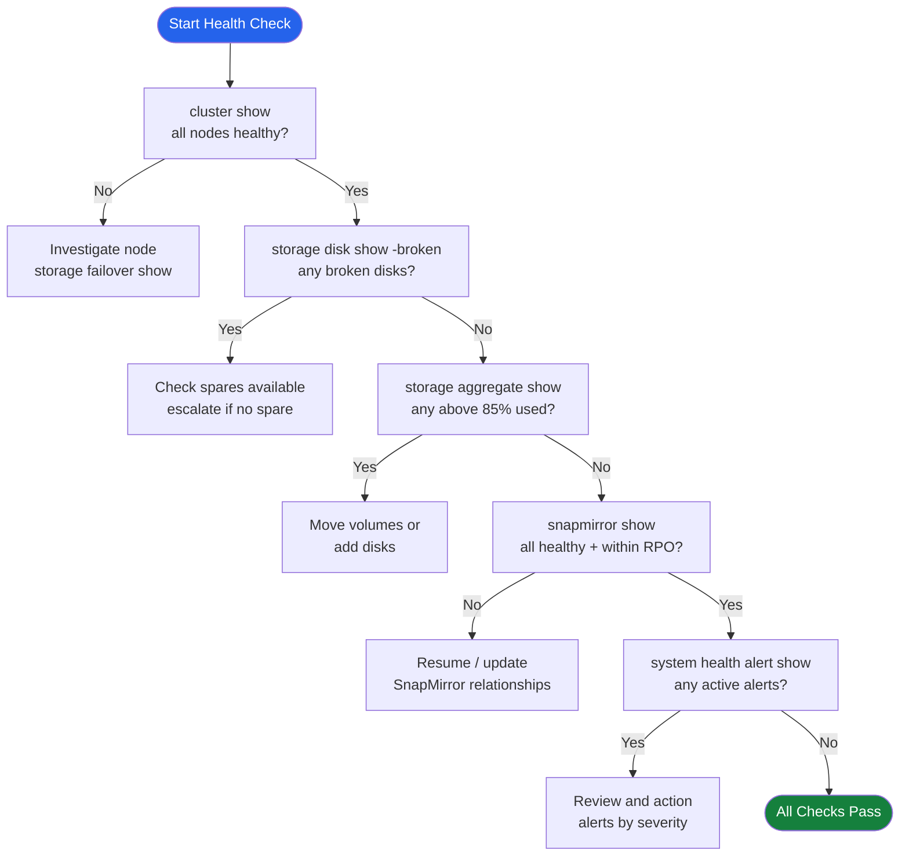

# ONTAP — Health Checks


<div class="kb-summary">
Health Checks reference covering Health Check Decision Flow, Daily Checks, Health Check, Cluster Health, Pre-Change Checklist and 1 more sections.
</div>
```
┌──────────────────────────────────── NetApp ONTAP — Health Checks ─────────────────────────────────────┐
│                                                                                                       │
│   ┌───────────────────────────────────────────────────────────────────────────────────────────────┐   │
│   │        ONTAP health checks: routine verification of operational status and performance        │   │
│   │         Checks include: controller status, drive health, replication lag, and capacity        │   │
│   │         Frequency: daily quick checks; weekly detailed review; monthly capacity report        │   │
│   │        Configure threshold-based alerts for proactive incident prevention and awareness       │   │
│   └───────────────────────────────────────────────────────────────────────────────────────────────┘   │
│                                                                                                       │
│    Check status → review alerts → verify replication → capacity → log                                 │
│                                                                                                       │
│                  ▼                                ▼                                ▼                  │
│                                                                                                       │
│   ┌─────────────────────────────┐  ┌─────────────────────────────┐  ┌─────────────────────────────┐   │
│   │            Layer            │  │          Component          │  │            Notes            │   │
│   │           Cluster           │  │        HA node pairs        │  │          Scale-out          │   │
│   │             SVM             │  │        Virtual server       │  │       Protocol access       │   │
│   │          Aggregate          │  │         RAID groups         │  │         Storage pool        │   │
│   │           FlexVol           │  │         Thin volume         │  │        Data container       │   │
│   │          SnapMirror         │  │         Replication         │  │          Async/Sync         │   │
│   └─────────────────────────────┘  └─────────────────────────────┘  └─────────────────────────────┘   │
│                                                                                                       │
│                          ▼                                                 ▼                          │
│                                                                                                       │
│   ┌───────────────────────────────────────────────────────────────────────────────────────────────┐   │
│   │    Check area    │  How to verify   │   Pass criteria   │    Frequency     │       Tool       │   │
│   │   Controllers    │   show status    │    All healthy    │      Daily       │     CLI/GUI      │   │
│   │      Drives      │   show drives    │  No failed/pred.  │      Daily       │     CLI/GUI      │   │
│   │   Replication    │ show replication │  Lag < threshold  │      Daily       │     CLI/GUI      │   │
│   │     Capacity     │  show capacity   │     < 80% used    │      Daily       │     CLI/GUI      │   │
│   └───────────────────────────────────────────────────────────────────────────────────────────────┘   │
│                                                                                                       │
│    Physical: AFF/FAS HA node pairs · cluster network · client access network · MetroCluster           │
│                                                                                                       │
│    Key terms:                                                                                         │
│                                                                                                       │
│    ONTAP              = NetApp storage OS; unified NAS, SAN, and object across AFF, FAS, ONTAP Select │
│    SVM                = Storage Virtual Machine; logical storage server with protocols, IP, and vol...│
│    Aggregate          = RAID group of disks; underpins FlexVols and FlexGroups within a node          │
│    FlexVol            = flexible thin-provisioned volume within an aggregate; most common container   │
│    FlexGroup          = scale-out volume spanning multiple aggregates; for very large NAS workloads   │
│    SnapMirror         = async or synchronous replication between ONTAP systems for DR and backup      │
│    SnapVault          = backup-oriented SnapMirror variant; independent retention at destination      │
│    FlexClone          = instant space-efficient writable clone of a volume or LUN from snapshot       │
│    Snapshot           = ONTAP space-efficient PiT copy; stored in .snapshot directory on NFS          │
│    ONTAP Mediator     = third-site quorum for SnapMirror SM-BC; prevents split-brain scenarios        │
│    SM-BC              = SnapMirror Business Continuity; synchronous zero-RPO active-active SAN repl...│
│    vserver            = ONTAP CLI name for SVM; vserver show and vserver nfs show are common commands │
│                                                                                                       │
└───────────────────────────────────────────────────────────────────────────────────────────────────────┘
```


## Health Check Decision Flow



## Daily Checks

| Check | Command | Notes |
|---|---|---|
| [ ] Run `cluster show` | `cluster show` | verify all nodes are healthy and HA pairs are configured |
| [ ] Run `storage disk show -broken` | `storage disk show -broken` | confirm zero broken or failed disks |
| [ ] Run `storage aggregate show -fields used-percent` | `storage aggregate show -fields used-percent` | flag any aggregate above 85% used |
| [ ] Run `snapmirror show -fields lag-time,healthy` | `snapmirror show -fields lag-time,healthy` | confirm all relationships healthy and lag within RPO |
| [ ] Run `system health alert show` | `system health alert show` | review and action any active health alerts |
| [ ] Run `storage failover show` | `storage failover show` | confirm HA takeover state is normal on all nodes |
| [ ] Run `volume show -fields volume,state,percent-used` | `volume show -fields volume,state,percent-used` | confirm all volumes are online and below threshold |
| [ ] Run `event log show -messagename callhome.*` | `event log show -messagename callhome.*` | check for any callhome EMS events since last check |

## Health Check

- [ ] Cluster node count and status match expected inventory
- [ ] All HA pairs show `true` for giveback-capability
- [ ] No aggregates above 85% used (warning) or 90% (critical)
- [ ] All SnapMirror relationships show `healthy: true`
- [ ] No active health alerts with severity `error` or higher
- [ ] All SVMs are running: `svm show -state running`
- [ ] Network interfaces all online: `network interface show -status-oper down` returns no results
- [ ] AutoSupport last sent within expected interval: `autosupport history show`

```bash
# Cluster node and HA status
cluster show
storage failover show

# Aggregate capacity — flag anything above 85%
storage aggregate show -fields aggr-name,used-percent,state

# Volume space usage across all SVMs
volume show -fields volume,state,percent-used

# SnapMirror relationship health and lag time
snapmirror show -fields source-path,destination-path,lag-time,healthy,state

# Broken or failed disks
storage disk show -broken

# Active health alerts
system health alert show

# Recent callhome EMS events
event log show -messagename callhome.*

# SVM and LIF status
svm show
network interface show -status-oper down
```

## Cluster Health

```bash
cluster show
# All nodes should show health: true and eligibility: true

system health status show
# Overall status should be: ok
```

### Node Health

```bash
system node show
# All nodes should be: up

system node show -fields uptime,health
```

### HA Pair Status

```bash
storage failover show
# Both nodes should show: Connected, Not in takeover
```

| State | Meaning |
|---|---|
| Connected, Not in takeover | Healthy — HA active |
| Connected, Waiting for giveback | Node in takeover; manual giveback may be needed |
| Disconnected | HA link down; investigate immediately |

### Disk Health

```bash
storage disk show -broken
# Any output here requires investigation

storage disk show -container-type spare
# Confirm spare disks are available for RAID rebuild
```

### Aggregate Health

```bash
storage aggregate show -state !online
# Should return no output if all aggregates are healthy

storage aggregate show-status | grep -v normal
```

### Volume Health

```bash
volume show -state !online
# Should return no output under normal conditions

volume show -fields state,health | grep -v true
```

### Interface Health

```bash
network interface show -status-oper down
# Any interfaces down should be investigated
```

### EMS Events (Recent Errors)

```bash
event log show -severity ERROR -time-range "1h"
event log show -severity CRITICAL
```

## Pre-Change Checklist

- [ ] All nodes `health: true`
- [ ] HA pair connected, not in takeover
- [ ] No broken disks; spares available
- [ ] All aggregates online
- [ ] All volumes online
- [ ] No critical EMS events in past 24 hours

## Health Summary Table

| Component | Command | Expected |
|---|---|---|
| Cluster | `cluster show` | health: true |
| HA | `storage failover show` | Connected |
| Disks | `storage disk show -broken` | No output |
| Aggregates | `storage aggregate show -state !online` | No output |
| Volumes | `volume show -state !online` | No output |
| EMS | `event log show -severity CRITICAL` | No output |
