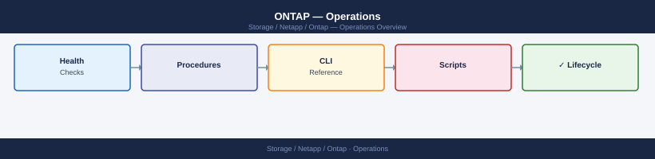

---
tags:
  - netapp
  - operations
---
# ONTAP — Operations

ONTAP — Operations reference: Health Checks, Procedures, CLI Reference, Install & Upgrade, and 2 more.

*Applies to: ONTAP 9.x*

<a class="kb-card" href="health-checks/"><strong>Health Checks</strong>Routine checks, service validation, and status verification.</a>
<a class="kb-card" href="procedures/"><strong>Procedures</strong>Day-to-day operational tasks and how-to guides.</a>
<a class="kb-card" href="cli-reference/"><strong>CLI Reference</strong>Commands, syntax, and quick reference.</a>
<a class="kb-card" href="install-upgrade/"><strong>Install & Upgrade</strong>Installation, upgrade, patching, and decommission.</a>
<a class="kb-card" href="scripts/"><strong>Scripts</strong>Automation scripts and reusable code.</a>
<a class="kb-card" href="backup-restore/"><strong>Backup & Restore</strong>Backup configuration, restore procedures, and validation.</a>
<a class="kb-card" href="morning-health-check/"><strong>Morning Health-Check</strong>Daily ONTAP cluster health-check runbook — takes ~10 minutes.</a>

