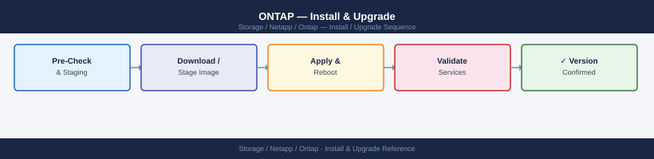

---
tags:
  - netapp
  - operations
---
# ONTAP — Install & Upgrade

<div class="kb-summary">
Install & Upgrade reference covering ONTAP Version Matrix, Upgrade Paths, EOL Tracking, Refresh Planning.

*Applies to: ONTAP 9.x*
</div>


## Before you begin

- **Access:** Storage admin credentials (cluster admin or equivalent)
- **Timing:** safe to run during business hours unless a step is marked ⚠ (causes interruption)
- **Dependencies:** no active upgrades or migrations on the same infrastructure
- **Logging:** capture command output — paste into the change record on completion

---

## ONTAP Version Matrix

| Release | GA Date | Full Support End | Limited Support End | Notes |
|---|---|---|---|---|
| ONTAP 9.10.1 | Dec 2021 | Dec 2023 | Dec 2025 | P4 — limited support only |
| ONTAP 9.11.1 | Jun 2022 | Jun 2024 | Jun 2026 | P4 — limited support only |
| ONTAP 9.12.1 | Dec 2022 | Dec 2024 | Dec 2026 | P4 — approaching end |
| ONTAP 9.13.1 | Jun 2023 | Jun 2025 | Jun 2027 | Active — full support |
| ONTAP 9.14.1 | Dec 2023 | Dec 2025 | Dec 2027 | Active — recommended baseline |
| ONTAP 9.15.1 | Jun 2024 | Jun 2026 | Jun 2028 | Active — current latest |

Verify exact dates on the [NetApp Product Lifecycle page](https://mysupport.netapp.com/) before planning any upgrade.

## Upgrade Paths

ONTAP follows a major.minor.patch versioning model. Upgrade rules:

- **Within the same minor release**: patch upgrades are always supported (e.g., 9.14.1 → 9.14.1P4)
- **Adjacent minor releases**: direct upgrade supported (e.g., 9.13.1 → 9.14.1)
- **Skipping minor releases**: generally not supported; must step through intermediate versions (e.g., 9.11.1 → 9.12.1 → 9.13.1)
- **Automated Non-Disruptive Upgrade (ANDU)**: preferred method; orchestrated by ONTAP itself, upgrades one node at a time via takeover/giveback
- Always check the [ONTAP Upgrade Advisor in BlueXP](https://bluexp.netapp.com) for the exact recommended path and any pre-upgrade blockers before beginning

```text
9.10.1 → 9.11.1 → 9.12.1 → 9.13.1 → 9.14.1 → 9.15.1
         (patch updates within each minor release are always allowed)
```

**Pre-upgrade checks:**
1. All SnapMirror relationships healthy; lag within RPO
2. No aggregates above 90% capacity
3. No failed or degraded RAID groups
4. AutoSupport delivering successfully
5. HA storage failover enabled on all pairs (`storage failover show`)

## EOL Tracking

- Monitor the NetApp Support lifecycle calendar quarterly
- Plan upgrades before limited support end dates — limited support means no new bug fixes, only existing fixes available
- Align ONTAP upgrades with SnapCenter compatibility — SnapCenter has its own supported ONTAP version matrix (see SnapCenter lifecycle)
- Track end-of-availability (EOA) for hardware platforms; an EOA platform still runs ONTAP but cannot be added to the fleet

## Refresh Planning

| Trigger | Action |
|---|---|
| ONTAP reaching limited support | Plan upgrade to current GA release within 6 months |
| Hardware EOA announced | Plan platform replacement within 18–24 months |
| Performance headroom <20% | Evaluate node addition or platform refresh |
| Aggregate disk count at shelf max | Add shelf or plan migration to larger-capacity drives |
| SnapMirror destination ONTAP < source | Upgrade destination first before upgrading source |

Refresh projects should be tracked in a capacity and lifecycle register updated quarterly. Use the Active IQ / BlueXP risk advisor to surface hardware and firmware advisories that can trigger unplanned refresh requirements.

---

## Verify

- Confirm the operation completed without errors in the log or management UI
- Verify the expected state change is visible (service running, object created, config applied)
- Document the outcome in the change record

---

## See also

- [Ontap — Procedures](../procedures/)
- [Ontap — Health Checks](../health-checks/)
