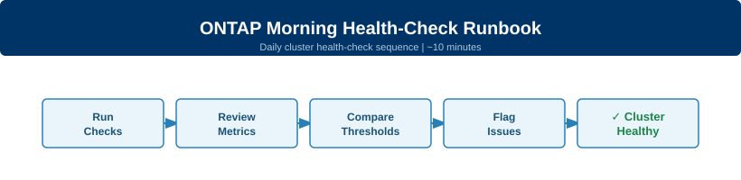

---
tags:
  - netapp
  - ontap
  - health-checks
  - operations
search:
  boost: 2
---
# ONTAP Morning Health-Check Runbook

<div class="kb-summary">
Daily ONTAP cluster health-check sequence — takes ~10 minutes. Run this every morning before starting any operational work.
</div>



```d2
direction: right

center: "NetApp ONTAP" {shape: hexagon}
run_this_routine: "Run This Routine" {shape: rectangle}
health_thresholds: "Health Thresholds" {shape: rectangle}

center -> run_this_routine
center -> health_thresholds
```

## Before you begin

**Prerequisites:**

- ONTAP CLI access — SSH to the cluster management LIF or use `system node run`
- Credentials with at least `readonly` cluster role (admin role for full access)
- Know your cluster name and node names (`cluster show` confirms both)
- No active non-disruptive upgrade (NDU) or takeover in progress — check with `storage failover show` first

**Timing:** Safe to run during business hours. None of these commands are disruptive. Capture output to your change log.

---

## Run This Routine

Work through steps 1–11 in order. Each command takes seconds. Flag any output that does not match the expected result before moving to the next step.

**Step 1 — Verify all nodes are healthy**

```bash
cluster show
```

Expected output: every node shows `true` in the Health column and `false` in the Epsilon column (one node may hold Epsilon — that is normal). Any node showing `false` for Health blocks the rest of the routine.

---

**Step 2 — Overall health subsystem status**

```bash
system health status show
```

Expected output: `Status: ok`. Any other status (`degraded`, `warning`) means a subsystem has an active alert — proceed to step 3 immediately.

---

**Step 3 — Active health alerts**

```bash
system health alert show
```

Expected output: no rows. Any alert row must be acknowledged or resolved. Note the `Probable Cause` and `Corrective Action` columns — these are actionable.

---

**Step 4 — Aggregate health and usage**

```bash
storage aggregate show -fields state,used-percent
```

Expected output: all aggregates in `online` state. Flag any aggregate with `used-percent` exceeding 80%. At 85% or above treat as critical — see threshold table below.

---

**Step 5 — Offline volumes**

```bash
volume show -fields state,percent-used | grep -v online
```

Expected output: no rows (or only the header line). Any volume not in `online` state requires investigation before starting operational work.

---

**Step 6 — Volumes approaching capacity**

```bash
volume show -fields percent-used | awk 'NR==1 || $NF+0 > 80'
```

Expected output: header line only. Any volume above 80% must be noted. Above 90% is critical — expand the volume or move data before proceeding with other work.

---

**Step 7 — SnapMirror replication lag**

```bash
snapmirror show -fields lag-time,health
```

Expected output: all relationships show `true` for Health. For `lag-time`, compare against each relationship's schedule — lag exceeding 2× the schedule interval indicates a transfer problem. Any `false` Health value requires immediate investigation.

---

**Step 8 — LIF status**

```bash
network interface show -fields status-oper
```

Expected output: all LIFs show `up` for `status-oper`. Any `down` LIF blocks storage access for the associated protocol — resolve before starting other work.

---

**Step 9 — Broken or failed disks**

```bash
storage disk show -broken
```

Expected output: no rows. Any broken disk must be replaced immediately. Open a case with NetApp if the disk is under support contract. Do not start any workload migrations until broken disks are replaced.

---

**Step 10 — Recent error events (last hour)**

```bash
event log show -severity error -time-range "1h"
```

Expected output: no rows, or only informational entries. Review any `error`-severity events. Cross-reference with steps 3–9 to determine if they are already captured by an alert. Events not tied to an existing alert need investigation.

---

**Step 11 — AutoSupport delivery**

```bash
autosupport history show
```

Expected output: the most recent entry shows `sent-successful` or `ignore`. A `failed` status means AutoSupport is not reaching NetApp — check proxy configuration and network connectivity. This does not block operations but must be resolved today.

---

## Health Thresholds

| Metric | Warning | Critical | Action |
|---|---|---|---|
| Aggregate used | >75% | >85% | Add disks or enable thin-provisioning on hosted volumes |
| Volume used | >80% | >90% | Expand volume size or move data to a less-full aggregate |
| SnapMirror lag | >2x schedule interval | RPO breach | Force a manual `snapmirror update`, check bandwidth and network |
| Broken disks | Any | Any | Replace immediately, open NetApp support case |
| LIF down | Any | Any | Investigate port and failover group; restore before starting work |
| Health alerts | Any warning | Any error | Follow Corrective Action in `system health alert show` |

---

## See Also

- [ONTAP Health Checks](../health-checks.md) — broader health-check reference covering storage, network, and protocol layers
- [ONTAP Procedures](../procedures.md) — step-by-step procedures for common admin tasks
- [ONTAP Troubleshooting](../../troubleshooting/index.md) — common issues and diagnostic steps
- [ONTAP CLI Reference](../cli-reference.md) — full command reference for ONTAP CLI
- [ONTAP Operations](../index.md) — all ONTAP operations pages
