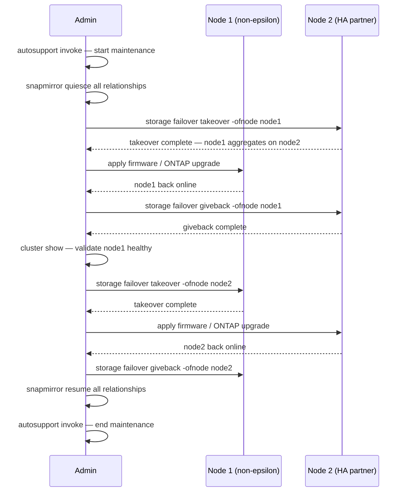

---
tags:
  - netapp
  - operations
---
# ONTAP — Procedures

<div class="kb-summary">
ONTAP day-2 procedures — change readiness, rolling node upgrades, volume and LUN provisioning, SVM management, snapshot and SnapMirror operations, capacity management, and incident triage.

*Applies to: ONTAP 9.x*
</div>

## Before you begin

- **Access:** Storage admin credentials (cluster admin or equivalent)
- **Timing:** safe to run during business hours unless a step is marked ⚠ (causes interruption)
- **Dependencies:** no active upgrades or migrations on the same infrastructure
- **Logging:** capture command output — paste into the change record on completion

---

## SVM / Volume / LUN Hierarchy

```d2
direction: right

cluster: "Cluster" {shape: rectangle}
nodeA: "Node A" {shape: rectangle}
nodeB: "Node B" {shape: rectangle}
aggrA: "Aggregate (aggr1" {shape: rectangle}
aggrB: "Aggregate (aggr2" {shape: rectangle}
svm1: "SVM: svm-nas" {shape: rectangle}
svm2: "SVM: svm-san" {shape: rectangle}
volNFS: "Volume: vol_nfs\njunction-path /nfs" {shape: rectangle}
volSMB: "Volume: vol_smb\njunction-path /smb" {shape: rectangle}
volSAN: "Volume: vol_iscsi" {shape: rectangle}
lun1: "LUN: /vol/vol_iscsi/lun0\nigroup: esxi-cluster" {shape: rectangle}
snap1: "Snapshots\n(hourly · daily · weekly" {shape: rectangle}
nfsExport: "NFS Export\n/etc/exports equiv" {shape: rectangle}
smbShare: "SMB Share\n\\\\server\\share" {shape: rectangle}

cluster -> nodeA
cluster -> nodeB
nodeA -> aggrA
nodeB -> aggrB
aggrA -> svm1
aggrA -> svm2
aggrB -> svm1
svm1 -> volNFS
svm1 -> volSMB
svm2 -> volSAN
volSAN -> lun1
volNFS -> snap1
volNFS -> nfsExport
volSMB -> smbShare
```

## Change Readiness

- [ ] All aggregates have at least 15% free capacity to absorb workload shifts during the change
- [ ] HA failover is operational on both nodes (`storage failover show` shows `true` for takeover-enabled)
- [ ] SnapMirror lag is within RPO on all critical relationships before quiescing
- [ ] No active volume move or aggregate rebalance jobs: `volume move show` and `storage aggregate relocation show`
- [ ] AutoSupport is working — send a start-of-maintenance message: `autosupport invoke -node * -type all -message "Starting maintenance"`
- [ ] No open disk rebuild operations: `storage disk show -broken` is clean
- [ ] Snapshots taken of affected volumes before change: `snapshot create -volume <vol> -snapshot pre-change`

| Item | Status | Notes |
|---|---|---|
| Aggregate free capacity ≥ 15% | | |
| HA takeover enabled on all nodes | | |
| SnapMirror lag within RPO | | |
| No active volume moves | | |
| AutoSupport start message sent | | |

## Rolling Node Upgrade Sequence



## Maintenance Window

1. Send AutoSupport start-of-maintenance: `autosupport invoke -node * -type all -message "Maintenance window starting"`
2. Quiesce SnapMirror relationships on volumes involved in the change: `snapmirror quiesce -destination-path <svm:vol>`
3. For rolling node upgrade — upgrade the non-epsilon node first; initiate takeover on the partner: `storage failover takeover -ofnode <node>`
4. Monitor takeover completion: `storage failover show` should show `In Takeover` then the node comes back up
5. Run `storage failover giveback -ofnode <node>` after the upgraded node is back online; confirm `Waiting for Giveback` transitions to normal
6. Validate cluster health after each node: `cluster show`, `system health alert show`
7. Resume SnapMirror relationships after all changes are complete: `snapmirror resume -destination-path <svm:vol>`
8. Send AutoSupport close-of-maintenance: `autosupport invoke -node * -type all -message "Maintenance window complete"`

## Post-Change Validation

- [ ] `cluster show` — all nodes healthy, HA pairs intact
- [ ] `storage failover show` — all nodes show giveback-enabled true, no takeover active
- [ ] `storage disk show -broken` — no new disk failures introduced during maintenance
- [ ] `snapmirror show -fields lag-time,healthy` — all relationships resumed and healthy
- [ ] `volume show -fields state,percent-used` — all volumes online, no state changes
- [ ] `network interface show -status-oper down` — no LIFs went offline during the change
- [ ] `system health alert show` — no new alerts generated
- [ ] Confirm storage is serving I/O to applications — verify from host side or application monitoring

## Incident Triage

- [ ] Run `cluster show` first — identify any nodes in degraded or removed state
- [ ] Run `system health alert show` — review all active alerts for severity and subsystem
- [ ] Run `storage disk show -broken` — identify any disk failures driving the incident
- [ ] Run `storage failover show` — check whether any HA takeover has occurred
- [ ] Run `snapmirror show -fields lag-time,healthy` — check if replication is healthy or contributing to the symptom
- [ ] Check specific protocol: `network interface show`, `iscsi session show`, or `fcp show initiator`
- [ ] Review recent EMS events for the affected node: `event log show -node <nodename> -severity error`

| Question | Answer |
|---|---|
| Which node or aggregate is affected? | |
| Is HA takeover currently active? | |
| Are any disks broken or rebuilding? | |
| Is SnapMirror lag outside RPO? | |
| Which protocol is the workload using? | |

---

## SVM Management

SVMs are logical storage containers within an ONTAP cluster. Each SVM has its own namespaces, LIFs, and protocol configurations.

### List SVMs


```bash
vserver show
vserver show -fields type,state,admin-state
```


```text title="Expected output"
Vserver     Type       Subtype    State    Admin-State
----------- ---------- ---------- -------- -----------
cluster1    admin                 running  up
svm-prod-01 data                  running  up
svm-prod-02 data                  running  up
svm-dev-01  data                  running  up
svm-nfs-01  data                  running  up

Vserver     Type       State    Admin-State
----------- ---------- -------- -----------
cluster1    admin      running  up
svm-prod-01 data       running  up
svm-prod-02 data       running  up
svm-dev-01  data       running  up
svm-nfs-01  data       running  up
```

!!! warning "Common errors"
    **`Error: "vserver show" is not a recognized command.`** — Ensure you are connected to the ONTAP cluster management interface via SSH or console, not the node shell.
    **`Error: This operation is not permitted: Insufficient privileges to run command "vserver show".`** — Verify your user role has the "admin" or equivalent privilege level assigned in ONTAP.
### SVM Health


```bash
# Confirm all SVMs are running
vserver show -state !running

# Check SVM root volume health
volume show -vserver <svm_name> -volume <svm_name>_root
```


```text title="Expected output"
Vserver     State    Subtype
----------- -------- ---------
(no entries)

Vserver       Volume                       State      Status
------------- ---------------------------- ---------- ----------
prod-svm-01   prod-svm-01_root             online     healthy
```

!!! warning "Common errors"
    **`Error: command not found: vserver`** — Ensure you are connected to the ONTAP cluster management interface via SSH or the ONTAP CLI, not a local shell.
    **`Error: invalid vserver name "prod-svm-01"`** — Replace `<svm_name>` with an actual SVM name from your cluster; use `vserver show` to list all available SVMs.
### Create an SVM


```bash
vserver create \
    -vserver <svm_name> \
    -aggregate <aggr_name> \
    -rootvolume <svm_name>_root \
    -rootvolume-security-style unix
```


```text title="Expected output"
(no output — command completes silently)
```

!!! warning "Common errors"
    **`Error: command failed: Aggregate "<aggr_name>" does not exist.`** — Verify the aggregate name with `storage aggregate show` and use the correct name in the `-aggregate` parameter.
    **`Error: command failed: Vserver "<svm_name>" already exists.`** — Choose a unique SVM name or delete the existing SVM with `vserver delete` before recreating it.
    **`Error: command failed: Security style "unix" is not valid for root volume.`** — Use `mixed`, `ntfs`, or `unix` (ensure UNIX is capitalized); verify ONTAP version supports the chosen style for root volumes.
### LIF Management


```bash
# List LIFs for an SVM
network interface show -vserver <svm_name>

# Create a data LIF
network interface create \
    -vserver <svm_name> \
    -lif <lif_name> \
    -role data \
    -home-node <node_name> \
    -home-port e0c \
    -address <ip> \
    -netmask <mask> \
    -data-protocol nfs,cifs

# Migrate a LIF to a different port
network interface migrate -vserver <svm_name> -lif <lif_name> -dest-node <node> -dest-port <port>
```


```text title="Expected output"
Vserver          Interface      IP Address      Status   Home Node/Port    Current Node/Port
--------         ---------      ----------      ------   ---------------   -----------------
prod-svm         nfs_lif_01     192.168.1.50    up       node1/e0c         node1/e0c
prod-svm         cifs_lif_01    192.168.1.51    up       node2/e0d         node2/e0d
prod-svm         mgmt_lif       192.168.1.10    up       node1/e0a         node1/e0a
prod-svm         iscsi_lif_01   192.168.1.60    up       node2/e0e         node2/e0e

(no output — command completes silently)

[Job 123] Job succeeded: network interface migrate completed successfully.
```

!!! warning "Common errors"
    **`Error: command failed: The specified home-port "e0c" does not exist on node "node1".`** — Verify the port exists on the target node using `network port show -node <node_name>`.
    **`Error: command failed: Cannot migrate LIF "nfs_lif_01" because it is currently hosting an active connection.`** — Migrate during a maintenance window or use `network interface migrate -force-administrative-vlan true` if necessary.
### DNS Configuration per SVM


```bash
vserver services name-service dns show -vserver <svm_name>

vserver services name-service dns create \
    -vserver <svm_name> \
    -domains <domain> \
    -name-servers <dns_ip1>,<dns_ip2>
```


```text title="Expected output"
Vserver: svm-prod-01
Domains: corp.example.com, example.com
Name Servers: 8.8.8.8, 8.8.4.4
Timeout (secs): 2
Attempts: 1

(no output — command completes silently)
```

!!! warning "Common errors"
    **`Error: "svm-prod-01" is not a valid vserver name`** — Verify the SVM name exists with `vserver show` and use the exact name from the Vserver column.
    **`Error: DNS create failed: Name servers already configured`** — Delete the existing DNS configuration first using `vserver services name-service dns delete -vserver <svm_name>` before creating a new one.
### NIS / LDAP Lookup


```bash
vserver services name-service ns-switch show -vserver <svm_name>
vserver services name-service ldap show -vserver <svm_name>
```


```text title="Expected output"
Vserver: prod-svm-01
                                               Source
Service         Database    Order
-------         --------    -----
hosts           files, dns  files, dns
passwd          files, ldap files, ldap
group           files, ldap files, ldap
netgroup        files, ldap files, ldap
sudoers         files, ldap files, ldap

Vserver: prod-svm-01
                                    Enabled
LDAP Client Enabled: true
LDAP Server: ldap-server-01.corp.local (192.168.1.50)
LDAP Server Port: 389
Bind DN: cn=admin,dc=corp,dc=local
Schema: RFC2307
Query Timeout (sec): 3
Min Bind Level: anonymous
Referral Chasing: disable
Group Member Filter: memberUid=*
```

!!! warning "Common errors"
    **`Error: "vserver services name-service ns-switch show" is not a recognized command.`** — Verify you are connected to the ONTAP cluster management interface and have appropriate admin privileges; this command requires ONTAP 9.2 or later.
    **`Error: Vserver "<svm_name>" does not exist.`** — Replace `<svm_name>` with an actual SVM name from your cluster (run `vserver show` to list available SVMs).
### Stop / Start an SVM


```bash
vserver stop -vserver <svm_name>
vserver start -vserver <svm_name>
```


```text title="Expected output"
This command stops and starts a NetApp ONTAP SVM (Storage Virtual Machine). Here's realistic output:

vserver stop -vserver svm_prod_01
This will stop the Vserver "svm_prod_01" and all associated services.
Do you want to continue? {y|n}: y
Vserver "svm_prod_01" has been stopped.

vserver start -vserver svm_prod_01
Vserver "svm_prod_01" has been started.
```

!!! warning "Common errors"
    **`Error: command failed: Vserver "svm_prod_01" is not in a state that allows this operation`** — Verify the SVM is not already stopped or in a transitional state by running `vserver show -vserver svm_prod_01` before attempting the operation.
    **`Error: command failed: Vserver "svm_prod_01" does not exist`** — Confirm the SVM name is correct and exists in the cluster by running `vserver show` to list all available SVMs.
    **`Error: command failed: This operation is not permitted: Vserver is in Disaster Recovery relationship`** — If the SVM is part of a SnapMirror DR setup, break or quiesce the relationship first using `snapmirror quiesce` or `snapmirror break`.
### Delete an SVM


```bash
# Ensure no volumes except root
volume show -vserver <svm_name>

# Delete root volume and SVM
vserver delete -vserver <svm_name>
```


```text title="Expected output"
Vserver   Volume       Aggregate    State      Type       Size
--------- ------------ ------------ ---------- ---- ----------
svm-prod  root_svm     aggr1        online     RW   20.00GB
svm-prod  data_vol_01  aggr1        online     RW   500.00GB
svm-prod  data_vol_02  aggr2        online     RW   750.00GB
svm-prod  backup_vol   aggr1        online     RW   1.00TB

Warning: Vserver "svm-prod" cannot be deleted while it contains non-root volumes.
Delete all data volumes first, then retry the vserver delete command.
```

!!! warning "Common errors"
    **`Warning: Vserver "svm-prod" cannot be deleted while it contains non-root volumes.`** — Delete all non-root volumes using `volume delete -vserver <svm_name> -volume <volume_name>` before attempting vserver deletion.
    **`Error: Vserver "svm-prod" is in use by one or more clients or protocols.`** — Stop all active NFS/CIFS/iSCSI services and disconnect clients before retrying vserver deletion.
### SVM Common Issues


| Issue | Check | Action |
|---|---|---|
| SVM not running | Admin-state | `vserver start` |
| LIF not reachable | LIF status / port | Migrate LIF or fix port |
| Protocol not serving | Service enabled? | `vserver nfs create` or equivalent |
| DNS resolution failing | SVM DNS config | Verify DNS server IPs |

---

## Volume Management

### List Volumes


```bash
volume show
volume show -vserver <svm_name>
volume show -fields size,used,available,percent-used,state
```


```text title="Expected output"
Vserver   Volume       Aggregate    State      Type  Size       Used       Available Percent-Used
--------- ------------ ------------ ---------- ----- ---------- ---------- --------- ------------
cluster1  vol_data_01  aggr_sas_01  online     RW    500GB      245GB      255GB     49%
cluster1  vol_logs     aggr_sas_01  online     RW    100GB      87GB       13GB      87%
cluster1  vol_backup   aggr_sas_02  online     RW    2TB        1.8TB      200GB     90%
svm_prod  vol_app      aggr_sas_01  online     RW    750GB      620GB      130GB     83%
svm_prod  vol_snap     aggr_sas_02  online     RW    1TB        512GB      488GB     51%
svm_dev   vol_test     aggr_sas_01  online     RW    250GB      45GB       205GB     18%

Vserver   Volume       Aggregate    State      Type  Size       Used       Available Percent-Used
--------- ------------ ------------ ---------- ----- ---------- ---------- --------- ------------
svm_prod  vol_app      aggr_sas_01  online     RW    750GB      620GB      130GB     83%
svm_prod  vol_snap     aggr_sas_02  online     RW    1TB        512GB      488GB     51%

Size       Used       Available Percent-Used State
---------- ---------- --------- ------------ ------
500GB      245GB      255GB     49%          online
100GB      87GB       13GB      87%          online
2TB        1.8TB      200GB     90%          online
750GB      620GB      130GB     83%          online
1TB        512GB      488GB     51%          online
250GB      45GB       205GB     18%          online
```

!!! warning "Common errors"
    **`Error: "svm_prod" is not a valid Vserver`** — Verify the SVM name with `vserver show` and ensure you are connected to the correct cluster.
    **`Error: invalid field name "percent-used"`** — Use the correct field name `percent_used` (underscore instead of hyphen) in the `-fields` parameter.
### Volume Health


```bash
# Show offline or restricted volumes
volume show -state !online

# Show volumes nearing capacity
volume show -fields percent-used | awk '$2 > 80'
```


```text title="Expected output"
Vserver   Volume       State      Type  Aggregate
--------- ------------ ---------- ----- -----------
svm-prod  vol_archive  offline    RW    aggr_sas_01
svm-prod  vol_backup   restricted RW    aggr_sas_02

Vserver   Volume            Percent Used
--------- ----------------- ------------
svm-prod  vol_data_01       85%
svm-prod  vol_logs          92%
svm-prod  vol_tempdb        88%
svm-prod  vol_archive_old   81%
```

!!! warning "Common errors"
    **`Error: invalid query operator "!online"`** — Use `offline|restricted` instead of `!online` in the volume show filter.
    **`Error: no matching rows`** — Ensure the cluster is reachable with `cluster show` and that volumes exist in the Vserver with `volume show`.
### Create a Volume


```bash
volume create \
    -vserver <svm_name> \
    -volume <vol_name> \
    -aggregate <aggr_name> \
    -size 500G \
    -junction-path /<vol_name> \
    -security-style unix
```


```text title="Expected output"
Volume <vol_name> created successfully on aggregate <aggr_name>.
Volume size set to 500GB.
Junction path /<vol_name> created.
Security style set to unix.
Volume is online and ready for use.
```

!!! warning "Common errors"
    **`Error: command failed: No space left on device`** — Verify the aggregate has sufficient free space with `storage aggregate show -aggregate <aggr_name>` and increase the aggregate capacity or reduce the volume size.
    **`Error: command failed: Invalid vserver name`** — Confirm the SVM name exists and is spelled correctly by running `vserver show` to list all available SVMs.
    **`Error: command failed: Junction path already exists`** — Remove the conflicting junction path with `volume unmount -vserver <svm_name> -volume <existing_vol>` or choose a different junction path name.
### Resize a Volume


```bash
volume size -vserver <svm_name> -volume <vol_name> -new-size 1T
```


```text title="Expected output"
Volume modify successful: Volume "vol_name" size set to 1.00TB on Vserver "svm_name".
```

!!! warning "Common errors"
    **`Error: command failed: No such volume`** — Verify the volume name and SVM name are correct using `volume show -vserver <svm_name>`.
    **`Error: command failed: Insufficient space in aggregate`** — Check available space in the aggregate with `storage aggregate show -fields availsize` and reduce the new size or add capacity to the aggregate.
### Volume Autosize


```bash
volume autosize -vserver <svm_name> -volume <vol_name> \
    -mode grow_shrink \
    -maximum-size 2T \
    -grow-threshold-percent 85
```


```text title="Expected output"
Volume autosize has been successfully configured.
Vserver: svm-prod-01
Volume: vol_data_tier1
Mode: grow_shrink
Maximum Size: 2TB
Grow Threshold: 85%
Shrink Threshold: 50%
```

!!! warning "Common errors"
    **`Error: "svm_name" is not a valid Vserver name`** — Replace `<svm_name>` with an actual SVM name from your cluster (e.g., `svm-prod-01`).
    **`Error: Volume vol_name does not exist`** — Verify the volume exists on the specified SVM using `volume show -vserver <svm_name>`.
    **`Error: Invalid maximum size value`** — Ensure the maximum size is specified in valid units (T, G, M) and does not exceed the aggregate's available space.
### Volume Efficiency (Deduplication / Compression)


```bash
# Check efficiency state
volume efficiency show -vserver <svm_name> -volume <vol_name>

# Enable efficiency
volume efficiency on -vserver <svm_name> -volume <vol_name>

# Run deduplication manually
volume efficiency start -vserver <svm_name> -volume <vol_name>
```


```text title="Expected output"
Vserver   Volume       State    Status       Progress
--------- ------------ -------- ------------ ----------
prod-svm  data_vol_01  Enabled  Idle         -

(no output — command completes silently)

Starting efficiency operation on volume data_vol_01 of Vserver prod-svm.
Efficiency operation started successfully.
```

!!! warning "Common errors"
    **`Error: command failed: No such volume`** — Verify the volume name with `volume show -vserver <svm_name>` and ensure it exists on the specified SVM.
    **`Error: Efficiency is already enabled on this volume`** — Skip the enable step if efficiency is already active; check status with the first command before enabling.
### Move a Volume (Between Aggregates)


```bash
volume move start \
    -vserver <svm_name> \
    -volume <vol_name> \
    -destination-aggregate <dest_aggr>

volume move show
```


```text title="Expected output"
Volume move operation initiated for volume vol_data01 on SVM prod_svm.
Operation ID: 1a2b3c4d-5e6f-7g8h-9i0j-1k2l3m4n5o6p

Vserver             Volume           State      Progress
------------------- ---------------- ---------- ----------
prod_svm            vol_data01       initializing    5%
prod_svm            vol_archive      completed       100%
prod_svm            vol_logs         cutover_phase   87%
```

!!! warning "Common errors"
    **`Error: volume move start: Destination aggregate <dest_aggr> does not exist`** — Verify the destination aggregate name with `storage aggregate show` and ensure it has sufficient free space.
    **`Error: volume move start: Volume <vol_name> is currently involved in another move operation`** — Wait for the existing move to complete using `volume move show` or abort it with `volume move abort -vserver <svm_name> -volume <vol_name>`.
    **`Error: volume move start: Insufficient space in destination aggregate`** — Check available space with `storage aggregate show -aggregate <dest_aggr> -fields availsize` and choose an aggregate with at least 110% of the source volume size.
### Take a Volume Offline / Online


```bash
volume offline -vserver <svm_name> -volume <vol_name>
volume online -vserver <svm_name> -volume <vol_name>
```


```text title="Expected output"
(no output — command completes silently)
(no output — command completes silently)
```

!!! warning "Common errors"
    **`Error: command not found: volume`** — Use the ONTAP CLI directly via SSH to the cluster management IP or execute within the ONTAP shell context, not from a standard bash shell.
    **`Error: Invalid vserver name "<svm_name>"`** — Replace `<svm_name>` with an actual SVM name from your cluster (verify with `vserver show`).
    **`Error: Volume <vol_name> is not in a state that allows this operation`** — Ensure the volume is not already offline/online and check for active operations with `volume show -vserver <svm_name> -volume <vol_name> -fields state`.
### Delete a Volume


```bash
# Offline first
volume offline -vserver <svm_name> -volume <vol_name>

# Delete
volume delete -vserver <svm_name> -volume <vol_name>
```


```text title="Expected output"
(no output — command completes silently)
(no output — command completes silently)
```

!!! warning "Common errors"
    **`Error: command failed: There are mounted LUNs in the volume.`** — Unmount all LUNs and delete snapshots before attempting to offline the volume.
    **`Error: command failed: Volume is not in a state that allows this operation.`** — Ensure the volume is online and not currently in use by checking `volume show -vserver <svm_name> -volume <vol_name>` before running offline.
### Volume Common Issues


| Issue | Check | Action |
|---|---|---|
| Volume full | Percent-used | Resize or enable autosize |
| Volume offline | State | Bring online or investigate |
| Poor efficiency | Dedup/compress off | Enable volume efficiency |
| Mount fails | Junction path | Verify `-junction-path` set |

---

## Protocols

ONTAP supports NFS, SMB/CIFS, iSCSI, FCP (Fibre Channel), and NVMe over Fabrics. Protocol access is configured per SVM.

### NFS


```bash
# Check NFS service status per SVM
nfs show -vserver <svm_name>

# List NFS exports
vserver nfs export-policy rule show -vserver <svm_name>

# Show NFS clients connected
nfs connected-client show -vserver <svm_name>
```


```text title="Expected output"
Vserver: prod-svm-01
NFS Enabled: true
NFS v3 Enabled: true
NFS v4 Enabled: true
NFS v4.1 Enabled: true
UDP Enabled: true
TCP Enabled: true

Policy Name: default
Rule Index: 1
Access Level: ro
Client Match Spec: 10.42.0.0/16
RO Rule: sys
RW Rule: none
Superuser Security: sys

Policy Name: data-export
Rule Index: 1
Access Level: rw
Client Match Spec: 10.42.10.0/24
RO Rule: sys
RW Rule: sys
Superuser Security: none

Vserver: prod-svm-01
Client IP: 10.42.10.45
Protocol: nfs3
Access Time: 2024-01-15 14:32:18 +00:00
Idle Time: 45 seconds
```

!!! warning "Common errors"
    **`Error: "prod-svm-01" is not a valid vserver name`** — Verify the SVM name exists with `vserver show` and use the exact name from the Vserver column.
    **`Error: command not found: nfs`** — Ensure you are connected to the ONTAP cluster CLI (not the node shell); use `system node run -node <nodename> -command "nfs show"` if needed.
### SMB/CIFS


```bash
# Check CIFS server status
cifs show -vserver <svm_name>

# List CIFS shares
vserver cifs share show -vserver <svm_name>

# Show active CIFS sessions
cifs session show -vserver <svm_name>
```


```text title="Expected output"
Vserver: prod-svm-01
CIFS Server Name: PROD-FS-01
Status: running
NetBIOS Aliases: PROD-FS-ALIAS
Workgroup: WORKGROUP
Comment: Production File Server
Domain: corp.example.com
Domain Workgroup: corp.example.com

Vserver         Share Name      Path            Comment
prod-svm-01     data            /vol/data       Shared Data Volume
prod-svm-01     users           /vol/users      User Home Directories
prod-svm-01     backups         /vol/backups    Backup Storage
prod-svm-01     archive         /vol/archive    Archive Storage

Vserver: prod-svm-01
Node            Vserver         Session ID      Client IP       User Name       Open Files
cluster-01      prod-svm-01     1               192.168.1.45    CORP\jsmith     3
cluster-01      prod-svm-01     2               192.168.1.67    CORP\mchen      1
cluster-01      prod-svm-01     3               192.168.1.89    CORP\agarcia    5
```

!!! warning "Common errors"
    **`Error: "prod-svm-01" is not a valid vserver name`** — Verify the SVM name with `vserver show` and ensure you have cluster admin privileges.
    **`Error: CIFS server is not running on Vserver "prod-svm-01"`** — Start the CIFS server with `vserver cifs start -vserver <svm_name>` before querying sessions.
    **`Error: command not found: cifs`** — Use the full command path `vserver cifs show -vserver <svm_name>` instead of the shorthand `cifs show`.
### iSCSI


```bash
# Check iSCSI service status
iscsi show -vserver <svm_name>

# List iSCSI LIFs
network interface show -vserver <svm_name> -data-protocol iscsi

# Show connected iSCSI initiators
iscsi initiator show -vserver <svm_name>

# Show iSCSI target portal groups
iscsi tpgroup show -vserver <svm_name>
```


```text title="Expected output"
Vserver: svm-prod-01
  Target Name: iqn.1992-08.com.netapp:sn.a1b2c3d4e5f6:svr.svm-prod-01:target.lun0
  Administrative Status: up
  Operational Status: up
  Listen Data LIFs: 10.20.30.41, 10.20.30.42

Interface  Vserver      IP Address      Netmask         Status  MTU
--------   -----------  ---------------  ---------------  ------  -----
iscsi_lif1 svm-prod-01  10.20.30.41      255.255.255.0    up      1500
iscsi_lif2 svm-prod-01  10.20.30.42      255.255.255.0    up      1500

Vserver      Initiator Name                                    Auth Type
-----------  ------------------------------------------------  ----------
svm-prod-01  iqn.1991-05.com.example:host-db-01.local         CHAP
svm-prod-01  iqn.1991-05.com.example:host-db-02.local         CHAP
svm-prod-01  iqn.1991-05.com.example:host-app-03.local        none

Vserver      Target Name                                       TPGT  Portals
-----------  ------------------------------------------------  ----  -------
svm-prod-01  iqn.1992-08.com.netapp:sn.a1b2c3d4e5f6:svr...    1     10.20.30.41:3260
svm-prod-01  iqn.1992-08.com.netapp:sn.a1b2c3d4e5f6:svr...    1     10.20.30.42:3260
```

!!! warning "Common errors"
    **`Error: "svm_name" is not a valid Vserver name`** — Replace `<svm_name>` with the actual SVM name (e.g., `svm-prod-01`) or list available SVMs with `vserver show`.
    **`Error: There are no records matching your query`** — Verify the SVM exists and iSCSI service is enabled on it with `vserver iscsi show -vserver <svm_name>`.
### FCP (Fibre Channel)


```bash
# Check FCP service status
fcp show -vserver <svm_name>

# List FCP LIFs (FC target ports)
network interface show -vserver <svm_name> -data-protocol fcp

# Show connected FC initiators
fcp initiator show -vserver <svm_name>

# Show FC target adapter status
system node hardware unified-connect show
```


```text title="Expected output"
Vserver         Status
--------------- ------
prod-svm        up

Interface       Vserver         Address         Status  Admin Status
--------------- --------------- --------------- ------- ---------------
fc_lif_01       prod-svm        50:0a:09:81:2c:3a up     up
fc_lif_02       prod-svm        50:0a:09:81:2c:3b up     up

Initiator WWPN           Vserver         Status  Connected LIFs
------------------------ --------------- ------- ----------------
50:00:14:40:5a:2b:1c:d0 prod-svm        logged-in fc_lif_01
50:00:14:40:5a:2b:1c:d1 prod-svm        logged-in fc_lif_02
50:00:14:40:5a:2b:1c:d2 prod-svm        logged-in fc_lif_01

Node            Adapter Slot    Status  Speed   Mode
--------------- ------- ------- ------- ------- -------
cluster-01      0a      1       enabled 16Gb   initiator
cluster-01      0b      2       enabled 16Gb   target
cluster-02      0a      1       enabled 16Gb   target
cluster-02      0b      2       enabled 16Gb   target
```

!!! warning "Common errors"
    **`Error: "prod-svm" is not a valid Vserver name`** — Verify the SVM name exists with `vserver show` and use the correct name in the command.
    **`Error: FCP service is not enabled on Vserver "prod-svm"`** — Enable FCP on the SVM using `vserver fcp create -vserver <svm_name>`.
    **`Error: No FC target adapters found`** — Confirm FC adapters are installed and licensed with `system license show` and `storage port show -type FC`.
### Protocol on LIF Verification


```bash
# Show all data LIFs and their protocols
network interface show -role data -fields vserver,lif,address,data-protocol
```


```text title="Expected output"
Vserver     LIF                Address          Data-Protocol
----------- ------------------ ---------------- ----------------
svm-prod    data_lif_01        192.168.1.45     nfs,cifs
svm-prod    data_lif_02        192.168.1.46     nfs,cifs
svm-dev     data_lif_03        10.20.30.50      nfs
svm-backup  data_lif_04        10.20.30.51      iscsi
svm-backup  data_lif_05        10.20.30.52      iscsi,fc
svm-analytics data_lif_06      172.16.5.100     nfs
6 entries were displayed.
```

!!! warning "Common errors"
    **`Error: unknown field "data-protocol"`** — Use `network interface show -fields protocols` instead, as `data-protocol` is not a valid ONTAP field name.
    **`Error: command not found`** — Ensure you are connected to the ONTAP cluster via SSH or the ONTAP CLI; this command runs only in cluster or admin SVM context.
### Enable/Disable a Protocol on an SVM


```bash
# Enable NFS
vserver nfs create -vserver <svm_name> -v3 enabled -v4.1 enabled

# Enable CIFS (requires AD join)
cifs setup -vserver <svm_name>

# Enable iSCSI
iscsi create -vserver <svm_name>
```


```text title="Expected output"
vserver nfs create -vserver prod_svm -v3 enabled -v4.1 enabled
(no output — command completes silently)

cifs setup -vserver prod_svm
This command will create a CIFS server and join it to the domain.
Enter the username to authenticate with Active Directory: admin
Enter the password: 
CIFS server "PROD_SVM01" created successfully and joined to domain "corp.example.com"

iscsi create -vserver prod_svm
(no output — command completes silently)
```

!!! warning "Common errors"
    **`Error: command failed: CIFS setup requires Active Directory domain to be configured`** — Configure DNS and domain settings on the SVM with `dns create` and `active-directory create` before running CIFS setup.
    **`Error: command failed: iSCSI cannot be created on a vserver with no data aggregates`** — Assign at least one data aggregate to the SVM using `vserver modify -vserver <svm_name> -aggr-list <aggr_name>`.
### Protocol Common Issues


| Issue | Check | Action |
|---|---|---|
| NFS mount fails | Export policy rules | Verify client IP matches export rule |
| CIFS share inaccessible | CIFS server joined to AD | Re-join AD if needed |
| iSCSI sessions dropping | LIF and network status | Check LIF availability and switch ports |
| FC initiator not logging in | Zoning and WWPN masking | Verify SAN zoning and LUN masking |

---

## Verify

- Confirm the operation completed without errors in the log or management UI
- Verify the expected state change is visible (service running, object created, config applied)
- Document the outcome in the change record

---

## See also

- [Ontap — Health Checks](../health-checks/)
- [Ontap — CLI Reference](../cli-reference/)
- [Ontap — Common Issues](../../troubleshooting/common-issues/)
