---
tags:
  - netapp
  - operations
---
# ONTAP — Procedures


<div class="kb-summary">
ONTAP day-2 procedures — change readiness, rolling node upgrades, volume and LUN provisioning, SVM management, snapshot and SnapMirror operations, capacity management, and incident triage.

*Applies to: ONTAP 9.x*
</div>


```d2
direction: right

hub: "NetApp ONTAP\nOperations" {shape: hexagon}
svm_volume_lun_hierarchy: "SVM / Volume / LUN Hierarchy" {shape: rectangle}
change_readiness: "Change Readiness" {shape: rectangle}
rolling_node_upgrade_sequence: "Rolling Node Upgrade Sequence" {shape: rectangle}
maintenance_window: "Maintenance Window" {shape: rectangle}
postchange_validation: "Post-Change Validation" {shape: rectangle}
incident_triage: "Incident Triage" {shape: rectangle}

hub -> svm_volume_lun_hierarchy
hub -> change_readiness
hub -> rolling_node_upgrade_sequence
hub -> maintenance_window
hub -> postchange_validation
hub -> incident_triage
```

## Before you begin

- **Access:** Storage admin credentials (cluster admin or equivalent)
- **Timing:** safe to run during business hours unless a step is marked ⚠ (causes interruption)
- **Dependencies:** no active upgrades or migrations on the same infrastructure
- **Logging:** capture command output — paste into the change record on completion

---

## SVM / Volume / LUN Hierarchy

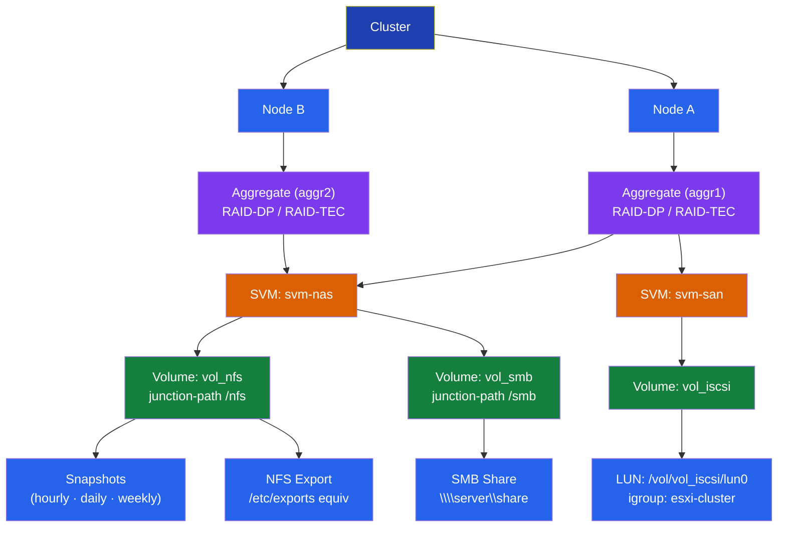

## Change Readiness

- [ ] All aggregates have at least 15% free capacity to absorb workload shifts during the change
- [ ] HA failover is operational on both nodes (`storage failover show` shows `true` for takeover-enabled)
- [ ] SnapMirror lag is within RPO on all critical relationships before quiescing
- [ ] No active volume move or aggregate rebalance jobs: `volume move show` and `storage aggregate relocation show`
- [ ] AutoSupport is working — send a start-of-maintenance message: `autosupport invoke -node * -type all -message "Starting maintenance"`
- [ ] No open disk rebuild operations: `storage disk show -broken` is clean
- [ ] Snapshots taken of affected volumes before change: `snapshot create -volume <vol> -snapshot pre-change`

| Item | Status | Notes |
|---|---|---|
| Aggregate free capacity ≥ 15% | | |
| HA takeover enabled on all nodes | | |
| SnapMirror lag within RPO | | |
| No active volume moves | | |
| AutoSupport start message sent | | |

## Rolling Node Upgrade Sequence

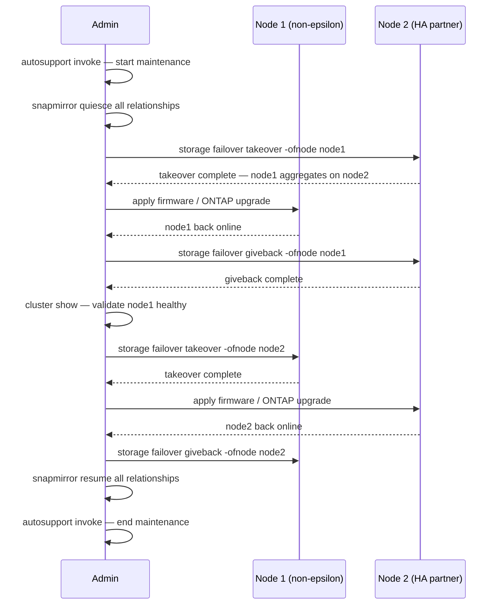

## Maintenance Window

1. Send AutoSupport start-of-maintenance: `autosupport invoke -node * -type all -message "Maintenance window starting"`
2. Quiesce SnapMirror relationships on volumes involved in the change: `snapmirror quiesce -destination-path <svm:vol>`
3. For rolling node upgrade — upgrade the non-epsilon node first; initiate takeover on the partner: `storage failover takeover -ofnode <node>`
4. Monitor takeover completion: `storage failover show` should show `In Takeover` then the node comes back up
5. Run `storage failover giveback -ofnode <node>` after the upgraded node is back online; confirm `Waiting for Giveback` transitions to normal
6. Validate cluster health after each node: `cluster show`, `system health alert show`
7. Resume SnapMirror relationships after all changes are complete: `snapmirror resume -destination-path <svm:vol>`
8. Send AutoSupport close-of-maintenance: `autosupport invoke -node * -type all -message "Maintenance window complete"`

## Post-Change Validation

- [ ] `cluster show` — all nodes healthy, HA pairs intact
- [ ] `storage failover show` — all nodes show giveback-enabled true, no takeover active
- [ ] `storage disk show -broken` — no new disk failures introduced during maintenance
- [ ] `snapmirror show -fields lag-time,healthy` — all relationships resumed and healthy
- [ ] `volume show -fields state,percent-used` — all volumes online, no state changes
- [ ] `network interface show -status-oper down` — no LIFs went offline during the change
- [ ] `system health alert show` — no new alerts generated
- [ ] Confirm storage is serving I/O to applications — verify from host side or application monitoring

## Incident Triage

- [ ] Run `cluster show` first — identify any nodes in degraded or removed state
- [ ] Run `system health alert show` — review all active alerts for severity and subsystem
- [ ] Run `storage disk show -broken` — identify any disk failures driving the incident
- [ ] Run `storage failover show` — check whether any HA takeover has occurred
- [ ] Run `snapmirror show -fields lag-time,healthy` — check if replication is healthy or contributing to the symptom
- [ ] Check specific protocol: `network interface show`, `iscsi session show`, or `fcp show initiator`
- [ ] Review recent EMS events for the affected node: `event log show -node <nodename> -severity error`

| Question | Answer |
|---|---|
| Which node or aggregate is affected? | |
| Is HA takeover currently active? | |
| Are any disks broken or rebuilding? | |
| Is SnapMirror lag outside RPO? | |
| Which protocol is the workload using? | |

---

## SVM Management

SVMs are logical storage containers within an ONTAP cluster. Each SVM has its own namespaces, LIFs, and protocol configurations.

### List SVMs

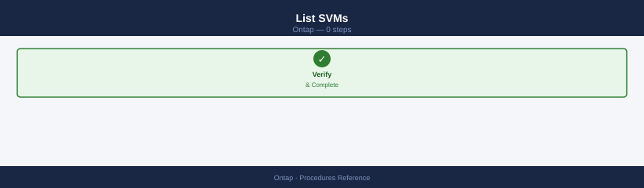

```bash
vserver show
vserver show -fields type,state,admin-state
```

### SVM Health

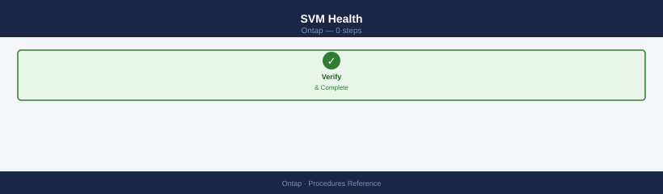

```bash
# Confirm all SVMs are running
vserver show -state !running

# Check SVM root volume health
volume show -vserver <svm_name> -volume <svm_name>_root
```

### Create an SVM

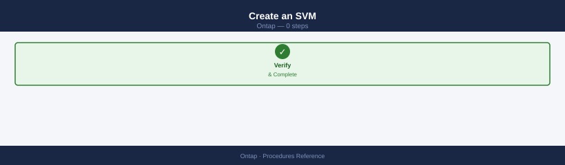

```bash
vserver create \
    -vserver <svm_name> \
    -aggregate <aggr_name> \
    -rootvolume <svm_name>_root \
    -rootvolume-security-style unix
```

### LIF Management

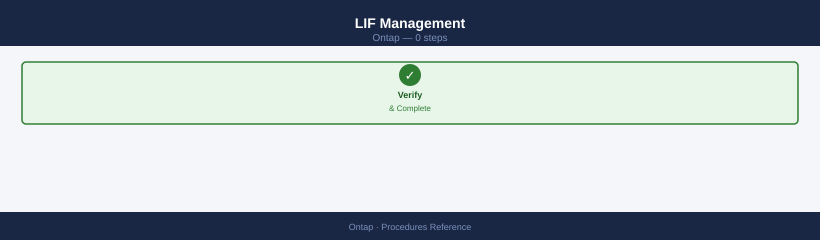

```bash
# List LIFs for an SVM
network interface show -vserver <svm_name>

# Create a data LIF
network interface create \
    -vserver <svm_name> \
    -lif <lif_name> \
    -role data \
    -home-node <node_name> \
    -home-port e0c \
    -address <ip> \
    -netmask <mask> \
    -data-protocol nfs,cifs

# Migrate a LIF to a different port
network interface migrate -vserver <svm_name> -lif <lif_name> -dest-node <node> -dest-port <port>
```

### DNS Configuration per SVM


```bash
vserver services name-service dns show -vserver <svm_name>

vserver services name-service dns create \
    -vserver <svm_name> \
    -domains <domain> \
    -name-servers <dns_ip1>,<dns_ip2>
```

### NIS / LDAP Lookup

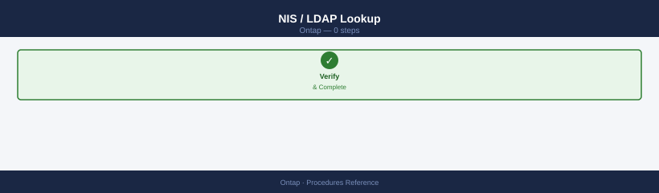

```bash
vserver services name-service ns-switch show -vserver <svm_name>
vserver services name-service ldap show -vserver <svm_name>
```

### Stop / Start an SVM

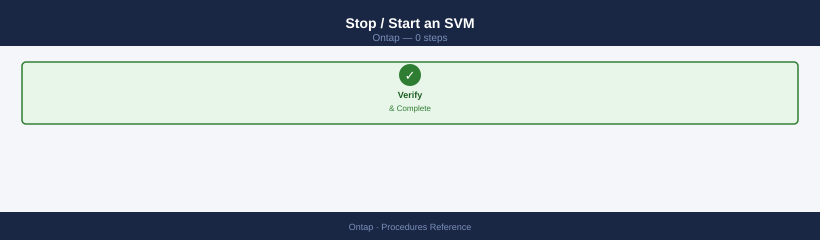

```bash
vserver stop -vserver <svm_name>
vserver start -vserver <svm_name>
```

### Delete an SVM

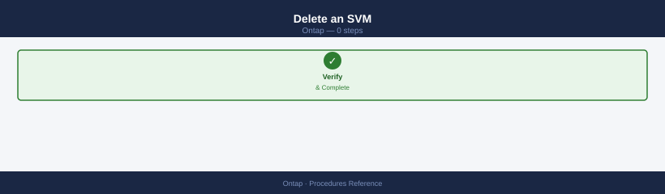

```bash
# Ensure no volumes except root
volume show -vserver <svm_name>

# Delete root volume and SVM
vserver delete -vserver <svm_name>
```

### SVM Common Issues

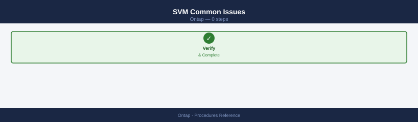

| Issue | Check | Action |
|---|---|---|
| SVM not running | Admin-state | `vserver start` |
| LIF not reachable | LIF status / port | Migrate LIF or fix port |
| Protocol not serving | Service enabled? | `vserver nfs create` or equivalent |
| DNS resolution failing | SVM DNS config | Verify DNS server IPs |

---

## Volume Management

### List Volumes

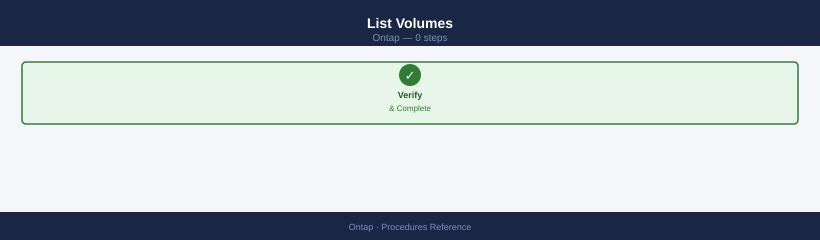

```bash
volume show
volume show -vserver <svm_name>
volume show -fields size,used,available,percent-used,state
```

### Volume Health

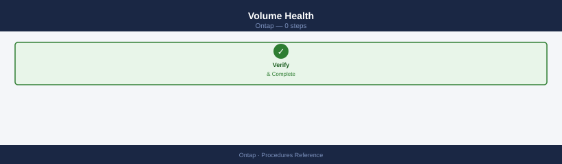

```bash
# Show offline or restricted volumes
volume show -state !online

# Show volumes nearing capacity
volume show -fields percent-used | awk '$2 > 80'
```

### Create a Volume

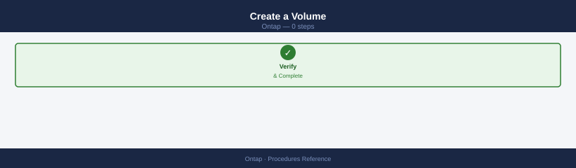

```bash
volume create \
    -vserver <svm_name> \
    -volume <vol_name> \
    -aggregate <aggr_name> \
    -size 500G \
    -junction-path /<vol_name> \
    -security-style unix
```

### Resize a Volume

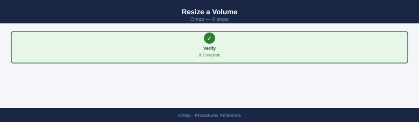

```bash
volume size -vserver <svm_name> -volume <vol_name> -new-size 1T
```

### Volume Autosize

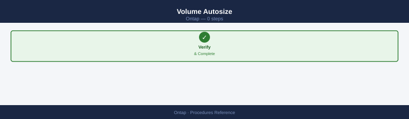

```bash
volume autosize -vserver <svm_name> -volume <vol_name> \
    -mode grow_shrink \
    -maximum-size 2T \
    -grow-threshold-percent 85
```

### Volume Efficiency (Deduplication / Compression)

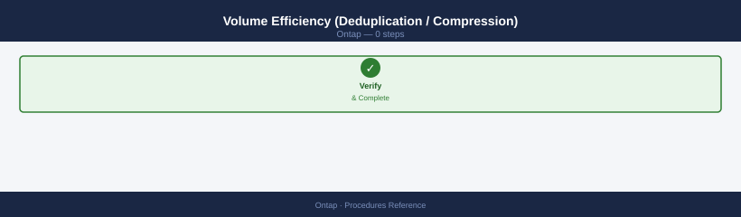

```bash
# Check efficiency state
volume efficiency show -vserver <svm_name> -volume <vol_name>

# Enable efficiency
volume efficiency on -vserver <svm_name> -volume <vol_name>

# Run deduplication manually
volume efficiency start -vserver <svm_name> -volume <vol_name>
```

### Move a Volume (Between Aggregates)

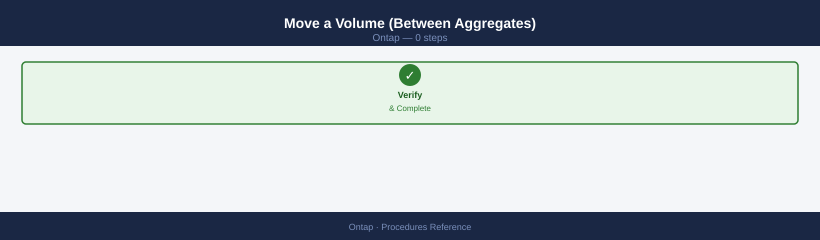

```bash
volume move start \
    -vserver <svm_name> \
    -volume <vol_name> \
    -destination-aggregate <dest_aggr>

volume move show
```

### Take a Volume Offline / Online

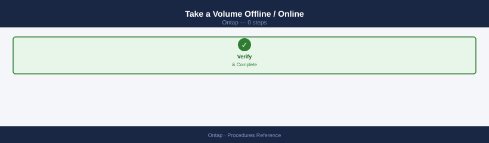

```bash
volume offline -vserver <svm_name> -volume <vol_name>
volume online -vserver <svm_name> -volume <vol_name>
```

### Delete a Volume

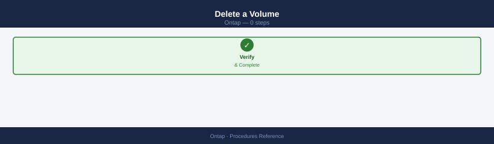

```bash
# Offline first
volume offline -vserver <svm_name> -volume <vol_name>

# Delete
volume delete -vserver <svm_name> -volume <vol_name>
```

### Volume Common Issues

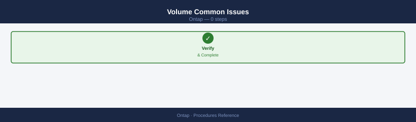

| Issue | Check | Action |
|---|---|---|
| Volume full | Percent-used | Resize or enable autosize |
| Volume offline | State | Bring online or investigate |
| Poor efficiency | Dedup/compress off | Enable volume efficiency |
| Mount fails | Junction path | Verify `-junction-path` set |

---

## Protocols

ONTAP supports NFS, SMB/CIFS, iSCSI, FCP (Fibre Channel), and NVMe over Fabrics. Protocol access is configured per SVM.

### NFS

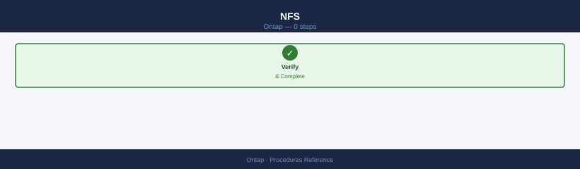

```bash
# Check NFS service status per SVM
nfs show -vserver <svm_name>

# List NFS exports
vserver nfs export-policy rule show -vserver <svm_name>

# Show NFS clients connected
nfs connected-client show -vserver <svm_name>
```

### SMB/CIFS

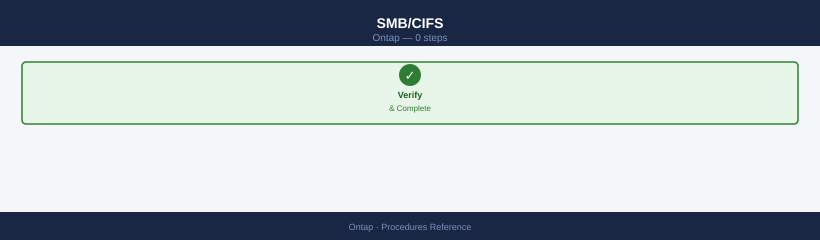

```bash
# Check CIFS server status
cifs show -vserver <svm_name>

# List CIFS shares
vserver cifs share show -vserver <svm_name>

# Show active CIFS sessions
cifs session show -vserver <svm_name>
```

### iSCSI

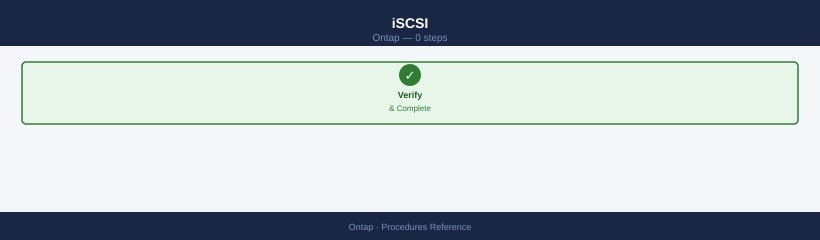

```bash
# Check iSCSI service status
iscsi show -vserver <svm_name>

# List iSCSI LIFs
network interface show -vserver <svm_name> -data-protocol iscsi

# Show connected iSCSI initiators
iscsi initiator show -vserver <svm_name>

# Show iSCSI target portal groups
iscsi tpgroup show -vserver <svm_name>
```

### FCP (Fibre Channel)

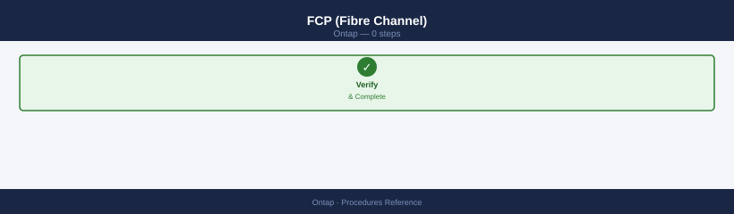

```bash
# Check FCP service status
fcp show -vserver <svm_name>

# List FCP LIFs (FC target ports)
network interface show -vserver <svm_name> -data-protocol fcp

# Show connected FC initiators
fcp initiator show -vserver <svm_name>

# Show FC target adapter status
system node hardware unified-connect show
```

### Protocol on LIF Verification

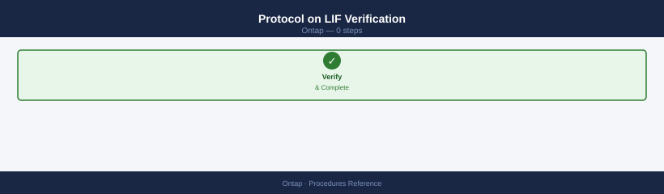

```bash
# Show all data LIFs and their protocols
network interface show -role data -fields vserver,lif,address,data-protocol
```

### Enable/Disable a Protocol on an SVM

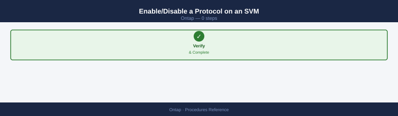

```bash
# Enable NFS
vserver nfs create -vserver <svm_name> -v3 enabled -v4.1 enabled

# Enable CIFS (requires AD join)
cifs setup -vserver <svm_name>

# Enable iSCSI
iscsi create -vserver <svm_name>
```

### Protocol Common Issues

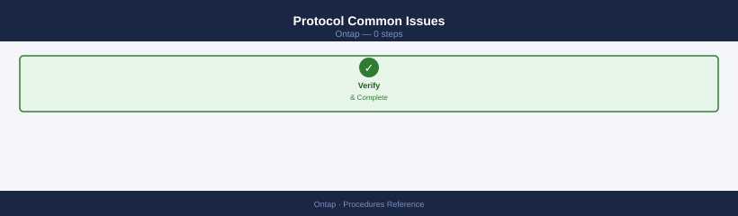

| Issue | Check | Action |
|---|---|---|
| NFS mount fails | Export policy rules | Verify client IP matches export rule |
| CIFS share inaccessible | CIFS server joined to AD | Re-join AD if needed |
| iSCSI sessions dropping | LIF and network status | Check LIF availability and switch ports |
| FC initiator not logging in | Zoning and WWPN masking | Verify SAN zoning and LUN masking |

---

## Verify

- Confirm the operation completed without errors in the log or management UI
- Verify the expected state change is visible (service running, object created, config applied)
- Document the outcome in the change record

---

## See also

- [Ontap — Health Checks](health-checks/)
- [Ontap — CLI Reference](cli-reference/)
- [Ontap — Common Issues](../troubleshooting/common-issues/)
