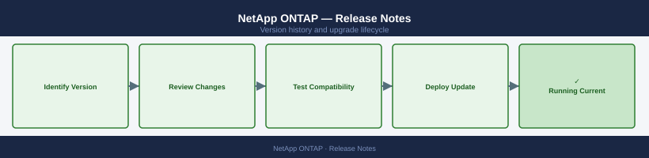

---
tags:
  - netapp
---
# NetApp ONTAP — Release Notes

*Applies to: NetApp ONTAP 9.x*

Version history and release notes for NetApp ONTAP.

## Version History

| Version | Released | Summary | Notes |
|---------|----------|---------|-------|
| 9.15.1 | 2024-Q4 | NVMe-oF enhancements, SnapMirror active sync improvements | [Release Notes](#) |
| 9.14.1 | 2024-Q1 | S3 object storage GA, autonomous ransomware protection v3 | [Release Notes](#) |
| 9.13.1 | 2023-Q3 | FlexGroup SnapMirror active sync, NFS 4.1 pNFS support | [Release Notes](#) |
| 9.12.1 | 2023-Q1 | iSCSI LUN rebalancing, ONTAP Mediator 1.5 | [Release Notes](#) |
| 9.11.1 | 2022-Q3 | Consistency groups GA, REST API parity milestone | [Release Notes](#) |

## Key Terminology

**Release Train**
: NetApp's versioning scheme: major.minor.patch (e.g. 9.15.1). Minor releases add features; patches fix bugs.

**LTR (Long-Term Release)**
: Designated ONTAP releases with extended support windows — currently 9.8, 9.12, 9.14.

**ANDU (Automated Non-Disruptive Upgrade)**
: Built-in ONTAP upgrade orchestration that performs rolling node-by-node updates without I/O interruption.

**EOS (End of Support)**
: Date after which NetApp no longer issues patches or provides support for a given ONTAP release.

## Upgrade Path

Upgrade from the current running version by reviewing the [NetApp Upgrade Advisor](https://docs.netapp.com/us-en/ontap/upgrade/index.html). Multi-hop upgrades (skipping minor versions) are supported only within the same major train; always validate with the ANDU compatibility matrix. Apply the upgrade in a non-disruptive rolling fashion using System Manager or CLI `system node image update`.
