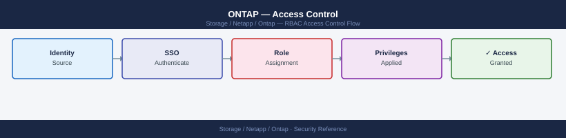
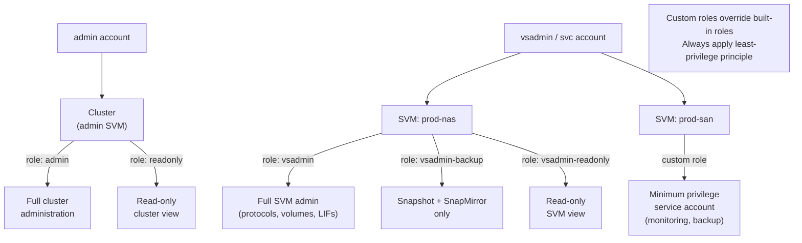

---
tags:
  - netapp
  - security
---
# ONTAP — Access Control


<div class="kb-summary">
Access Control reference covering RBAC Scope Model, RBAC, Custom Roles, User Login Management, Audit Logging.

*Applies to: ONTAP 9.x*
</div>



## Before you begin

- **Access:** Storage admin credentials (cluster admin or equivalent)
- **Change management:** security changes require CAB approval in most environments
- **Rollback plan:** document current state before any security control change
- **Testing:** validate in a non-production environment first where possible

---

## RBAC Scope Model



## RBAC

ONTAP has two RBAC scopes: **cluster-level** (managed by the `admin` account) and **SVM-level** (managed by `vsadmin` accounts within a specific SVM). Built-in roles:

| Role | Scope | Access Level |
|---|---|---|
| `admin` | Cluster | Full cluster administration — all commands |
| `readonly` | Cluster | Read-only cluster view — no configuration changes |
| `vsadmin` | SVM | Full SVM administration within one SVM |
| `vsadmin-readonly` | SVM | Read-only view of one SVM |
| `vsadmin-backup` | SVM | Snapshot and SnapMirror operations within one SVM |
| `vsadmin-snaplock` | SVM | SnapLock volume administration within one SVM |
| `vsadmin-protocol` | SVM | Protocol configuration (NFS, CIFS, iSCSI) within one SVM |

## Custom Roles

Create custom roles with minimum required permissions for automation service accounts:

```bash
# Create a custom read-only monitoring role
security login role create -role monitor-role -cmddirname "DEFAULT" -access none
security login role create -role monitor-role -cmddirname "version" -access readonly
security login role create -role monitor-role -cmddirname "volume show" -access readonly
security login role create -role monitor-role -cmddirname "snapmirror show" -access readonly

# Create a service account using the custom role
security login create -username svc-monitor -application ssh -authmethod publickey -role monitor-role
```

## User Login Management

```bash
# List all login accounts
security login show
security login show -vserver <svm>

# Create a user (SSH + password auth)
security login create \
    -username <user> \
    -application ssh \
    -authentication-method password \
    -role admin \
    -vserver <svm>

# Delete a user
security login delete -username <user> -application ssh -vserver <svm>

# Change password
security login password -username <user> -vserver <svm>

# Lock / unlock an account
security login lock -username <user> -vserver <svm>
security login unlock -username <user> -vserver <svm>
```

## Audit Logging

**Admin action auditing**: All CLI, API, and System Manager operations by authenticated users are captured in the ONTAP audit log:

```bash
# View recent administrative audit events
security audit log show
security audit log show -user admin -time-range 24h
```

**File access auditing via ONTAP Audit Framework**: Captures NFS and SMB file access events to an EVTX audit log on a designated NAS volume:

```bash
# Configure SVM-level file access auditing
vserver audit create -vserver <svm> -destination /audit_logs -events file-ops,cifs-logon-logoff
vserver audit enable -vserver <svm>
```

**FPolicy for file access control and monitoring**: FPolicy intercepts file operations and can send them to an external FPolicy server (DLP, ransomware detection, archiving):

```bash
# Show FPolicy configuration
fpolicy show
fpolicy policy show
fpolicy policy scope show
```

---

## See also

- [Ontap — Authentication](authentication/)
- [Ontap — Hardening](hardening/)
- [Ontap — Encryption](encryption/)
