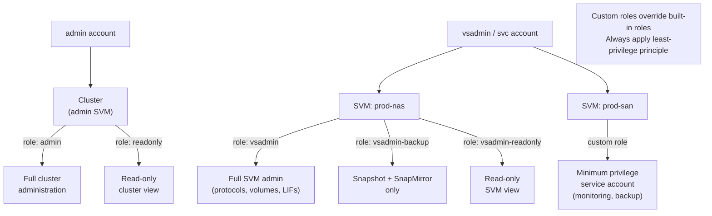

# ONTAP — Access Control


<div class="kb-summary">
Access Control reference covering RBAC Scope Model, RBAC, Custom Roles, User Login Management, Audit Logging.
</div>
```text
┌──────────────────────────────────── NetApp ONTAP — Access Control ────────────────────────────────────┐
│                                                                                                       │
│   ┌───────────────────────────────────────────────────────────────────────────────────────────────┐   │
│   │          ONTAP access control: RBAC roles, least-privilege, and access audit logging          │   │
│   │        Roles: admin (full), operator (read/modify), read-only (view); map to AD groups        │   │
│   │       Authentication: local accounts, LDAP/AD integration, and MFA for privileged users       │   │
│   │          Audit: log all admin actions; review access logs monthly; rotate credentials         │   │
│   └───────────────────────────────────────────────────────────────────────────────────────────────┘   │
│                                                                                                       │
│    Identify user → assign role → enforce MFA → audit → review quarterly                               │
│                                                                                                       │
│                  ▼                                ▼                                ▼                  │
│                                                                                                       │
│   ┌─────────────────────────────┐  ┌─────────────────────────────┐  ┌─────────────────────────────┐   │
│   │            Layer            │  │          Component          │  │            Notes            │   │
│   │           Cluster           │  │        HA node pairs        │  │          Scale-out          │   │
│   │             SVM             │  │        Virtual server       │  │       Protocol access       │   │
│   │          Aggregate          │  │         RAID groups         │  │         Storage pool        │   │
│   │           FlexVol           │  │         Thin volume         │  │        Data container       │   │
│   │          SnapMirror         │  │         Replication         │  │          Async/Sync         │   │
│   └─────────────────────────────┘  └─────────────────────────────┘  └─────────────────────────────┘   │
│                                                                                                       │
│                          ▼                                                 ▼                          │
│                                                                                                       │
│   ┌───────────────────────────────────────────────────────────────────────────────────────────────┐   │
│   │       Role       │   Permissions    │       Scope       │       Auth       │   Review cycle   │   │
│   │      Admin       │    Full CRUD     │       Global      │   MFA required   │     Monthly      │   │
│   │     Operator     │   Read/modify    │      Assigned     │   MFA required   │    Quarterly     │   │
│   │    Read-only     │    View only     │      Assigned     │     Password     │    Quarterly     │   │
│   │   Service acct   │     API only     │    Specific API   │    Token/cert    │      Annual      │   │
│   └───────────────────────────────────────────────────────────────────────────────────────────────┘   │
│                                                                                                       │
│    Physical: AFF/FAS HA node pairs · cluster network · client access network · MetroCluster           │
│                                                                                                       │
│    Key terms:                                                                                         │
│                                                                                                       │
│    ONTAP              = NetApp storage OS; unified NAS, SAN, and object across AFF, FAS, ONTAP Select │
│    SVM                = Storage Virtual Machine; logical storage server with protocols, IP, and vol...│
│    Aggregate          = RAID group of disks; underpins FlexVols and FlexGroups within a node          │
│    FlexVol            = flexible thin-provisioned volume within an aggregate; most common container   │
│    FlexGroup          = scale-out volume spanning multiple aggregates; for very large NAS workloads   │
│    SnapMirror         = async or synchronous replication between ONTAP systems for DR and backup      │
│    SnapVault          = backup-oriented SnapMirror variant; independent retention at destination      │
│    FlexClone          = instant space-efficient writable clone of a volume or LUN from snapshot       │
│    Snapshot           = ONTAP space-efficient PiT copy; stored in .snapshot directory on NFS          │
│    ONTAP Mediator     = third-site quorum for SnapMirror SM-BC; prevents split-brain scenarios        │
│    SM-BC              = SnapMirror Business Continuity; synchronous zero-RPO active-active SAN repl...│
│    vserver            = ONTAP CLI name for SVM; vserver show and vserver nfs show are common commands │
│                                                                                                       │
└───────────────────────────────────────────────────────────────────────────────────────────────────────┘
```


## RBAC Scope Model



## RBAC

ONTAP has two RBAC scopes: **cluster-level** (managed by the `admin` account) and **SVM-level** (managed by `vsadmin` accounts within a specific SVM). Built-in roles:

| Role | Scope | Access Level |
|---|---|---|
| `admin` | Cluster | Full cluster administration — all commands |
| `readonly` | Cluster | Read-only cluster view — no configuration changes |
| `vsadmin` | SVM | Full SVM administration within one SVM |
| `vsadmin-readonly` | SVM | Read-only view of one SVM |
| `vsadmin-backup` | SVM | Snapshot and SnapMirror operations within one SVM |
| `vsadmin-snaplock` | SVM | SnapLock volume administration within one SVM |
| `vsadmin-protocol` | SVM | Protocol configuration (NFS, CIFS, iSCSI) within one SVM |

## Custom Roles

Create custom roles with minimum required permissions for automation service accounts:

```bash
# Create a custom read-only monitoring role
security login role create -role monitor-role -cmddirname "DEFAULT" -access none
security login role create -role monitor-role -cmddirname "version" -access readonly
security login role create -role monitor-role -cmddirname "volume show" -access readonly
security login role create -role monitor-role -cmddirname "snapmirror show" -access readonly

# Create a service account using the custom role
security login create -username svc-monitor -application ssh -authmethod publickey -role monitor-role
```

## User Login Management

```bash
# List all login accounts
security login show
security login show -vserver <svm>

# Create a user (SSH + password auth)
security login create \
    -username <user> \
    -application ssh \
    -authentication-method password \
    -role admin \
    -vserver <svm>

# Delete a user
security login delete -username <user> -application ssh -vserver <svm>

# Change password
security login password -username <user> -vserver <svm>

# Lock / unlock an account
security login lock -username <user> -vserver <svm>
security login unlock -username <user> -vserver <svm>
```

## Audit Logging

**Admin action auditing**: All CLI, API, and System Manager operations by authenticated users are captured in the ONTAP audit log:

```bash
# View recent administrative audit events
security audit log show
security audit log show -user admin -time-range 24h
```

**File access auditing via ONTAP Audit Framework**: Captures NFS and SMB file access events to an EVTX audit log on a designated NAS volume:

```bash
# Configure SVM-level file access auditing
vserver audit create -vserver <svm> -destination /audit_logs -events file-ops,cifs-logon-logoff
vserver audit enable -vserver <svm>
```

**FPolicy for file access control and monitoring**: FPolicy intercepts file operations and can send them to an external FPolicy server (DLP, ransomware detection, archiving):

```bash
# Show FPolicy configuration
fpolicy show
fpolicy policy show
fpolicy policy scope show
```
