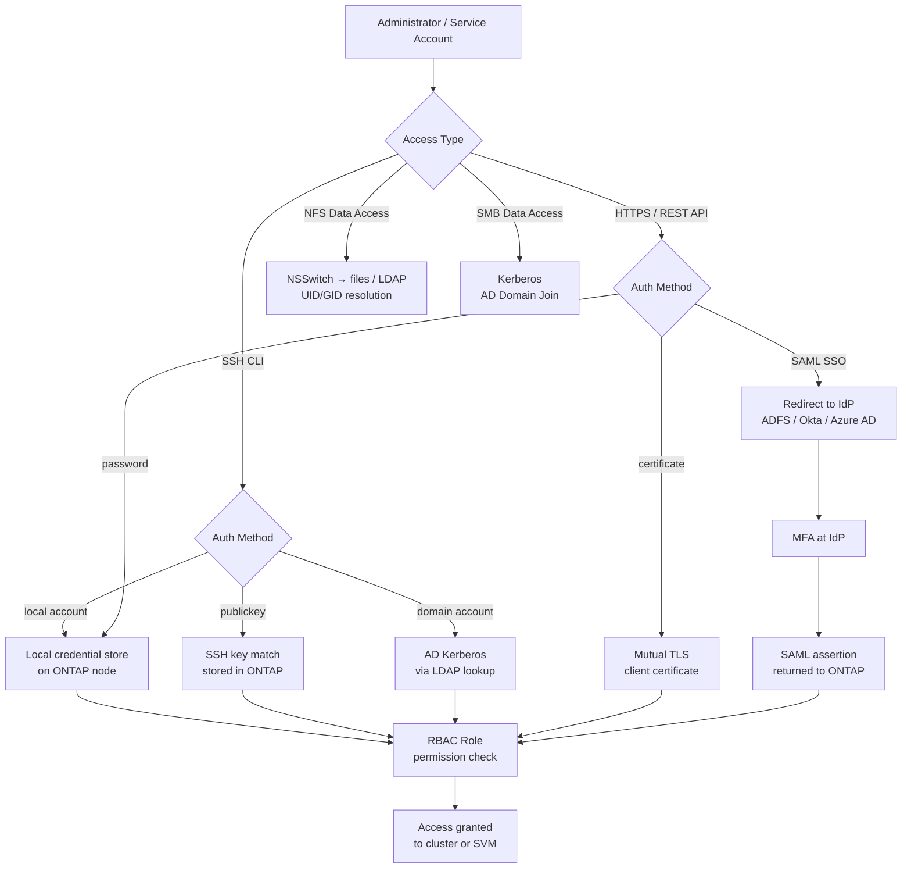

---
tags:
  - netapp
  - security
---
# ONTAP — Authentication


<div class="kb-summary">
Authentication in ONTAP controls how administrators and service accounts gain access to cluster and SVM management interfaces. ONTAP supports local accounts, Active Directory (LDAP/Kerberos), SSH public keys, and SAML-based SSO for System Manager.

*Applies to: ONTAP 9.x*
</div>
```text
┌──────────────────────────────────── NetApp ONTAP — Authentication ────────────────────────────────────┐
│                                                                                                       │
│   ┌───────────────────────────────────────────────────────────────────────────────────────────────┐   │
│   │          ONTAP authentication: local accounts, LDAP/AD, RADIUS, and SAML SSO options          │   │
│   │        MFA: time-based OTP or hardware token required for all privileged admin accounts       │   │
│   │         Service accounts: dedicated accounts for automation; API tokens/keys preferred        │   │
│   │       Session: idle timeout enforced; concurrent session limits for admin role accounts       │   │
│   └───────────────────────────────────────────────────────────────────────────────────────────────┘   │
│                                                                                                       │
│    Login → authenticate LDAP/SAML/local → MFA → authorise role → session                              │
│                                                                                                       │
│                  ▼                                ▼                                ▼                  │
│                                                                                                       │
│   ┌─────────────────────────────┐  ┌─────────────────────────────┐  ┌─────────────────────────────┐   │
│   │            Layer            │  │          Component          │  │            Notes            │   │
│   │           Cluster           │  │        HA node pairs        │  │          Scale-out          │   │
│   │             SVM             │  │        Virtual server       │  │       Protocol access       │   │
│   │          Aggregate          │  │         RAID groups         │  │         Storage pool        │   │
│   │           FlexVol           │  │         Thin volume         │  │        Data container       │   │
│   │          SnapMirror         │  │         Replication         │  │          Async/Sync         │   │
│   └─────────────────────────────┘  └─────────────────────────────┘  └─────────────────────────────┘   │
│                                                                                                       │
│                          ▼                                                 ▼                          │
│                                                                                                       │
│   ┌───────────────────────────────────────────────────────────────────────────────────────────────┐   │
│   │      Method      │     Use case     │  Config location  │       MFA        │     Priority     │   │
│   │     LDAP/AD      │  Staff accounts  │   Auth settings   │     Required     │     Primary      │   │
│   │     SAML SSO     │    Federated     │    SSO settings   │   IdP-enforced   │    Preferred     │   │
│   │      Local       │   Break-glass    │    Local users    │     Required     │  Emergency only  │   │
│   │    API token     │    Automation    │  Service account  │   N/A (token)    │    Automation    │   │
│   └───────────────────────────────────────────────────────────────────────────────────────────────┘   │
│                                                                                                       │
│    Physical: AFF/FAS HA node pairs · cluster network · client access network · MetroCluster           │
│                                                                                                       │
│    Key terms:                                                                                         │
│                                                                                                       │
│    ONTAP              = NetApp storage OS; unified NAS, SAN, and object across AFF, FAS, ONTAP Select │
│    SVM                = Storage Virtual Machine; logical storage server with protocols, IP, and vol...│
│    Aggregate          = RAID group of disks; underpins FlexVols and FlexGroups within a node          │
│    FlexVol            = flexible thin-provisioned volume within an aggregate; most common container   │
│    FlexGroup          = scale-out volume spanning multiple aggregates; for very large NAS workloads   │
│    SnapMirror         = async or synchronous replication between ONTAP systems for DR and backup      │
│    SnapVault          = backup-oriented SnapMirror variant; independent retention at destination      │
│    FlexClone          = instant space-efficient writable clone of a volume or LUN from snapshot       │
│    Snapshot           = ONTAP space-efficient PiT copy; stored in .snapshot directory on NFS          │
│    ONTAP Mediator     = third-site quorum for SnapMirror SM-BC; prevents split-brain scenarios        │
│    SM-BC              = SnapMirror Business Continuity; synchronous zero-RPO active-active SAN repl...│
│    vserver            = ONTAP CLI name for SVM; vserver show and vserver nfs show are common commands │
│                                                                                                       │
└───────────────────────────────────────────────────────────────────────────────────────────────────────┘
```


## Before you begin

- **Access:** Storage admin credentials (cluster admin or equivalent)
- **Change management:** security changes require CAB approval in most environments
- **Rollback plan:** document current state before any security control change
- **Testing:** validate in a non-production environment first where possible

---

## Authentication Flow



## Authentication Methods Summary

| Method | Application | Use Case |
|---|---|---|
| Password | SSH, HTTP, ONTAPI | Local accounts; should be avoided for admin in production |
| Public key | SSH | Service accounts and admin access; preferred for SSH |
| Certificate | HTTPS (REST API, ONTAPI) | API automation; mutual TLS |
| Domain (AD) | SSH, HTTP | AD-integrated admin accounts; uses Kerberos |
| SAML | HTTP (System Manager UI) | Browser-based SSO via IdP (ADFS, Okta) |
| NSSWITCH / LDAP | NFS/CIFS data access | UID/GID resolution for NFS; user mapping for CIFS |

---

## Local Accounts

ONTAP supports local admin accounts at both the cluster level and the SVM level. Local accounts are independent of Active Directory and are used for break-glass access and service accounts.

### Managing Local Accounts

```bash
# List all login accounts across all SVMs
security login show

# List accounts for a specific SVM
security login show -vserver <svm>

# Show account details including role and last login
security login show -fields username,application,authmethod,role,is-account-locked

# Create a local account with password authentication
security login create \
    -username <user> \
    -application ssh \
    -authentication-method password \
    -role admin \
    -vserver <cluster-or-svm>

# Create a local account with public key authentication
security login create \
    -username svc-monitor \
    -application ssh \
    -authentication-method publickey \
    -role monitor-role \
    -vserver <cluster-name>

# Change a user password
security login password -username <user> -vserver <svm>

# Lock an account (disable access without deleting)
security login lock -username <user> -vserver <svm>

# Unlock an account
security login unlock -username <user> -vserver <svm>

# Delete an account
security login delete -username <user> -application ssh -vserver <svm>
```

### Built-in Accounts

| Account | Default State | Notes |
|---|---|---|
| `admin` | Active | Primary cluster admin; rotate password and enforce key auth |
| `diag` | Active | Node diagnostic access; lock in production |
| `autosupport` | Internal | AutoSupport service; do not modify |

Always lock the `diag` account on production clusters:

```bash
security login lock -username diag -vserver <cluster-name>
```

---

## SSH Public Key Authentication

Public key authentication is required for admin accounts and service accounts in production environments. Password authentication for SSH should be disabled for the `admin` account once key access is confirmed.

### Adding Public Keys

```bash
# Add a public key for an existing user account
security login publickey create \
    -username admin \
    -index 0 \
    -publickey "ssh-rsa AAAA...rest_of_key...user@host"

# Add an Ed25519 key (preferred for new keys)
security login publickey create \
    -username svc-ansible \
    -index 0 \
    -publickey "ssh-ed25519 AAAA...key...user@host"

# List all configured public keys
security login publickey show

# Show public keys for a specific user
security login publickey show -username admin
```

### Requiring Key-Only Authentication

After confirming key authentication works, disable password auth for the admin account:

```bash
# Verify key authentication is working first (test in a separate SSH session)
# Then remove the password-based login method
security login delete -username admin -application ssh -authentication-method password

# Confirm only publickey auth remains for admin
security login show -username admin
```

### Key Rotation

```bash
# Add the new key (index 1) before removing the old one
security login publickey create -username admin -index 1 -publickey "ssh-ed25519 AAAA...new_key"

# After confirming new key works, delete the old key
security login publickey delete -username admin -index 0

# Renumber index if needed
security login publickey modify -username admin -index 1 -new-index 0
```

---

## Active Directory / CIFS Authentication

Joining an SVM to Active Directory enables CIFS/SMB file access using Kerberos authentication and allows domain accounts to be used for ONTAP management login.

### Joining an SVM to Active Directory

```bash
# Join an SVM to Active Directory for CIFS/SMB
# Requires Domain Admin credentials at join time
vserver cifs create \
    -vserver <svm> \
    -cifs-server <netbios-name> \
    -domain <domain.corp> \
    -ou "OU=StorageServers,DC=domain,DC=corp"

# Verify CIFS domain join and DC connectivity
vserver cifs domain info -vserver <svm>

# Check AD join status
vserver cifs show -vserver <svm> -fields ad-status

# Check which DCs the SVM is communicating with
vserver cifs domain discovered-servers show -vserver <svm>
```

### Domain Account Management Login

Domain accounts can be granted ONTAP management access without requiring a local account:

```bash
# Grant an AD user SSH access with a specific role
security login create \
    -username "DOMAIN\\admin-user" \
    -application ssh \
    -authentication-method domain \
    -role admin \
    -vserver <cluster-name>

# Grant an AD group access (ONTAP 9.8+)
security login create \
    -username "DOMAIN\\StorageAdmins" \
    -application ssh \
    -authentication-method domain \
    -role admin \
    -vserver <cluster-name>

# Verify domain login configuration
security login show -authentication-method domain
```

---

## LDAP Integration

LDAP is used for name service lookups — resolving NFS UIDs and GIDs to usernames, and mapping Windows SIDs to UNIX IDs for mixed-security volumes.

### LDAP Client Configuration

```bash
# Create an LDAP client configuration
vserver services name-service ldap client create \
    -vserver <svm> \
    -client-config <ldap-config-name> \
    -servers <ldap-server-ip> \
    -base-dn "DC=domain,DC=corp" \
    -schema RFC-2307 \
    -bind-dn "CN=svc-ontap-ldap,OU=Service Accounts,DC=domain,DC=corp" \
    -bind-password <password>

# Apply LDAP client config to the SVM
vserver services name-service ldap create \
    -vserver <svm> \
    -client-config <ldap-config-name> \
    -client-enabled true

# Show LDAP configuration for an SVM
vserver services name-service ldap show -vserver <svm>

# Test LDAP connectivity
vserver services name-service ldap check -vserver <svm>
```

### Name Service Switch

The name service switch defines the order in which ONTAP resolves user and group information:

```bash
# Show name service lookup order
vserver services name-service ns-switch show -vserver <svm>

# Configure lookup order (files first, then LDAP for passwd/group)
vserver services name-service ns-switch modify -vserver <svm> \
    -database passwd -sources files,ldap
vserver services name-service ns-switch modify -vserver <svm> \
    -database group -sources files,ldap
vserver services name-service ns-switch modify -vserver <svm> \
    -database netgroup -sources files,ldap
```

---

## SNMPv3 Authentication

SNMP is used for monitoring integration (Nagios, Zabbix, Prometheus via SNMP exporters). Only SNMPv3 should be used in production — SNMPv1 and v2c transmit community strings in plaintext.

```bash
# Configure an SNMPv3 user with authentication and privacy (AES-128 encryption)
system snmp user create \
    -username snmpv3monitor \
    -authmethod sha \
    -authpassword <auth-passphrase> \
    -privmethod aes128 \
    -privpassword <priv-passphrase>

# Add an SNMPv3 trap host (monitoring server)
system snmp traphost add -ipaddr <monitoring-host-ip> -username snmpv3monitor

# Verify SNMP configuration
system snmp show
system snmp user show

# Delete all SNMPv1/v2c community strings
system snmp community delete -community-name public
system snmp community delete -community-name <any-other-community>

# Confirm no v1/v2c communities remain
system snmp community show
# Expected: no entries
```

Recommended SNMPv3 security levels:

| Parameter | Recommended Value | Notes |
|---|---|---|
| Auth method | SHA (SHA-256 preferred) | MD5 is deprecated; use SHA |
| Privacy method | AES-128 | DES is deprecated; use AES |
| Security level | authPriv | Both auth and encryption required |

---

## SAML SSO for System Manager

ONTAP 9.8+ supports SAML 2.0-based single sign-on for the System Manager web UI. This integrates with enterprise identity providers (ADFS, Okta, Azure AD) to enforce corporate MFA and session policies.

### SAML Configuration Overview

```bash
# Enable SAML on the cluster
security saml-sp create \
    -idp-uri <idp-metadata-url> \
    -sp-host <cluster-management-fqdn>

# Show SAML SP configuration
security saml-sp show

# Show SAML IdP configuration
security saml-sp idp show
```

SAML configuration requires:
1. Download the ONTAP SP metadata from `https://<cluster-mgmt>/saml-service-provider-metadata.xml`
2. Register the SP in your IdP (ADFS, Okta, or Azure AD) using the SP metadata
3. Configure IdP metadata URI in ONTAP: the IdP must be reachable from the cluster management LIF
4. Test login via System Manager — ONTAP redirects to the IdP for authentication

### SAML Bypass (Break-Glass)

SAML enforcement locks out password-based System Manager login. Maintain a local `admin` account with SSH key access as a break-glass method in case the IdP is unavailable.

```bash
# SAML applies to HTTP (System Manager) only
# SSH with local admin account always works regardless of SAML state
# Verify local admin SSH key access before enabling SAML
security login show -username admin -application ssh
```

---

## Kerberos for NFS

NFSv4.1 with Kerberos (krb5, krb5i, krb5p) provides strong authentication and optional integrity/privacy for NFS data. This is required in environments with compliance mandates for in-flight encryption of NAS traffic.

```bash
# Check NFS Kerberos configuration on an SVM
vserver nfs kerberos interface show -vserver <svm>

# Enable Kerberos on a specific NFS LIF
vserver nfs kerberos interface enable \
    -vserver <svm> \
    -lif <lif_name> \
    -spn nfs/<lif_fqdn>@<KERBEROS_REALM>

# Show Kerberos realms configured
vserver nfs kerberos realm show -vserver <svm>

# Create a Kerberos realm configuration
vserver nfs kerberos realm create \
    -vserver <svm> \
    -realm <KERBEROS_REALM> \
    -kdc-vendor Microsoft \
    -kdc-ip <domain-controller-ip> \
    -kdc-port 88 \
    -adserver-ip <domain-controller-ip> \
    -adserver-name <dc-hostname>
```

Kerberos security flavors for NFS exports:

| Flavor | Authentication | Integrity | Encryption |
|---|---|---|---|
| `krb5` | Kerberos | No | No |
| `krb5i` | Kerberos | Yes (checksum) | No |
| `krb5p` | Kerberos | Yes | Yes (AES-256) |

Configure the required flavor in the NFS export policy rule:

```bash
vserver export-policy rule modify \
    -vserver <svm> \
    -policyname <policy> \
    -ruleindex 1 \
    -rorule krb5p \
    -rwrule krb5p \
    -superuser krb5p
```
---

## Related Reference

- [Standard LDAP Integration](../../../../security/ldap-integration/index.md) — field reference, service account standards, TLS requirements, and connectivity testing
- [Standard SAML Configuration](../../../../security/saml-configuration/index.md) — SP/IdP setup, Azure AD and Okta steps, attribute mapping, and security requirements
