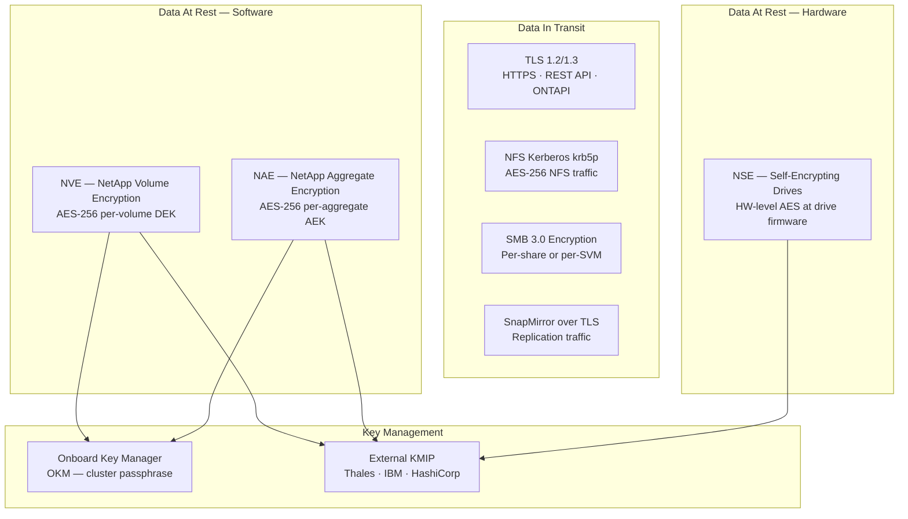
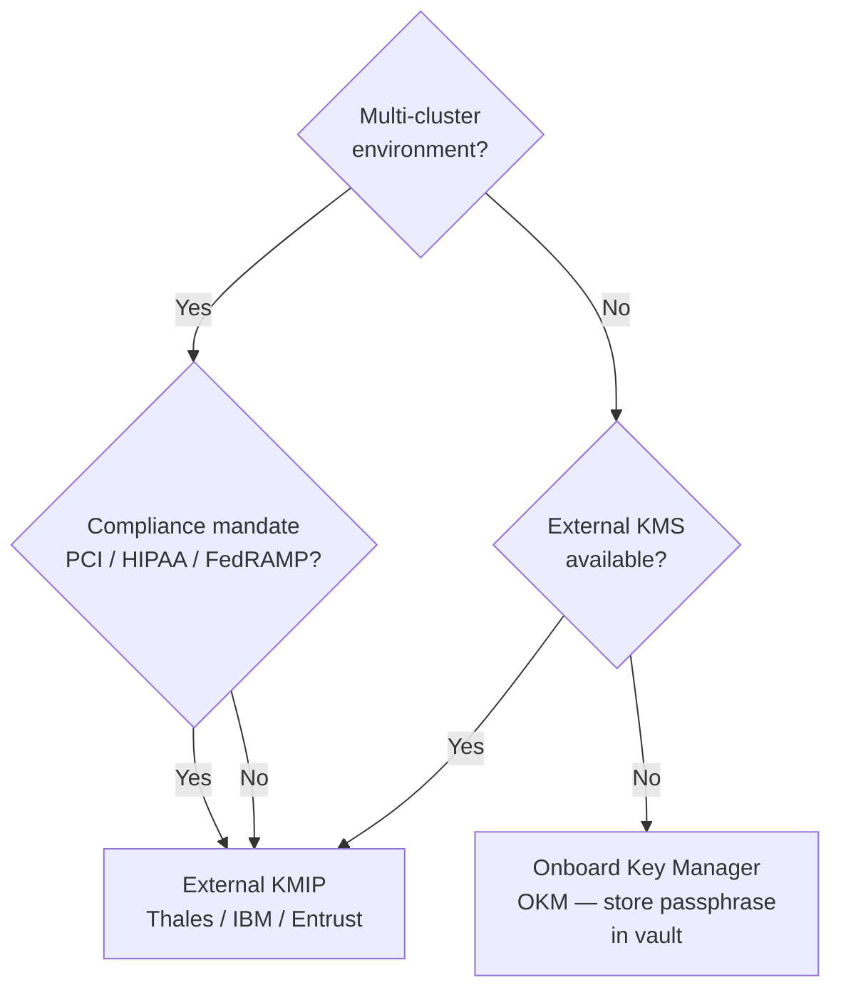

---
tags:
  - netapp
  - security
---
# ONTAP — Encryption


<div class="kb-summary">
ONTAP provides encryption at rest via NetApp Volume Encryption (NVE) and NetApp Aggregate Encryption (NAE), and encryption in transit via TLS for management interfaces and Kerberos/IPsec for data protocols.
</div>
```text
┌────────────────────────────────────── NetApp ONTAP — Encryption ──────────────────────────────────────┐
│                                                                                                       │
│   ┌───────────────────────────────────────────────────────────────────────────────────────────────┐   │
│   │          ONTAP encryption: data at rest and in transit encryption for all stored data         │   │
│   │          At rest: AES-256 encryption using controller-managed or external key manager         │   │
│   │          In transit: TLS 1.2+ for management; protocol encryption for data in flight          │   │
│   │         Key management: external KMIP-compatible KMS or built-in key lifecycle manager        │   │
│   └───────────────────────────────────────────────────────────────────────────────────────────────┘   │
│                                                                                                       │
│    Enable encryption → configure KMS → verify → audit → rotate keys                                   │
│                                                                                                       │
│                  ▼                                ▼                                ▼                  │
│                                                                                                       │
│   ┌─────────────────────────────┐  ┌─────────────────────────────┐  ┌─────────────────────────────┐   │
│   │            Layer            │  │          Component          │  │            Notes            │   │
│   │           Cluster           │  │        HA node pairs        │  │          Scale-out          │   │
│   │             SVM             │  │        Virtual server       │  │       Protocol access       │   │
│   │          Aggregate          │  │         RAID groups         │  │         Storage pool        │   │
│   │           FlexVol           │  │         Thin volume         │  │        Data container       │   │
│   │          SnapMirror         │  │         Replication         │  │          Async/Sync         │   │
│   └─────────────────────────────┘  └─────────────────────────────┘  └─────────────────────────────┘   │
│                                                                                                       │
│                          ▼                                                 ▼                          │
│                                                                                                       │
│   ┌───────────────────────────────────────────────────────────────────────────────────────────────┐   │
│   │      Layer       │     Standard     │     Key source    │       KMS        │      Notes       │   │
│   │     At rest      │     AES-256      │     Controller    │  Internal/KMIP   │    Always on     │   │
│   │    In transit    │     TLS 1.2+     │      PKI cert     │   Internal CA    │   Mgmt + data    │   │
│   │   Key rotation   │      Annual      │     KMS policy    │   External KMS   │    Automated     │   │
│   │    Key escrow    │     Required     │     KMS vault     │   External KMS   │    DR access     │   │
│   └───────────────────────────────────────────────────────────────────────────────────────────────┘   │
│                                                                                                       │
│    Physical: AFF/FAS HA node pairs · cluster network · client access network · MetroCluster           │
│                                                                                                       │
│    Key terms:                                                                                         │
│                                                                                                       │
│    ONTAP              = NetApp storage OS; unified NAS, SAN, and object across AFF, FAS, ONTAP Select │
│    SVM                = Storage Virtual Machine; logical storage server with protocols, IP, and vol...│
│    Aggregate          = RAID group of disks; underpins FlexVols and FlexGroups within a node          │
│    FlexVol            = flexible thin-provisioned volume within an aggregate; most common container   │
│    FlexGroup          = scale-out volume spanning multiple aggregates; for very large NAS workloads   │
│    SnapMirror         = async or synchronous replication between ONTAP systems for DR and backup      │
│    SnapVault          = backup-oriented SnapMirror variant; independent retention at destination      │
│    FlexClone          = instant space-efficient writable clone of a volume or LUN from snapshot       │
│    Snapshot           = ONTAP space-efficient PiT copy; stored in .snapshot directory on NFS          │
│    ONTAP Mediator     = third-site quorum for SnapMirror SM-BC; prevents split-brain scenarios        │
│    SM-BC              = SnapMirror Business Continuity; synchronous zero-RPO active-active SAN repl...│
│    vserver            = ONTAP CLI name for SVM; vserver show and vserver nfs show are common commands │
│                                                                                                       │
└───────────────────────────────────────────────────────────────────────────────────────────────────────┘
```


 Key management is handled by the Onboard Key Manager (OKM) or an external KMIP key manager.

## Before you begin

- **Access:** Storage admin credentials (cluster admin or equivalent)
- **Change management:** security changes require CAB approval in most environments
- **Rollback plan:** document current state before any security control change
- **Testing:** validate in a non-production environment first where possible

---

## Encryption Layer Architecture



## Encryption Architecture Overview

| Layer | Technology | Scope |
|---|---|---|
| Volume-level at rest | NetApp Volume Encryption (NVE) | Per-volume AES-256; each volume has a unique data encryption key |
| Aggregate-level at rest | NetApp Aggregate Encryption (NAE) | Per-aggregate AES-256; enables cross-volume deduplication savings |
| Self-encrypting drives | NSE (NetApp Storage Encryption) | Hardware-level encryption at the drive; no software overhead |
| Management in transit | TLS 1.2/1.3 | HTTPS for System Manager, REST API, and ONTAPI |
| Data in transit (NFS) | NFS Kerberos (krb5p) | AES-256 encryption for NFS data traffic |
| Data in transit (SMB) | SMB signing + SMB 3.0 encryption | Per-share or per-SVM SMB data encryption |
| Replication in transit | TLS on SnapMirror | SnapMirror traffic encrypted over TLS (ONTAP 9.6+) |

---

## NetApp Volume Encryption (NVE)

NVE is software-based per-volume encryption using AES-256 in XTS mode. Each volume has a unique data encryption key (DEK) stored in the key manager. Encryption is transparent to applications and protocols — no client-side changes are needed.

### Requirements

- NVE license (included in ONTAP One or available separately)
- Key manager configured (OKM or external KMIP) before creating encrypted volumes
- AFF platforms: NVE encryption does not reduce storage efficiency (dedup, compression still operate)

### Enabling NVE on a New Volume

```bash
# Create a new volume with encryption enabled
volume create \
    -vserver <svm> \
    -volume <vol_name> \
    -aggregate <aggr_name> \
    -size 500G \
    -encrypt true \
    -junction-path /<vol_name>

# Confirm encryption is active
volume show -vserver <svm> -volume <vol_name> -fields encrypt,encryption-state
```

### Enabling NVE on an Existing Volume

Encrypting an existing volume requires re-keying — ONTAP rewrites the volume data with the new DEK. This is an online, non-disruptive operation for most workloads but runs in the background and affects I/O performance temporarily.

```bash
# Start encryption conversion on an existing volume
volume encryption conversion start -vserver <svm> -volume <vol_name>

# Monitor conversion progress
volume encryption conversion show -vserver <svm> -volume <vol_name>

# Confirm volume is encrypted after conversion completes
volume show -vserver <svm> -volume <vol_name> -fields encryption-state
# Expected: full (fully encrypted)
```

### NVE Key Operations

```bash
# Show encryption status for all volumes
volume show -fields encrypt,encryption-state

# Show the key ID protecting a volume
volume encryption show-key-id -vserver <svm> -volume <vol_name>

# Rekey a volume (rotate the DEK)
volume encryption rekey start -vserver <svm> -volume <vol_name>
volume encryption rekey show -vserver <svm> -volume <vol_name>
```

---

## NetApp Aggregate Encryption (NAE)

NAE encrypts at the aggregate level. All volumes within an NAE aggregate share an aggregate encryption key (AEK). NAE is required when you want both encryption and cross-volume deduplication savings — NVE encrypts each volume independently, which prevents dedup fingerprints from matching across volumes.

### Creating an NAE Aggregate

```bash
# Create a new NAE-enabled aggregate
storage aggregate create \
    -aggregate <aggr_name> \
    -node <node_name> \
    -diskcount 24 \
    -encrypt-with-aggr-key true

# Verify NAE is active on the aggregate
storage aggregate show -aggregate <aggr_name> -fields encrypt-with-aggr-key
```

### Converting an Existing Aggregate to NAE

```bash
# Start NAE conversion (background, non-disruptive)
storage aggregate encryption rekey start -aggregate <aggr_name>

# Monitor progress
storage aggregate encryption rekey show -aggregate <aggr_name>
```

### NAE vs NVE Decision

| Consideration | NVE | NAE |
|---|---|---|
| Cross-volume dedup savings preserved | No | Yes |
| Per-volume key isolation | Yes | No (aggregate-level key) |
| Volume can be moved off aggregate and remain encrypted | Yes | Volume re-encrypts with new aggregate key |
| Suitable for mixed-workload clusters | Yes | Yes |
| Required for compliance needing per-volume key control | Yes | Depends on audit requirement |

---

## NetApp Storage Encryption (NSE) — Self-Encrypting Drives

NSE uses hardware-level self-encrypting drives (SEDs). Encryption happens at the drive firmware level, with no ONTAP CPU overhead. NSE is often combined with NVE (double encryption) for defense-in-depth.

```bash
# Show NSE drive status
storage disk show -fields disk,is-fips-compliant,drive-protection-mode

# Show storage encryption key status
storage encryption disk show

# Assign authentication keys to NSE drives
storage encryption disk modify -disk <disk_id> -data-key-id <key_id>
```

---

## Key Management

### Onboard Key Manager (OKM)

OKM is ONTAP's built-in key manager. Keys are stored within the cluster itself, protected by a cluster-wide passphrase. Suitable for single-cluster environments or where an external KMS is not available.

```bash
# Configure OKM (first-time setup)
security key-manager onboard enable
# You will be prompted to enter and confirm a passphrase

# Back up the OKM passphrase and key hierarchy
# CRITICAL: Store the passphrase in a secure vault (CyberArk, HashiCorp Vault, or password manager)
# Without the passphrase, encrypted data is unrecoverable after a cluster loss

# Show OKM status
security key-manager onboard show

# Show key IDs managed by OKM
security key-manager key query -key-manager-type onboard

# Synchronize OKM keys to a new node added to the cluster
security key-manager onboard sync
```

### External KMIP Key Manager

KMIP (Key Management Interoperability Protocol) integrates ONTAP with an enterprise KMS such as Thales CipherTrust, IBM SKLM, Entrust KeyControl, or HashiCorp Vault (via KMIP adapter). External key management is required for:

- Multi-cluster environments sharing a common KMS
- Compliance mandates (PCI-DSS, HIPAA, FedRAMP) requiring externally managed keys
- Key lifecycle policies enforced outside of ONTAP

```bash
# Install the client certificate ONTAP uses to authenticate to the KMS
security certificate install -vserver <admin-svm> -type client-ca

# Install the KMS server CA certificate
security certificate install -vserver <admin-svm> -type server-ca -server-name <kmip-server>

# Enable external KMIP key manager
security key-manager external enable \
    -vserver <admin-svm> \
    -key-servers <kmip-server-ip>:5696 \
    -client-cert <client-cert-name> \
    -server-ca-certs <server-ca-cert-name>

# Add a secondary KMS server for high availability
security key-manager external add-servers \
    -vserver <admin-svm> \
    -key-servers <secondary-kmip-server-ip>:5696

# Verify KMS connectivity
security key-manager external show
security key-manager external check
# Expected: connectivity: available

# Show keys managed by external KMS
security key-manager key query -key-manager-type external
```

### Key Manager Decision



### Key Manager Health Checks

```bash
# Show overall key manager status
security key-manager show-key-query

# Show key manager type and status
security key-manager show

# For OKM
security key-manager onboard show

# For KMIP
security key-manager external show
security key-manager external check
```

---

## TLS and SSH Hardening

### Enforce TLS 1.2 Minimum

```bash
# Set minimum TLS version for HTTPS management
security config modify -interface HTTPS -min-protocol-version TLSv1.2

# Show current TLS/SSL configuration
security config show

# Verify TLS version from a client
openssl s_client -connect <cluster-mgmt-ip>:443 -tls1_1
# Should fail (connection rejected) if TLS 1.2 minimum is enforced
```

### Restrict SSH Ciphers and MACs

```bash
# Restrict SSH to strong ciphers and MAC algorithms
security ssh modify \
    -vserver <cluster-name> \
    -ciphers aes256-ctr,aes192-ctr,aes128-ctr,aes256-gcm@openssh.com,aes128-gcm@openssh.com \
    -macs hmac-sha2-256,hmac-sha2-512,hmac-sha2-256-etm@openssh.com

# Verify SSH configuration
security ssh show -vserver <cluster-name>

# Disable weak KEX algorithms (ONTAP 9.10+)
security ssh modify -vserver <cluster-name> \
    -key-exchange-algorithms ecdh-sha2-nistp256,ecdh-sha2-nistp384,diffie-hellman-group14-sha256
```

### Disable Telnet and RSH

These protocols must not be enabled on production clusters:

```bash
# Verify insecure protocols are disabled
security protocol show
# Confirm telnet and rsh show enabled: false

# Disable if enabled
security protocol modify -application telnet -enabled false
security protocol modify -application rsh -enabled false
```

### FIPS 140-2 Mode

ONTAP supports a FIPS 140-2 compliance mode that restricts cryptographic algorithms to FIPS-approved ciphers and disallows non-compliant algorithms for all management interfaces.

```bash
# Enable FIPS 140-2 compliance mode
# WARNING: This will drop existing SSH sessions using non-FIPS ciphers
# Ensure all management clients support FIPS-approved algorithms before enabling
security config modify -is-fips-enabled true

# Verify FIPS mode is enabled
security config show -fields is-fips-enabled
```

FIPS mode implications:
- SSLv3, TLSv1.0, TLSv1.1 are disabled
- SSH ciphers are restricted to AES-128-CTR, AES-192-CTR, AES-256-CTR
- MD5 and non-FIPS MACs are rejected
- System Manager and API clients must use TLS 1.2 or later

---

## Certificate Management

### Listing and Inspecting Certificates

```bash
# List all installed certificates
security certificate show
security certificate show -vserver <svm>

# Show certificate details including expiration
security certificate show -vserver <svm> -fields common-name,expiration-date,type

# Identify certificates expiring within 60 days
security certificate show -fields common-name,expiration-date | \
    awk 'NR>1 {print}' | sort -k2
```

### Generating a CSR and Installing a Signed Certificate

```bash
# Generate a CSR (Certificate Signing Request)
security certificate generate-csr \
    -common-name <cluster-fqdn> \
    -size 2048 \
    -country US \
    -state "New York" \
    -locality "New York City" \
    -organization "Example Corp" \
    -unit "Infrastructure"

# The CSR output is printed to the terminal — copy and submit to your CA

# After receiving the signed certificate from the CA, install it
security certificate install -vserver <svm> -type server
# Paste the PEM certificate when prompted

# Install the CA chain certificate
security certificate install -vserver <svm> -type server-ca
# Paste the CA chain PEM when prompted
```

### Certificate Rotation for System Manager (HTTPS)

```bash
# Delete the existing self-signed or expired certificate
security certificate delete -vserver <svm> -common-name <cn> -type server

# Generate a new CSR, get it signed, and install as above

# Activate the new certificate for HTTPS
security ssl modify -vserver <svm> -certificate-name <new-cert-common-name>

# Verify the active SSL certificate
security ssl show -vserver <svm>
```

### Certificate Monitoring

Set up EMS alerting for certificate expiry:

```bash
# Check if any EMS events fire for certificate expiry
event log show -messagename sslcert.expired*
event log show -messagename sslcert.expiring*

# Configure email alert for certificate expiry events
event notification destination create -name cert-alerts -email ops@corp.local
event notification create -filter-name cert-filter -destinations cert-alerts
event filter create -filter-name cert-filter -type include -messagename sslcert.*
```
