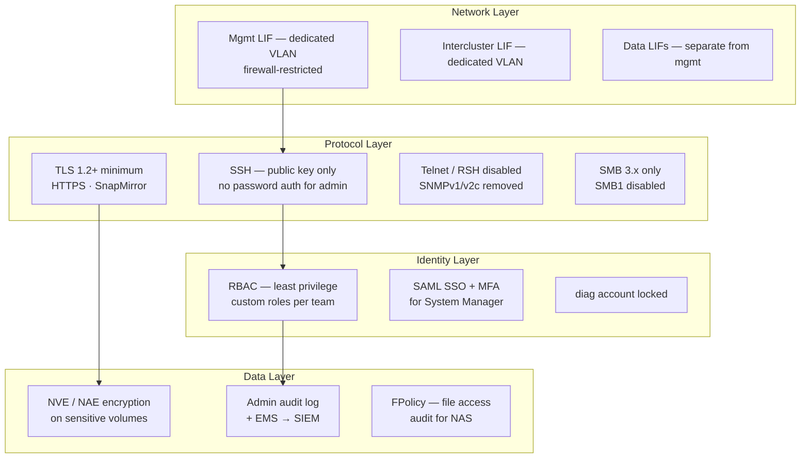

---
tags:
  - netapp
  - security
---
# ONTAP — Hardening


<div class="kb-summary">
Security hardening for ONTAP focuses on reducing attack surface, enforcing strong authentication, encrypting management and data traffic, and enabling comprehensive audit logging. Apply this baseline to all production clusters at build and validate quarterly.
</div>
```text
┌────────────────────────────────── NetApp ONTAP — Security Hardening ──────────────────────────────────┐
│                                                                                                       │
│   ┌───────────────────────────────────────────────────────────────────────────────────────────────┐   │
│   │         ONTAP hardening: disable unused protocols, enforce encryption, restrict access        │   │
│   │         Network: dedicated storage VLAN; restrict management access to jump hosts only        │   │
│   │        Auth: disable default accounts; enforce password complexity and rotation policy        │   │
│   │         Audit: forward syslog to SIEM; alert on privilege escalation and failed logins        │   │
│   └───────────────────────────────────────────────────────────────────────────────────────────────┘   │
│                                                                                                       │
│    Baseline config → disable unused → enforce MFA → enable logging → audit                            │
│                                                                                                       │
│                  ▼                                ▼                                ▼                  │
│                                                                                                       │
│   ┌─────────────────────────────┐  ┌─────────────────────────────┐  ┌─────────────────────────────┐   │
│   │            Layer            │  │          Component          │  │            Notes            │   │
│   │           Cluster           │  │        HA node pairs        │  │          Scale-out          │   │
│   │             SVM             │  │        Virtual server       │  │       Protocol access       │   │
│   │          Aggregate          │  │         RAID groups         │  │         Storage pool        │   │
│   │           FlexVol           │  │         Thin volume         │  │        Data container       │   │
│   │          SnapMirror         │  │         Replication         │  │          Async/Sync         │   │
│   └─────────────────────────────┘  └─────────────────────────────┘  └─────────────────────────────┘   │
│                                                                                                       │
│                          ▼                                                 ▼                          │
│                                                                                                       │
│   ┌───────────────────────────────────────────────────────────────────────────────────────────────┐   │
│   │       Area       │     Control      │      Standard     │      Verify      │    Frequency     │   │
│   │     Accounts     │ Disable defaults │  No default creds │   Login audit    │      Deploy      │   │
│   │    Protocols     │  Disable unused  │   TLS 1.2+ only   │    Port scan     │     Monthly      │   │
│   │       MFA        │ Enforce all admi │   TOTP/hardware   │    Auth logs     │    Continuous    │   │
│   │     Logging      │ SIEM forwarding  │  All admin events │   SIEM alerts    │      Daily       │   │
│   └───────────────────────────────────────────────────────────────────────────────────────────────┘   │
│                                                                                                       │
│    Physical: AFF/FAS HA node pairs · cluster network · client access network · MetroCluster           │
│                                                                                                       │
│    Key terms:                                                                                         │
│                                                                                                       │
│    ONTAP              = NetApp storage OS; unified NAS, SAN, and object across AFF, FAS, ONTAP Select │
│    SVM                = Storage Virtual Machine; logical storage server with protocols, IP, and vol...│
│    Aggregate          = RAID group of disks; underpins FlexVols and FlexGroups within a node          │
│    FlexVol            = flexible thin-provisioned volume within an aggregate; most common container   │
│    FlexGroup          = scale-out volume spanning multiple aggregates; for very large NAS workloads   │
│    SnapMirror         = async or synchronous replication between ONTAP systems for DR and backup      │
│    SnapVault          = backup-oriented SnapMirror variant; independent retention at destination      │
│    FlexClone          = instant space-efficient writable clone of a volume or LUN from snapshot       │
│    Snapshot           = ONTAP space-efficient PiT copy; stored in .snapshot directory on NFS          │
│    ONTAP Mediator     = third-site quorum for SnapMirror SM-BC; prevents split-brain scenarios        │
│    SM-BC              = SnapMirror Business Continuity; synchronous zero-RPO active-active SAN repl...│
│    vserver            = ONTAP CLI name for SVM; vserver show and vserver nfs show are common commands │
│                                                                                                       │
└───────────────────────────────────────────────────────────────────────────────────────────────────────┘
```


## Before you begin

- **Access:** Storage admin credentials (cluster admin or equivalent)
- **Change management:** security changes require CAB approval in most environments
- **Rollback plan:** document current state before any security control change
- **Testing:** validate in a non-production environment first where possible

---

## Hardening Control Layers



## Hardening Checklist

### Authentication and Access

- [ ] Password authentication disabled for `admin` account; SSH public key only
- [ ] Built-in `diag` account locked: `security login lock -username diag`
- [ ] All service/automation accounts use minimum-privilege custom RBAC roles
- [ ] No shared accounts; each administrator has an individual named account
- [ ] SSH idle session timeout configured: `security session timeout modify -timeout 600`
- [ ] SSH host key type restricted to Ed25519 or RSA-4096+

### Protocol Security

- [ ] TLS 1.2 minimum enforced for HTTPS management: `security config modify -interface HTTPS -min-protocol-version TLSv1.2`
- [ ] Telnet and RSH disabled: `security protocol show` confirms both are `false`
- [ ] SNMPv1 and SNMPv2c community strings deleted; SNMPv3 only
- [ ] SMB1 disabled on all CIFS SVMs: `vserver cifs options modify -smb1-enabled false`
- [ ] SSH ciphers restricted to AES-CTR and AES-GCM variants; weak ciphers removed

### Encryption

- [ ] NVE or NAE enabled on all volumes containing sensitive or regulated data
- [ ] External KMIP key manager configured (OKM acceptable for non-regulated environments)
- [ ] AutoSupport configured for HTTPS delivery (not HTTP or SMTP)
- [ ] SnapMirror relationships using TLS encryption (ONTAP 9.6+ default)

### Auditing and Monitoring

- [ ] Admin action audit logging enabled and confirmed active: `security audit log show`
- [ ] EMS log forwarding to SIEM configured
- [ ] AutoSupport delivering successfully to NetApp; proxy configured if required
- [ ] FPolicy configured on production NAS SVMs for file access auditing if required by compliance
- [ ] EMS email alerts configured for CRITICAL and ERROR severity events

### Network

- [ ] Cluster management LIF on a dedicated management VLAN; not reachable from untrusted networks
- [ ] Firewall rules restrict cluster management LIF access to authorized management hosts only
- [ ] Intercluster LIFs are on a dedicated VLAN separate from data LIFs
- [ ] No data LIFs on the management VLAN

---

## Authentication Hardening

### Disable Admin Password Authentication

```bash
# First: ensure a public key is configured and working
security login publickey show -username admin

# Verify key auth works — test SSH with the key in a separate terminal before proceeding
# ssh -i /path/to/key admin@<cluster-mgmt-ip>

# Remove password-based SSH login for admin
security login delete -username admin -application ssh -authentication-method password

# Confirm only publickey method remains
security login show -username admin
```

### Lock Diagnostic Accounts

```bash
# Lock the built-in diag account
security login lock -username diag -vserver <cluster-name>

# Verify it is locked
security login show -username diag -fields is-account-locked
# Expected: is-account-locked: true
```

### Session Timeout

```bash
# Set CLI SSH idle timeout to 10 minutes (600 seconds)
security session timeout modify -timeout 600

# Verify timeout
security session timeout show
```

### Account Lockout Policy

ONTAP does not have a configurable account lockout after N failed attempts in the same way as Active Directory. Enforce this compensating control:

- Monitor failed login events via EMS: `event log show -messagename security.authentication.failed`
- Use LDAP/AD-integrated accounts where lockout is enforced at the IdP
- For local accounts, review `security audit log show` for repeated failed attempts

---

## Protocol Hardening

### TLS Hardening

```bash
# Enforce TLS 1.2 minimum for HTTPS management interfaces
security config modify -interface HTTPS -min-protocol-version TLSv1.2

# Verify current TLS configuration
security config show

# For highest security environments, enforce TLS 1.2 only on both interfaces
security config modify -interface SSL -min-protocol-version TLSv1.2

# Verify with an external SSL test
openssl s_client -connect <cluster-mgmt-ip>:443 -tls1_1
# Should fail if TLS 1.2 minimum is properly enforced
```

### SSH Cipher Hardening

```bash
# Restrict SSH to strong ciphers (remove CBC mode ciphers)
security ssh modify \
    -vserver <cluster-name> \
    -ciphers aes256-ctr,aes192-ctr,aes128-ctr,aes256-gcm@openssh.com,aes128-gcm@openssh.com \
    -macs hmac-sha2-256,hmac-sha2-512

# Verify SSH settings
security ssh show -vserver <cluster-name>
```

### Disable Legacy Protocols

```bash
# Disable Telnet
security protocol modify -application telnet -enabled false

# Disable RSH
security protocol modify -application rsh -enabled false

# Verify both are disabled
security protocol show
```

### Disable SMB1

```bash
# Disable SMB1 (vulnerable to EternalBlue and similar exploits)
vserver cifs options modify -vserver <svm> -smb1-enabled false

# Verify SMB1 is disabled
vserver cifs options show -vserver <svm> -fields smb1-enabled
# Expected: smb1-enabled: false

# Enable SMB signing (prevents man-in-the-middle attacks on SMB traffic)
vserver cifs security modify -vserver <svm> -is-signing-required true
```

---

## SNMP Hardening

```bash
# Delete all SNMPv1/v2c community strings
system snmp community delete -community-name public
system snmp community delete -community-name private

# Confirm no community strings remain
system snmp community show
# Expected: no entries

# Create an SNMPv3 user with authentication and privacy
system snmp user create \
    -username snmpv3monitor \
    -authmethod sha \
    -authpassword <strong-auth-passphrase> \
    -privmethod aes128 \
    -privpassword <strong-priv-passphrase>

# Add the monitoring server as an SNMPv3 trap host
system snmp traphost add -ipaddr <monitoring-server-ip> -username snmpv3monitor

# Enable SNMP
system snmp modify -is-enabled true

# Verify SNMP configuration
system snmp show
system snmp user show
system snmp traphost show
```

---

## AutoSupport Security

AutoSupport transmits cluster telemetry to NetApp and optionally to internal addresses. Ensure HTTPS is used and that proxy configuration is in place if direct internet access is not available from the cluster management network.

```bash
# Set all nodes to use HTTPS for AutoSupport delivery
autosupport modify -node * -transport https

# Configure a proxy if the cluster management LIF cannot reach the internet directly
autosupport modify -node * -proxy-url http://proxy.example.local:8080

# Set the internal notification address for callhome events
autosupport modify -node * -noteto ops-storage@corp.local

# Verify HTTPS connectivity to NetApp AutoSupport endpoints
autosupport check show

# Test AutoSupport delivery
autosupport invoke -node * -type test

# Confirm test message was delivered
autosupport history show -node * -most-recent 3
# Look for status: sent-successful
```

---

## Audit and SIEM Forwarding

### Admin Action Audit Log

All CLI, System Manager, and API operations by authenticated users are recorded in the ONTAP administrative audit log. This is enabled by default and cannot be disabled.

```bash
# View recent administrative audit events
security audit log show

# Filter by username
security audit log show -user admin

# Filter by time range (last 24 hours)
security audit log show -time-range "24h"

# Filter by command
security audit log show -cmdname "security login"
```

### EMS Syslog Forwarding to SIEM

```bash
# Create a syslog destination for your SIEM
event notification destination create \
    -name siem-dest \
    -syslog <siem-server-ip>

# Create an event notification filter for CRITICAL and ERROR events
event filter create -filter-name critical-errors
event filter rule add -filter-name critical-errors -type include -severity critical
event filter rule add -filter-name critical-errors -type include -severity error
event filter rule add -filter-name critical-errors -type include -severity alert

# Create the notification linking filter to destination
event notification create \
    -filter-name critical-errors \
    -destinations siem-dest

# Verify notification configuration
event notification destination show
event notification show
```

### File Access Audit (ONTAP Audit Framework)

For NAS environments requiring file access audit logging (SOX, HIPAA, PCI-DSS):

```bash
# Configure file access auditing on an SVM
# First create a volume to store audit logs
volume create -vserver <svm> -volume audit_logs -aggregate <aggr> -size 50G -junction-path /audit_logs

# Configure the audit framework
vserver audit create \
    -vserver <svm> \
    -destination /audit_logs \
    -events file-ops,cifs-logon-logoff \
    -format xml \
    -rotate-size 50MB \
    -rotate-schedule-minute 0 \
    -rotate-schedule-hour 0 \
    -rotate-schedule-dayofweek 0

# Enable auditing
vserver audit enable -vserver <svm>

# Verify audit configuration
vserver audit show -vserver <svm>

# Show audit log files
vserver audit event-log show -vserver <svm>
```

---

## RBAC Hardening for Service Accounts

Automation tools, monitoring agents, and backup software should never use the full `admin` role. Create dedicated roles with minimum required permissions.

### Read-Only Monitoring Role

```bash
# Create a monitoring role with no access by default
security login role create \
    -role monitoring-ro \
    -cmddirname "DEFAULT" \
    -access none \
    -vserver <cluster-name>

# Grant read-only access to specific command directories
security login role create -role monitoring-ro -cmddirname "version" -access readonly
security login role create -role monitoring-ro -cmddirname "cluster show" -access readonly
security login role create -role monitoring-ro -cmddirname "storage aggregate show" -access readonly
security login role create -role monitoring-ro -cmddirname "volume show" -access readonly
security login role create -role monitoring-ro -cmddirname "snapmirror show" -access readonly
security login role create -role monitoring-ro -cmddirname "network interface show" -access readonly
security login role create -role monitoring-ro -cmddirname "system health alert show" -access readonly
security login role create -role monitoring-ro -cmddirname "storage disk show" -access readonly
security login role create -role monitoring-ro -cmddirname "event log show" -access readonly

# Create the monitoring service account
security login create \
    -username svc-monitoring \
    -application ssh \
    -authentication-method publickey \
    -role monitoring-ro \
    -vserver <cluster-name>

# Add the monitoring service's public key
security login publickey create \
    -username svc-monitoring \
    -index 0 \
    -publickey "ssh-ed25519 AAAA...monitoring-service-key"
```

### SnapCenter / Backup Role

```bash
# Create a backup role for SnapCenter or Veeam with snapshot and SnapMirror access
security login role create -role backup-role -cmddirname "DEFAULT" -access none
security login role create -role backup-role -cmddirname "version" -access readonly
security login role create -role backup-role -cmddirname "volume snapshot" -access all
security login role create -role backup-role -cmddirname "snapmirror" -access all
security login role create -role backup-role -cmddirname "volume show" -access readonly
security login role create -role backup-role -cmddirname "volume clone" -access all
security login role create -role backup-role -cmddirname "lun show" -access readonly

security login create \
    -username svc-snapcenter \
    -application http \
    -authentication-method password \
    -role backup-role \
    -vserver <cluster-name>
```

---

## Compliance Mode and Audit Readiness

For regulated environments (PCI-DSS, HIPAA, FedRAMP, ISO 27001):

| Control | ONTAP Feature | Command |
|---|---|---|
| Data encryption at rest | NVE / NAE / NSE | `volume show -fields encryption-state` |
| Data encryption in transit | TLS 1.2+, NFS Kerberos krb5p | `security config show` |
| Access control and least privilege | Custom RBAC roles | `security login role show` |
| Multi-factor authentication | SAML SSO with MFA at IdP | `security saml-sp show` |
| Audit logging | ONTAP audit log + vserver audit | `security audit log show` |
| Log forwarding to SIEM | EMS syslog notifications | `event notification destination show` |
| Key management | External KMIP | `security key-manager external show` |
| FIPS 140-2 | ONTAP FIPS mode | `security config show -fields is-fips-enabled` |
| Vulnerability management | AutoSupport + Active IQ | `autosupport history show` |
| Change management | AutoSupport maintenance messages | `autosupport invoke -type all` |
