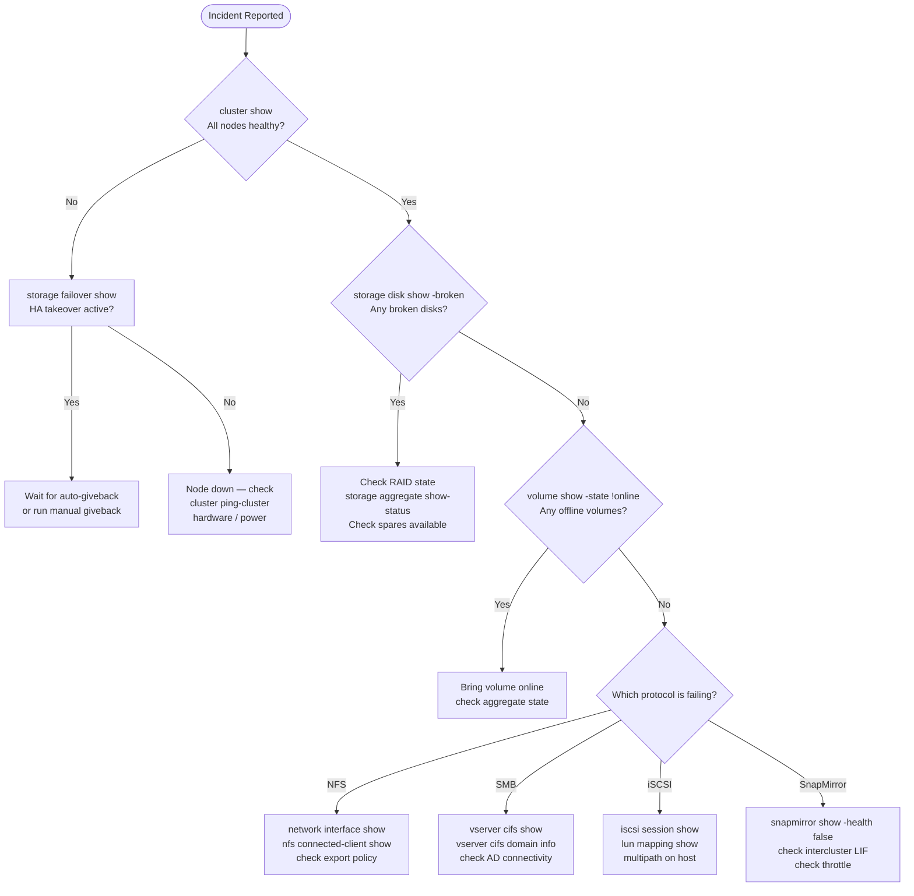

# ONTAP — Common Issues

## Incident Triage Decision Tree



## Quick Reference

| Symptom | Likely Cause | Action |
|---|---|---|
| Volume full / write errors to hosts | Volume space exhausted; autogrow not configured or hit max | `volume show -fields used-percent,autosize-mode`; increase max-autosize or delete old snapshots with `snapshot delete` |
| Aggregate nearly full (>90%) | Thin-provisioned volumes grew beyond aggregate free space | `storage aggregate show`; move volumes with `volume move start` or reduce snapshot reserves |
| SnapMirror lag exceeding RPO | Network bandwidth contention, dedupe/SnapMirror scheduling conflict, or throttle active | `snapmirror show -fields lag-time,transfer-bytes`; adjust schedule; check `snapmirror config-replication show` |
| NFS mount hangs after SP takeover | Stale NFS lock; automount not recovering after LIF migration | Verify LIF on correct port: `network interface show`; unmount and remount on client; check NFS grace period |
| iSCSI session dropped | LIF failover changed IP; host iSCSI initiator did not reconnect | `iscsi session show`; confirm LIF IP stability; rescan iSCSI on host; verify multipath (`multipath -ll` on Linux) |
| Node takeover not auto-triggering | Storage failover disabled or partner unreachable | `storage failover show`; check cluster interconnect with `cluster ping-cluster -node <node>`; verify `options cf.mode` |
| SMB/CIFS shares inaccessible | CIFS server stopped or Kerberos ticket issue with Active Directory | `vserver cifs show`; `vserver cifs domain info -vserver <svm>`; verify AD connectivity and DNS resolution |
| Slow NFS performance | Jumbo frames not configured end-to-end, or QoS ceiling throttling workload | Check MTU on ONTAP ports (`network port show -fields mtu`) and switches; review QoS stats: `qos statistics performance show` |
| Volume move failing mid-way | Destination aggregate too full, or a cutover window was missed | `volume move show`; check destination aggregate space; re-run `volume move start` with `-cutover-window` extended |
| EMS callhome alerts firing | Disk failure, RAID degraded, or hardware fault | `storage disk show -broken`; `storage aggregate show -state degraded`; check `system health alert show` |

---

## Volume Full / Write Errors

### Symptoms

- Hosts receive write errors or I/O timeouts
- Applications report filesystem full errors
- NFS clients return `No space left on device`
- iSCSI/FC hosts receive SCSI reservation conflicts or status check conditions

### Diagnosis

```bash
# Identify volumes at or near capacity
volume show -fields volume,vserver,used-percent,size,available,autosize-mode

# Check if autogrow is configured and its limits
volume show -vserver <svm> -volume <vol> -fields autosize-mode,max-autosize,grow-threshold-percent

# Check snapshot reserve consumption — snapshots can fill volume space
volume show -vserver <svm> -volume <vol> -fields snapshot-percent,snapshot-count

# List snapshots by size (largest first)
volume snapshot show -vserver <svm> -volume <vol> -fields size,create-time | sort -k2 -rn

# Check aggregate available space — thin volumes must have aggregate backing
storage aggregate show -fields aggr-name,available,percent-used
```

### Resolution

```bash
# Option 1 — Increase volume size immediately
volume size -vserver <svm> -volume <vol> -new-size 500G

# Option 2 — Enable or extend autogrow
volume modify -vserver <svm> -volume <vol> \
    -autosize-mode grow_shrink \
    -max-autosize 1T \
    -grow-threshold-percent 85

# Option 3 — Delete old or unnecessary snapshots
volume snapshot show -vserver <svm> -volume <vol>
volume snapshot delete -vserver <svm> -volume <vol> -snapshot <snap_name>

# Delete all non-busy snapshots (use with caution)
volume snapshot delete -vserver <svm> -volume <vol> -snapshot * -force true

# Option 4 — Reduce snapshot reserve percentage
volume modify -vserver <svm> -volume <vol> -percent-snapshot-space 10

# Option 5 — Run deduplication to reclaim space
volume efficiency start -vserver <svm> -volume <vol> -scan-all true
```

### Prevention

- Enable autogrow with an explicit maximum on all production volumes
- Set volume snapshot reserve to 10–15% for active volumes; reduce to 5% on volumes with SnapMirror (destination retains snaps separately)
- Monitor volume capacity daily and alert at 80%
- Configure EMS email alerts for `wafl.vol.full` and `wafl.vol.autoSize.fail`

---

## Aggregate Capacity Critical

### Symptoms

- `storage aggregate show` shows aggregate above 90% used
- Volume autogrow fails because aggregate is full
- New volume creation fails with "No space available in aggregate"
- ONTAP issues EMS events: `aggr.nearly.full`, `aggr.full`

### Diagnosis

```bash
# Show all aggregates with usage
storage aggregate show -fields aggr-name,node,available,size,percent-used,state

# Show per-aggregate space breakdown including snapshot reserve
storage aggregate show-space -aggregate <aggr_name>

# Identify which volumes are consuming space
volume show -aggregate <aggr_name> -fields volume,vserver,size,used,percent-used

# Check for volumes with large snapshot reserves
volume show -aggregate <aggr_name> -fields volume,snapshot-percent,percent-used

# Identify volumes with large unused space (candidate for move)
volume show -aggregate <aggr_name> -fields volume,size,used,available | sort -k4
```

### Resolution

```bash
# Option 1 — Move a volume to a less-full aggregate (non-disruptive)
volume move start -vserver <svm> -volume <vol> -destination-aggregate <dest_aggr>
volume move show -vserver <svm> -volume <vol>

# Option 2 — Add disks to the aggregate
storage aggregate add-disks -aggregate <aggr_name> -diskcount 4

# Confirm unassigned disks available
storage disk show -container-type unassigned

# Option 3 — Reduce snapshot reserves across volumes in the aggregate
volume modify -vserver <svm> -volume <vol> -percent-snapshot-space 5

# Option 4 — Run storage efficiency on all volumes in the aggregate
volume efficiency start -aggregate <aggr_name>
```

---

## SnapMirror Lag / Unhealthy Relationship

### Symptoms

- `snapmirror show` reports `healthy: false`
- Lag time exceeds RPO threshold
- Transfer state stuck in `transferring` or `idle` unexpectedly
- EMS events: `snapmirror.dest.lag.warn`, `snapmirror.src.unreachable`

### Diagnosis

```bash
# Show all relationships with health and lag
snapmirror show -fields source-path,destination-path,lag-time,healthy,state,last-transfer-size

# Show only unhealthy relationships
snapmirror show -health false

# Check transfer history for failures
snapmirror history show -destination-path <dest_svm>:<dest_vol>

# Check for throttle limiting transfer speed
snapmirror config-replication show

# Check intercluster LIF connectivity between clusters
network interface show -role intercluster
cluster peer show

# Verify intercluster LIF reachability
network ping -lif <ic_lif> -vserver <cluster_admin_svm> -destination <remote_ic_lif_ip>
```

### Resolution

```bash
# Resume a quiesced relationship
snapmirror resume -destination-path <dest_svm>:<dest_vol>

# Force a manual update to catch up on lag
snapmirror update -destination-path <dest_svm>:<dest_vol>

# Abort a stuck transfer and restart
snapmirror abort -destination-path <dest_svm>:<dest_vol>
snapmirror update -destination-path <dest_svm>:<dest_vol>

# If relationship is broken-off (after a failover), resync it
snapmirror resync -destination-path <dest_svm>:<dest_vol>

# Remove a throttle if one is limiting transfer speed
snapmirror modify -destination-path <dest_svm>:<dest_vol> -throttle unlimited

# Re-initialize from scratch (only if relationship is corrupt — destructive)
snapmirror initialize -destination-path <dest_svm>:<dest_vol>
```

---

## NFS Mount Hangs / Stale Lock After Failover

### Symptoms

- NFS clients hang indefinitely after a node failover (HA takeover or SP switchover)
- `df` or any file access on the mount hangs
- Linux clients show processes in `D` state (uninterruptible wait)
- Automount does not recover after LIF migration

### Diagnosis

```bash
# Verify the LIF is online and on the correct port
network interface show -vserver <svm> -fields lif,address,curr-node,curr-port,status-oper

# Check if the LIF is on its home port (takeover may have migrated it)
network interface show -vserver <svm> -fields lif,home-node,home-port,curr-node,curr-port

# Check NFS grace period state (clients waiting for lock reclaim)
# Grace period is typically 45 seconds after failover
nfs show -vserver <svm> -fields grace-period

# Check for connected NFS clients
nfs connected-client show -vserver <svm>

# Check export policy — did it change during failover?
vserver export-policy show -vserver <svm>
```

### Resolution

On the storage side:

```bash
# Revert LIF to home port if it migrated during failover
network interface revert -vserver <svm> -lif <lif_name>

# Verify LIF is accessible from the client IP
network ping -lif <lif_name> -vserver <svm> -destination <client_ip>
```

On the NFS client side:
```bash
# Force unmount a hung NFS mount (lazy unmount)
umount -f -l /mnt/data

# Remount after confirming LIF is accessible
mount -t nfs <lif_ip>:/vol/data /mnt/data

# For automount, bounce the autofs service
systemctl restart autofs
```

If NFSv4 state is stale, the NFS server grace period (default 45 seconds) must expire before new locks are granted. Do not reboot NFS clients during the grace period — this resets their lock reclaim timer.

---

## iSCSI Session Dropped / Host Cannot Access LUN

### Symptoms

- Host multipath shows one or more paths failed
- `iscsiadm -m session` shows disconnected sessions
- Block I/O errors in Linux dmesg: `device-mapper: multipath: Failing path`
- Windows Disk Management shows disk offline

### Diagnosis

```bash
# Check iSCSI sessions from ONTAP side
iscsi session show -vserver <svm>
iscsi session show -vserver <svm> -fields initiator-name,tpgroup,lif

# Check iSCSI LIFs are operational
network interface show -vserver <svm> -data-protocol iscsi

# Verify LUN is online and mapped
lun show -vserver <svm> -fields path,state,mapped
lun mapping show -vserver <svm>

# Check igroup has the correct initiator IQN
lun igroup show -vserver <svm>
```

### Resolution

```bash
# Bring a LUN back online if it went offline
lun online -vserver <svm> -path /vol/<vol>/<lun_name>

# Verify iSCSI service is running on the SVM
iscsi show -vserver <svm>
iscsi modify -vserver <svm> -is-admin-enabled true
```

On the Linux host:
```bash
# Rescan iSCSI targets
iscsiadm -m session --rescan

# Log back into a target after network recovery
iscsiadm -m node -T <iqn.target> -p <lif_ip>:3260 --login

# Rescan SCSI bus to pick up re-connected LUN
rescan-scsi-bus.sh
multipath -r     # reload multipath maps
```

---

## Storage Failover (HA) Not Triggering

### Symptoms

- A node fails but the partner does not automatically take over
- `storage failover show` shows `Disabled` or `Disconnected`
- Cluster shows one node unreachable but storage is not serving from the surviving node

### Diagnosis

```bash
# Check HA failover state on all nodes
storage failover show

# Expected output: Enabled = true, State = Connected

# Check cluster interconnect (heartbeat link)
cluster ping-cluster -node <node_name>

# Check HA interconnect port state
network port show -node <node_name> -fields port,health-status,link-status

# Check if failover is manually disabled
storage failover show -fields node,enabled,mode
```

### Resolution

```bash
# Re-enable storage failover if it was disabled
storage failover modify -node <node_name> -enabled true

# Trigger a manual takeover (planned maintenance)
storage failover takeover -ofnode <node_to_take_over>

# After node recovery, return ownership
storage failover giveback -ofnode <node_name>

# Force giveback if stuck in partial state
storage failover giveback -ofnode <node_name> -require-partner-waiting false
```

---

## SMB/CIFS Share Inaccessible

### Symptoms

- Windows clients receive "Network path not found" or "Access denied"
- CIFS shares disappear from browsing
- Kerberos errors in Windows event log

### Diagnosis

```bash
# Check CIFS server status and domain join health
vserver cifs show -vserver <svm>
vserver cifs domain info -vserver <svm>

# Check for Active Directory connectivity issues
vserver cifs check -vserver <svm>

# Check CIFS sessions — are any clients connected?
vserver cifs session show -vserver <svm>

# Verify the CIFS LIF is operational
network interface show -vserver <svm> -data-protocol cifs

# Check if the SVM is running
vserver show -vserver <svm> -fields state
```

### Resolution

```bash
# Start the SVM if it is stopped
vserver start -vserver <svm>

# Re-join Active Directory if the machine account is broken
vserver cifs delete -vserver <svm>
vserver cifs create -vserver <svm> -cifs-server <netbios_name> \
    -domain <domain.corp> -ou "OU=Servers,DC=domain,DC=corp"

# Reset the CIFS machine account password (requires Domain Admin)
vserver cifs password -vserver <svm>

# Verify DNS resolution from the SVM
vserver services name-service dns check -vserver <svm>

# Disable SMB1 if legacy clients cause negotiation failures
vserver cifs options modify -vserver <svm> -smb1-enabled false
```

---

## Disk Failure / RAID Degraded

### Symptoms

- `storage disk show -broken` lists one or more disks
- EMS event: `raid.config.phy.degraded`, `diskown.diskNotFound`
- `storage aggregate show-status` shows RAID group in `degraded` state

### Diagnosis

```bash
# List all broken disks
storage disk show -broken -fields disk,container-type,bay,shelf,node

# Check RAID status per aggregate
storage aggregate show-status -aggregate <aggr_name>

# Identify available spare disks for automatic RAID rebuild
storage disk show -container-type spare

# Check if reconstruction is already in progress
storage aggregate show -fields aggr-name,state,raid-status

# Get full disk details including location
storage disk show -fields disk,serial-number,bay,shelf,node,rpm,size
```

### Resolution

ONTAP will automatically initiate RAID reconstruction when a spare disk is available. No manual intervention is needed for reconstruction to start.

```bash
# Confirm reconstruction is underway
storage disk show -raid-state reconstructing

# Mark a disk as failed if ONTAP has not done so automatically
storage disk fail -disk <disk_id>

# Unfail a disk if it was transiently removed and re-seated successfully
storage disk unfail -disk <disk_id>

# Assign an unassigned spare to replace a failed disk
storage disk assign -disk <spare_disk_id> -owner <node_name>
```

If no spare disks are available, RAID reconstruction cannot proceed. Escalate immediately — a second disk failure in the same RAID group will cause aggregate loss.

---

## Before Calling Support

1. Capture current cluster state: `cluster show`, `storage failover show`, `system health alert show`
2. Collect EMS events for the relevant timeframe: `event log show -time-range <start>..<end>`
3. Generate an AutoSupport: `system node autosupport invoke -node * -type all -message "case <number>"`
4. Note the exact ONTAP version: `system image show`
5. Record the hardware platform and serial numbers: `system node show -fields model,serial-number`
6. Describe the timeline of the issue — when it started, what changed (upgrade, config change, load change)
7. Have the NetApp support site login ready: [https://mysupport.netapp.com](https://mysupport.netapp.com)
