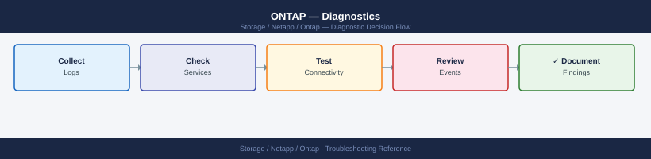

---
tags:
  - netapp
  - troubleshooting
search:
  boost: 1.5
---
# ONTAP — Diagnostics

<div class="kb-summary">
ONTAP diagnostic commands: check cluster and HA health with <code>cluster show</code> and <code>storage failover show</code>, inspect aggregate and disk state with <code>storage aggregate show-status</code> and <code>storage disk show -broken</code>, check volume state and capacity with <code>volume show -state !online</code>, diagnose NFS/CIFS/iSCSI/FC protocols with per-protocol statistics, trace SnapMirror lag with <code>snapmirror show -health false</code>, analyse EMS events with <code>event log show -severity CRITICAL</code>, and generate an AutoSupport bundle before calling NetApp support.

*Applies to: ONTAP 9.x*
</div>


```d2
direction: right

A: "ONTAP Issue" {shape: rectangle}
B: "cluster show: node health\nsystem health status show\nstorage failover show: HA state" {shape: rectangle}
C: "C" {shape: rectangle}
D: "system node show: state and uptime\ncluster ring show: cluster services\nstorage failover interconnect show" {shape: rectangle}
E: "aggr show -state !online\nstorage disk show -broken\ndisk show -raid-state recon" {shape: rectangle}
F: "volume show -state !online\nvolume show percent-used > 90%\nvolume efficiency show: dedup" {shape: rectangle}
G: "net int show -status-oper down\nnet int show -is-home false\ncluster ping-cluster: ICL health" {shape: rectangle}
H: "H" {shape: rectangle}
I: "nfs connected-client show\nvserver export-policy check-access\nstatistics start -object nfsv3" {shape: rectangle}
J: "vserver cifs domain info\nvserver cifs session show\nstatistics start -object smb2" {shape: rectangle}
K: "iscsi session show\nlun mapping show\nlun igroup show" {shape: rectangle}
L: "fcp adapter show\nfcp initiator show\nfcp topology show" {shape: rectangle}
M: "snapmirror show -health false\nsnapmirror lag show\nnet int show -role intercluster" {shape: rectangle}
N: "statistics start -object volume\nqos statistics performance show\nsystem node run sysstat" {shape: rectangle}
O: "autosupport invoke: all nodes\nOpen NetApp support case" {shape: rectangle}

A -> B
C -> D
C -> E
C -> F
C -> G
H -> I
H -> J
H -> K
H -> L
C -> M
C -> N
D -> O
E -> O
F -> O
G -> O
I -> O
J -> O
K -> O
L -> O
M -> O
N -> O
```

```d2
direction: down

symptom: Identify Symptom {shape: diamond}
step_1_first_response: "Step 1 — First response" {shape: rectangle}
step_2_cluster_and_node_diagnostics: "Step 2 — Cluster and node diagnostics" {shape: rectangle}
step_3_storage_aggregate_and_disk_di: "Step 3 — Storage — aggregate and disk diagnostics" {shape: rectangle}
step_4_volume_diagnostics: "Step 4 — Volume diagnostics" {shape: rectangle}
step_5_network_diagnostics: "Step 5 — Network diagnostics" {shape: rectangle}
step_6_protocolspecific_diagnostics: "Step 6 — Protocol-specific diagnostics" {shape: rectangle}
resolution: Resolve or Escalate {shape: oval}

symptom -> step_1_first_response: investigate
symptom -> step_2_cluster_and_node_diagnostics: investigate
symptom -> step_3_storage_aggregate_and_disk_di: investigate
symptom -> step_4_volume_diagnostics: investigate
symptom -> step_5_network_diagnostics: investigate
symptom -> step_6_protocolspecific_diagnostics: investigate
step_1_first_response -> resolution
step_2_cluster_and_node_diagnostics -> resolution
step_3_storage_aggregate_and_disk_di -> resolution
step_4_volume_diagnostics -> resolution
step_5_network_diagnostics -> resolution
step_6_protocolspecific_diagnostics -> resolution
```

## Before you begin

- **Access:** SSH to cluster management IP or node management IP as admin; node shell (`system node run -node <node>`) for advanced per-node commands; SP/BMC console for unresponsive nodes
- **Gather first:** `cluster show` (node count and health), `system health status show` (overall health), the affected SVM and volume or protocol, and the specific symptom (error message, offline resource, slow response time)
- **Scope:** confirm whether the issue is cluster-wide (all SVMs affected), node-specific (one node or aggregate), SVM-specific (one protocol or tenant), or volume-specific — `event log show -severity CRITICAL` and `system health alert show` give the fastest cross-component view
- **AutoSupport:** always trigger an AutoSupport before calling NetApp — `system node autosupport invoke -node * -type all -message "case <SR> - <description>"`

---

## Step 1 — First response

Run these commands immediately on any ONTAP incident.

```bash
# Overall cluster health summary
cluster show
system health status show
system health alert show

# HA pair state
storage failover show

# Check for any broken disks
storage disk show -broken

# Check for any offline aggregates
storage aggregate show -state !online

# Check for any offline volumes
volume show -state !online

# Check network interfaces that are down
network interface show -status-oper down

# Recent CRITICAL and ERROR events
event log show -severity CRITICAL
event log show -severity ERROR -time-range 1h
```

If any of these commands return unexpected results, follow the relevant subsystem diagnostic section below.

---

## Step 2 — Cluster and node diagnostics

```bash
# Cluster node count and status
cluster show
# All nodes should show: health=true, eligibility=true

# Detailed node status including uptime
system node show
system node show -fields node,health,state,uptime,model,serial-number

# Node-level hardware configuration (drops to node shell)
system node run -node <node_name> sysconfig -a

# Node environment (temperature, fans, power)
system node run -node <node_name> environment status

# Node-level system resource utilisation
system node run -node <node_name> sysstat -c 5 -x 2

# Check the cluster ring (internal cluster services)
cluster ring show

# Epsilon node (tiebreaker in split-brain scenarios)
cluster show -fields node,epsilon
```

### Storage failover diagnostics

```bash
# Detailed HA failover state
storage failover show -fields node,enabled,state,partner,takeover-enabled,giveback-status

# Check interconnect link status between HA partners
storage failover interconnect show

# Test cluster interconnect ping (HA heartbeat)
cluster ping-cluster -node <node_name>

# Show failover history (recent takeovers and givebacks)
storage failover history show -node <node_name>
```

HA state interpretation:

| State | Meaning | Action |
|---|---|---|
| `Connected, Not in takeover` | Normal — HA active | None |
| `Connected, Waiting for Giveback` | Partner was taken over; partner is recovered and waiting | Run `storage failover giveback -ofnode <node>` |
| `In Takeover` | Active takeover in progress or complete | Wait for completion or giveback |
| `Disconnected` | HA interconnect link down | Check physical link; investigate immediately |
| `false` (enabled) | HA disabled | Run `storage failover modify -node <node> -enabled true` after investigation |

---

## Step 3 — Storage — aggregate and disk diagnostics

```bash
# Aggregate health — show any not online
storage aggregate show -state !online
storage aggregate show -fields aggr-name,node,state,raid-status,percent-used

# Aggregate RAID status detail
storage aggregate show-status -aggregate <aggr_name>
storage aggregate show-raidtree -aggregate <aggr_name>

# Disk health
storage disk show -broken -fields disk,container-type,bay,shelf,node,serial-number
storage disk show -container-type spare        # confirm spares available for rebuild
storage disk show -raid-state reconstructing   # active RAID reconstruction

# All disks with firmware revision and location
storage disk show -fields disk,bay,shelf,node,firmware-revision,rpm,size,disk-type

# Disk shelf status
storage shelf show
storage shelf show -detail
```

### RAID reconstruction monitoring

When a disk fails and a spare is available, ONTAP automatically starts RAID reconstruction. Monitor progress:

```bash
# Show reconstruction status
storage disk show -raid-state reconstructing

# Show aggregate state during reconstruction
storage aggregate show -aggregate <aggr_name> -fields state,raid-status

# Watch reconstruction progress (check every 60 seconds)
storage aggregate show-status -aggregate <aggr_name>
# Look for "Parity reconstruction" or "Data reconstruction" with a percentage
```

Typical reconstruction times:
- NVMe SSD: hours to a day for large capacities
- SAS HDD: 6–24 hours per TB depending on disk RPM and aggregate workload
- SATA HDD: 12–48+ hours per TB

---

## Step 4 — Volume diagnostics

```bash
# Volume state — identify offline or restricted volumes
volume show -state !online
volume show -state offline
volume show -state restricted

# Volume capacity — identify full or near-full volumes
volume show -fields vserver,volume,size,used,available,percent-used | sort -k5 -rn

# Autosize configuration
volume show -fields vserver,volume,autosize-mode,max-autosize,grow-threshold-percent

# Space guarantee and snapshot reserve
volume show -fields volume,space-guarantee,snapshot-percent,percent-snapshot-space

# Volume efficiency status (dedup / compression)
volume efficiency show -vserver <svm>

# FlexClone volumes and their parent
volume clone show
volume clone show -fields flexclone,parent-volume,parent-snapshot

# Volume move status
volume move show
```

---

## Step 5 — Network diagnostics

```bash
# LIF status — identify any down interfaces
network interface show
network interface show -status-oper down
network interface show -fields lif,vserver,address,home-node,curr-node,home-port,curr-port,status-oper

# LIFs not on home port (migrated due to failover or maintenance)
network interface show -is-home false

# Port status — identify failed or degraded ports
network port show
network port show -fields node,port,health-status,link-status,speed,mtu

# Interface group (bond/LACP) status
network port ifgrp show

# VLAN configuration
network port vlan show

# Routing table
network route show

# Test connectivity from a specific LIF
network ping -lif <lif_name> -vserver <svm> -destination <target_ip>

# Check cluster interconnect connectivity
cluster ping-cluster -node <node_name>

# Trace route from a LIF (ONTAP 9.8+)
network traceroute -lif <lif_name> -vserver <svm> -destination <ip>

# DNS resolution check
vserver services name-service dns check -vserver <svm>

# LDAP connectivity check
vserver services name-service ldap check -vserver <svm>
```

### MTU / Jumbo frame verification

```bash
# Check ONTAP port MTU settings
network port show -fields node,port,mtu

# Ping with large payload to test jumbo frames end-to-end
network ping -lif <lif_name> -vserver <svm> -destination <target_ip> -packet-size 8972
# 8972 bytes = 9000 byte jumbo frame minus IP/ICMP headers
```

---

## Step 6 — Protocol-specific diagnostics

### NFS diagnostics

```bash
# NFS service status per SVM
vserver nfs show -vserver <svm>

# Connected NFS clients
nfs connected-client show -vserver <svm>

# NFS export policy rules
vserver export-policy rule show -vserver <svm> -policyname <policy>

# Test client IP against export policy
vserver export-policy check-access -vserver <svm> -volume <vol> -client-ip <ip> \
  -authentication-method sys -protocol nfs3

# NFS statistics (read/write ops and latency)
statistics start -object nfsv3 -sample-id nfs-diag
# wait 30 seconds
statistics stop -sample-id nfs-diag
statistics show -sample-id nfs-diag
```

### CIFS/SMB diagnostics

```bash
# CIFS server and domain status
vserver cifs show -vserver <svm>
vserver cifs domain info -vserver <svm>

# CIFS domain controller connectivity
vserver cifs domain discovered-servers show -vserver <svm>

# Active CIFS sessions
vserver cifs session show -vserver <svm>
vserver cifs session show -vserver <svm> -fields node,connection-count,open-files

# Open files on an SVM
vserver cifs session file show -vserver <svm>

# CIFS SMB statistics
statistics start -object smb2 -sample-id smb2-diag
# wait 30 seconds
statistics stop -sample-id smb2-diag
statistics show -sample-id smb2-diag
```

### iSCSI diagnostics

```bash
# iSCSI service status
iscsi show -vserver <svm>

# iSCSI sessions (connected initiators)
iscsi session show -vserver <svm>
iscsi session show -vserver <svm> -fields initiator-name,lif,tpgroup,connection-count

# iSCSI target portal groups
iscsi tpgroup show -vserver <svm>

# LUN mapping — confirm host can see LUNs
lun show -vserver <svm>
lun mapping show -vserver <svm>
lun mapping show -vserver <svm> -igroup <igroup_name>

# igroup membership
lun igroup show -vserver <svm>
```

### FC / FCoE diagnostics

```bash
# FC service status
fcp show -vserver <svm>

# FC adapter status (physical ports)
fcp adapter show -fields node,adapter,state,speed,fabric-established

# FC initiators (logged-in hosts)
fcp initiator show -vserver <svm>

# FC interface status (FC LIFs)
fcp interface show -vserver <svm>

# FC topology information
fcp topology show
```

---

## Step 7 — SnapMirror diagnostics

```bash
# All relationships with health and lag
snapmirror show -fields source-path,destination-path,lag-time,healthy,state,last-transfer-end-timestamp

# Only unhealthy relationships
snapmirror show -health false

# Transfer progress (active transfers)
snapmirror show -transfer-progress

# Transfer history for a specific relationship
snapmirror history show -destination-path <dest_svm>:<dest_vol>

# Lag for all relationships (compact view)
snapmirror lag show

# SnapMirror network statistics (bandwidth usage)
statistics start -object snapmirror -sample-id sm-diag
# wait 30 seconds
statistics stop -sample-id sm-diag
statistics show -sample-id sm-diag

# Check intercluster LIF status (required for cross-cluster SnapMirror)
network interface show -role intercluster
```

---

## Step 8 — Performance diagnostics

ONTAP statistics require a start/stop sample cycle. Let it run for at least 30 seconds before stopping to get meaningful data.

```bash
# Volume-level performance statistics
statistics start -object volume -sample-id vol-perf
# wait 30–60 seconds
statistics stop -sample-id vol-perf
statistics show -sample-id vol-perf

# Filter for key latency metrics (microseconds)
statistics show -sample-id vol-perf | grep -E "total_latency|read_latency|write_latency"

# Filter for IOPS
statistics show -sample-id vol-perf | grep -E "total_ops|read_ops|write_ops"

# Volume-specific statistics (single volume)
statistics show -object volume -instance <vol_name> -counter read_latency,write_latency,total_ops

# QoS workload statistics (shows throttling and floor/ceiling hit rates)
qos statistics performance show
qos statistics workload performance show

# Node-level CPU and disk utilisation (node shell)
system node run -node <node_name> sysstat -c 10 -x 2
```

### Latency interpretation

| Metric | Acceptable | Warning | Critical |
|---|---|---|---|
| NFS read latency | < 2 ms | 2–10 ms | > 10 ms |
| NFS write latency | < 3 ms | 3–10 ms | > 10 ms |
| iSCSI/FC read latency | < 1 ms | 1–5 ms | > 5 ms |
| iSCSI/FC write latency | < 1 ms | 1–5 ms | > 5 ms |
| Volume total_latency | < 2 ms | 2–10 ms | > 10 ms |

High latency root causes to investigate:
- Aggregate over 80% used (WAFL metadata overhead)
- QoS ceiling throttling the workload: `qos statistics performance show`
- Network MTU mismatch (NFS/NVMe/TCP): check jumbo frames end-to-end
- SnapMirror or efficiency jobs running during production peak hours

---

## Step 9 — EMS event log analysis

```bash
# Recent events by severity
event log show -severity EMERGENCY
event log show -severity ALERT
event log show -severity CRITICAL
event log show -severity ERROR

# Events in the last hour
event log show -severity ERROR -time-range 1h

# Events from a specific node
event log show -node <node_name> -severity ERROR

# Search for a specific message name (pattern)
event log show -messagename wafl.vol.full
event log show -messagename raid.*
event log show -messagename disk.*

# Events related to SnapMirror
event log show -messagename snapmirror.*

# Show event details including description
event log show -messagename <message_name> -detail
```

Common EMS messages and their meaning:

| EMS Message | Severity | Meaning |
|---|---|---|
| `wafl.vol.full` | ERROR | Volume is 100% used; writes will fail |
| `wafl.vol.autoSize.fail` | ERROR | Autogrow attempted but aggregate is full |
| `raid.config.phy.degraded` | ERROR | RAID group degraded due to disk failure |
| `diskown.diskNotFound` | ERROR | A disk is missing from an aggregate |
| `callhome.disk.failure` | ALERT | Disk failure detected; AutoSupport sent |
| `snapmirror.dest.lag.warn` | WARNING | SnapMirror lag exceeds warning threshold |
| `ha.takeover.occurred` | NOTICE | HA takeover has happened |
| `LIF.compatibility.change` | NOTICE | LIF has been migrated to a different port |

---

## Step 10 — Coredump and panic analysis

```bash
# List core dump files
system node coredump show

# Show core dump details
system node coredump show -node <node_name> -fields state,type,panic-string,uptime-before-crash

# Delete processed core dumps (after AutoSupport upload)
system node coredump delete -node <node_name> -corefile <filename>

# Check Service Processor logs for pre-panic system events
system service-processor log show -node <node_name>
system service-processor log show -node <node_name> -num-rows 100
```

A node panic followed by an automatic HA takeover is normal ONTAP behavior — the key diagnostic information is in the panic string and the EMS log immediately preceding the panic. Always generate an AutoSupport when an unexpected panic occurs.

---

## Step 11 — AutoSupport bundle

AutoSupport bundles are the primary support artifact. Generate one before calling NetApp support:

```bash
# Generate AutoSupport tied to a support case
system node autosupport invoke -node * -type all -message "case <SR-number> - <description>"

# Verify delivery
system node autosupport history show -node * -most-recent 5
# Status should show: sent-successful
```

If AutoSupport delivery is failing:

```bash
# Check AutoSupport configuration
system node autosupport show

# Test connectivity to NetApp endpoints
system node autosupport check show

# Check proxy configuration
system node autosupport show -fields proxy-url,transport
```

---

## Log locations

| Log Source | Location / Command |
|---|---|
| EMS event log | `event log show` (CLI); `/mroot/etc/log/ems` (node shell) |
| AutoSupport history | `system node autosupport history show -node <node>` |
| Audit log (admin actions) | `security audit log show` |
| CIFS/SMB audit | SVM-level audit log configured to NAS volume via `vserver audit` |
| Crash dumps / core files | `system node coredump show`; files at `/mroot/etc/crash/` |
| Disk firmware log | `storage disk show -fields firmware-revision`; in AutoSupport |
| Node syslog | `system node run -node <node> syslog` (node shell) |
| SP / BMC logs | `system service-processor log show -node <node>` |
| Core file listing | `system node coredump show -node <node>` |

---

## See also

- [ONTAP — Common Issues](../common-issues/)
- [ONTAP — Escalation](../escalation/)

## Verify resolution

- `cluster show` returns all nodes with `health: true` and `eligibility: true`
- `storage failover show` shows `Connected, Not in takeover` for all HA pairs
- `system health status show` returns `ok`
- `storage disk show -broken` returns no broken disks (or the same pre-existing broken disks that were there before the incident)
- `volume show -state !online` returns no unexpectedly offline volumes
- `network interface show -status-oper down` returns no operationally-down LIFs
- For SnapMirror: `snapmirror show -health false` returns no unhealthy relationships
- `event log show -severity CRITICAL -time-range 1h` shows no new critical events after the fix was applied
