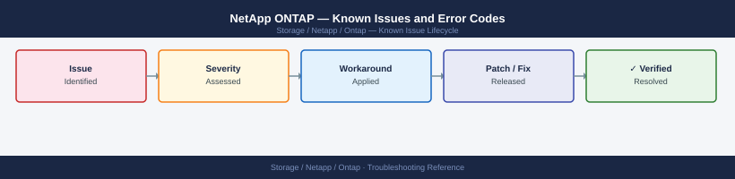

---
tags:
  - troubleshooting
  - netapp
  - ontap
  - known-issues
---
# NetApp ONTAP — Known Issues and Error Codes

Catalog of known ONTAP bugs, error codes, and workarounds covering NFS, SMB, SnapMirror, iSCSI, and cluster health.

*Applies to: ONTAP 9.12–9.15*

## Before you begin

- Run `system health alert show` on the cluster for active alerts.
- EMS logs: `event log show -severity ERROR` — first point of diagnosis for all issues.
- AutoSupport uploads collect all diagnostic data: `system node autosupport invoke -node * -type all`.

## NFS

| Error / Symptom | Affected Versions | Cause | Workaround / Fix | Fixed In |
|---|---|---|---|---|
| NFS client shows `Stale file handle` after SVM failover | ONTAP 9.x | Client cached old data LIF IP; NFS mount bound to specific LIF | Configure NFS clients to use DNS name (round-robin across LIFs) rather than IP | N/A |
| `NFSERR_ACCES` on NFS export despite correct permissions | ONTAP 9.x | Export policy rule client match uses CIDR but client IP outside range | Verify export policy rule client match exactly matches client subnet | N/A |
| NFS v4.1 delegation recall causing high latency | ONTAP 9.12 | Delegation recall storm during high-metadata workload | Disable NFSv4.1 delegations for affected SVM if workload is high-metadata: `vserver nfs modify -delegation disabled` | 9.13 |

## SMB / CIFS

| Error / Symptom | Affected Versions | Cause | Workaround / Fix | Fixed In |
|---|---|---|---|---|
| `Access denied` on SMB share after AD password reset for service account | ONTAP 9.x | CIFS server machine account in AD out of sync | Re-join CIFS SVM to AD domain: `vserver cifs modify -domain-workgroup` | N/A |
| DFS namespace broken after SVM DR failover | ONTAP 9.x | DFS referral points to old SVM data LIF | Update DFS namespace targets to new data LIF IP post-failover | N/A |

## SnapMirror / Replication

| Error / Symptom | Affected Versions | Cause | Workaround / Fix | Fixed In |
|---|---|---|---|---|
| SnapMirror relationship stuck `Idle` — lag increasing | ONTAP 9.x | Intercluster LIF blocked; TCP 11104/11105 not reachable | Verify ports 11104/11105 open between intercluster LIFs | N/A |
| SnapMirror update fails: `Source volume is busy` | ONTAP 9.x | Snapshot retention prevents new Snapshot during update | Delete oldest Snapshot manually; or increase max Snapshot count | N/A |

## iSCSI / SAN

| Error / Symptom | Affected Versions | Cause | Workaround / Fix | Fixed In |
|---|---|---|---|---|
| iSCSI initiator loses path after LIF migration | ONTAP 9.x | Host iSCSI session bound to old LIF IP | Rescan initiator: `iscsiadm -m session --rescan`; enable ALUA on host | N/A |
| LUN offline after node takeover | ONTAP 9.x | LUN not mapped on partner node's LIF | Verify igroups include both home and partner LIFs (required for multi-path) | N/A |

## See also

- [NetApp ONTAP — Common Issues](common-issues/)
- [NetApp SnapMirror — Known Issues](../../snapmirror/troubleshooting/known-issues.md)
- [NetApp SnapCenter — Known Issues](../../snapcenter/troubleshooting/known-issues.md)
