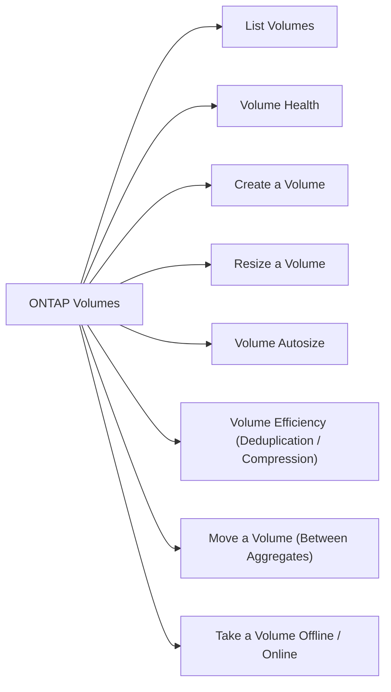

# ONTAP Volumes



## List Volumes

```bash
volume show
volume show -vserver <svm_name>
volume show -fields size,used,available,percent-used,state
```

## Volume Health

```bash
# Show offline or restricted volumes
volume show -state !online

# Show volumes nearing capacity
volume show -fields percent-used | awk '$2 > 80'
```

## Create a Volume

```bash
volume create \
    -vserver <svm_name> \
    -volume <vol_name> \
    -aggregate <aggr_name> \
    -size 500G \
    -junction-path /<vol_name> \
    -security-style unix
```

## Resize a Volume

```bash
volume size -vserver <svm_name> -volume <vol_name> -new-size 1T
```

## Volume Autosize

```bash
volume autosize -vserver <svm_name> -volume <vol_name> \
    -mode grow_shrink \
    -maximum-size 2T \
    -grow-threshold-percent 85
```

## Volume Efficiency (Deduplication / Compression)

```bash
# Check efficiency state
volume efficiency show -vserver <svm_name> -volume <vol_name>

# Enable efficiency
volume efficiency on -vserver <svm_name> -volume <vol_name>

# Run deduplication manually
volume efficiency start -vserver <svm_name> -volume <vol_name>
```

## Move a Volume (Between Aggregates)

```bash
volume move start \
    -vserver <svm_name> \
    -volume <vol_name> \
    -destination-aggregate <dest_aggr>

volume move show
```

## Take a Volume Offline / Online

```bash
volume offline -vserver <svm_name> -volume <vol_name>
volume online -vserver <svm_name> -volume <vol_name>
```

## Delete a Volume

```bash
# Offline first
volume offline -vserver <svm_name> -volume <vol_name>

# Delete
volume delete -vserver <svm_name> -volume <vol_name>
```

## Common Issues

| Issue | Check | Action |
|---|---|---|
| Volume full | Percent-used | Resize or enable autosize |
| Volume offline | State | Bring online or investigate |
| Poor efficiency | Dedup/compress off | Enable volume efficiency |
| Mount fails | Junction path | Verify `-junction-path` set |
