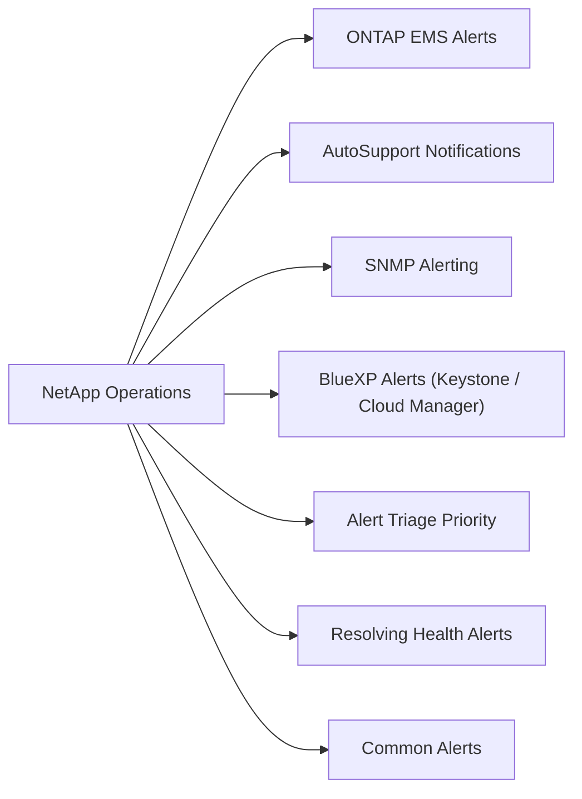

# NetApp Operations — Alerts



## ONTAP EMS Alerts

```bash
# Show active health alerts
system health alert show

# Show recent critical/error events
event log show -severity critical
event log show -severity error -time ">24h"

# Show subsystem health
system health subsystem show
```

## AutoSupport Notifications

AutoSupport triggers automatic case creation with NetApp support for critical events. Verify it is configured:

```bash
system node autosupport show -fields state,support,transport,mail-hosts
```

Expected: `state: enable`, `support: true`.

## SNMP Alerting

```bash
# Show SNMP communities and trap hosts
system snmp show
system snmp traphost show
```

Verify trap destinations are configured to route to your monitoring platform (SCOM, Zabbix, etc.).

## BlueXP Alerts (Keystone / Cloud Manager)

For Keystone subscriptions and Cloud Volumes ONTAP, alerts are surfaced in:
- **BlueXP → Notifications** — capacity, health, and service alerts
- **BlueXP → Digital Wallet** — burst capacity warnings

## Alert Triage Priority

| Severity | Example | Action |
|---|---|---|
| Emergency | Aggregate offline | Immediate — page on-call |
| Alert | Disk failed, HA link down | Same business day |
| Error | LIF down, volume near full | Investigate within 24h |
| Warning | Efficiency below threshold | Review at next available |

## Resolving Health Alerts

```bash
# View active alerts with detail
system health alert show

# Acknowledge an alert (after resolution)
system health alert modify -node <node> -alert-id <id> -acknowledge true

# Clear alert after fixing underlying issue
system health alert delete -node <node> -alert-id <id>
```

## Common Alerts

| Alert | Cause | Resolution |
|---|---|---|
| Volume full | Data growth | Resize or enable autosize |
| Disk failed | Hardware failure | Replace disk, verify RAID rebuild |
| HA interconnect down | Cable/port failure | Investigate HA link |
| AutoSupport failure | Proxy or network | Verify outbound connectivity |
