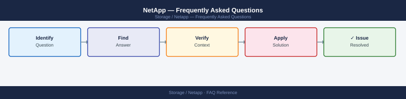

---
tags:
  - netapp
  - faq
  - operations
---
# NetApp — Frequently Asked Questions

Common questions about NetApp operations, configuration, and troubleshooting. For step-by-step procedures, see the <a href="index.md">Operations</a> section.

## General

**Q: How do I determine which NetApp products are deployed and their versions?**
A: Use BlueXP (console.bluexp.netapp.com) → Inventory for a unified view. For ONTAP: `version` CLI. For StorageGRID: Grid Manager → Nodes → Software Version. For E-Series: SANtricity System Manager → About.

**Q: How do I check the current NetApp version?**
A: `BlueXP → Inventory → Software Versions`

## Configuration

**Q: What is the default AutoSupport configuration and when should it change?**
A: AutoSupport sends telemetry to NetApp and your support team. Default is HTTPS to NetApp. Enable email notifications for your team: `autosupport modify -mail-hosts <smtp> -to <team@company.com>`. Never disable AutoSupport in production.

**Q: How do I enable BlueXP data tiering to object storage?**
A: In BlueXP → Tiering, connect your ONTAP cluster. Select the volumes to tier. Choose S3, Azure Blob, or StorageGRID as the target. BlueXP automatically moves cold data (configurable cooldown period) to object storage.

## Operations

**Q: How do I plan a NetApp portfolio upgrade across multiple product generations?**
A: Upgrade ONTAP first (it provides the most compatibility guarantees). Then upgrade SnapCenter. Finally upgrade monitoring tools (InsightIQ, Active IQ). Review the NetApp Interoperability Matrix (IMT) before each upgrade.

**Q: What is the correct procedure to add a new NetApp system to BlueXP?**
A: BlueXP → Add Working Environment. Select NetApp ONTAP, E-Series, or StorageGRID. Provide management IP and credentials. BlueXP discovers the system and adds it to the dashboard within 5 minutes.

## Troubleshooting

**Q: BlueXP shows 'System at Risk' for a cluster. What does it mean?**
A: NetApp Active IQ has identified a risk (hardware vulnerability, software bug, configuration issue). Click through to see the specific risk and recommended action. Address Critical risks within 30 days; High within 90 days.

**Q: NetApp Active IQ shows a performance risk — where do I start?**
A: Review the specific recommendation in Active IQ. Common causes: volume move needed, aggregate rebalancing, protocol contention. Follow the recommended action in the Active IQ advisory. Contact NetApp Support if unclear.

## Backup and Recovery

**Q: How often should I audit NetApp configuration across the portfolio?**
A: Monthly review of Active IQ recommendations. Quarterly review of SnapMirror health and SnapCenter backup success rates. Annual review of licence compliance and support contract renewals.

**Q: Can I use NetApp BlueXP to initiate a disaster recovery failover?**
A: Yes — BlueXP DR (preview) supports policy-based DR failover for ONTAP. For production DR, use SnapCenter or manual SnapMirror break/resync procedures. Test DR failover quarterly in an isolated environment.

## See Also

- [NetApp Operations](index.md)
- [NetApp Troubleshooting](../../troubleshooting/index.md)
