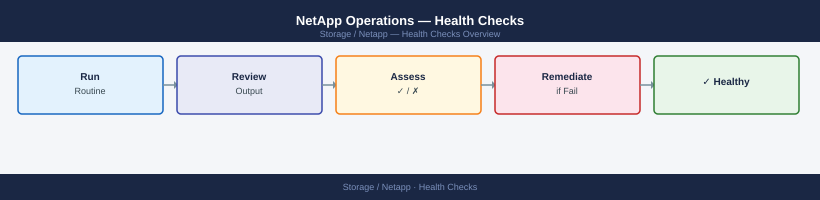

---
tags:
  - netapp
  - operations
---
# NetApp Operations — Health Checks

<div class="kb-summary">
Health Checks reference covering Daily Health Check Workflow, AutoSupport Validation, Pre-Change Checklist, Health Summary Table.

*Applies to: ONTAP 9.x*
</div>



## Before you begin

- **Access:** Storage admin credentials (cluster admin or equivalent)
- **Timing:** safe to run during business hours unless a step is marked ⚠ (causes interruption)
- **Dependencies:** no active upgrades or migrations on the same infrastructure
- **Logging:** capture command output — paste into the change record on completion

---

## Run This Routine

1. **Active IQ alerts** — log in to NetApp Active IQ → check open risk items by severity
2. **Cluster count and version** — run `cluster show` across all managed clusters
3. **Support case status** — NetApp Support → My Cases — review all open P1/P2 cases
4. **Capacity at risk** — Active IQ → Capacity → flag any clusters above 80% used
5. **Software version compliance** — verify no cluster is running an End-of-Support software version
6. **License compliance** — run `license show` on each cluster — verify all required licences are active

## Daily Health Check Workflow

```bash
# 1. Overall cluster health
cluster show
system health status show

# 2. HA pair status
storage failover show

# 3. Disk health
storage disk show -broken

# 4. Aggregate health
storage aggregate show -state !online
storage aggregate show -fields percent-used | awk '$2 > 80'

# 5. Volume health
volume show -state !online
volume show -fields percent-used | awk '$2 > 85'

# 6. Interface health
network interface show -status-oper down

# 7. EMS critical events (last 24 hours)
event log show -severity critical -time ">24h"
event log show -severity error -time ">24h"

# 8. SnapMirror health
snapmirror show -health false
```

## AutoSupport Validation

```bash
system node autosupport show -fields state,last-successful-destination
```

Confirm last successful delivery is recent (within 24 hours for daily AutoSupport).

## Pre-Change Checklist

- [ ] Cluster health: `system health status show` → ok
- [ ] HA connected: `storage failover show` → Connected
- [ ] No broken disks: `storage disk show -broken` → no output
- [ ] All aggregates online: `storage aggregate show -state !online` → no output
- [ ] All volumes online: `volume show -state !online` → no output
- [ ] No down LIFs: `network interface show -status-oper down` → no output
- [ ] No critical EMS events in 24h
- [ ] SnapMirror relationships healthy

## Health Summary Table

| Check | Command | Expected |
|---|---|---|
| Cluster nodes | `cluster show` | health: true |
| HA pair | `storage failover show` | Connected |
| Disks | `storage disk show -broken` | No output |
| Aggregates | `storage aggregate show -state !online` | No output |
| Capacity | `storage aggregate show` | < 80% |
| Volumes | `volume show -state !online` | No output |
| LIFs | `network interface show -status-oper down` | No output |
| EMS | `event log show -severity critical` | No output |
| SnapMirror | `snapmirror show -health false` | No output |

---

## Verify

- Confirm the operation completed without errors in the log or management UI
- Verify the expected state change is visible (service running, object created, config applied)
- Document the outcome in the change record

## See also

- [NetApp — Alerts](../alerts/)
- [NetApp — Support Cases](../support-cases/)
- [NetApp — Overview](../../)
