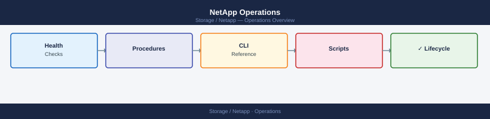

---
tags:
  - netapp
  - operations
---
# NetApp Operations

Use this section for practical notes, checks, commands, troubleshooting, design references, and change validation.

*Applies to: ONTAP 9.x*

<a class="kb-card" href="alerts/">
  <strong>Alerts</strong>
  Notes, checks, runbooks, commands, troubleshooting, and operational references for Alerts.
</a>

<a class="kb-card" href="health-checks/">
  <strong>Health Checks</strong>
  Notes, checks, runbooks, commands, troubleshooting, and operational references for Health Checks.
</a>

<a class="kb-card" href="support-cases/">
  <strong>Support Cases</strong>
  Notes, checks, runbooks, commands, troubleshooting, and operational references for Support Cases.
</a>

