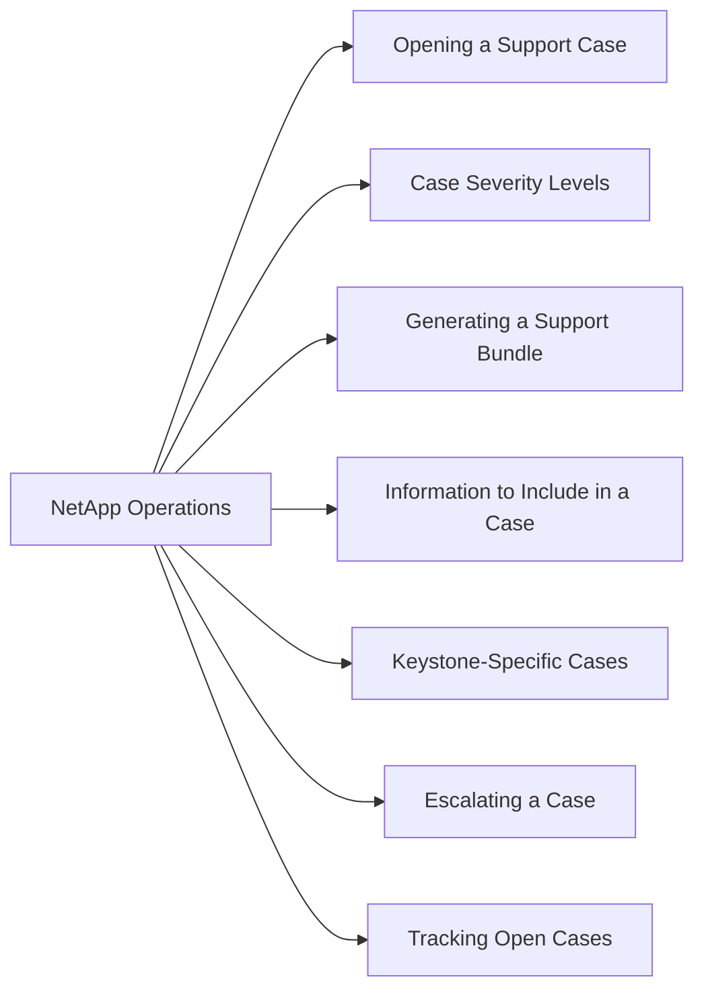

# NetApp Operations — Support Cases



## Opening a Support Case

**Via NetApp Support Portal (mysupport.netapp.com):**
1. Log in and navigate to **My AutoSupport → Cases → Create Case**
2. Select the affected system (by serial number or site)
3. Provide a detailed description, symptom timeline, and impact
4. Attach relevant logs or AutoSupport bundles
5. Select severity and submit

**Via Phone:**
NetApp provides 24/7 phone support for P1 and P2 cases.

## Case Severity Levels

| Severity | Definition | Target Response |
|---|---|---|
| P1 — Critical | Production system down, data loss risk | 15–30 minutes (24/7) |
| P2 — High | Degraded operation, redundancy lost | 1–2 hours (24/7) |
| P3 — Medium | Non-critical issue, workaround available | 4 business hours |
| P4 — Low | Question, guidance, feature request | Next business day |

## Generating a Support Bundle

Before opening a case, collect an AutoSupport:

```bash
# Generate a manual AutoSupport (sends to NetApp automatically)
system node autosupport invoke -node * -type all -message "Opening case for <issue>"

# Confirm AutoSupport delivery
system node autosupport history show | head -20
```

## Information to Include in a Case

- Array serial number and system name
- ONTAP version (`system node image show`)
- Symptom description with timestamps
- Affected volumes, SVMs, or nodes
- Recent changes (upgrades, configuration, cabling)
- Output of:
  - `cluster show`
  - `system health status show`
  - `event log show -severity error -time ">24h"`
  - `storage failover show`

## Keystone-Specific Cases

For Keystone subscription issues, engage via:
- NetApp Support Portal — select subscription
- Keystone Success Manager — for billing and capacity disputes
- BlueXP → Support → Create Case — for BlueXP-managed services

## Escalating a Case

If a case is not progressing:
1. Request escalation directly within the case
2. Contact your NetApp TAM (Technical Account Manager)
3. For P1: call NetApp support directly — do not rely on email

## Tracking Open Cases

All open and closed cases are visible at **mysupport.netapp.com → Cases**.

AutoSupport also generates case numbers automatically when critical EMS events are triggered — check **My AutoSupport → Cases** for system-initiated cases.
