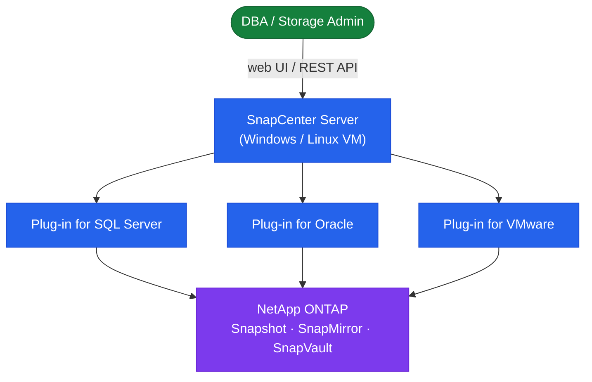

---
tags:
  - architecture
  - netapp
---
# SnapCenter — How It Works


<div class="kb-summary">
How It Works reference covering Overview, Topology, HA Options, Components, Connectivity and 2 more sections.

*Applies to: SnapCenter 5.x*
</div>
```text
┌────────────────────────────────── NetApp SnapCenter — How It Works ───────────────────────────────────┐
│                                                                                                       │
│   ┌───────────────────────────────────────────────────────────────────────────────────────────────┐   │
│   │    SnapCenter operational flow: request → controller → data service → host acknowledgement    │   │
│   │         Data path: host I/O → SnapCenter controller → storage media → persistent write        │   │
│   │  Management: SnapCenter GUI / REST API provides unified control for all operational functions │   │
│   │           Protection: snapshots, replication, and redundancy ensure data durability           │   │
│   └───────────────────────────────────────────────────────────────────────────────────────────────┘   │
│                                                                                                       │
│    Host I/O → SnapCenter controller → storage media → acknowledge → replicate                         │
│                                                                                                       │
│                  ▼                                ▼                                ▼                  │
│                                                                                                       │
│   ┌─────────────────────────────┐  ┌─────────────────────────────┐  ┌─────────────────────────────┐   │
│   │            Layer            │  │          Component          │  │            Notes            │   │
│   │            Server           │  │          Windows VM         │  │       Central control       │   │
│   │           Plug-in           │  │          Host agent         │  │        App-consistent       │   │
│   │            Policy           │  │       Schedule/retain       │  │         Backup rule         │   │
│   │        Resource group       │  │       Grouped targets       │  │        Shared policy        │   │
│   │           Recovery          │  │       Volume/LUN/file       │  │       Granular restore      │   │
│   └─────────────────────────────┘  └─────────────────────────────┘  └─────────────────────────────┘   │
│                                                                                                       │
│                          ▼                                                 ▼                          │
│                                                                                                       │
│   ┌───────────────────────────────────────────────────────────────────────────────────────────────┐   │
│   │    Component     │     Purpose      │      Protocol     │       Auth       │      Notes       │   │
│   │   SQL plug-in    │  MSSQL backups   │       HTTPS       │   Windows auth   │  App-consistent  │   │
│   │  Oracle plug-in  │  Oracle backups  │       HTTPS       │       SSH        │ RMAN integratio  │   │
│   │  VMware plug-in  │  VM/VMDK backup  │   HTTPS/vCenter   │   vCenter SSO    │   vSphere API    │   │
│   │ SAP HANA plug-in │   HANA backups   │       HTTPS       │     SAP auth     │   Backint API    │   │
│   └───────────────────────────────────────────────────────────────────────────────────────────────┘   │
│                                                                                                       │
│    Physical: SnapCenter Server (Windows) · ONTAP clusters · plug-in hosts · application servers       │
│                                                                                                       │
│    Key terms:                                                                                         │
│                                                                                                       │
│    SnapCenter         = NetApp backup orchestration; coordinates app-consistent snapshots via plug-ins│
│    Plug-in            = host-side agent; quiesces application before snapshot: SQL, Oracle, VMware    │
│    Resource group     = set of resources sharing a backup policy and schedule in SnapCenter           │
│    Policy             = SnapCenter object defining snapshot frequency, retention, and replication t...│
│    App-consistent     = snapshot taken after DB quiesce; guarantees crash-consistent recovery         │
│    Clone lifecycle    = SnapCenter clone: create from snapshot, provision to host, then delete        │
│    FlexClone          = underlying ONTAP technology; SnapCenter clone maps to an ONTAP FlexClone      │
│    Vault policy       = SnapCenter policy that also replicates snapshots to SnapVault destination     │
│    Mirror policy      = SnapCenter policy that replicates snapshots via SnapMirror to DR cluster      │
│    RBAC               = SnapCenter role-based access; Admin, Backup Operator, Restore Operator roles  │
│    SMF                = SnapCenter MySQL database storing job history, policies, and resource configs │
│    SnapCenter API     = REST API on port 8143; full feature coverage for automation workflows         │
│                                                                                                       │
└───────────────────────────────────────────────────────────────────────────────────────────────────────┘
```


## Overview

SnapCenter is a Windows-based centralized data protection platform that orchestrates application-consistent ONTAP snapshots across a fleet of hosts and applications. It communicates with ONTAP storage systems via the ONTAP REST API or ZAPI, with application hosts via the SnapCenter Agent (TCP 8145), and exposes a web GUI on port 8146 and a REST API for automation. The architecture separates the control plane (SnapCenter Server), the data plane (ONTAP snapshots), and the agent layer (plugins on protected hosts).

## Topology



## HA Options

SnapCenter Server is not natively HA. Recommended approaches:

- **Windows Server Failover Cluster (WSFC)** — host the SnapCenter application on a WSFC for automatic failover
- **VM-based resilience** — run SnapCenter as a VM protected by VMware HA; RTO is VM restart time (~5 minutes)
- **MySQL HA** — run the repository on a highly available MySQL cluster to prevent data loss
- **SnapCenter Server backup** — use the built-in backup feature to snapshot the repository and application config daily; store on secondary ONTAP

## Components

| Component | Description |
|---|---|
| SnapCenter Server | Windows Server hosting the web application, scheduler, and REST API; accessible at `https://<server>:8146` |
| Repository Database | MySQL database storing all job history, policies, resource groups, and RBAC configuration |
| SnapCenter Agent | Lightweight Windows or Linux service (port 8145) on each protected host; runs pre/post quiesce scripts |
| Plug-in for Windows | VSS-based backup for SQL Server, Exchange, and Windows filesystems |
| Plug-in for UNIX | Agent extension for Linux/AIX; supports Oracle, SAP HANA, and UNIX filesystems |
| Plug-in for VMware vSphere | Separate OVA appliance registered with vCenter; VM-level and datastore-level backup without in-guest agents |
| ONTAP Storage Systems | Registered as storage connections; SnapCenter manages snapshots, SnapMirror updates, and SnapVault transfers via ONTAP APIs |
| SMTP / Email Relay | Optional; SnapCenter sends job notifications via SMTP |

## Connectivity

| Connection | Protocol / Port | Direction |
|---|---|---|
| Admin browser to SnapCenter GUI | HTTPS/8146 | Client → Server |
| SnapCenter Server to ONTAP | HTTPS/443 (REST) or ZAPI | Server → ONTAP cluster-mgmt LIF |
| SnapCenter Server to Agent | TCP/8145 | Server → Host agent |
| SnapCenter Agent to Server | TCP/8145 | Host → Server (callback) |
| SnapCenter to MySQL repository | TCP/3306 | Local (or network if remote DB) |
| SnapCenter to SMTP relay | TCP/25 or 587 | Server → Mail relay |
| Plug-in for VMware to vCenter | HTTPS/443 | Plugin OVA → vCenter |

## Sizing Guidelines

- **SnapCenter Server**: Minimum 4 vCPU / 8 GB RAM for up to 50 hosts; scale to 8 vCPU / 16 GB for 50–200 hosts; dedicated Windows Server 2019 or 2022
- **Repository database**: Allow ~500 MB per 1,000 backup jobs retained; 20 GB minimum partition
- **Concurrent jobs**: Default maximum is 5; increase to 10–20 in global settings for large environments
- **Plugin hosts per server**: Supports up to ~300–400 active hosts; beyond that, evaluate a secondary SnapCenter instance

## Plugins

| Plugin | Use Case |
|---|---|
| Plug-in for Windows | Windows filesystems, SQL Server |
| Plug-in for SQL Server | SQL Server databases (VSS-based) |
| Plug-in for Oracle | Oracle DB on Linux/Windows |
| Plug-in for SAP HANA | SAP HANA databases |
| Plug-in for VMware vSphere | VMware VMs and datastores |
| Plug-in for UNIX | Linux filesystems |

```bash
# Windows — restart plugin service
Restart-Service -Name "SnapCenter Plug-in for Windows"

# Linux — restart plugin service
/opt/NetApp/snapcenter/scc/bin/scc restart
```
