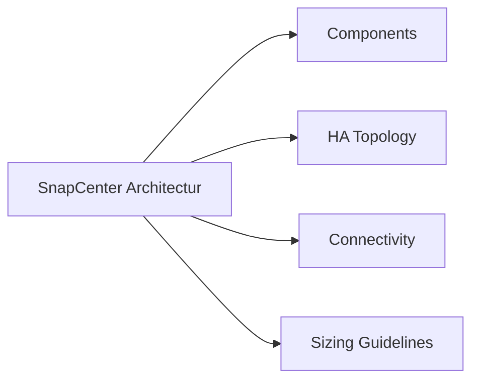

# SnapCenter Architecture



## Overview

SnapCenter is a Windows-based centralized data protection platform that orchestrates application-consistent ONTAP snapshots across a fleet of hosts and applications. It communicates with ONTAP storage systems via the ONTAP REST API or ZAPI, with application hosts via the SnapCenter Agent (TCP 8145), and exposes a web GUI on port 8146 and a REST API for automation. The architecture separates the control plane (SnapCenter Server), the data plane (ONTAP snapshots), and the agent layer (plugins on protected hosts).

## Components

| Component | Description |
|---|---|
| SnapCenter Server | Windows Server hosting the SnapCenter web application, scheduler, and REST API; accessible at `https://<server>:8146` |
| Repository Database | MySQL database installed on the SnapCenter Server host (or a separate MySQL server); stores all job history, policies, resource groups, and RBAC configuration |
| SnapCenter Agent | Lightweight Windows or Linux service (port 8145) installed on each protected host; communicates with the SnapCenter Server and runs pre/post quiesce scripts |
| SnapCenter Plug-in for Windows | Agent extension for Windows filesystem and VSS-based application backup; supports SQL Server, Exchange, and Windows filesystems |
| SnapCenter Plug-in for UNIX | Agent extension for Linux/AIX; supports Oracle, SAP HANA, and UNIX filesystems |
| SnapCenter Plug-in for VMware vSphere | Separate OVA appliance registered with vCenter; provides VM-level and datastore-level backup without an agent inside VMs |
| ONTAP Storage Systems | Registered as storage connections in SnapCenter; SnapCenter creates and manages ONTAP snapshots, SnapMirror updates, and SnapVault transfers via ONTAP APIs |
| SMTP / Email Relay | Optional; SnapCenter sends job success/failure notifications via SMTP |

## HA Topology

SnapCenter Server itself is not natively HA in the open way a cluster is. Recommended approaches:

- **SQL Server FCI or Always On for repository**: Run the MySQL repository on a highly available MySQL cluster to prevent data loss
- **Windows Failover Cluster**: Host the SnapCenter Server application on a Windows Server Failover Cluster (WSFC) for automatic failover of the application server
- **VM-based resilience**: Run SnapCenter Server as a VM protected by VMware HA; RPO is the last SnapCenter Server backup; RTO is VM restart time (~5 minutes)
- **SnapCenter Server backup**: Use the built-in `SnapCenter Server backup` feature to snapshot the repository and application configuration daily; store on secondary ONTAP

```
  ┌────────────────────────────────────┐
  │        SnapCenter Server           │
  │  (Windows Server / IIS + MySQL)    │
  │         Port 8146 (GUI/API)        │
  └──────┬───────────────┬─────────────┘
         │               │
   ONTAP API        TCP 8145
   (REST/ZAPI)      (Agent)
         │               │
  ┌──────▼──────┐  ┌─────▼─────────────┐
  │ ONTAP       │  │ Protected Hosts   │
  │ Cluster(s)  │  │ (Win/Linux/VMware)│
  └─────────────┘  └───────────────────┘
```

## Connectivity

| Connection | Protocol / Port | Direction |
|---|---|---|
| Admin browser to SnapCenter GUI | HTTPS/8146 | Client → Server |
| SnapCenter Server to ONTAP | HTTPS/443 (REST) or ZAPI | Server → ONTAP cluster-mgmt LIF |
| SnapCenter Server to Agent | TCP/8145 | Server → Host agent |
| SnapCenter Agent to Server | TCP/8145 | Host → Server (callback) |
| SnapCenter to MySQL repository | TCP/3306 | Local (or network if remote DB) |
| SnapCenter to SMTP relay | TCP/25 or 587 | Server → Mail relay |
| SnapCenter Plug-in for VMware to vCenter | HTTPS/443 | Plugin OVA → vCenter |

## Sizing Guidelines

- **SnapCenter Server**: Minimum 4 vCPU, 8 GB RAM for up to 50 hosts; scale to 8 vCPU / 16 GB for 50–200 hosts; dedicated Windows Server (2019 or 2022)
- **Repository database**: MySQL data directory sizing — allow ~500 MB per 1,000 backup jobs retained; 20 GB minimum partition
- **Concurrent jobs**: Default maximum concurrent jobs is 5; increase to 10–20 in SnapCenter global settings for large environments, limited by ONTAP API throughput
- **Plugin hosts per server**: A single SnapCenter Server supports up to several hundred registered hosts; beyond 300–400 active hosts, evaluate a secondary SnapCenter instance for scale-out
- **SnapCenter Plug-in for VMware**: Deploy one OVA per vCenter; supports thousands of VMs; requires access to vCenter API and ONTAP APIs for all datastores
