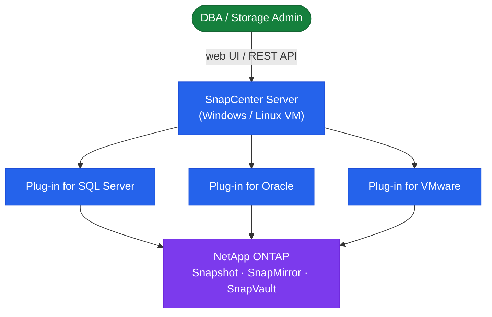

# SnapCenter — Architecture

<div class="kb-summary">
SnapCenter architecture reference — topology, HA options, components, connectivity ports, plugin model, and sizing guidelines.
</div>
```
┌────────────────────────────────── NetApp SnapCenter — Architecture ───────────────────────────────────┐
│                                                                                                       │
│   ┌───────────────────────────────────────────────────────────────────────────────────────────────┐   │
│   │ SnapCenter architecture overview: centralised backup and recovery orchestration for NetApp st │   │
│   │                           Protocols: HTTPS · iSCSI · FC · NFS · SMB                           │   │
│   │            Key components: SnapCenter Server, DB plug-ins, VMware plug-in, Policies           │   │
│   │          Design principles: HA, scalability, non-disruptive operations, and security          │   │
│   └───────────────────────────────────────────────────────────────────────────────────────────────┘   │
│                                                                                                       │
│    Design → deploy → configure → validate → monitor → optimise                                        │
│                                                                                                       │
│                  ▼                                ▼                                ▼                  │
│                                                                                                       │
│   ┌─────────────────────────────┐  ┌─────────────────────────────┐  ┌─────────────────────────────┐   │
│   │            Layer            │  │          Component          │  │            Notes            │   │
│   │            Server           │  │          Windows VM         │  │       Central control       │   │
│   │           Plug-in           │  │          Host agent         │  │        App-consistent       │   │
│   │            Policy           │  │       Schedule/retain       │  │         Backup rule         │   │
│   │        Resource group       │  │       Grouped targets       │  │        Shared policy        │   │
│   │           Recovery          │  │       Volume/LUN/file       │  │       Granular restore      │   │
│   └─────────────────────────────┘  └─────────────────────────────┘  └─────────────────────────────┘   │
│                                                                                                       │
│                          ▼                                                 ▼                          │
│                                                                                                       │
│   ┌───────────────────────────────────────────────────────────────────────────────────────────────┐   │
│   │    Component     │     Purpose      │      Protocol     │       Auth       │      Notes       │   │
│   │   SQL plug-in    │  MSSQL backups   │       HTTPS       │   Windows auth   │  App-consistent  │   │
│   │  Oracle plug-in  │  Oracle backups  │       HTTPS       │       SSH        │ RMAN integratio  │   │
│   │  VMware plug-in  │  VM/VMDK backup  │   HTTPS/vCenter   │   vCenter SSO    │   vSphere API    │   │
│   │ SAP HANA plug-in │   HANA backups   │       HTTPS       │     SAP auth     │   Backint API    │   │
│   └───────────────────────────────────────────────────────────────────────────────────────────────┘   │
│                                                                                                       │
│    Physical: SnapCenter Server (Windows) · ONTAP clusters · plug-in hosts · application servers       │
│                                                                                                       │
│    Key terms:                                                                                         │
│                                                                                                       │
│    SnapCenter         = NetApp backup orchestration; coordinates app-consistent snapshots via plug-ins│
│    Plug-in            = host-side agent; quiesces application before snapshot: SQL, Oracle, VMware    │
│    Resource group     = set of resources sharing a backup policy and schedule in SnapCenter           │
│    Policy             = SnapCenter object defining snapshot frequency, retention, and replication t...│
│    App-consistent     = snapshot taken after DB quiesce; guarantees crash-consistent recovery         │
│    Clone lifecycle    = SnapCenter clone: create from snapshot, provision to host, then delete        │
│    FlexClone          = underlying ONTAP technology; SnapCenter clone maps to an ONTAP FlexClone      │
│    Vault policy       = SnapCenter policy that also replicates snapshots to SnapVault destination     │
│    Mirror policy      = SnapCenter policy that replicates snapshots via SnapMirror to DR cluster      │
│    RBAC               = SnapCenter role-based access; Admin, Backup Operator, Restore Operator roles  │
│    SMF                = SnapCenter MySQL database storing job history, policies, and resource configs │
│    SnapCenter API     = REST API on port 8143; full feature coverage for automation workflows         │
│                                                                                                       │
└───────────────────────────────────────────────────────────────────────────────────────────────────────┘
```


<div class="kb-grid kb-grid-3">
<a class="kb-card" href="how-it-works/"><strong>How It Works</strong><span>Topology, HA options, components, connectivity ports, plugins, and sizing guidelines.</span></a>
<a class="kb-card" href="integrations/"><strong>Integrations</strong><span>Integration with ONTAP, VMware, Active Directory, and external systems.</span></a>
<a class="kb-card" href="design-standards/"><strong>Design Standards</strong><span>Naming conventions, build baseline, and configuration checklist.</span></a>
</div>

| Component | Platform | Notes |
|---|---|---|
| SnapCenter Server | Windows Server 2019/2022 VM | Web GUI (8146), REST API, scheduler; 4 vCPU/8GB min |
| Repository Database | MySQL (local or HA cluster) | Stores job history, policies, resource groups, RBAC |
| SnapCenter Agent | Windows or Linux service | Port 8145; installed on each protected host |
| Plug-in for VMware | OVA appliance (per vCenter) | VM and datastore backup without in-guest agents |


