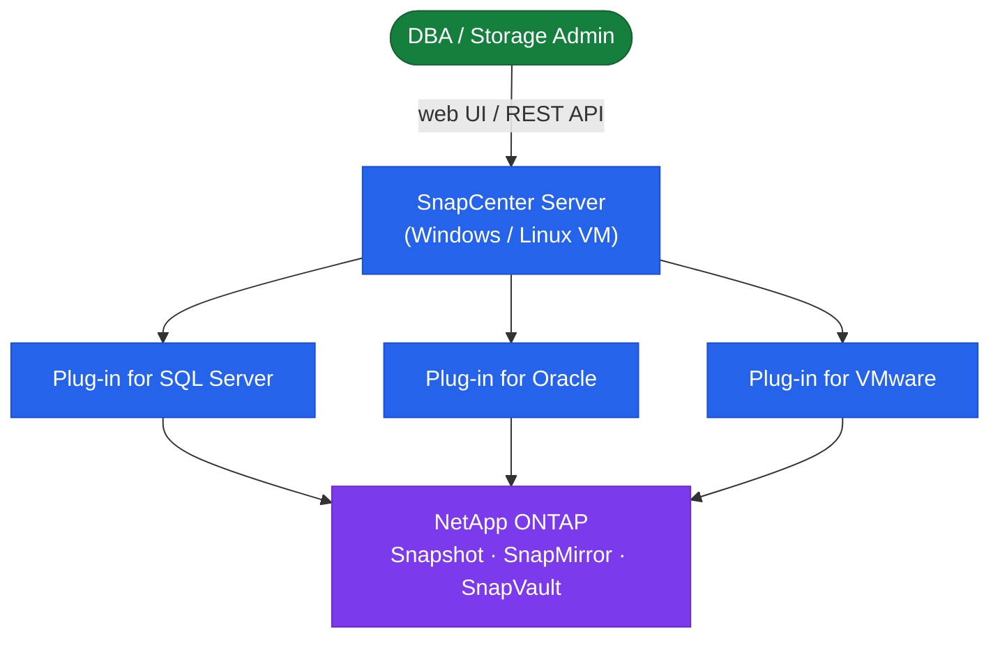

# SnapCenter — Overview

> Part of the [SnapCenter Architecture](../) reference.

---

## Overview

SnapCenter is a Windows-based centralized data protection platform that orchestrates application-consistent ONTAP snapshots across a fleet of hosts and applications. It communicates with ONTAP storage systems via the ONTAP REST API or ZAPI, with application hosts via the SnapCenter Agent (TCP 8145), and exposes a web GUI on port 8146 and a REST API for automation. The architecture separates the control plane (SnapCenter Server), the data plane (ONTAP snapshots), and the agent layer (plugins on protected hosts).

## HA Topology

SnapCenter Server itself is not natively HA in the open way a cluster is. Recommended approaches:

- **SQL Server FCI or Always On for repository**: Run the MySQL repository on a highly available MySQL cluster to prevent data loss
- **Windows Failover Cluster**: Host the SnapCenter Server application on a Windows Server Failover Cluster (WSFC) for automatic failover of the application server
- **VM-based resilience**: Run SnapCenter Server as a VM protected by VMware HA; RPO is the last SnapCenter Server backup; RTO is VM restart time (~5 minutes)
- **SnapCenter Server backup**: Use the built-in `SnapCenter Server backup` feature to snapshot the repository and application configuration daily; store on secondary ONTAP

## Connectivity

| Connection | Protocol / Port | Direction |
|---|---|---|
| Admin browser to SnapCenter GUI | HTTPS/8146 | Client → Server |
| SnapCenter Server to ONTAP | HTTPS/443 (REST) or ZAPI | Server → ONTAP cluster-mgmt LIF |
| SnapCenter Server to Agent | TCP/8145 | Server → Host agent |
| SnapCenter Agent to Server | TCP/8145 | Host → Server (callback) |
| SnapCenter to MySQL repository | TCP/3306 | Local (or network if remote DB) |
| SnapCenter to SMTP relay | TCP/25 or 587 | Server → Mail relay |
| SnapCenter Plug-in for VMware to vCenter | HTTPS/443 | Plugin OVA → vCenter |
