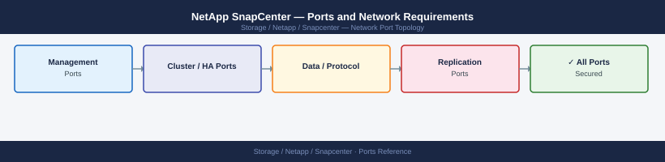

---
tags:
  - snapcenter
  - netapp
  - networking
  - firewall
  - ports
  - backup
---
# NetApp SnapCenter — Ports and Network Requirements

<div class="kb-summary">
Firewall port reference for NetApp SnapCenter. SnapCenter provides application-aware backup and recovery using NetApp Snapshot copies. Covers the SnapCenter Server, plugin hosts, and storage system connections.

*Applies to: SnapCenter 5.x*
</div>


## Inbound — Admin to SnapCenter Server

| Port | Protocol | Source | Purpose |
|---|---|---|---|
| 8146 | TCP | Admin browsers | SnapCenter web UI (HTTPS) |
| 8145 | TCP | SnapCenter plugins | SnapCenter Server → plugin host communication |
| 22 | TCP | Jump hosts | SSH — SnapCenter Server OS access (Linux-based SnapCenter) |

## SnapCenter Server to Plugin Hosts

SnapCenter pushes plugins to managed hosts and coordinates backup jobs.

| Port | Protocol | Source | Destination | Purpose |
|---|---|---|---|---|
| 8145 | TCP | SnapCenter Server | Windows plugin hosts | SnapCenter SMCore service on Windows |
| 22 | TCP | SnapCenter Server | Linux plugin hosts | SSH — Linux plugin management and deployment |
| 5985/5986 | TCP | SnapCenter Server | Windows plugin hosts | WinRM — Windows host management |

## SnapCenter / Plugin Hosts to NetApp Storage

| Port | Protocol | Source | Destination | Purpose |
|---|---|---|---|---|
| 443 | TCP | SnapCenter Server | ONTAP cluster management LIF | ONTAP REST API — Snapshot operations, cloning, SVM management |
| 443 | TCP | SnapCenter Server | SVM management LIF | SVM-scoped REST API for NAS/SAN operations |
| 2049 | TCP | Plugin hosts | ONTAP NFS data LIF | NFS mount for backup data path |
| 3260 | TCP | Plugin hosts | ONTAP iSCSI data LIF | iSCSI LUN access for backup data path |

## Plugin Host to SnapCenter Server (Result Reporting)

| Port | Protocol | Source | Destination | Purpose |
|---|---|---|---|---|
| 8145 | TCP | Windows plugin hosts | SnapCenter Server | Plugin → Server result and status reporting |

## Firewall Zone Summary

| From | To | Ports | Notes |
|---|---|---|---|
| Admin browsers | SnapCenter Server | 8146 | Web UI |
| SnapCenter Server | Windows hosts | 8145, 5986 | Plugin management |
| SnapCenter Server | Linux hosts | 22 | Linux plugin |
| SnapCenter Server | ONTAP mgmt LIF | 443 | Snapshot coordination |
| Plugin hosts | ONTAP data LIFs | 2049, 3260 | Data path for backup |

## Verify

```bash
# From admin workstation — test SnapCenter web UI
curl -sk -o /dev/null -w "%{http_code}" https://<snapcenter-server>:8146/

# From SnapCenter Server — test ONTAP API
curl -sk -o /dev/null -w "%{http_code}" https://<ontap-mgmt-lif>/api/cluster

# From plugin host — test SnapCenter Server
nc -zv <snapcenter-server> 8145

# From plugin host (Windows) — test NFS to ONTAP
showmount -e <ontap-nfs-lif>
```


```text title="Expected output"
200
200
Connection to snapcenter-prod.corp.local 8145 port [tcp/*] succeeded!
Export list for 192.168.42.50:
/vol/backup_nfs           192.168.40.0/24
/vol/snapcenter_logs      192.168.40.0/24
/vol/plugin_staging       192.168.40.0/24
```

!!! warning "Common errors"
    **`curl: (60) SSL certificate problem: self signed certificate`** — Add `-k` flag to skip certificate verification (already present in example, but ensure it's not removed).
    **`Connection refused`** — Verify SnapCenter Server is running with `systemctl status snapcenter` and firewall rules allow port 8145 from plugin host.
    **`showmount: clnt_create: RPC: Program not registered`** — Confirm NFS service is enabled on ONTAP LIF and the LIF is reachable; check `network interface show -vserver <svm>` for correct NFS LIF IP.
## See also

- [NetApp SnapCenter — Architecture](../how-it-works/)
- [NetApp ONTAP — Ports](../../ontap/architecture/ports.md)
- [NetApp SnapMirror — Ports](../../snapmirror/architecture/ports.md)
