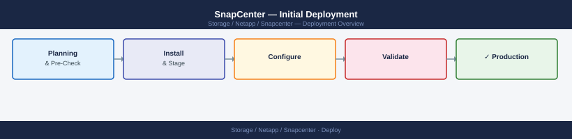
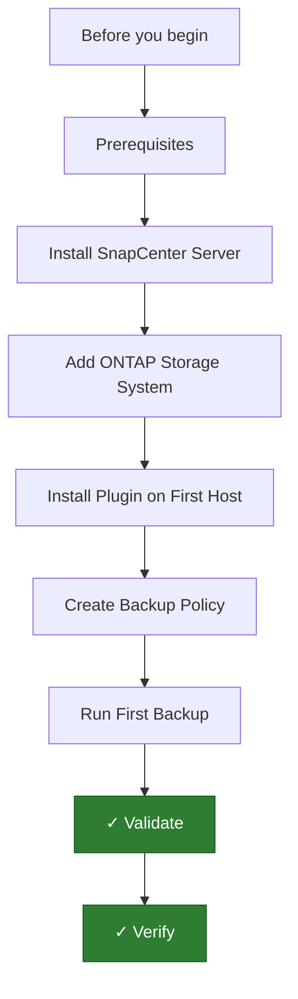

---
tags:
  - deployment
  - netapp
search:
  boost: 1.5
---

## Before you begin

- **Access:** admin credentials for the target system and any upstream dependencies (DNS, NTP, vCenter, directory services)
- **Timing:** safe to run during a scheduled maintenance window; allow 1-2 hours for initial deployment
- **Dependencies:** network connectivity verified; DNS resolvable; NTP configured; any licence keys available
- **Logging:** record every IP address, hostname, and credential set assigned during this deployment

---

# SnapCenter — Initial Deployment



This guide covers deploying NetApp SnapCenter Server from prerequisites through running and validating a first backup. SnapCenter centralizes application-consistent backup and restore for SQL Server, Oracle, SAP HANA, VMware VMs, and file systems backed by ONTAP.

---




## Prerequisites

**Windows Server requirements:**

- Windows Server 2019 or 2022 (Desktop Experience — not Server Core)
- Minimum 4 vCPU, 16 GB RAM, 150 GB disk for the SnapCenter Server VM
- Static IP address and FQDN resolvable from all hosts to be protected
- Domain-joined (required for Kerberos-based Windows host plugin communication)
- .NET Framework 4.8 or later installed

**SQL Server requirements:**

- SQL Server 2016, 2019, or 2022 (Express is sufficient for SnapCenter's internal repository — do not use a shared production instance)
- SQL Server installed locally on the SnapCenter Server before SnapCenter installation
- Named instance or default instance — record the instance name for the installer

**Network:**

- TCP 8146: HTTPS access from browsers and SnapCenter hosts to SnapCenter Server
- TCP 8043: SnapCenter agent communication
- TCP 9090: SnapCenter SMCore service
- ONTAP SVM management ports (443) reachable from SnapCenter Server
- All protected hosts reachable from SnapCenter Server (FQDN resolution required)

**ONTAP:**

- An ONTAP SVM management LIF IP and credentials (at minimum `vsadmin` role)
- Snapshots and SnapMirror licenses active on the ONTAP cluster

---

## Install SnapCenter Server

1. Download the SnapCenter Server installer (`.exe`) from the NetApp Support site. Match the version to your ONTAP version using the NetApp Interoperability Matrix Tool (IMT).
2. Copy the installer to the Windows Server VM and run it as a local Administrator.
3. The installer wizard starts. Accept the license agreement.
4. **Installation directory:** Keep the default (`C:\Program Files\NetApp\SnapCenter\`) unless a non-OS disk is preferred for performance.
5. **SQL Server instance:** Select the local SQL instance that will host the SnapCenter repository database.
6. **Web site port:** Default is 8146. Change only if a conflict exists.
7. **Service account:** Create a dedicated domain service account (e.g., `CORP\svc_snapcenter`) with local administrator rights on the SnapCenter Server. Enter its credentials in the installer.
8. Click **Install**. The installer deploys the SnapCenter Server, SMCore, MySQL, and the web server. This takes 10–15 minutes.
9. Once complete, open the SnapCenter UI at `https://<snapcenter_fqdn>:8146` in a browser.
10. Log in with the domain account used during installation.

---

## Add ONTAP Storage System

SnapCenter must know about the ONTAP SVM (or cluster) to create snapshots and manage SnapMirror.

1. In SnapCenter, navigate to **Storage Systems** in the left pane.
2. Click **New** (the + icon).
3. Fill in:
   - **Type:** ONTAP SVM (recommended; add at SVM level for least-privilege)
   - **Storage system name / IP:** Enter the SVM management LIF IP or FQDN
   - **Username / Password:** Enter the `vsadmin` credentials (or a custom ONTAP role with snapshot and SnapMirror privileges)
   - **Port:** 443 (default ONTAP management HTTPS)
4. Click **More Options** and set:
   - **Event Management System (EMS):** Enable if you want ONTAP EMS events forwarded to SnapCenter
   - **Preferred IP:** Set the IP SnapCenter uses to communicate with this SVM
5. Click **Submit**. SnapCenter tests connectivity and adds the SVM. A green checkmark confirms success.

Repeat for each SVM or cluster to be managed.

---

## Install Plugin on First Host

SnapCenter uses lightweight plugins installed on protected hosts for application-consistent backups. The most common is the SnapCenter Plug-in for Microsoft SQL Server.

**For SQL Server:**

1. In SnapCenter, navigate to **Hosts > Managed Hosts > Add**.
2. Fill in:
   - **Host type:** Windows
   - **Host name:** FQDN of the SQL Server host
   - **Credentials:** Domain admin account with local administrator rights on the SQL host
3. Select plugins to install:
   - Check **SnapCenter Plug-in for Microsoft SQL Server**
   - Check **SnapCenter Plug-in for Windows** (required as a base plugin)
4. Click **Submit**. SnapCenter pushes the SMCore agent and SQL plugin to the target host over WinRM or SMB.
5. Monitor the installation log. Green status confirms success.

**Verify plugin communication:**

```powershell
# On the SQL host — confirm SMCore service is running
Get-Service -Name SMCore
# Status should be Running
```

6. Back in SnapCenter, navigate to **Hosts > Managed Hosts** and confirm the SQL host shows **Running** status.

---

## Create Backup Policy

A backup policy defines the snapshot schedule, retention, and optional SnapMirror/SnapVault replication.

1. Navigate to **Settings > Policies > New**.
2. Name the policy (e.g., `sql_daily_7day`).
3. Select **SQL Server** as the policy type.
4. Configure:
   - **Backup type:** Full backup (includes log backup for point-in-time recovery)
   - **Schedule type:** Daily
   - **Retention:** Keep 7 snapshots
   - **Replicate snapshot after backup:** Enable if SnapMirror replication is configured on the SVM
   - **Log backup frequency:** Every 15 minutes (for low RPO SQL workloads)
   - **Log backup retention:** 24 hours
5. Click **Finish**. The policy is created and ready to attach to a resource group.

---

## Run First Backup

**Create a resource group and attach the policy:**

1. Navigate to **Resources > Resource Groups > New**.
2. Name the resource group (e.g., `RG_SQL_Prod`).
3. Add resources: select the SQL Server instance and the databases to protect.
4. On the Policies page, attach the policy created above.
5. Set the schedule (e.g., daily at 02:00).
6. Click **Finish**.

**Run an on-demand backup immediately:**

1. Select the resource group `RG_SQL_Prod`.
2. Click **Back up now**.
3. Confirm the backup type (Full) and click **Backup**.
4. Monitor the backup job under **Monitor > Jobs**.

The job log shows:
- Quiescing SQL databases
- Creating ONTAP snapshot
- (If configured) Initiating SnapMirror update
- Completing and reporting success

---

## Validate

1. In SnapCenter, navigate to **Monitor > Jobs**. The backup job should show **Completed** (green).
2. Verify the snapshot was created on the ONTAP SVM:

```bash
# On the ONTAP cluster CLI
snapshot show -vserver svm_sql01 -volume vol_sql01_data
# A snapshot named with the SnapCenter job ID should appear
```

3. Test a restore to confirm the backup is usable:
   - In SnapCenter, select the database, click **Restore**.
   - Choose the latest snapshot as the restore point.
   - Use **Alternate location** (restore to a different database name) for a non-destructive validation test.
4. Confirm the restored database is accessible in SQL Server Management Studio.
5. Verify no errors appear in SnapCenter under **Monitor > Alerts**.

---

## Verify

- **Cluster health:** all nodes show online in the management UI
- **Volume access:** mount a test LUN/NFS export from a host and confirm read/write
- **Replication:** confirm replication partner shows last-sync within RPO window

---

## See also

- [Snapcenter — Procedures](../operations/procedures/)
- [Snapcenter — Common Issues](../troubleshooting/common-issues/)
- [Snapcenter — How It Works](../architecture/how-it-works/)
