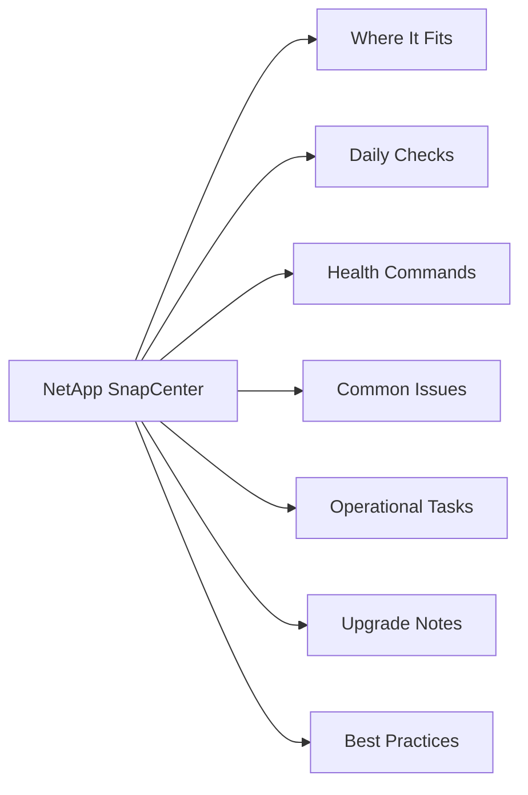

# NetApp SnapCenter

<a class="kb-card" href="scripts/">
  <strong>Scripts</strong>
  PowerShell backup job monitor, failed job alert, and resource health check scripts.
</a>

<a class="kb-card" href="operations/">
  <strong>Operations</strong>
  Daily checks, health check, change readiness, incident triage, maintenance window, and post-change validation.
</a>

<a class="kb-card" href="cli-reference/">
  <strong>CLI Reference</strong>
  SnapCenter PowerShell cmdlets, REST API reference, backup and clone operations.
</a>

<a class="kb-card" href="backup-jobs/">
  <strong>Backup Jobs</strong>
  Backup job management and monitoring.
</a>

<a class="kb-card" href="integration/">
  <strong>Integration</strong>
  Integration with other systems and platforms.
</a>

<a class="kb-card" href="lifecycle/">
  <strong>Lifecycle</strong>
  Installation, upgrades, patching, and decommission.
</a>

<a class="kb-card" href="security/">
  <strong>Security</strong>
  Security configuration, hardening, and access control.
</a>

<a class="kb-card" href="standards/">
  <strong>Standards</strong>
  Configuration standards, naming conventions, and baselines.
</a>

<a class="kb-card" href="troubleshooting/">
  <strong>Troubleshooting</strong>
  Common issues, diagnostic steps, and resolution guides.
</a>

<a class="kb-card" href="vendor-support/">
  <strong>Vendor Support</strong>
  Support bundles, case management, and escalation paths.
</a>

## Overview

NetApp SnapCenter is centralized backup and recovery software that leverages application-consistent ONTAP snapshots to protect databases, virtual machines, and filesystems. It uses a plugin architecture to quiesce applications before snapshot creation, ensuring data consistency, and integrates with SnapMirror and SnapVault to replicate backups to secondary or tertiary storage. The web GUI is accessible at `https://[server]:8146` and automation is available via PowerShell cmdlets.

## Where It Fits

| Use Case |
|---|
| Application-consistent backup for Oracle, SQL Server, SAP HANA, and Exchange databases |
| VMware vSphere VM and datastore protection via the SnapCenter Plug-in for VMware |
| Windows and Linux filesystem backup requiring crash-consistent or VSS-consistent snapshots |
| Long-term backup retention using SnapVault (XDP) policies to a secondary ONTAP system |
| Self-service restore and clone workflows delegated to application teams via RBAC |
| Disaster recovery preparation through SnapMirror-integrated secondary copies |

## Daily Checks

| Check | Command | Notes |
|---|---|---|
| Review backup job results in Jobs → Monitor for any failures or warnin |  |  |
| Confirm all resource groups ran successfully and no jobs are stuck in |  |  |
| Check the dashboard for any unprotected resources or resources missing |  |  |
| Verify SnapVault/SnapMirror relationship health on secondary storage u |  |  |
| Review any plugin host connectivity alerts under Settings → Hosts |  |  |
| Confirm storage capacity on both primary and secondary ONTAP systems i |  |  |
| Check retention counts |  | ensure older snapshots are being expired per policy |
| Review audit logs for any unauthorized access or configuration changes |  |  |

## Health Commands

~~~bash
# Connect to SnapCenter via PowerShell
Open-SmConnection -SMSbaseurl https://<snapcenter-server>:8146

# List all backup jobs and their status
Get-SmJob | Select JobId, JobType, Status, StartDateTime, EndDateTime

# List all resource groups and protection status
Get-SmResourceGroup | Select ResourceGroupName, PluginCode, Status

# List all policies
Get-SmPolicy | Select PolicyName, PluginType, BackupType

# Check registered hosts and plugin status
Get-SmHost | Select HostName, HostType, PlugInStatus

# List available snapshots for a resource
Get-SmBackup -ResourceName <resource_name> | Select BackupName, BackupTime, Status
~~~

## Common Issues

| Symptom | Likely Cause | Action |
|---|---|---|
| Plugin not connecting to host | SnapCenter agent service stopped or firewall blocking port 8145 | Go to Settings → Hosts, select host, click Refresh; check agent service and firewall on the target host |
| Backup job failing with quiesce error | Application not responding to pre-backup script or VSS writer error | Check application logs on target host; verify pre/post scripts are executable and return exit code 0 |
| Clone operation failing | Insufficient free space on destination aggregate or FlexClone license missing | Check aggregate capacity and confirm FlexClone is licensed on the ONTAP cluster |
| SnapVault update failing on secondary | SnapVault relationship is broken-off or source snapshot was deleted before transfer | Run `snapmirror show -destination-path` on destination cluster; resync or re-initialize as needed |
| Restore job failing with LUN mapping error | LUN already mapped to another host or igroup mismatch | Verify igroup membership and LUN mapping on ONTAP; unmount and remap as needed |
| Resource group stuck in running state | Agent crash or hung script on target host | Kill the hung job from Jobs → Monitor; restart SnapCenter agent on affected host |

## Operational Tasks

| Task | Command |
|---|---|
| Register new plugin hosts via Settings → Hosts → Add and deploy the appropriate |  |
| Create backup policies defining snapshot frequency, retention count, and SnapMir |  |
| Assign resources (databases, VMs, filesystems) to resource groups and attach bac |  |
| Execute on-demand backups from Resource Groups → Back Up Now for urgent protecti |  |
| Perform granular restores from Jobs → Monitor or Resources → Restore, selecting |  |
| Clone a database or volume from a backup snapshot for dev/test provisioning usin |  |
| Update plugin packages on registered hosts when upgrading SnapCenter server vers |  |
| Configure RBAC roles to delegate restore and clone operations to application own |  |

## Upgrade Notes

| Step | Action |
|---|---|
| 1 | Review the NetApp Interoperability Matrix Tool (IMT) to confirm the new SnapCenter version is compatible with your ONTAP, OS, and application plugin versions |
| 2 | Take a full backup of the SnapCenter repository database (MySQL) before beginning the upgrade |
| 3 | Upgrade the SnapCenter server first — download the installer from the NetApp Support site and run on the Windows server hosting SnapCenter |
| 4 | After server upgrade, update all host plugin packages via Settings → Hosts → Update Plug-in; plugins must match the server version |
| 5 | Verify all resource groups, policies, and schedules are intact post-upgrade by reviewing the dashboard |
| 6 | Run a manual backup job on a representative resource group to confirm end-to-end functionality |
| 7 | Update SnapCenter PowerShell cmdlets on any automation hosts to the version matching the new server |

## Best Practices

| Recommendation | Detail |
|---|---|
| Separate resource groups by application tier (e.g., | Separate resource groups by application tier (e.g., prod-oracle, prod-sqlserver) to allow independent scheduling and retention policies |
| Always configure pre-backup and post-backup scripts for | Always configure pre-backup and post-backup scripts for application quiesce/unquiesce to ensure crash-consistent snapshots are avoided |
| Use SnapVault (XDP policy) for long-term retention on a | Use SnapVault (XDP policy) for long-term retention on a secondary ONTAP system to reduce primary capacity consumption |
| Test restores quarterly | a backup is only valid if the restore works; include both full and granular (single-file or tablespace) restore tests |
| Configure RBAC so application teams can trigger restores | Configure RBAC so application teams can trigger restores and clones without needing storage admin access |
| Monitor backup job success rate from the SnapCenter | Monitor backup job success rate from the SnapCenter dashboard and set up email notifications for job failures |
| Keep SnapCenter server and all plugins on the same major version | running mixed versions causes API errors and plugin communication failures |
| Document resource group membership and policy assignments | Document resource group membership and policy assignments so that coverage gaps are visible during audits |
