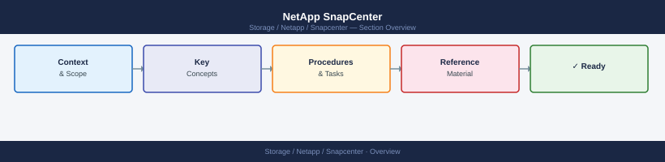

---
tags:
  - netapp
---
# NetApp SnapCenter

NetApp SnapCenter knowledge base — architecture, operations, security, and troubleshooting for application-consistent backup and recovery on ONTAP.

*Applies to: SnapCenter 5.x*

<a class="kb-card" href="architecture/"><strong>Architecture</strong>Topology, HA options, components, connectivity ports, plugin model, and sizing guidelines.</a>
<a class="kb-card" href="deploy/">
  <strong>Deploy</strong>
  Installation, initial configuration, and deployment procedures.
</a>

<a class="kb-card" href="operations/"><strong>Operations</strong>Daily checks, health monitoring, maintenance tasks, and runbooks.</a>
<a class="kb-card" href="security/"><strong>Security</strong>Security configuration, hardening, and access control.</a>
<a class="kb-card" href="troubleshooting/"><strong>Troubleshooting</strong>Common issues, diagnostic steps, and escalation paths.</a>

