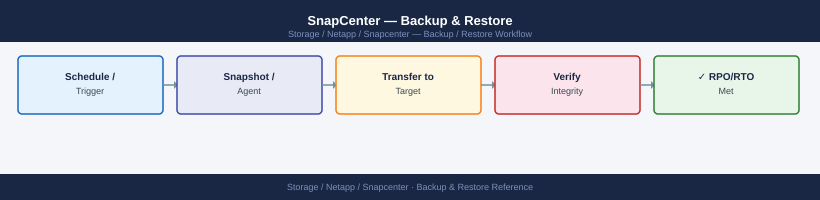

---
tags:
  - netapp
  - operations
---
# SnapCenter — Backup & Restore

SnapCenter backup and restore: creating resource groups, on-demand Protect Now, restore to original location, clone from backup, and SnapVault restore procedure.

*Applies to: SnapCenter 5.x*

---

## Before you begin

- **Access:** Storage admin credentials (cluster admin or equivalent)
- **Timing:** safe to run during business hours unless a step is marked ⚠ (causes interruption)
- **Dependencies:** no active upgrades or migrations on the same infrastructure
- **Logging:** capture command output — paste into the change record on completion

---

## Restore from SnapCenter UI

1. Navigate to **Resources** → select the resource (database, file system, VM)
2. Click **Restore**
3. Select the backup copy (snapshot) to restore from
4. Choose restore scope:
   - **Complete restore** — full volume/database restore
   - **File-level restore** — individual files or directories
   - **Item-level** — application-specific (mailbox, database, table)
5. Confirm and monitor via **Monitor → Jobs**

## SQL Server Database Restore

1. Navigate to **Resources → Microsoft SQL Server**
2. Select the database → **Restore**
3. Choose backup set and log chain (for point-in-time)
4. Select restore destination (original or alternate instance)
5. SnapCenter quiesces, reverts snapshot, and replays logs

## Oracle Database Restore

1. Navigate to **Resources → Oracle**
2. Select the database → **Restore**
3. Choose restore point (snapshot + archive log apply)
4. SnapCenter recovers to the selected SCN or timestamp

## File System Restore

1. Navigate to **Resources → Windows / UNIX File Systems**
2. Select the resource → **Restore**
3. Choose snapshot and target path
4. SnapCenter mounts the snapshot and restores files

## Single File Restore

For granular recovery without full volume revert:

1. Navigate to the backup copy
2. Click **Mount** to temporarily mount the snapshot
3. Copy the required file(s) from the mounted path
4. Unmount after recovery

## Alternate Location Restore

Restore to a different host or path:
1. In the restore wizard, select **Alternate location**
2. Specify destination host, instance, or path
3. SnapCenter handles clone/mount operations

## Validate After Restore

- Bring the application online and verify data integrity
- Run application-level checks (DBCC CHECKDB for SQL, RMAN validate for Oracle)
- Confirm backup resumes on the restored resource

## Common Issues

| Issue | Cause | Action |
|---|---|---|
| Restore fails at mount step | Array connectivity | Check ONTAP LIF and iSCSI/NFS |
| Log replay fails | Logs missing | Restore from an earlier consistent point |
| Plugin error during restore | Plugin stopped | Restart plugin on target host |
| Alternate restore fails | Credentials | Verify SnapCenter credentials for destination |

---

## Verify

- Confirm the operation completed without errors in the log or management UI
- Verify the expected state change is visible (service running, object created, config applied)
- Document the outcome in the change record

---

## See also

- [Snapcenter — Procedures](procedures/)
- [Snapcenter — Health Checks](health-checks/)
- [Snapcenter — Common Issues](../troubleshooting/common-issues/)
