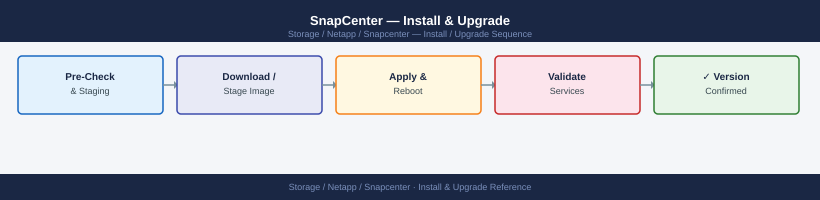

---
tags:
  - netapp
  - operations
---
# SnapCenter — Install & Upgrade

SnapCenter install and upgrade: Windows Server prerequisites, plug-in deployment to hosts, server version upgrade, and post-upgrade plugin re-validation.

*Applies to: SnapCenter 5.x*

---

## Before you begin

- **Access:** Storage admin credentials (cluster admin or equivalent)
- **Timing:** safe to run during business hours unless a step is marked ⚠ (causes interruption)
- **Dependencies:** no active upgrades or migrations on the same infrastructure
- **Logging:** capture command output — paste into the change record on completion

---

## SnapCenter Version Matrix

| SnapCenter Version | Release Date | Supported ONTAP Versions | End of Support |
|---|---|---|---|
| SnapCenter 4.7 | Oct 2021 | ONTAP 9.7–9.10 | Oct 2023 |
| SnapCenter 4.8 | Apr 2022 | ONTAP 9.7–9.11 | Apr 2024 |
| SnapCenter 4.9 | Sep 2022 | ONTAP 9.7–9.12 | Sep 2024 |
| SnapCenter 5.0 | Mar 2023 | ONTAP 9.8–9.13 | Mar 2025 |
| SnapCenter 6.0 | Oct 2023 | ONTAP 9.10–9.14 | Oct 2025 |
| SnapCenter 6.1 | Jun 2024 | ONTAP 9.11–9.15 | Jun 2026 |

Always verify the exact compatibility matrix in the [NetApp Interoperability Matrix Tool (IMT)](https://imt.netapp.com/matrix/imt.html) before upgrading. SnapCenter also has separate compatibility tables for each application plugin (Oracle, SQL Server, Exchange, SAP HANA, VMware).

## ONTAP Compatibility

- SnapCenter requires ONTAP 9.x; exact minimum version depends on features used (SnapMirror Business Continuity, vVols, etc.)
- SnapCenter 6.x requires ONTAP 9.10.1 or later for all features; some features (SnapMirror active sync, REST-only operations) require 9.12+
- The SnapCenter Plug-in for VMware vSphere follows its own version matrix and must be compatible with both the SnapCenter Server version and the vSphere version

## Upgrade Paths

SnapCenter supports in-place upgrades. Upgrade path:

1. Back up the MySQL repository: `C:\Program Files\NetApp\SnapCenter\MySQL Data\`
2. Record all resource groups, policies, schedules, and RBAC configurations (export from GUI or API)
3. Download the new SnapCenter Server installer from [mysupport.netapp.com](https://support.netapp.com)
4. Run the installer on the SnapCenter Server — it performs an in-place upgrade
5. After server upgrade, update all plugin packages via Settings → Hosts → select all → Update Plug-in
6. Update SnapCenter Plug-in for VMware OVA if deployed (download new OVA, deploy, deregister old OVA, register new OVA with vCenter)
7. Verify all resource groups, schedules, and job history are intact
8. Run a manual backup job on a representative resource group to confirm end-to-end functionality

**Never skip minor versions** — upgrade from 5.0 → 6.0 → 6.1, not 5.0 → 6.1 directly, unless the upgrade guide explicitly supports it.

## EOL Tracking

- SnapCenter follows roughly a 6-month release cadence
- End-of-support typically 2 years from release date
- Plan upgrades before end-of-support to ensure access to bug fixes and security patches
- Application plugin EOL is tied to the SnapCenter Server version — upgrading the server implicitly requires plugin upgrades

## Refresh Planning

| Trigger | Action |
|---|---|
| SnapCenter version approaching end-of-support | Plan upgrade within 3 months of EOL date |
| ONTAP upgraded beyond SnapCenter supported range | Upgrade SnapCenter before or concurrently with ONTAP upgrade |
| Windows Server OS reaching EOL | Migrate SnapCenter Server to new Windows Server VM |
| vSphere version upgrade | Verify SnapCenter Plug-in for VMware compatibility; upgrade OVA if needed |
| Application plugin (Oracle/SQL) version change | Verify IMT for plugin-to-SnapCenter-Server compatibility |

---

## Verify

- Confirm the operation completed without errors in the log or management UI
- Verify the expected state change is visible (service running, object created, config applied)
- Document the outcome in the change record

---

## See also

- [Snapcenter — Procedures](../procedures/)
- [Snapcenter — Health Checks](../health-checks/)
- [Snapcenter — Deploy](../../deploy/)
