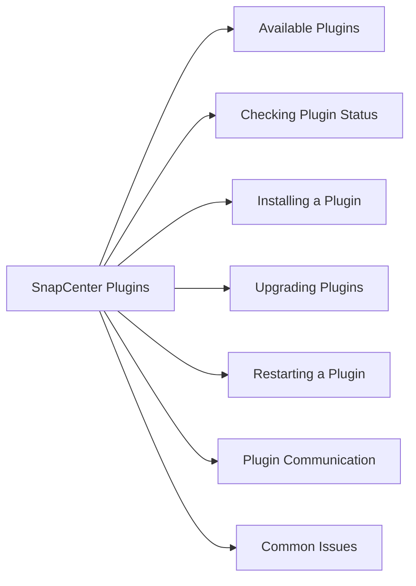

# SnapCenter Plugins

SnapCenter uses host-based plugins to quiesce applications before snapshot creation, enabling application-consistent backups.



## Available Plugins

| Plugin | Use Case |
|---|---|
| SnapCenter Plug-in for Windows | Windows file systems, SQL Server |
| SnapCenter Plug-in for SQL Server | SQL Server databases (VSS-based) |
| SnapCenter Plug-in for Oracle | Oracle DB on Linux/Windows |
| SnapCenter Plug-in for SAP HANA | SAP HANA databases |
| SnapCenter Plug-in for VMware vSphere | VMware VMs and datastores |
| SnapCenter Plug-in for UNIX | Linux file systems |

## Checking Plugin Status

In the SnapCenter UI:
1. Navigate to **Hosts** → verify all hosts show `Running`
2. A host with `Stopped` or `Not reachable` requires investigation

## Installing a Plugin

1. Navigate to **Hosts → Add**
2. Enter host FQDN, credentials, and select plug-in packages
3. SnapCenter pushes the installer to the host automatically
4. Verify status shows `Running` after installation

## Upgrading Plugins

1. Navigate to **Hosts** → select the host
2. Click **Modify Host** → update plug-in version
3. SnapCenter pushes the new version; services restart automatically

## Restarting a Plugin

If a plugin shows `Stopped`:

```bash
# Windows (PowerShell — on the target host)
Restart-Service -Name "SnapCenter Plug-in for Windows"

# Linux (on the target host)
/opt/NetApp/snapcenter/scc/bin/scc restart
```

## Plugin Communication

- SnapCenter Server communicates with plugins over **port 8145** (default)
- Ensure firewall rules allow TCP 8145 from SnapCenter Server to each managed host
- Plugin hosts require outbound connectivity back to SnapCenter Server

## Common Issues

| Issue | Cause | Action |
|---|---|---|
| Plugin stopped | Service crash | Restart plugin service on host |
| Host not reachable | Firewall or DNS | Check TCP 8145 and name resolution |
| Backup not app-consistent | Plugin not running at backup time | Verify plugin status before backup |
| Plugin install fails | Credentials or connectivity | Verify SSH/WinRM access and credentials |
