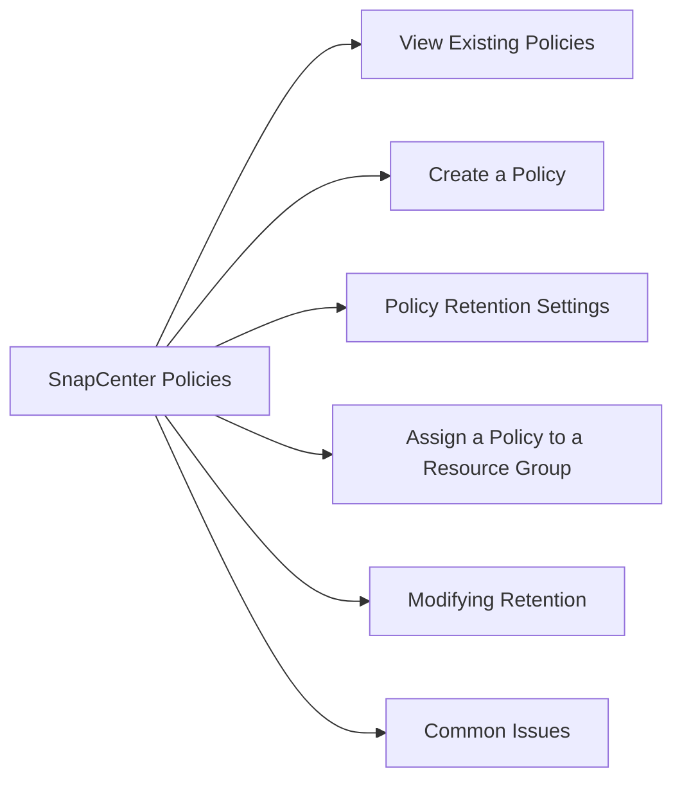

# SnapCenter Policies

Policies define how SnapCenter performs backups — schedule, retention, SnapMirror/SnapVault replication, and consistency settings.

## View Existing Policies

In the SnapCenter UI:
1. Navigate to **Settings → Policies**
2. Select a policy to view its configuration

Key policy attributes:
- **Backup type** — Snapshot-based, log backup, full/differential
- **Schedule frequency** — Hourly, daily, weekly, monthly
- **Retention** — Number of snapshots to retain on primary
- **Replication** — Update SnapMirror / SnapVault after backup
- **Consistency** — Crash-consistent vs. application-consistent

## Create a Policy

1. Navigate to **Settings → Policies → New**
2. Select the plug-in type (SQL Server, Oracle, Windows, etc.)
3. Configure:
   - Backup type
   - Schedule (or on-demand only)
   - Retention count
   - SnapMirror update (yes/no)
4. Save the policy

## Policy Retention Settings

| Retention Type | Description |
|---|---|
| Snapshot copies (primary) | Snapshots retained on primary ONTAP |
| SnapVault retention | Copies retained on secondary (longer-term) |
| Log backup retention | Transaction log backups (SQL, Oracle) |

## Assign a Policy to a Resource Group

1. Navigate to **Resources → Resource Groups**
2. Select the resource group → **Modify**
3. In the **Policies** step, attach the required policy
4. Set the schedule (if not already in the policy)

## Modifying Retention

Reducing retention takes effect on the next backup run — SnapCenter will delete old snapshots at that point. Increasing retention is effective immediately.

## Common Issues

| Issue | Cause | Action |
|---|---|---|
| Retention not enforced | Policy not applied to resource group | Verify resource group → policy attachment |
| SnapMirror not updating | Replication option disabled in policy | Edit policy to enable SnapMirror update |
| No schedule running | Schedule not configured | Verify schedule in resource group |
| Logs growing unbounded | Log retention not set | Configure log backup retention |
