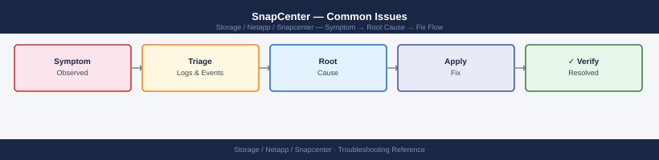

---
tags:
  - netapp
  - troubleshooting
search:
  boost: 1.5
---
# SnapCenter — Common Issues

<div class="kb-summary">
SnapCenter troubleshooting: `Invoke-SmDiagnostics`, plugin connectivity failures, repository corruption, backup job timeout analysis, and NetApp support escalation.

*Applies to: SnapCenter 5.x*
</div>


---

```d2
direction: down

symptom: Identify Symptom {shape: diamond}
diagnostic_flow: "Diagnostic Flow" {shape: rectangle}
common_issues_reference: "Common Issues Reference" {shape: rectangle}
verify_resolution: "Verify resolution" {shape: rectangle}
resolution: Resolve or Escalate {shape: oval}

symptom -> diagnostic_flow: investigate
symptom -> common_issues_reference: investigate
symptom -> verify_resolution: investigate
diagnostic_flow -> resolution
common_issues_reference -> resolution
verify_resolution -> resolution
```

## Diagnostic Flow

```d2
direction: right

S: "What is the symptom?" {shape: rectangle}
A: "Backup job failed" {shape: rectangle}
B: "Plugin host not reachable" {shape: rectangle}
C: "Restore operation failed" {shape: rectangle}
D: "Schedule not triggering" {shape: rectangle}
E: "Credential or auth error" {shape: rectangle}
A1: "A1" {shape: rectangle}
A2: "Check VSS writers and app-aware settings — see\nCommon Issues Reference" {shape: rectangle}
A3: "Verify ONTAP credentials and SVM connectivity" {shape: rectangle}
B1: "B1" {shape: rectangle}
B2: "Restart SnapCenter agent on host — see Common\nIssues Reference" {shape: rectangle}
B3: "Check firewall on TCP 8145 between server and host" {shape: rectangle}
C1: "C1" {shape: rectangle}
C2: "Check igroup membership on ONTAP — see Common\nIssues Reference" {shape: rectangle}
C3: "Check destination aggregate and FlexClone license" {shape: rectangle}
D1: "D1" {shape: rectangle}
D2: "Restart SchedulerSvc and IIS on SnapCenter Server" {shape: rectangle}
D3: "Review policy schedule and resource group association" {shape: rectangle}
E1: "Verify ONTAP credentials in Settings — see Common\nIssues Reference" {shape: rectangle}

S -> A
S -> B
S -> C
S -> D
S -> E
A1 -> A2
A1 -> A3
B1 -> B2
B1 -> B3
C1 -> C2
C1 -> C3
D1 -> D2
D1 -> D3
E -> E1
```

---

## Before you begin

- **Access:** Storage admin credentials (cluster admin or equivalent)
- **Gather first:** recent error message text, event timestamps, and affected object names
- **Scope:** confirm whether the issue affects a single object, host, cluster, or site
- **Escalation:** open a vendor support ticket before running any destructive step
- **Logging:** document each command and output — required if escalation is needed

---

## Common Issues Reference

| Symptom | Likely Cause | Action |
|---|---|---|
| Plugin not connecting to host | SnapCenter Agent service stopped or firewall blocking TCP 8145 | Settings → Hosts → Refresh host; check agent service: `Get-Service SnapCenter*` (Windows) or `systemctl status spl` (Linux); verify firewall rules |
| Backup job failing with quiesce error | Application not responding to pre-backup script; VSS writer error (SQL/Exchange) | Check application logs on the host; test script manually; on Windows, check VSS writer state: `vssadmin list writers` |
| Clone operation failing with space error | Insufficient free space on destination aggregate; FlexClone license not present | Check aggregate capacity on ONTAP: `storage aggregate show`; verify FlexClone license: `system license show` |
| SnapVault update failing — source snapshot missing | Source snapshot deleted before XDP transfer completed; retention policy mismatch | On destination cluster: `snapmirror show -destination-path`; run `snapmirror resync` or re-initialize the XDP relationship |
| Restore job failing with LUN mapping error | LUN already mapped to another host; igroup mismatch during restore | Check igroup membership: `lun mapping show` on ONTAP; unmount LUN on conflicting host; remap to correct igroup |
| Resource group stuck in running state | Agent crash or hung pre/post script on target host | Kill job from Jobs → Monitor → Cancel; restart SnapCenter agent on host (`Restart-Service SnapCenter*` or `systemctl restart spl`); investigate script exit codes |
| SnapCenter Server unavailable (GUI 503 error) | IIS app pool crashed; SnapCenter web service stopped | On server: `iisreset`; check Windows services: `SnapCenter_WebApp`, `SchedulerSvc`; review IIS error logs |
| Backup succeeds but no snapshot visible on ONTAP | ONTAP storage connection uses wrong SVM credentials; snapshot naming mismatch | Re-verify ONTAP credentials in Settings → Storage Systems; check `snapshot show -volume <vol>` on ONTAP directly |

---

## Verify resolution

- Confirm the original symptom no longer occurs
- Check logs for any residual errors related to the issue
- Monitor for 10–15 minutes to confirm the fix is stable

---

## See also

- [Snapcenter — Diagnostics](../diagnostics/)
- [Snapcenter — Escalation](../escalation/)
- [Snapcenter — Health Checks](../../operations/health-checks/)
