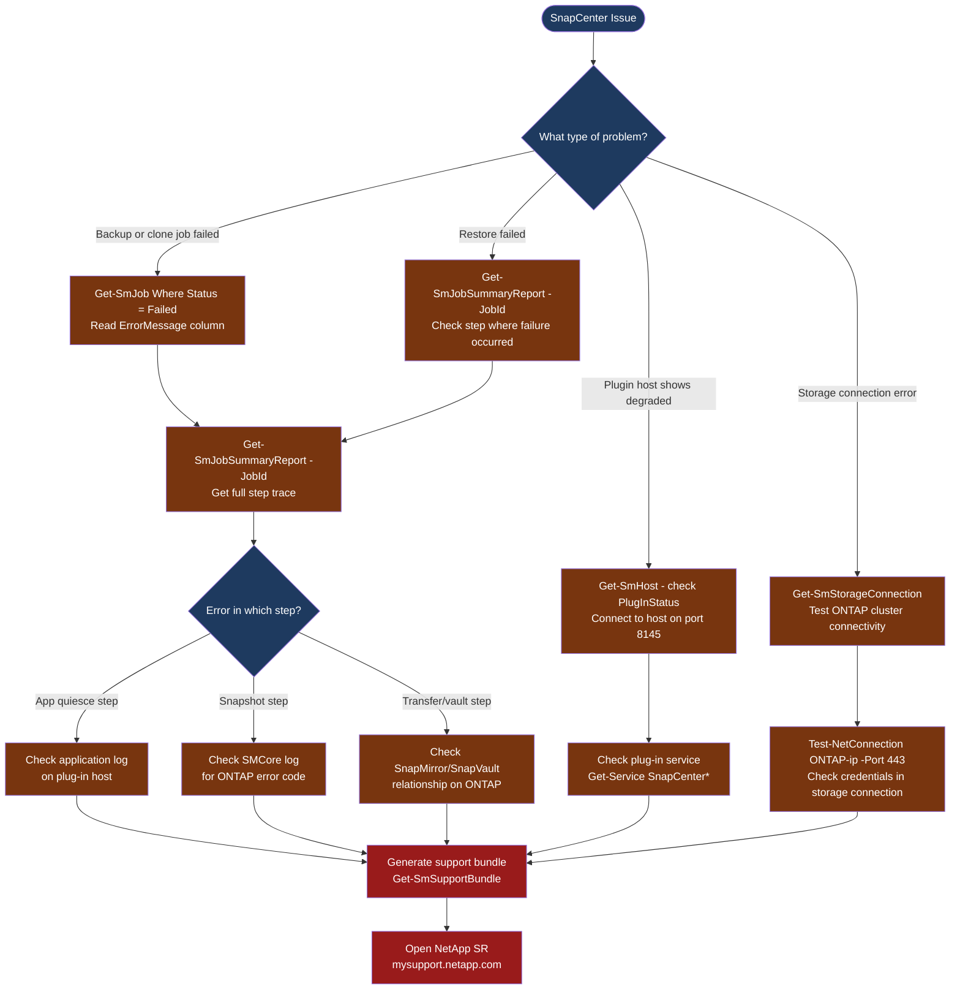

---
tags:
  - netapp
  - troubleshooting
search:
  boost: 1.5
---
# SnapCenter — Diagnostics

<div class="kb-summary">
SnapCenter diagnostic commands: query failed jobs with Get-SmJob, inspect job detail with Get-SmJobSummaryReport, check host plugin status, verify ONTAP storage connections, inspect component log files, and generate the support bundle for NetApp cases.

*Applies to: NetApp SnapCenter 5.x*
</div>




```d2
direction: down

symptom: Identify Symptom {shape: diamond}
step_1_check_failed_jobs: "Step 1 — Check failed jobs" {shape: rectangle}
step_2_check_resource_groups_and_hos: "Step 2 — Check resource groups and hosts" {shape: rectangle}
step_3_check_ontap_storage_connectio: "Step 3 — Check ONTAP storage connections" {shape: rectangle}
step_4_check_plugin_service_on_the_h: "Step 4 — Check plug-in service on the host" {shape: rectangle}
step_5_inspect_component_logs_on_the: "Step 5 — Inspect component logs on the SnapCenter server" {shape: rectangle}
step_6_generate_support_bundle_for_n: "Step 6 — Generate support bundle for NetApp SR" {shape: rectangle}
resolution: Resolve or Escalate {shape: oval}

symptom -> step_1_check_failed_jobs: investigate
symptom -> step_2_check_resource_groups_and_hos: investigate
symptom -> step_3_check_ontap_storage_connectio: investigate
symptom -> step_4_check_plugin_service_on_the_h: investigate
symptom -> step_5_inspect_component_logs_on_the: investigate
symptom -> step_6_generate_support_bundle_for_n: investigate
step_1_check_failed_jobs -> resolution
step_2_check_resource_groups_and_hos -> resolution
step_3_check_ontap_storage_connectio -> resolution
step_4_check_plugin_service_on_the_h -> resolution
step_5_inspect_component_logs_on_the -> resolution
step_6_generate_support_bundle_for_n -> resolution
```

## Before you begin

- **Access:** SnapCenter admin role (SnapCenterAdmin); Windows admin on the SnapCenter server; ONTAP cluster admin credentials
- **Gather first:** the failed job ID (from the SnapCenter Jobs view), the error message text, the resource group and policy involved, and whether the issue is new or recurring
- **Scope:** confirm whether the failure affects one resource, one host, one ONTAP cluster, or all backups
- **Plugin dependency:** most backup failures originate on the plug-in host — always check the plug-in service status and logs on the affected host

---

## Step 1 — Check failed jobs

```powershell
# Connect to SnapCenter (run on the SnapCenter server or from a host with the module)
Open-SmConnection -SMSbaseurl https://<snapcenter-server>:8146

# List all failed jobs (last 24 hours)
Get-SmJob | Where-Object { $_.Status -eq "Failed" -and $_.StartDateTime -gt (Get-Date).AddHours(-24) } |
  Select-Object JobId, JobType, ResourceGroupName, StartDateTime, ErrorMessage |
  Format-Table -AutoSize

# List all jobs regardless of status (for history review)
Get-SmJob | Select-Object JobId, Status, JobType, ResourceGroupName, StartDateTime, EndDateTime |
  Sort-Object StartDateTime -Descending | Select-Object -First 20

# Get the full job step trace for a specific failed job
Get-SmJobSummaryReport -JobId <job-id>
# Output: each step in the backup workflow with status, start/end time, and error details
# Focus on the first step that shows "Failed" — all subsequent steps also fail after the first failure
```

---

## Step 2 — Check resource groups and hosts

```powershell
# List all resource groups and their current protection status
Get-SmResourceGroup | Select-Object ResourceGroupName, Status, LastRunTime, NextRunTime |
  Sort-Object Status

# Check all registered plug-in hosts and their status
Get-SmHost | Select-Object HostName, HostType, PlugInStatus, HostStatus |
  Where-Object { $_.PlugInStatus -ne "Installed" -or $_.HostStatus -ne "Reachable" }
# Problem: PlugInStatus = "Degraded" or "Not Installed"; HostStatus = "Unreachable"

# List all backups for a specific resource
Get-SmBackup -ResourceName <resource-name> |
  Select-Object BackupName, BackupTime, BackupType, Status |
  Sort-Object BackupTime -Descending | Select-Object -First 10
```

---

## Step 3 — Check ONTAP storage connections

```powershell
# List all registered ONTAP storage connections
Get-SmStorageConnection | Select-Object StorageName, Protocol, ClusterVersion, Status

# Test TCP connectivity to each ONTAP cluster management IP
Get-SmStorageConnection | ForEach-Object {
  $result = Test-NetConnection -ComputerName $_.StorageName -Port 443
  [PSCustomObject]@{
    StorageName = $_.StorageName
    Port443     = $result.TcpTestSucceeded
  }
}
# Expected: TcpTestSucceeded: True for all clusters

# Verify ONTAP credentials are valid (try directly via REST)
$creds = Get-Credential
Invoke-RestMethod -Uri "https://<ontap-cluster>/api/cluster" `
  -Authentication Basic -Credential $creds -SkipCertificateCheck
```

---

## Step 4 — Check plug-in service on the host

```powershell
# On a Windows plug-in host
Get-Service SnapCenter* | Select-Object Name, Status, StartType
# Expected: all SnapCenter services Running

# Start a stopped plug-in service
Start-Service 'SnapCenter Plug-in for Windows' 2>/dev/null
Start-Service 'SnapCenter SMCore Service' 2>/dev/null

# Check Windows Event Log for plug-in errors
Get-EventLog -LogName Application -Source "SnapCenter*" -Newest 50 |
  Format-Table TimeGenerated, EntryType, Message -Wrap
```

```bash
# On a Linux plug-in host
systemctl status spl
# Expected: active (running)

# Start if stopped
systemctl start spl
systemctl status spl

# Check Linux plug-in log
tail -100 /var/opt/snapcenter/spl/logs/spl.log
grep -i "error\|exception\|fail" /var/opt/snapcenter/spl/logs/spl.log | tail -50

# Test connectivity back to SnapCenter server (plug-in needs to reach server on 8146)
curl -sk https://<snapcenter-server>:8146/api/3.0/version
```

---

## Step 5 — Inspect component logs on the SnapCenter server

```powershell
# SnapCenter log directory base
$logBase = "C:\Program Files\NetApp\SnapCenter"

# SMCore log — primary job engine log (most useful for backup/restore failures)
Get-ChildItem "$logBase\SMCore\log\" | Sort-Object LastWriteTime -Descending | Select-Object -First 3
Get-Content "$logBase\SMCore\log\SMCore.log" -Tail 200 |
  Select-String -Pattern "Error|Exception|Failed|Warning" -CaseSensitive:$false

# SnapCenter Web App log — UI and API errors
Get-Content "$logBase\SnapCenter Web App\log\SnapCenter_Web_App.log" -Tail 100 |
  Select-String -Pattern "Error|Exception" -CaseSensitive:$false

# Scheduler log — shows why a scheduled job did not start
Get-Content "$logBase\SnapCenter Scheduler\log\SnapCenterScheduler.log" -Tail 100

# MySQL repository log — database errors
Get-Content "C:\Program Files\NetApp\SnapCenter\MySQL Data\mysql-error.log" -Tail 50
```

---

## Step 6 — Generate support bundle for NetApp SR

```powershell
# Generate a complete support bundle (all logs + configuration + DB state)
# Via PowerShell (recommended for scripted collection):
Get-SmSupportBundle -Path C:\Temp\snapcenter-support-$(Get-Date -Format yyyyMMdd-HHmm)

# Via GUI:
# SnapCenter → Help (? icon) → Support → Generate Support Bundle
# Wait for completion (5–15 minutes) → Download the .zip

# Include in the NetApp SR:
# - Support bundle .zip
# - SnapCenter version: Help → About
# - Failed job ID and error message
# - Whether the issue started after a version upgrade, ONTAP update, or config change
```

---

## Log locations

| Component | Path | What to look for |
|---|---|---|
| SMCore (job engine) | `C:\Program Files\NetApp\SnapCenter\SMCore\log\SMCore.log` | Backup/restore step failures, ONTAP errors |
| Web App | `C:\Program Files\NetApp\SnapCenter\SnapCenter Web App\log\` | UI errors, API failures |
| Scheduler | `C:\Program Files\NetApp\SnapCenter\SnapCenter Scheduler\log\` | Missed schedules, schedule engine errors |
| Windows plug-in | `C:\Program Files\NetApp\SnapCenter\Snapcenter Plug-in Creator\log\` | App quiesce errors (SQL, Exchange) |
| Linux plug-in (spl) | `/var/opt/snapcenter/spl/logs/spl.log` | Linux host plug-in errors |
| VMware plug-in | `/var/log/netapp/snapcenter/` (inside the OVA) | VM backup and VMDK failures |
| MySQL repository | `C:\Program Files\NetApp\SnapCenter\MySQL Data\mysql-error.log` | Database errors |
| IIS (web server) | `C:\inetpub\logs\LogFiles\` | HTTP errors, certificate issues |

---

## See also

- [SnapCenter — Common Issues](../common-issues/)
- [SnapCenter — Escalation](../escalation/)
- [SnapCenter — Health Checks](../operations/health-checks/)

## Verify resolution

- `Get-SmJob | Where-Object { $_.Status -eq "Failed" }` shows no new failures after the fix
- `Get-SmHost` shows `PlugInStatus = Installed` and `HostStatus = Reachable` for all affected hosts
- Trigger a manual backup via SnapCenter UI for the affected resource group — confirm it completes with `Status = Completed`
- Verify the snapshot exists on ONTAP: `snap list -vserver <svm> -volume <vol>` shows the new snapshot
