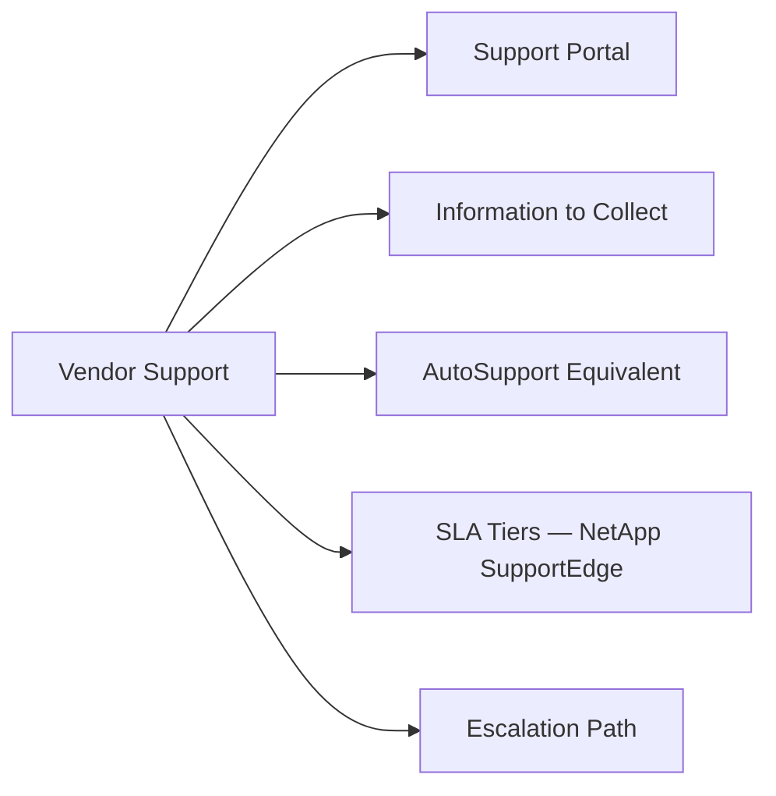

# SnapCenter Vendor Support



## Support Portal

[https://mysupport.netapp.com](https://mysupport.netapp.com)

Open SnapCenter cases under: Storage Software → SnapCenter. Cases are handled by NetApp support engineers specialising in SnapCenter and its application plugins.

## Information to Collect

Before opening a case or during initial triage, collect:

| Item | Source |
|---|---|
| SnapCenter Server version | Help → About in GUI; or `Get-SmHost -HostType SnapCenter` |
| Plugin versions on affected hosts | Settings → Hosts → view plug-in version column |
| ONTAP version of registered storage systems | `Get-SmStorageConnection` then `system image show` on ONTAP |
| Job ID and error message | Jobs → Monitor → select failed job → View Logs |
| SnapCenter support bundle | Help → Support → Generate Support Bundle (all logs + config) |
| Windows Event Log from SnapCenter Server | Application log, System log, export as .evtx |
| Plugin host OS logs | Windows Event Log or `/var/opt/snapcenter/spl/logs/` on Linux |
| ONTAP EMS logs (for snapshot/SnapMirror failures) | `event log show -severity error -time-range 24h` |

```powershell
# Generate SnapCenter support bundle via PowerShell
Get-SmSupportBundle -Path C:\temp\snapcenter-support-bundle

# Export all job history to CSV for support analysis
Get-SmJob | Export-Csv -Path C:\temp\snapcenter-jobs.csv -NoTypeInformation

# Collect version info
Get-SmHost | Select HostName, HostType, PlugInVersion, SnapCenterVersion | Format-Table
```

## AutoSupport Equivalent

SnapCenter does not have a native AutoSupport mechanism like ONTAP. The support bundle is the equivalent artifact. For the ONTAP storage systems involved, also generate an AutoSupport:

```bash
# On ONTAP — generate AutoSupport tied to the SnapCenter case number
system node autosupport invoke -node * -type all -message "SnapCenter case <number> - <description>"
```

## SLA Tiers — NetApp SupportEdge

| Priority | Response Time | Criteria |
|---|---|---|
| P1 — Critical | 1 hour | All backups failing; active data loss risk; production DR blocked |
| P2 — High | 2 hours | Most backup jobs failing; restore capability impaired |
| P3 — Medium | 4 hours | Individual resource group failing; workaround available |
| P4 — Low | Next business day | Configuration questions, feature requests, non-urgent issues |

For P1 SnapCenter cases, call the NetApp support line after opening the web case to ensure immediate assignment: +1-888-463-8277.

## Escalation Path

1. **Initial case**: Assigned to a SnapCenter Technical Support Engineer (TSE) via [mysupport.netapp.com](https://mysupport.netapp.com)
2. **Application specialist escalation**: TSE escalates to an Oracle/SQL/VMware application plugin specialist if the issue is in the plugin layer
3. **Development escalation**: For confirmed bugs, the TSE opens a bug report (BUG ID) and escalates to SnapCenter engineering; you receive a tracking ID
4. **Duty Manager escalation**: If response SLA is breached or the issue is unresolved after reasonable time, request escalation to the Support Duty Manager — state your case number and SLA breach
5. **Account team**: Engage your NetApp Account Manager for persistent P1 issues or SLA disputes

When escalating, always reference:
- SnapCenter case number and BUG ID if assigned
- Business impact: which applications are unprotected, since when
- All actions taken and their outcomes
- Whether a workaround is in place
