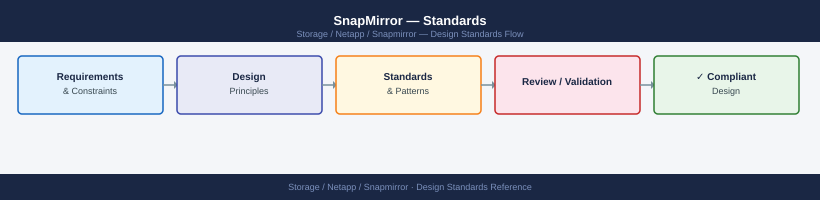

---
tags:
  - architecture
  - netapp
---
# SnapMirror — Standards

SnapMirror design standards: async vs. sync policy selection, RPO and retention policy per relationship type, inter-cluster LIF requirements, and fan-out topology limits.

*Applies to: SnapMirror*

---

## Naming Conventions

| Object | Pattern | Example |
|---|---|---|
| SnapMirror policy | `sm-<type>-<retention>` | `sm-async-daily`, `sm-xdp-weekly` |
| Relationship label | `<frequency>` | `hourly`, `daily`, `weekly` |
| Destination volume | `<source_vol>_dr` or `<source_vol>_vault` | `vol_app01_dr`, `vol_app01_vault` |
| Intercluster LIF | `ic-<node>-<port>` | `ic-node01-e0e` |
| Cluster peer | `<site1>-<site2>` | `prod-dr` |

## Replication Policy Baseline

- All Tier-1 production volumes must have an active SnapMirror relationship; no Tier-1 volume may be unprotected
- RPO must be documented per application and aligned with the SnapMirror schedule configured for that volume
- SnapMirror schedule (transfer frequency) must be set to achieve the documented RPO with margin — schedule at twice the frequency of the RPO where bandwidth allows
- XDP relationships with `MirrorAndVault` policy are preferred for DR volumes that also require independent snapshot retention on the destination
- Consistency groups (CGs) must be used for multi-volume workloads (database data + log volumes) to ensure crash-consistent replication across related volumes
- SnapMirror Sync or SMBC required for Tier-0 workloads where zero data loss is a hard requirement

## Configuration Checklist

- [ ] Cluster peer relationship established between source and destination clusters
- [ ] SVM peer relationship established between source and destination SVMs
- [ ] Intercluster LIFs configured on a dedicated replication network (separate from data traffic)
- [ ] Destination volume created as type DP (not RW) with equal or greater size than source
- [ ] SnapMirror policy created with correct rules, schedule, and retention settings
- [ ] Relationship created with `snapmirror create` specifying correct `-type` (XDP for async, StrictSync/Sync for synchronous)
- [ ] Baseline transfer completed with `snapmirror initialize` and confirmed healthy
- [ ] Lag monitoring alert configured in ONTAP EMS (`snapmirror.lag.warn` threshold set per RPO)
- [ ] Relationship documented with `-comment` field: owner, RPO tier, last DR test date
- [ ] DR test scheduled within 90 days of relationship creation

---

## See also

- [Snapmirror — How It Works](../how-it-works/)
- [Snapmirror — Integrations](../integrations/)
- [Snapmirror — Deploy](../../deploy/)
