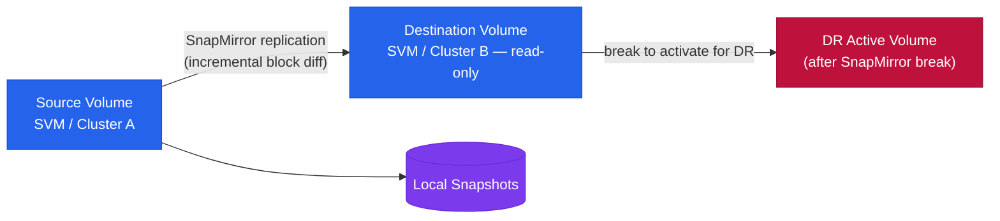

# SnapMirror — How It Works


<div class="kb-summary">
How It Works reference covering Overview, Replication Types, Components, Connectivity, Key Commands and 2 more sections.
</div>
```
┌────────────────────────────────── NetApp SnapMirror — How It Works ───────────────────────────────────┐
│                                                                                                       │
│   ┌───────────────────────────────────────────────────────────────────────────────────────────────┐   │
│   │    SnapMirror operational flow: request → controller → data service → host acknowledgement    │   │
│   │         Data path: host I/O → SnapMirror controller → storage media → persistent write        │   │
│   │ Management: ONTAP System Manager / SnapMirror CLI provides unified control for all operationa │   │
│   │           Protection: snapshots, replication, and redundancy ensure data durability           │   │
│   └───────────────────────────────────────────────────────────────────────────────────────────────┘   │
│                                                                                                       │
│    Host I/O → SnapMirror controller → storage media → acknowledge → replicate                         │
│                                                                                                       │
│                  ▼                                ▼                                ▼                  │
│                                                                                                       │
│   ┌─────────────────────────────┐  ┌─────────────────────────────┐  ┌─────────────────────────────┐   │
│   │            Layer            │  │          Component          │  │            Notes            │   │
│   │            Async            │  │        Periodic sync        │  │         RPO: minutes        │   │
│   │             Sync            │  │           Zero RPO          │  │          Sub-ms lag         │   │
│   │            SM-BC            │  │        Active-active        │  │        Transparent FO       │   │
│   │            Vault            │  │        Long retention       │  │         Backup copy         │   │
│   │            Cloud            │  │         ONTAP → CVO         │  │       Cloud DR/backup       │   │
│   └─────────────────────────────┘  └─────────────────────────────┘  └─────────────────────────────┘   │
│                                                                                                       │
│                          ▼                                                 ▼                          │
│                                                                                                       │
│   ┌───────────────────────────────────────────────────────────────────────────────────────────────┐   │
│   │    Component     │     Purpose      │      Protocol     │       Auth       │      Notes       │   │
│   │ Async SnapMirror │  DR replication  │    SM protocol    │   Certificate    │   RPO minutes    │   │
│   │ Sync SnapMirror  │  Zero-RPO sync   │    SM protocol    │   Certificate    │ StrictSync/Sync  │   │
│   │      SM-BC       │ Active-active SA │    SM protocol    │     Mediator     │    No RPO/RTO    │   │
│   │    SnapVault     │ Backup retention │    SM protocol    │   Certificate    │ Longer retentio  │   │
│   └───────────────────────────────────────────────────────────────────────────────────────────────┘   │
│                                                                                                       │
│    Physical: Source ONTAP cluster · destination ONTAP cluster · intercluster LIFs · WAN link          │
│                                                                                                       │
│    Key terms:                                                                                         │
│                                                                                                       │
│    SnapMirror         = ONTAP replication; transfers only changed blocks after initial baseline sync  │
│    Intercluster LIF   = dedicated logical interface for SnapMirror traffic between clusters           │
│    SnapMirror policy  = defines schedule, retention, and transfer type (async/sync/vault)             │
│    Baseline transfer  = first full snapshot transfer establishing the SnapMirror relationship         │
│    Update             = incremental transfer; only sends new or changed blocks since last successfu...│
│    Snapmirror break   = breaks the DR relationship; activates destination volume for read-write       │
│    Resync             = re-establishes a broken SnapMirror relationship from the last common snapshot │
│    SM-BC              = SnapMirror Business Continuity; synchronous zero-RPO active-active SAN volumes│
│    Mediator           = ONTAP Mediator; quorum service for SM-BC running on Linux VM at third site    │
│    SnapVault          = SnapMirror variant for backup retention; destination has independent schedule │
│    MirrorAndVault     = policy combining SnapMirror DR and SnapVault backup retention copies          │
│    Fanout             = single source volume replicating to multiple destination clusters simultane...│
│                                                                                                       │
└───────────────────────────────────────────────────────────────────────────────────────────────────────┘
```


## Overview

SnapMirror is ONTAP's built-in replication engine, providing volume-level and SVM-level replication across ONTAP clusters. It supports three primary operating modes: asynchronous (SnapMirror Async, RPO-based), synchronous (SnapMirror Synchronous, zero RPO), and extended data protection (XDP/SnapVault, backup retention). Relationships are always managed from the destination cluster. SnapMirror Business Continuity (SMBC/AutomatedFailOver) extends synchronous replication with transparent host-level failover for SAN workloads.

## Replication Types

| Type | RPO | Description |
|---|---|---|
| SnapMirror Async | Configurable, minutes to hours | Standard volume replication; transfers run on a schedule; destination is read-only DP volume |
| SnapMirror Sync | Zero RPO | Every write acknowledged on both source and destination; requires <5ms RTT between clusters |
| SnapMirror Business Continuity (SMBC) | Zero RPO, transparent failover | Consistency group-based; mediator-assisted automatic failover; no host reconfiguration |
| SnapVault / XDP | Daily/weekly backup copies | Extended data protection; independent retention on destination; replaces legacy SnapVault |



## Components

| Component | Description |
|---|---|
| Source volume | Read/write volume on the source cluster; the origin of replicated data |
| Destination volume | DP (data protection) type, read-only; managed by the replication engine |
| SnapMirror policy | Defines rules, schedule, and retention for the relationship |
| Cluster peer relationship | Trust relationship between two ONTAP clusters; prerequisite for all SnapMirror |
| SVM peer relationship | Required for cross-SVM replication; establishes peer trust at the data SVM layer |
| Intercluster LIFs | Dedicated network interfaces used exclusively for SnapMirror replication traffic |
| ONTAP Mediator | External Linux VM used as a quorum witness for SMBC automatic failover |

## Connectivity

Intercluster LIFs must be on a dedicated replication network, separate from data and management traffic. ONTAP uses TCP ports 11104 and 11105 for intercluster replication. Cluster peering must be established before SVM peering, and SVM peering is required before any volume or SVM-level relationship can be created.

| Replication Type | Latency Requirement | Bandwidth Requirement |
|---|---|---|
| SnapMirror Async | No strict requirement | Based on change rate and schedule window |
| SnapMirror Sync | <5ms RTT (sustained) | Write throughput of source workload |
| SMBC | <5ms RTT (sustained) | Write throughput of consistency group |

Estimate required replication bandwidth: `(Daily change rate × source volume size) / replication window (seconds)`

## Key Commands

```bash
# Show all relationships with lag time and health
snapmirror show -fields lag-time,healthy,last-transfer-end-timestamp

# Show full detail for a specific relationship
snapmirror show -destination-path svm_dst:vol_dst

# Show relationships in broken-off state
snapmirror show -relationship-status broken-off

# Trigger immediate incremental update
snapmirror update -destination-path svm_dst:vol_dst

# Resync a broken-off relationship
snapmirror resync -destination-path svm_dst:vol_dst

# Break a relationship for DR failover (makes destination read-write)
snapmirror break -destination-path svm_dst:vol_dst

# Initialize a new relationship (baseline transfer)
snapmirror initialize -destination-path svm_dst:vol_dst

# Quiesce a relationship (pause future transfers, finishes current)
snapmirror quiesce -destination-path svm_dst:vol_dst

# Show transfer history
snapmirror show-history -destination-path svm_dst:vol_dst
```

## DR Failover Sequence

1. **Detect RPO breach or site failure** — identify that the source is unavailable or lag has exceeded the RPO threshold
2. **Quiesce the relationship** — `snapmirror quiesce -destination-path svm_dst:vol_dst` (allows in-flight transfer to complete)
3. **Break the relationship** — `snapmirror break -destination-path svm_dst:vol_dst` (makes destination read-write)
4. **Mount/present the destination volume to DR hosts** — rescan iSCSI/FC on host or remount NFS exports
5. **Start application on DR hosts** — verify data integrity; bring application online
6. **Failback** — once source site recovers, reverse resync: `snapmirror resync -destination-path svm_src:vol_src` (treating the original source as the new destination until fully synced)
7. **Final reverse resync** — break and remount on original source hosts; re-establish the original replication direction

## SVM-Level Replication

SVM DR replicates the full SVM configuration (volumes, LIFs, NFS exports, CIFS shares, igroups) in addition to data:

```bash
# Create an SVM DR relationship
snapmirror create -source-path svm_src: -destination-path svm_dst: -type XDP -policy MirrorAllSnapshots

# Initialize SVM DR baseline
snapmirror initialize -destination-path svm_dst:

# Update SVM DR configuration
snapmirror update -destination-path svm_dst:

# Activate SVM at DR site
snapmirror break -destination-path svm_dst:
vserver start -vserver svm_dst
```
