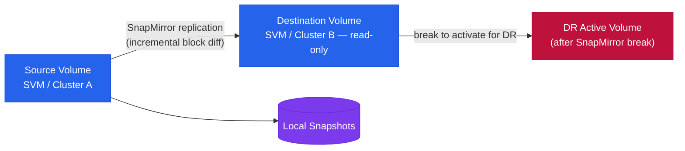

# SnapMirror — Overview

> Part of the [SnapMirror Architecture](../) reference.

---

## Overview

SnapMirror is ONTAP's built-in replication engine, providing volume-level and SVM-level replication across ONTAP clusters. It supports three primary operating modes: asynchronous (SnapMirror Async, RPO-based), synchronous (SnapMirror Synchronous, zero RPO), and extended data protection (XDP/SnapVault, backup retention). Relationships are always managed from the destination cluster. SnapMirror Business Continuity (SMBC/AutomatedFailOver) extends synchronous replication with transparent host-level failover for SAN workloads.

## Replication Modes

## Replication Types

| Type | RPO | Description |
|---|---|---|
| SnapMirror Async | Configurable, minutes to hours | Standard volume replication; transfers run on a schedule; destination is read-only DP volume |
| SnapMirror Sync | Zero RPO | Every write acknowledged on both source and destination; requires <5ms RTT between clusters |
| SnapMirror Business Continuity (SMBC) | Zero RPO, transparent failover | Consistency group-based; mediator-assisted automatic failover; no host reconfiguration |
| SnapVault / XDP | Daily/weekly backup copies | Extended data protection; independent retention on destination; replaces legacy SnapVault |

## Connectivity

Intercluster LIFs must be on a dedicated replication network, separate from data and management traffic. ONTAP uses TCP ports 11104 and 11105 for intercluster replication. Cluster peering must be established before SVM peering, and SVM peering is required before any volume or SVM-level relationship can be created. Bandwidth requirements are driven by the daily change rate of source data — higher change rates require proportionally more replication bandwidth to sustain the configured RPO.

---

## In this section

<a class="kb-card" href="components/"><strong>Components</strong>Core components, services, and technical specifications.</a>
<a class="kb-card" href="integrations/"><strong>Integrations</strong>Integration with other platforms and external systems.</a>
<a class="kb-card" href="standards/"><strong>Standards</strong>Sizing guidelines, design standards, and best practices.</a>

